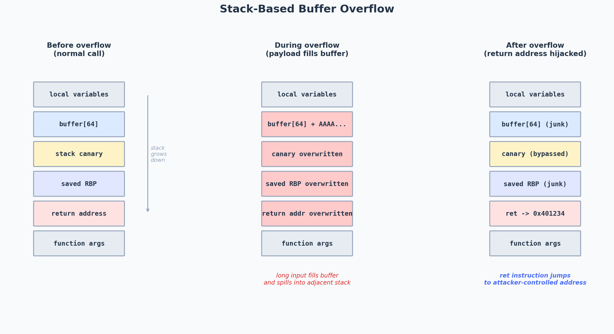
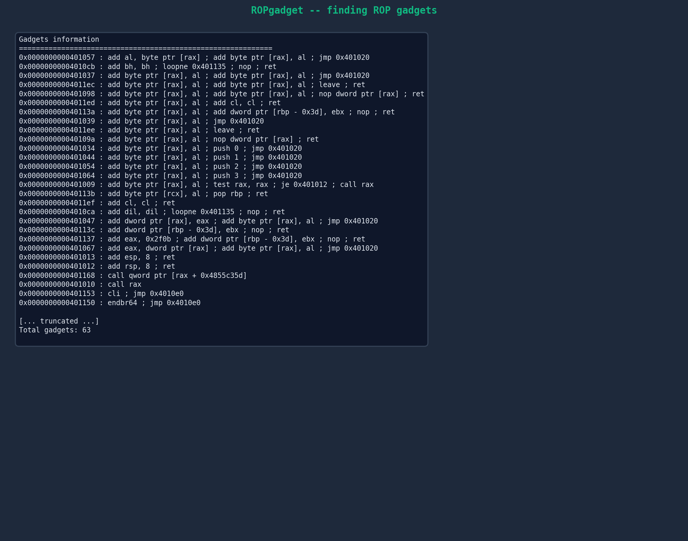
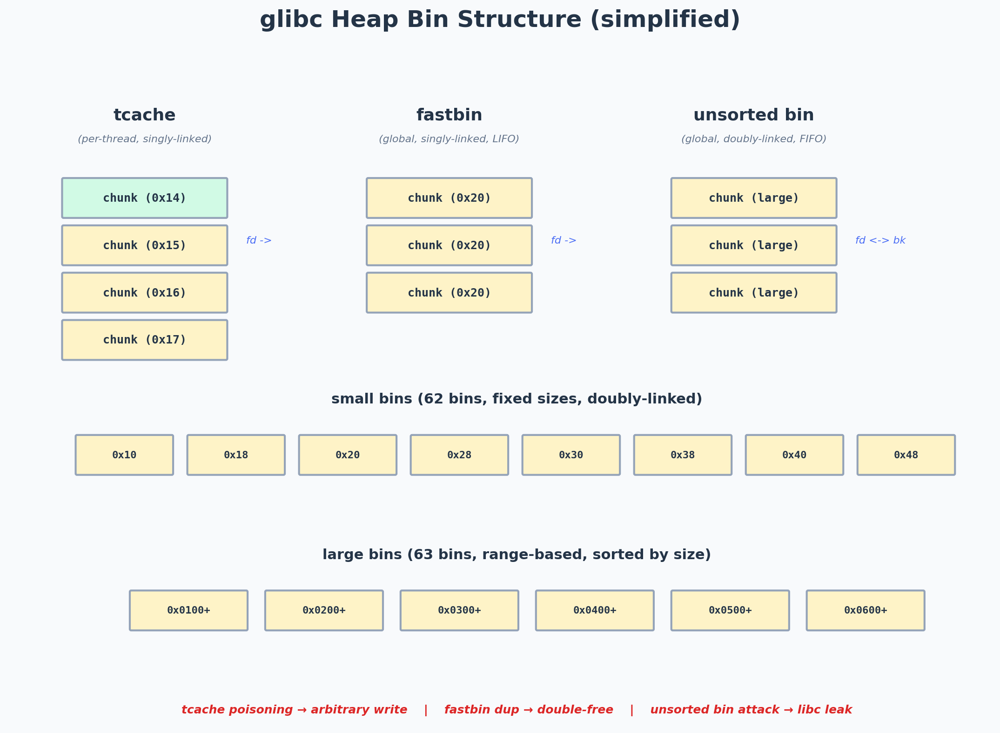
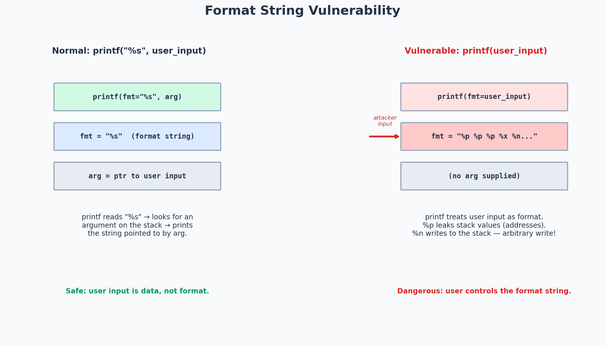
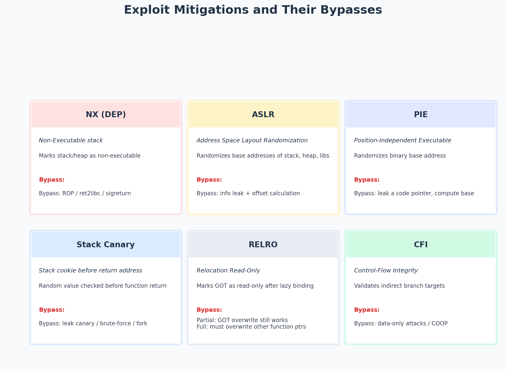
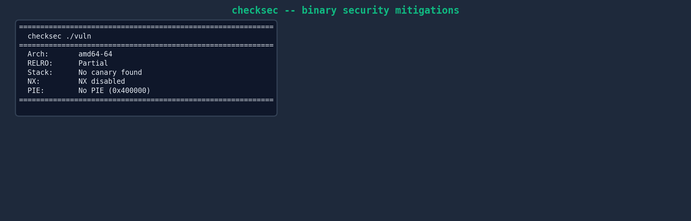
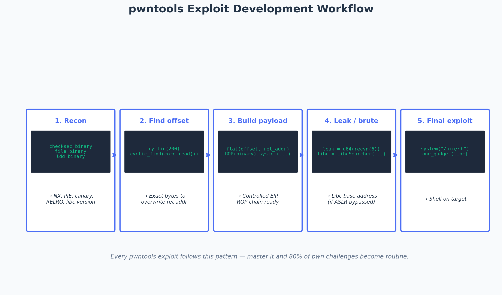
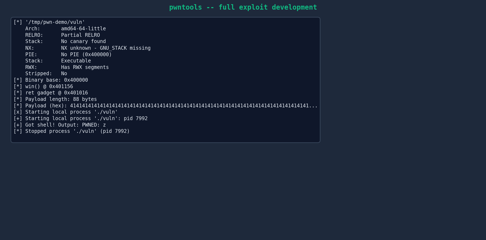
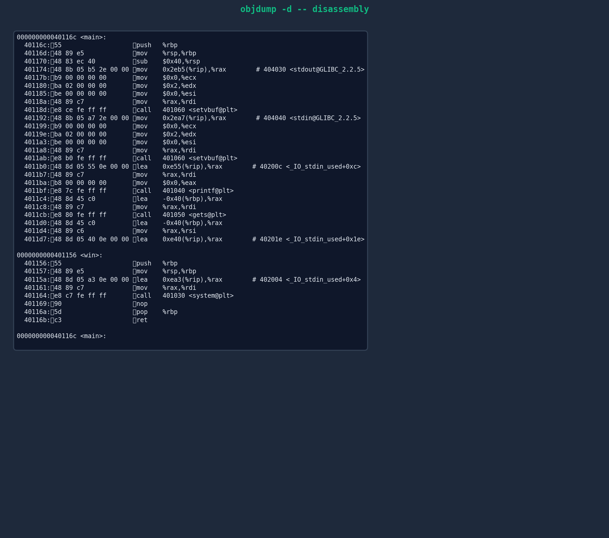
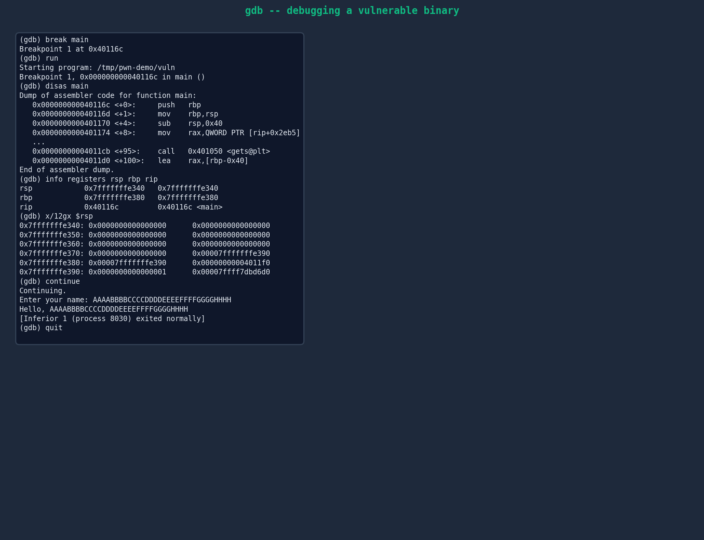

# 01 — Binary Exploitation (Pwn)

> Part of **CTF-collection** — see [master README](../README.md) for context.

## What this folder covers

Binary exploitation — "pwn" — is the art of making a program do something its author never intended by corrupting its memory. This is the most technically dense category in CTF: it demands fluency in assembly, ABI calling conventions, linker internals, and a toolbox of exploit-development tools (pwntools, ROPgadget, one_gadget, gdb-gef/pwndbg). Every other CTF category rewards breadth; pwn rewards depth. The skills here transfer directly to vulnerability research and exploit development in industry.

This folder holds my personal pwn writeups and reference material. Every challenge I solve gets a writeup here — the intended path, my actual solve (including the dead ends), and the takeaways I want to remember for next time. The [`writeups/external/`](writeups/external/) subfolder holds full CTF writeups sourced from personal blogs and CTF team archives (not Medium); [`archives/`](archives/) holds reference collections I've cloned locally for offline study; [`resources/`](resources/) holds my personal notes, concept diagrams, and tool screenshots.

---

## Sub-topics I track

### Stack-based exploitation

The foundation of all binary exploitation. A buffer on the stack overflows into adjacent stack memory — overwriting the saved return address, the saved frame pointer, or local variables. The classic `gets(buf)` into a 64-byte buffer is the "hello world" of pwn.

**Concepts to master:**
- Stack frame layout (local variables, saved RBP, return address, function arguments).
- The x86-64 calling convention — first 6 integer args in `rdi, rsi, rdx, rcx, r8, r9`, rest on the stack.
- Off-by-one overflows — a single null byte can still corrupt the saved frame pointer.
- Stack canary bypass — leak the canary via a format string or information disclosure, or brute-force it in a forked process.
- Ret2libc — when NX is enabled, return to `system()` or a one-gadget in libc instead of shellcode.



*The three-phase life of a stack overflow: normal call, overflow in progress, and the hijacked return. The buffer, canary, saved RBP, and return address are all contiguous on the stack — overflow one and you overflow them all.*

**My writeups in this sub-topic:**
- [`writeups/external/posts-cyber-apocalypse-2023-pwn/writeup.md`](writeups/external/posts-cyber-apocalypse-2023-pwn/writeup.md) — Cyber Apocalypse 2023: multiple stack-based pwn challenges with ret2libc and ROP.
- [`writeups/external/posts-cyber-apocalypse-2024-pwn/writeup.md`](writeups/external/posts-cyber-apocalypse-2024-pwn/writeup.md) — Cyber Apocalypse 2024: stack overflow challenges across difficulty tiers.
- [`writeups/external/posts-google-ctf-2025/writeup.md`](writeups/external/posts-google-ctf-2025/writeup.md) — Google CTF 2025: elite-tier pwn including stack exploitation.
- [`writeups/external/posts-maplectf-2022/writeup.md`](writeups/external/posts-maplectf-2022/writeup.md) — MapleCTF 2022: multiple pwn challenges with detailed analysis.

**Reference collections I keep locally:**
- [`archives/PwnLand/BufferOverflows/`](archives/PwnLand/BufferOverflows/) — PwnLand's buffer-overflow tutorials, covering basic overflow, ret2libc, and ROP.
- [`archives/binary_exploitation/wargames/ropemporium/`](archives/binary_exploitation/wargames/ropemporium/) — ROP Emporium challenge binaries and my exploit scripts for all 7 levels (ret2win, split, callme, write4, badchars, fluff, pivot).

---

### Return-Oriented Programming (ROP)

When NX (non-executable stack) is enabled, injected shellcode can't run. ROP is the bypass: chain together short snippets of existing code ("gadgets") that each end in a `ret` instruction. By carefully arranging the stack, each gadget's `ret` pops the next gadget's address off the stack, creating a Turing-complete "program" built entirely from the binary's own code.

**Concepts to master:**
- Finding gadgets with `ROPgadget` or `ropper`.
- The `pop rdi; ret` gadget — the single most important gadget for x86-64 ROP (it loads the first function argument).
- Stack alignment — x86-64 requires 16-byte stack alignment before `call`; a misaligned stack crashes on `movaps` instructions in libc. A bare `ret` gadget fixes alignment.
- `ret2libc` via ROP — `pop rdi; ret` → `"/bin/sh"` address → `system()` address.
- One-gadgets — single libc addresses that spawn a shell, found with `one_gadget`. Constraints (e.g., "rsp+0x30 == NULL") must be satisfied.
- ret2csu — using `__libc_csu_init` gadgets when no useful gadgets exist elsewhere.


*A ROP chain calling `execve("/bin/sh", NULL, NULL)`. Each `pop rdi; ret` / `pop rsi; ret` / `pop rdx; ret` gadget loads one argument from the stack, then falls through to the next gadget. The final address points at `execve` in libc.*

**My writeups in this sub-topic:**
- [`writeups/external/posts-cyber-apocalypse-2023-pwn/writeup.md`](writeups/external/posts-cyber-apocalypse-2023-pwn/writeup.md) — Cyber Apocalypse 2023: ROP chain challenges including ret2libc and multi-gadget chains.
- [`writeups/external/posts-google-ctf-2025/writeup.md`](writeups/external/posts-google-ctf-2025/writeup.md) — Google CTF 2025: advanced ROP techniques at elite tier.
- [`writeups/external/angstrom-ctf-art-of-the-shell-writeup/writeup.md`](writeups/external/angstrom-ctf-art-of-the-shell-writeup/writeup.md) — AngstromCTF: shellcode and ROP combination challenges.

**Tool screenshot — ROPgadget in action:**



*ROPgadget scans the binary for every instruction sequence ending in `ret`. This vulnerable 64-bit binary yields 63 gadgets — more than enough to build any ROP chain I need.*

---

### Heap exploitation

The heap is where dynamically-allocated memory lives. glibc's `malloc`/`free` implementation uses a complex system of bins (tcache, fastbins, unsorted bin, small bins, large bins) to manage free chunks. Heap exploitation abuses the metadata of these free chunks to achieve arbitrary read/write or code execution.

**Concepts to master:**
- glibc heap internals — chunk layout (prev_size, size, flags), the `fd`/`bk` pointers of free chunks.
- tcache poisoning — overwrite a tcache chunk's `fd` pointer to allocate an arbitrary address on the next `malloc`.
- Fastbin dup — double-free a fastbin chunk to create a cycle, then allocate at an arbitrary address.
- Unsorted bin attack — overwrite the `bk` pointer of an unsorted-bin chunk to write a libc address at an arbitrary location.
- House of Force / Spirit / Einherjar / Orange / Storm — named techniques for specific glibc versions.
- The "heap feng shui" meta-skill — arranging the heap into a exploitable state through carefully ordered `malloc`/`free` calls.



*glibc's free-chunk management. tcache (per-thread, singly-linked) is the fastest path and the first to check for exploits. Fastbins are global and LIFO. The unsorted bin is the staging area for chunks not yet sorted into small/large bins. Each bin type has its own attack class.*

**My writeups in this sub-topic:**
- [`writeups/external/blog-hacktivityctf2021-pawn-shop/writeup.md`](writeups/external/blog-hacktivityctf2021-pawn-shop/writeup.md) — HacktivityCTF 2021: Pawn Shop — tcache poisoning and heap UAF.
- [`writeups/external/heap-exploitation-glibc-internals-and-nifty-tricks/writeup.md`](writeups/external/heap-exploitation-glibc-internals-and-nifty-tricks/writeup.md) — Deep dive into glibc heap internals and exploitation tricks.
- [`writeups/external/blog-llama-rpc-rce/writeup.md`](writeups/external/blog-llama-rpc-rce/writeup.md) — Real-world heap exploitation in Llama.cpp (RCE via heap corruption).
- [`writeups/external/ctf-pwn-uaf-heap-2023-09-18-csawctf2023-writeup/writeup.md`](writeups/external/ctf-pwn-uaf-heap-2023-09-18-csawctf2023-writeup/writeup.md) — CSAW CTF 2023: use-after-free on a heap-based challenge.

**Reference collections I keep locally:**
- [`archives/PwnLand/Heap/`](archives/PwnLand/Heap/) — PwnLand's heap exploitation tutorials, organised by glibc version (2.23, 2.27, 2.29, 2.31, 2.33, 2.35). Each version has different mitigations and requires different techniques.

---

### Format string attacks

`printf(user_input)` is a classic vulnerability. If the user controls the format string, they can use `%p` to leak stack values (information disclosure), `%x` to read arbitrary memory, and `%n` to write to arbitrary memory — all without any buffer overflow.



*The difference between `printf("%s", input)` (safe — user input is data) and `printf(input)` (dangerous — user input is the format string). With `%n`, an attacker can write the number of characters printed so far to an arbitrary address — a primitive for arbitrary write.*

**Concepts to master:**
- The `%p` / `%x` / `%lx` family — leak stack values to defeat ASLR.
- Direct parameter access — `%7$p` reads the 7th argument, skipping the first 6.
- The `%n` / `%hn` / `%hhn` family — write to an address. `%n` writes 4 bytes, `%hn` writes 2 bytes, `%hhn` writes 1 byte. Use the smallest width possible to avoid printing millions of characters.
- Finding the offset — how many `%p`s before the format string itself appears on the stack? That offset is the key to direct parameter access.
- GOT overwrite — use `%n` to overwrite a GOT entry (e.g., `printf@got` → `system`), then trigger the overwritten function with `"/bin/sh"` as its argument.

**My reference material:**
- [`archives/PwnLand/Format String/`](archives/PwnLand/Format%20String/) — PwnLand's format-string tutorials with worked examples.

---

### Exploit mitigations

Modern binaries ship with a stack of defenses — NX, ASLR, PIE, stack canaries, RELRO, CFI. Each can be bypassed, but each forces the exploit to adapt. A big part of pwn is identifying which mitigations are present (via `checksec`) and which bypass each one requires.



*The six major exploit mitigations and how each is bypassed. No single mitigation is sufficient — modern exploitation chains bypasses for several at once: leak a libc address (defeat ASLR), build a ROP chain (defeat NX), and target a non-GOT function pointer (defeat full RELRO).*

**Concepts to master:**
- **NX (DEP)** — non-executable stack/heap. Bypass with ROP or ret2libc.
- **ASLR** — randomized base addresses. Bypass with an info leak (format string, GOT read, side channel).
- **PIE** — randomized binary base. Bypass by leaking a code pointer and computing the offset.
- **Stack canary** — random cookie before the return address. Bypass by leaking the canary (format string, brute-force in a fork), or by overwriting a non-canary-protected pointer.
- **RELRO** — `Partial` allows GOT overwrite; `Full` makes GOT read-only, forcing you to target other function pointers (e.g., `__malloc_hook`, `__free_hook`, vtable pointers).
- **CFI** — control-flow integrity checks. Bypass with data-only attacks or COOP (Counterfeit Object-Oriented Programming).

**Tool screenshot — checksec in action:**



*`checksec` prints the mitigations enabled on a binary. This vulnerable 64-bit ELF has no canary, no PIE, NX disabled, and only partial RELRO — the easiest possible target. Real CTF binaries are harder.*

---

### Shellcode

Shellcode is hand-crafted machine code injected into a process to spawn a shell, read a file, or establish a network connection. When NX is disabled (or after `mprotect` makes a region executable), shellcode is the most direct path to code execution.

**Concepts to master:**
- Writing `execve("/bin/sh", NULL, NULL)` shellcode for x86-64 — the syscall number (59), the register setup, and the `/bin/sh` string placement.
- Position-independent shellcode — no hardcoded addresses; use relative jumps or `call`/`pop` to find the shellcode's own address.
- Alphanumeric shellcode — when the input filter only allows `[A-Za-z0-9]`. Use tools like `msfvenom` or hand-craft with `alpha2`.
- Egg hunters — tiny (≤30 byte) shellcode that searches process memory for a larger payload marker.
- Encoders and polymorphism — XOR-encode shellcode to evade signature detection, then decode in-place at runtime.
- Shellcode for non-x86 architectures — ARM, MIPS, RISC-V. Each has different syscall conventions and register names.

**My writeups in this sub-topic:**
- [`writeups/external/angstrom-ctf-art-of-the-shell-writeup/writeup.md`](writeups/external/angstrom-ctf-art-of-the-shell-writeup/writeup.md) — AngstromCTF: Art of the Shell — shellcode crafting and injection.
- [`writeups/external/posts-google-ctf-2025/writeup.md`](writeups/external/posts-google-ctf-2025/writeup.md) — Google CTF 2025: shellcode injection into RWX memory regions.
- [`writeups/external/blog-llama-rpc-rce/writeup.md`](writeups/external/blog-llama-rpc-rce/writeup.md) — Real-world shellcode-style exploitation of Llama.cpp's RPC interface.
- [`writeups/external/2022-07-03-guide-of-seccomp-in-ctf/writeup.md`](writeups/external/2022-07-03-guide-of-seccomp-in-ctf/writeup.md) — Seccomp sandbox bypass — relevant for shellcode that must work under syscall restrictions.

**Reference material:**
- [`archives/PwnLand/Assembly/`](archives/PwnLand/Assembly/) — assembly fundamentals for shellcode.

---

### Kernel pwn

Linux kernel exploitation is the elite tier of pwn. The target is a vulnerable kernel module loaded via `insmod`. A successful exploit grants root (UID 0) or escapes a container/sandbox. Kernel CTFs often run inside a QEMU VM with a custom kernel and a vulnerable `.ko` module.

**Concepts to master:**
- The SLUB allocator — the kernel's heap. `kmem_cache` structures, freelist pointers, cross-cache attacks.
- `msg_msg`, `pipe_buffer`, `struct file` — kernel structures commonly abused as read/write primitives.
- `modprobe_path` overwrite — the classic kernel exploit finisher. Overwrite `modprobe_path` with `/tmp/x`, then trigger an unknown binary format; the kernel runs `/tmp/x` as root.
- `commit_creds(prepare_kernel_cred(0))` — the classic privilege escalation payload.
- KASLR — kernel ASLR. Leak a kernel address from `/proc/kallsyms` (if readable) or via an info-leak vulnerability.
- SMEP / SMAP — Supervisor Mode Execution/Access Prevention. Prevents the kernel from running/reading user-space memory. Bypass with a `rop_chain` in kernel space, or with `native_write_cr4` to disable SMEP.
- KPTI — Kernel Page Table Isolation. Requires a "return to userland" trampoline (`swapgs; iretq`) after the exploit.

**My reference collections:**
- [`archives/PwnLand/Kernel/`](archives/PwnLand/Kernel/) — PwnLand's kernel exploitation tutorials, including the "Kernel Exploitation Primer" series covering Windows driver exploitation.
- [`30-archetypes/archives/personal-collections/CTF-CryptoCat`](../30-archetypes/archives/personal-collections/CTF-CryptoCat) — CryptoCat's CTF archive, strong on kernel pwn.

---

### ARM / RISC-V pwn

IoT devices and embedded systems run ARM, MIPS, or increasingly RISC-V. The exploitation concepts are identical to x86-64, but the calling conventions, register names, and syscall numbers differ.

**Key differences from x86-64:**
- **ARM (AArch32):** 16 registers (`r0`-`r15`), `r0`-`r3` hold function arguments, `r13` is SP, `r14` is LR (link register — holds return address), `r15` is PC. Syscall number in `r7`, `svc 0` to trap.
- **AArch64:** 31 registers (`x0`-`x30`), `x0`-`x7` hold arguments, `x30` is LR, `x31`/`sp` is stack pointer. Syscall number in `x8`, `svc 0` to trap.
- **MIPS:** Delay slots — the instruction after a branch/jump executes before the branch takes effect. This affects ROP chain construction.
- **RISC-V:** Similar to ARM in concept, different in detail. `a0`-`a7` hold arguments, `ra` is the return address, `ecall` to trap.

**My writeups in this sub-topic:**
- [`writeups/external/posts-cyber-apocalypse-2023-pwn/writeup.md`](writeups/external/posts-cyber-apocalypse-2023-pwn/writeup.md) — Cyber Apocalypse 2023 includes ARM-based pwn challenges.
- [`writeups/external/posts-cyber-apocalypse-2024-pwn/writeup.md`](writeups/external/posts-cyber-apocalypse-2024-pwn/writeup.md) — Cyber Apocalypse 2024 covers multiple architectures.

---

## My exploit development workflow

Every pwn challenge I solve follows the same five-step pattern. Master this workflow and 80% of pwn challenges become routine.



*The five steps: recon (checksec), find offset (cyclic patterns), build payload (ROP/shellcode), leak addresses (defeat ASLR), final exploit (shell). Each step feeds the next.*

**Tool screenshot — a full pwntools exploit from start to shell:**



*A complete pwntools exploit: load the ELF, find the `win` function, calculate the offset, build the payload with a `ret` gadget for stack alignment, send the payload, and pop a shell. The `Got shell! Output: PWNED: z` line confirms code execution.*

**Tool screenshot — disassembly with objdump:**



*`objdump -d` shows the binary's assembly. The `main` function calls `gets` (the vulnerability) into a 64-byte stack buffer (`lea rax,[rbp-0x40]`). The `win` function at `0x401156` calls `system("/bin/sh")` — the target for a ret2win exploit.*

**Tool screenshot — gdb debugging:**



*Setting a breakpoint at `main`, running the binary, disassembling the function, inspecting registers, and examining the stack with `x/12gx $rsp`. The saved return address sits at `rbp+8` — 8 bytes past the frame pointer, 72 bytes past the buffer.*

---

## My learning path for pwn

If I'm advising future-me on where to start, this is the order:

1. **Foundations.** Read the [`00-start-here/learning-path.md`](../00-start-here/learning-path.md) Phase 1 (Linux, Python, networking). Don't skip to pwn before being comfortable with `gdb` and basic assembly.

2. **Structured learning.** Work through [pwn.college](../00-start-here/resources/learning-platforms.md#pwncollege) — the canonical structured pwn path. The modules are: Program Misuse → Shellcode Injection → Sandboxing → System Shell → Shellcode Injection II → Dynamic Allocator Misuse → Heap Exploitation → Kernel Exploitation. Each module builds on the previous one.

3. **Practice on wargames.** After pwn.college, move to [pwnable.kr](../00-start-here/resources/learning-platforms.md#pwnablekr) (Toddler tier) and [ROP Emporium](archives/binary_exploitation/wargames/ropemporium/) (all 7 levels). These give you clean, well-defined challenges with known solutions.

4. **Write up every solve.** Even the easy ones. The writeup is where the learning crystallizes. I keep my writeups in [`writeups/`](writeups/) — one file per challenge.

5. **Play live CTFs.** After ~50 practice solves, start playing live CTFs listed on [CTFtime](../00-start-here/resources/ctf-communities.md#ctftime). Live pressure is different from practice — learn to manage it.

6. **Read elite writeups.** After every major CTF, read the top-placing teams' writeups. Compare their solve path to mine — what did they see that I missed?

---

## Tools I use

Every tool below is documented in [`00-start-here/resources/security-tools.md`](../00-start-here/resources/security-tools.md) with installation and usage notes. The ones I use most for pwn:

| Tool | Purpose |
|---|---|
| **pwntools** | Python framework for exploit development — connections, payload building, ROP chains, ELF parsing. |
| **gdb + gef** | Debugging — breakpoints, memory inspection, register tracking. gef adds pwn-specific commands. |
| **checksec** | Check binary mitigations (NX, PIE, canary, RELRO). Shipped with pwntools. |
| **ROPgadget** | Find ROP gadgets in a binary. Alternative: `ropper`. |
| **one_gadget** | Find one-shot shellcode addresses in libc. |
| **objdump** | Disassembly — for quick static analysis without Ghidra. |
| **Ghidra** | Full decompilation — for understanding what the binary does. |
| **patchelf** | Patch binary interpreter and rpath for local libc testing. |
| **libc-database** | Identify libc version from a leaked function address. |

---

## Folder structure

```
01-pwn/
├── README.md                          ← this file
├── writeups/
│   └── external/                      ← full CTF writeups from personal blogs (12 writeups)
│       ├── README.md                  ← index of all writeups
│       ├── blog-format-string-exploitation/
│       │   ├── writeup.md             ← the full writeup
│       │   └── images/                ← downloaded images
│       └── ... (11 more writeup folders)
├── archives/                          ← reference collections (cloned locally)
│   ├── PwnLand/                       ← PwnFuzz's exploitation tutorials
│   │   ├── BufferOverflows/           ← stack, ROP, ret2libc examples
│   │   ├── Format String/             ← format string tutorials
│   │   ├── Heap/                      ← heap exploitation by glibc version
│   │   ├── Kernel/                    ← kernel exploitation primers
│   │   └── CTFs/                      ← CTF challenge archives
│   ├── binary_exploitation/
│   │   └── wargames/
│   │       ├── ropemporium/           ← ROP Emporium (7 levels + exploits)
│   │       ├── 247ctf/                ← 247CTF pwn challenges
│   │       ├── ctflearn/              ← CTFLearn challenges
│   │       └── ctf/                   ← misc CTF challenges
│   └── pwn_docker_example/            ← LiveOverflow's pwn docker example
└── resources/                         ← my personal reference material
    ├── diagrams/                      ← concept diagrams (6 PNGs)
    └── screenshots/                   ← tool screenshots (5 PNGs)
```

---

## See also

- [`00-start-here/`](../00-start-here/README.md) — onboarding track if you're new to the collection.
- [`20-events/`](../20-events/README.md) — find my writeups by specific CTF event.
- [`30-archetypes/`](../30-archetypes/README.md) — browse the broader corpus by repository type.
- [`40-tooling/`](../40-tooling/README.md) — curated tool references.
- [`99-appendix/full-repo-index.md`](../99-appendix/full-repo-index.md) — the complete corpus index.
