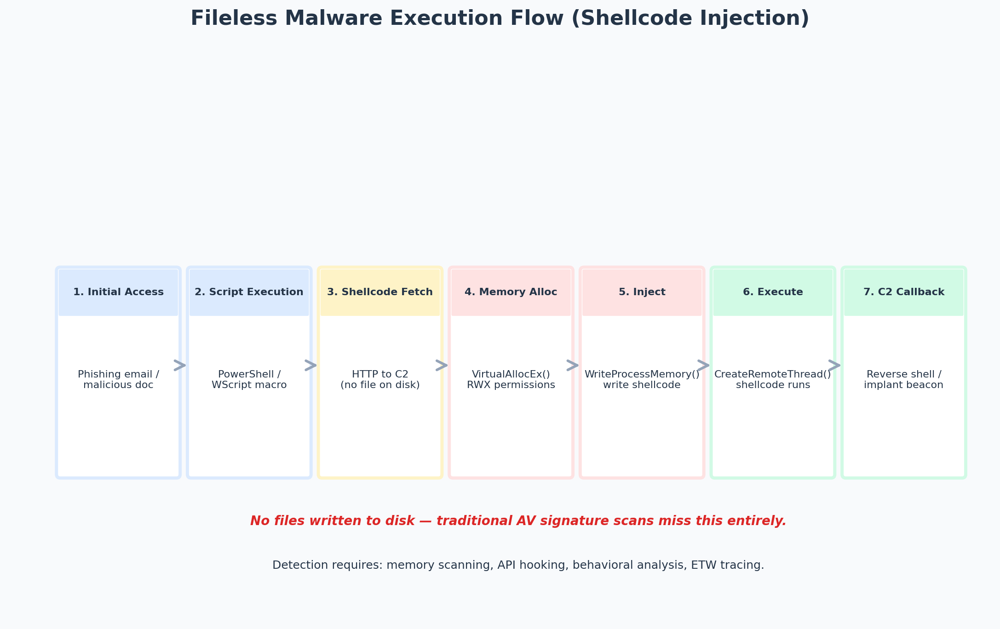

# Maldev Evasion: Shellcode Injection and Fileless Execution

> Topic: Fileless malware techniques, shellcode injection, AV/EDR evasion
> Source basis: Personal study notes on malware development (MalDev Academy curriculum)

---

## Challenge / Topic Overview

This writeup documents my study of fileless malware execution techniques — the kind of thing that shows up in advanced red-team engagements and, increasingly, in CTF challenges that model real-world adversary tradecraft. The goal is to understand how modern malware achieves execution without writing files to disk, and why traditional antivirus tools struggle to detect these techniques.

Fileless malware is malicious code that operates entirely within a computer's memory rather than installing itself on the hard drive. It uses legitimate, trusted programs (PowerShell, WScript, the .NET runtime) to compromise the system, which means no malicious files are ever written to disk. This makes detection significantly harder for traditional antivirus tools that rely on filesystem scanning to locate threats.

*The seven-stage fileless execution pipeline. Each stage uses a different Windows API, and none of them write a file to disk. The entire attack lives in memory.*

---

## Reconnaissance: Why Fileless?

Before diving into the technique, it's worth understanding *why* fileless malware exists and what advantage it gives the attacker. The core insight is that traditional AV engines scan the filesystem. If no file exists on disk, the AV has nothing to scan. The malware runs purely in memory, which means the only way to detect it is through memory scanning, API behavior monitoring, or kernel-level telemetry (ETW, Event Tracing for Windows).

The trade-off for the attacker is persistence: fileless malware doesn't survive a reboot unless it establishes a persistence mechanism (e.g., a registry run key that re-executes the shellcode loader on startup). This makes fileless techniques most useful for short-term operations — foothold establishment, lateral movement, and data exfiltration — rather than long-term persistence.

---

## Technique Deep-Dive: Shellcode Injection

The canonical fileless shellcode injection follows seven steps:

### Step 1 — Initial Access
The attacker delivers a phishing email with a malicious Office document attachment, or a shortcut file (.lnk) that triggers script execution. The document contains a macro that runs when the victim opens it.

### Step 2 — Script Execution
The macro launches PowerShell (or WScript) via `WScript.Shell.Run`. PowerShell is chosen because it's signed by Microsoft, present on every Windows install, and has full access to the Win32 API via Add-Type and P/Invoke.

### Step 3 — Shellcode Fetch
The PowerShell script downloads the shellcode payload from the attacker's C2 server using `System.Net.WebClient.DownloadData()`. The shellcode arrives as a byte array in memory — no file is written to disk.

### Step 4 — Memory Allocation
The script calls `VirtualAllocEx()` (or `VirtualAlloc()`) to allocate a memory region in the current process with `PAGE_EXECUTE_READWRITE` permissions. The RWX permission is necessary because the shellcode needs to be both written (step 5) and executed (step 6).

### Step 5 — Shellcode Injection
`WriteProcessMemory()` (or `memcpy` in .NET) copies the shellcode bytes from the downloaded byte array into the newly allocated memory region.

### Step 6 — Execution
`CreateRemoteThread()` (or `CreateThread()` for local injection) creates a new thread starting at the shellcode's address. The OS scheduler picks up the thread and begins executing the shellcode.

### Step 7 — C2 Callback
The shellcode (typically a Cobalt Strike beacon, Sliver implant, or custom reverse shell) establishes a connection back to the attacker's C2 server. From this point, the attacker has interactive access to the compromised machine.

---

## Detection and Defense

Understanding the attack is only half the story. The other half is understanding how defenders detect it:

- **Memory scanning** — EDR products scan process memory for known shellcode signatures. Attackers evade this with encryption (the shellcode is encrypted at rest, decrypted only in memory moments before execution).
- **API hooking** — Defenders hook `VirtualAllocEx`, `WriteProcessMemory`, and `CreateRemoteThread` to monitor for suspicious allocation patterns (e.g., RWX memory in a process that doesn't normally allocate executable memory).
- **ETW tracing** — Event Tracing for Windows provides kernel-level telemetry that's harder to evade than user-mode hooks. Attackers respond by disabling ETW providers early in the shellcode.
- **AMSI** — The Anti-Malware Scan Interface scans script content (PowerShell, JavaScript, VBScript) before execution. Attackers evade AMSI by obfuscating the script or patching the `amsi.dll` `AmsiScanBuffer` function in-memory.

---

## Takeaways

- **Fileless != undetectable.** Fileless techniques evade filesystem scanning but not memory scanning or behavioral analysis. The advantage is reduced, not eliminated, detection surface.
- **RWX is a red flag.** Modern EDR flags any process that allocates `PAGE_EXECUTE_READWRITE` memory. The modern evasion is to allocate `PAGE_READWRITE` (writable but not executable), write the shellcode, then `VirtualProtect()` to change permissions to `PAGE_EXECUTE_READ` right before execution. This "RW → RX" pattern is less suspicious than RWX.
- **Every Win32 API is a potential telemetry point.** The seven steps above touch seven different APIs, and each one can be hooked or traced by defenders. The more APIs an attack uses, the more detection opportunities exist. This is why advanced malware minimizes API surface area — e.g., using direct syscalls (via Nt* functions) instead of going through `kernel32.dll` wrappers.
