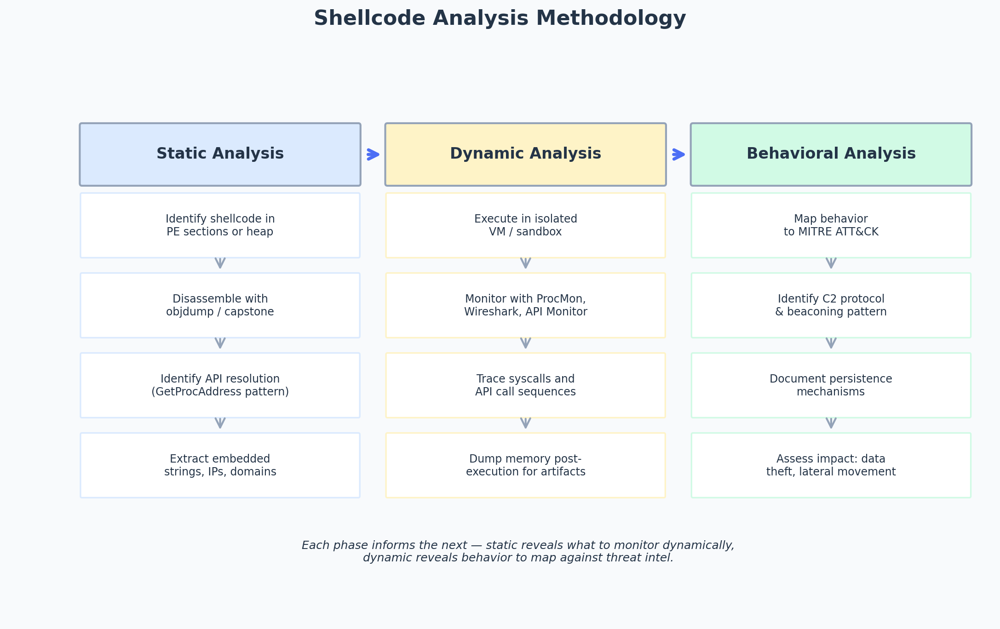

# Shellcode Analysis — Advanced Dynamic Analysis

> Topic: Malware analysis, shellcode reverse engineering, behavioral profiling
> Source basis: Personal study notes on malware analysis workflow

---

## Challenge / Topic Overview

This writeup documents my approach to analyzing shellcode extracted from a malware sample. The goal is to understand what the shellcode does — what APIs it calls, what C2 server it contacts, what data it exfiltrates — without executing it on a real machine. This is a core skill for malware analysts and for CTF players tackling reverse-engineering challenges that involve shellcode payloads.

Shellcode analysis is the process of understanding small pieces of malicious code that are injected directly into memory, typically used by attackers for exploitation or for gaining control over a compromised system. Shellcode is usually embedded in exploit payloads and is designed to execute commands or deliver additional malicious functionality.



*The three-phase analysis pipeline. Static analysis reveals structure, dynamic analysis reveals behavior, and behavioral analysis maps the behavior to threat-intel frameworks like MITRE ATT&CK.*

---

## Phase 1 — Static Analysis

Before executing anything, I dissect the shellcode statically to understand its structure.

### Identifying the shellcode

In a PE file, shellcode typically lives in:
- The `.data` or `.rsrc` section (if embedded as a resource)
- A heap allocation (if loaded at runtime)
- An encoded blob in a section marked writable, often XOR-encoded or base64-encoded

I use `objdump -s` or `xxd` to dump the raw bytes, or Ghidra's "Export Data" feature to extract a region to a binary file.

### Disassembly

Once I have the raw shellcode bytes, I disassemble them with `ndisasm` (for a quick look) or `capstone` (for Python scripting):

```bash
# Quick x86-64 disassembly
ndisasm -b 64 shellcode.bin

# Or in Python with capstone
from capstone import *
md = Cs(CS_ARCH_X86, CS_MODE_64)
for i in md.disasm(open('shellcode.bin','rb').read(), 0):
    print(f"0x{i.address:x}:\t{i.mnemonic}\t{i.op_str}")
```

### API resolution pattern

Most Windows shellcode doesn't hardcode API addresses (they change between OS versions and builds). Instead, it walks the PEB (Process Environment Block) → `LDR` → in-memory module list → export table to resolve `GetProcAddress`, then uses that to resolve everything else. I look for the following byte signatures:

- `64 A1 30 00 00 00` — `mov eax, dword ptr fs:[0x30]` (PEB access, 32-bit)
- `65 48 8B 04 25 60 00 00 00` — `mov rax, qword ptr gs:[0x60]` (PEB access, 64-bit)

Finding these tells me the shellcode resolves APIs dynamically, which means my disassembly will show `call rax` or `jmp rax` instead of named API calls.

---

## Phase 2 — Dynamic Analysis

After static analysis reveals the structure, I execute the shellcode in a controlled environment to observe its real-time behavior.

### Sandbox setup

I use an isolated Windows VM (FlareVM or a custom sandbox) with monitoring tools pre-installed:
- **Process Monitor** — filesystem and registry activity
- **Wireshark** — network traffic
- **API Monitor** — API call tracing
- **x64dbg** — interactive debugging

### Execution

I load the shellcode into a custom harness that allocates RWX memory, copies the shellcode in, and calls it. This gives me control over the execution context and lets me single-step through the shellcode in x64dbg.

### Tracing

As the shellcode runs, I monitor:
- **System calls** — what files/registry keys does it touch?
- **API calls** — what functions does it resolve and call?
- **Network traffic** — does it beacon to a C2 server? What protocol?
- **Memory mutations** — does it self-modify or decode additional payloads?

### Memory dumping

After execution, I dump the process memory with `procdump -ma` or x64dbg's "Dump memory" feature. This captures any decoded second-stage payloads that only exist in memory.

---

## Phase 3 — Behavioral Analysis

The final phase maps observed behavior to known threat-intel frameworks.

### MITRE ATT&CK mapping

I map every observed behavior to a MITRE ATT&CK technique ID:
- `VirtualAllocEx` + `WriteProcessMemory` + `CreateRemoteThread` → T1055 (Process Injection)
- HTTP beaconing to a fixed domain → T1071.001 (Web Protocols)
- Registry run key creation → T1547.001 (Registry Run Keys)

### C2 protocol identification

If the shellcode establishes a C2 channel, I analyze the protocol:
- Is it raw TCP, HTTP, DNS, or ICMP?
- Is there a beaconing interval?
- Is the traffic encrypted? What algorithm?
- Are there hardcoded IPs, domains, or URLs?

### Impact assessment

Finally, I assess what the shellcode is designed to achieve:
- **Data theft** — does it enumerate and exfiltrate files?
- **Persistence** — does it establish a run key or scheduled task?
- **Lateral movement** — does it attempt to spread via SMB or WMI?
- **Destructive action** — does it delete files or wipe disks?

---

## Takeaways

- **Static before dynamic.** Always disassemble first. Dynamic analysis without static context is like driving blind — you won't know what to look for.
- **Emulation is the safe path.** Tools like `unicorn-engine` (for CPU emulation) and `scdbg` (for shellcode-specific emulation) let me observe shellcode behavior without risking a real execution. I use them before resorting to live execution in a VM.
- **Document everything.** Every API call, every byte offset, every hardcoded string goes into my notes. Six months later, I won't remember why the shellcode at offset 0x42 was important, but my notes will tell me.
