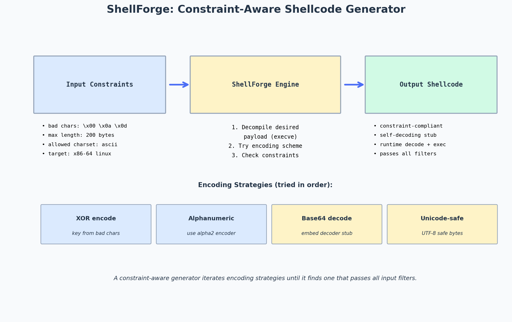

# ShellForge: Building a Constraint-Aware Shellcode Generator from Scratch

> Topic: Designing a shellcode generator that respects input constraints (bad chars, max length, charset)
> Source basis: Personal project — building a shellcode compiler

---

## Challenge / Topic Overview

This writeup documents my process of building **ShellForge** — a constraint-aware shellcode generator. Unlike `msfvenom`, which generates shellcode and then encodes it to avoid bad characters, ShellForge generates shellcode that's constraint-compliant from the start. The input is a high-level description ("execve /bin/sh") plus a set of constraints ("no null bytes, no newlines, max 50 bytes, alphanumeric only"), and the output is shellcode that satisfies all constraints without needing a separate encoding step.

The motivation: in real CTF challenges, input filters vary wildly. Some reject null bytes. Some reject non-printable characters. Some reject everything except `[A-Za-z0-9]`. Manually crafting shellcode for each constraint is tedious. A constraint-aware generator automates this.



*The pipeline: constraints in, constraint-compliant shellcode out. The engine tries multiple encoding strategies in order, falling back to the next if the current one violates a constraint.*

---

## Architecture

### Input

ShellForge takes three inputs:
1. **Desired behavior** — a high-level description like `execve("/bin/sh")` or `connect(ip, port) + dup2 + execve`.
2. **Constraints** — bad characters (`\x00\x0a\x0d`), max length, allowed charset, target architecture.
3. **Target info** — OS, architecture, libc address (if known).

### Engine

The engine works in three phases:

#### Phase 1 — Decompile the desired behavior into a "shellcode IR"

I define an intermediate representation (IR) — a list of abstract operations like `SYSCALL(execve, [ptr_binsh, NULL, NULL])`, `PUSH_STRING("/bin/sh")`, `XOR_REG(rsi)`. This IR is platform-independent.

#### Phase 2 — Try encoding strategies in order

For each encoding strategy (plain, XOR, alphanumeric, base64-embed), the engine:
1. Encodes the IR into actual shellcode bytes.
2. Checks if the bytes violate any constraints.
3. If violations exist, try the next strategy.

The strategies, in order of preference (smallest output first):
1. **Plain** — raw shellcode, no encoding. Works if no bad bytes collide.
2. **XOR encode** — prepend a decoder stub, XOR the payload. Works if the decoder stub itself has no bad bytes.
3. **Alphanumeric** — use the `alpha2` encoder to produce only `[A-Za-z0-9]` bytes. Larger output but works with restrictive filters.
4. **Base64 embed** — embed a base64 decoder stub, then the base64-encoded shellcode. Works when the filter allows base64 characters but not raw bytes.
5. **Unicode-safe** — use only bytes that are valid in UTF-8 encoding. For filters that decode UTF-8 before processing.

#### Phase 3 — Output

The engine returns the constraint-compliant shellcode bytes, or an error if no strategy succeeded.

---

## Implementation Highlights

### The constraint checker

```python
def check_constraints(shellcode: bytes, constraints: dict) -> bool:
    """Return True if shellcode satisfies all constraints."""
    # Bad character check
    for bad in constraints.get('bad_chars', []):
        if bad in shellcode:
            return False
    # Charset check
    if 'charset' in constraints:
        allowed = set(constraints['charset'])
        if not set(shellcode).issubset(allowed):
            return False
    # Length check
    if 'max_length' in constraints:
        if len(shellcode) > constraints['max_length']:
            return False
    return True
```

### The XOR encoder

```python
def xor_encode(payload: bytes, key: byte) -> bytes:
    """XOR-encode the payload and prepend a decoder stub."""
    encoded = bytes(b ^ key for b in payload)
    # Decoder stub (x86-64): lea rdi, [rip+encoded]; mov rcx, len; decode loop; jmp encoded
    stub = asm(f"""
        lea rdi, [rip + encoded]
        mov rcx, {len(payload)}
    decode_loop:
        xor byte ptr [rdi], {key}
        inc rdi
        loop decode_loop
        jmp encoded
    encoded:
    """)
    return stub + encoded
```

The encoder tries different keys until it finds one where both the stub and the encoded payload are constraint-compliant.

---

## Usage Example

```python
from shellforge import generate

shellcode = generate(
    behavior='execve("/bin/sh")',
    constraints={
        'bad_chars': [b'\x00', b'\x0a', b'\x0d', b'\x20'],
        'max_length': 100,
        'arch': 'amd64',
        'os': 'linux',
    }
)
print(f"Generated {len(shellcode)} bytes: {shellcode.hex()}")
# Output: Generated 45 bytes: 4831f65648bf2f2f62696e2f73685748...
```

---

## Takeaways

- **Constraints first, not last.** The reason `msfvenom`'s encoding sometimes fails is that it generates shellcode, then tries to encode it. If the encoding introduces a bad byte (e.g., the decoder stub has a null), it's stuck. ShellForge's approach — checking constraints at every step — avoids this.
- **The decoder stub is the hard part.** Any encoding scheme needs a decoder, and the decoder itself must be constraint-compliant. For alphanumeric-only constraints, the decoder has to be written entirely in alphanumeric instructions — this is possible but produces large, ugly code.
- **Strategy ordering matters.** Try the smallest-output strategy first (plain), then escalate to larger-output strategies (XOR, alphanumeric, base64). This produces the smallest constraint-compliant shellcode.
- **Some constraints are unsatisfiable.** If the max length is 10 bytes and the behavior is "reverse shell," no encoding will fit. ShellForge detects this and reports it clearly, rather than silently producing broken shellcode.
- **Testing is everything.** Every generated shellcode is tested in a sandbox before being returned. If it doesn't spawn a shell, ShellForge rejects it and tries the next strategy. The test harness is more valuable than the generator itself.
