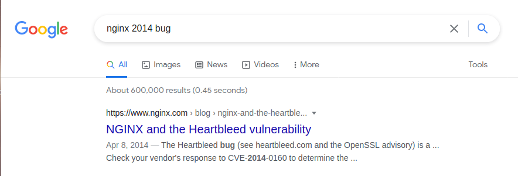
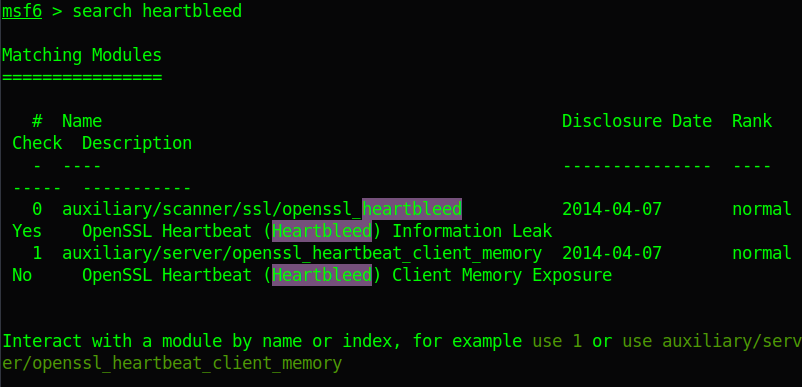
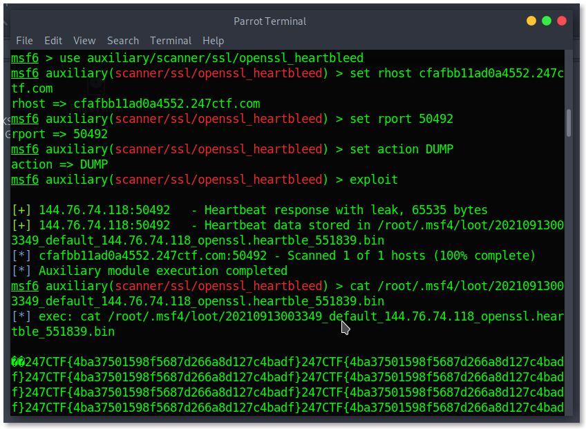

# :globe_with_meridians: 247CTF - SENSITIVE SERVER MEMORY - Writeup

---

# 247CTF — SENSITIVE SERVER MEMORY — Writeup

Description :

>

The webserver for this challenge is storing sensitive data in memory. Can you read it? Did anybody patch since 2014?.

We have a web server with the flag inside its memory and we must find a way to leak information from the memory.

reading the description we notice that the web server is not patched since 2014 hence its vulnerable to a certain attack.

let’s enumerate the webserver version.

Sent a request to the domain and got a 400 response, but I know now that it is a nginx server.

Now we have the web server type, let’s search for bugs discovered i 2014 for nginx server and related to memory.

The first result in google search reveals that this is the famous [HEARTBLEED](https://heartbleed.com/)

vulnerability, and indeed heartbleed is a memory leak vulnerability, we can exploit this in a simple way only by using metasploit framework.

we have two auxiliary modules for this bug let’s use auxiliary/scanner/ssl/openssl_heartbleed.

specify the RHOST and RPORT with the hostname and port for the webserver, also set the action option to DUMP to dump the memory content to a file.

exploit !

---
