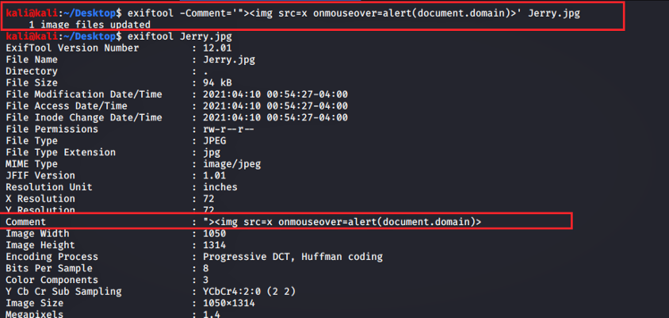
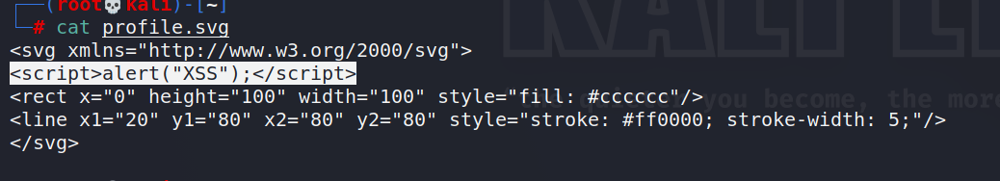

# :globe_with_meridians: All about File upload XSS. Different ways to triggered XSS though…

---

# All about File upload XSS

Hello Hackers,

Hope you guys Doing well and hunting lots of bugs and Dollars !

we have already discussed XSS in our previous article “All about XSS “. So let me introduce you to another way of finding XSS which can occur via a file upload.

A file upload is a serious opportunity to find cross-site scripting (XSS) to a web application.

As we know many web application allows clients or their users to upload files for many different purposes and this is only the opportunity to find loopholes on them. so let’s see how to attack these entry points which allows files to upload there, for the purpose of finding XSS.

>

XSS through filename

The filename always reflects on the web page when you upload any file, so you can change the filename with XSS payload and try to upload it on the web application. it may happen that XSS can be triggered there.

>

XSS through Metadata

*what is Metadata?*

Metadata is data that provides information about the other data. you can simply call it data of data.

## Get Xcheater’s stories in your inbox

Join Medium for free to get updates from this writer.

Remember me for faster sign in

It gives you basic information about the data. it can be created manually for many other reasons, but today we will use metadata for triggering our XSS payloads. For manually creating metadata you can use [ExifTool](https://github.com/exiftool/exiftool)which will help you in this process.

*writing xss payload in metadata*

It can be only arises when exif metadata not stripped from file.

>

XSS through SVG file

If the web application allows uploading SVG (scalable vector graphics) file extension, which is also an image type. then try to craft XSS payload through SVG file.

*Scalable Vector Graphics(SVG) is an XML-based vector image format for two-dimensional graphics with support for interactivity and animation.*

*payload*

Payloads

Hope this is useful for you guys

Happy Hacking

Twitter handle :- [https://twitter.com/Xch_eater](https://twitter.com/Xch_eater)

---
