# :globe_with_meridians: Blitzstorm Ctf 2024 Web Official Write Up 862452B4444D

---

Challenge Name : Cyber-Awareness.

Description : This person is Trying to raise awareness, but they are unaware that someone may be observing their action.

Author : Hanzala.

Points : 100.

## Get Hanzala Ghayas Abbasi’s stories in your inbox

Join Medium for free to get updates from this writer.

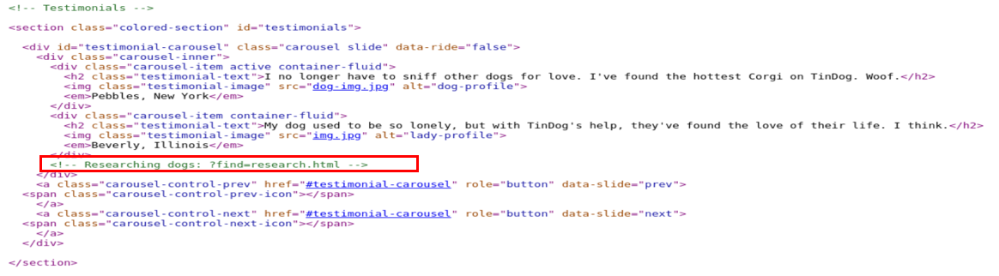
Remember me for faster sign in

After starting the instance, we encounter a cyber awareness page with nothing interesting in the code.

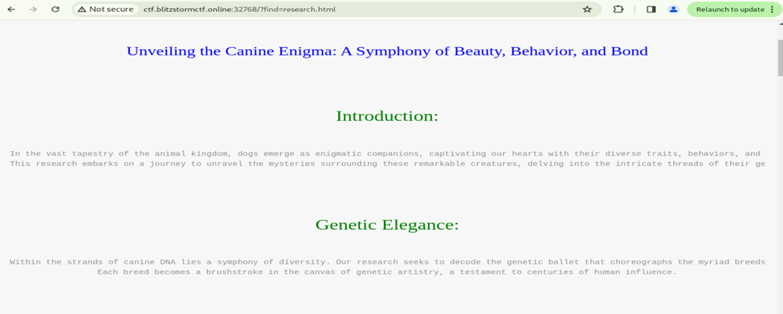
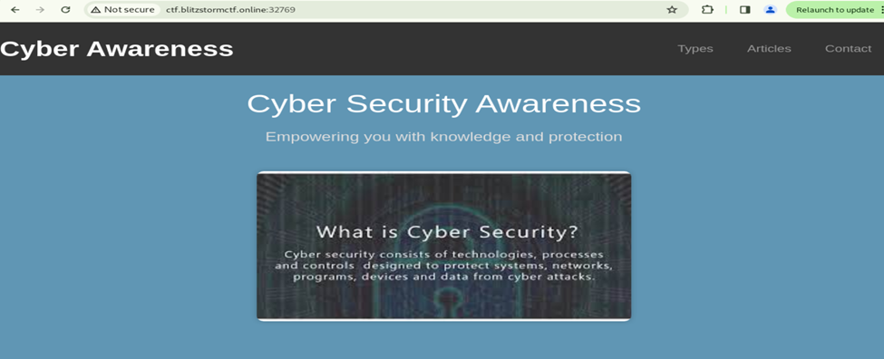

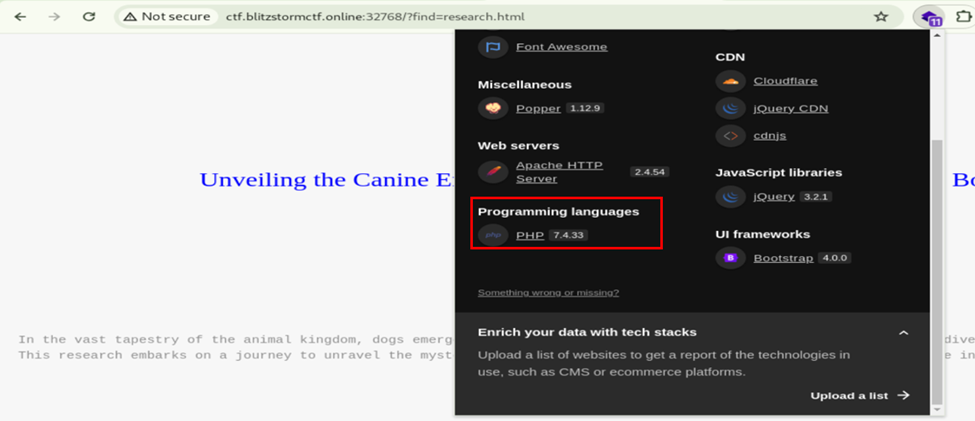

*Cyber_Awarness*

Doing directory busting reveal .git folder.

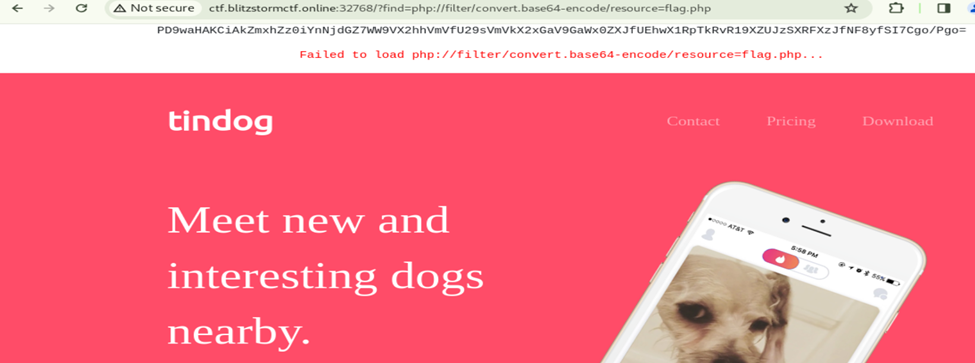
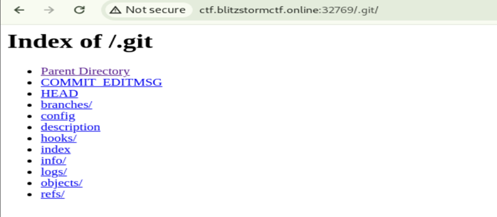

*.git*

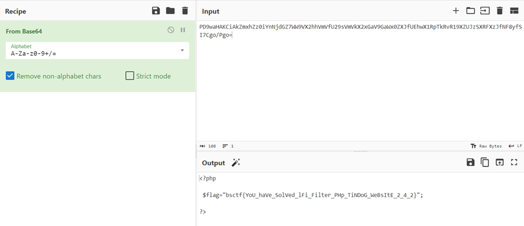
We install all .git folders on our local machine.

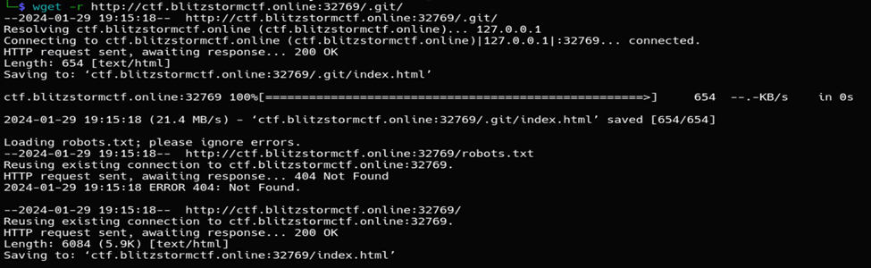

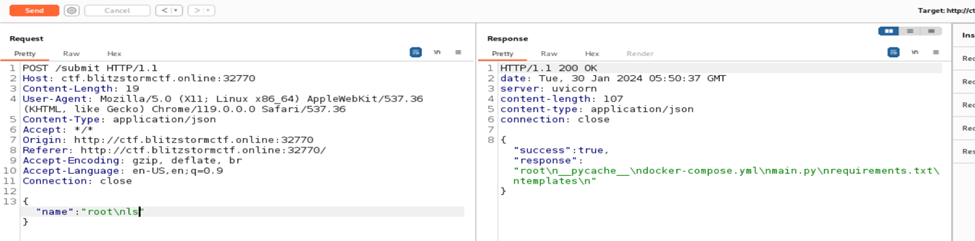

*download*

As depicted in the image below, a folder is installed; your port may vary.

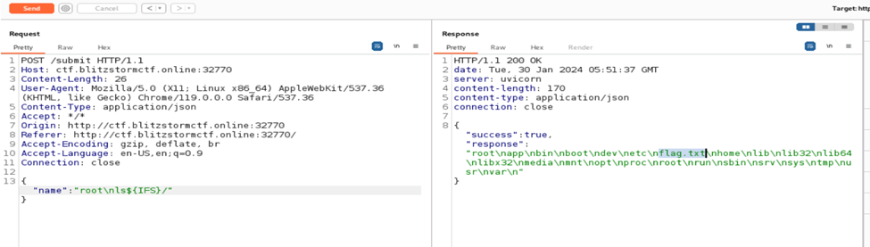
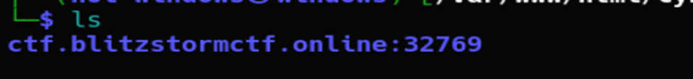

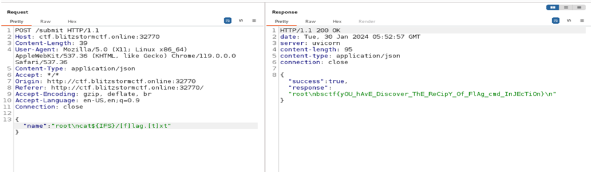

The status command indicates that the flag has been deleted.

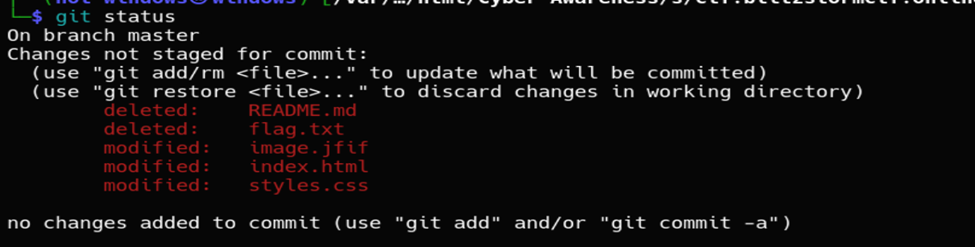

*git_status*

Using the `git checkout --` command will reveal the flag.

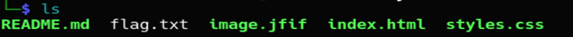

*git_checkout*

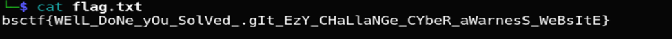

Finally we will get the flag.

*flag*

---
