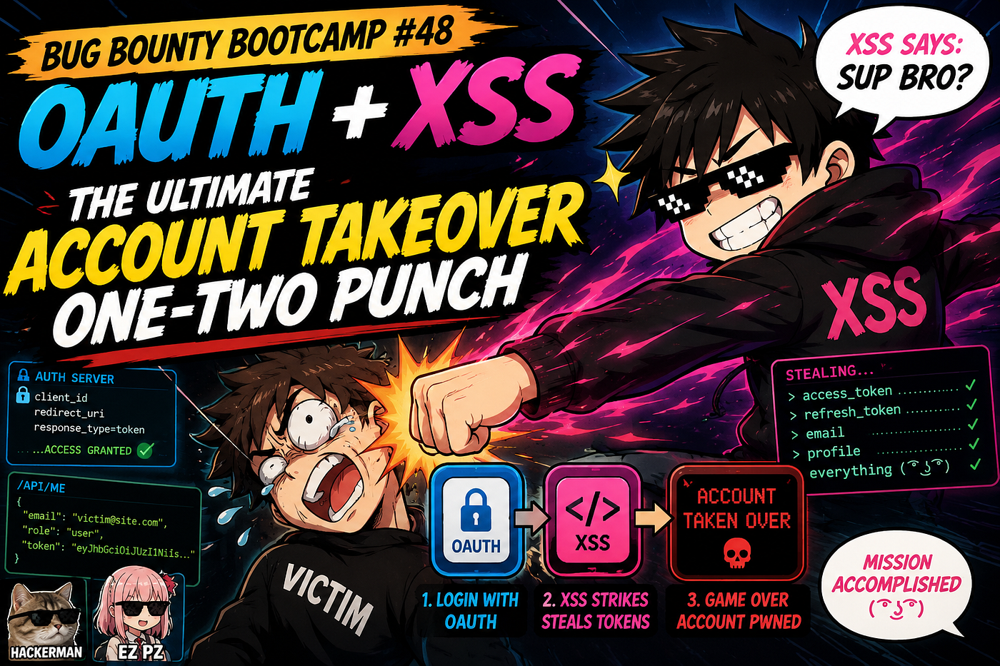

# :globe_with_meridians: “Bug Bounty Bootcamp #48: OAuth + XSS ”

---

# “Bug Bounty Bootcamp #48: OAuth + XSS ”

## The Ultimate Account Takeover One-Two Punch

You found an open redirect in the OAuth flow. Or a reflected XSS. Separate? Meh. Combined? You can steal anyone’s session token, change their email, and reset their password — all in one automated attack. Let’s chain them like a pro.

Free Link / Friend Link

Welcome back, you beautiful chain-reaction gremlin. You’ve learned about account takeovers in general. Now we focus on two powerful ATO techniques:

- OAuth + Open Redirect — Leak the authentication hash by redirecting to your server

- XSS + CSRF-style POST — Execute JavaScript that changes the user’s email, then triggers a password reset

Both techniques turn “medium” vulnerabilities into critical account takeover exploits. And the best part? You don’t need to be a JavaScript wizard — ChatGPT can write the code for you.

## Part 1: OAuth + Open Redirect — Stealing the Magic Hash

OAuth flows are beautiful and terrifying. The user clicks “Login with Google” (or any provider), gets redirected to the auth server, approves, and gets sent back with a hash or code in the URL fragment (`#access_token=xyz`). If you can control the `redirect_uri`, you can steal…

---
