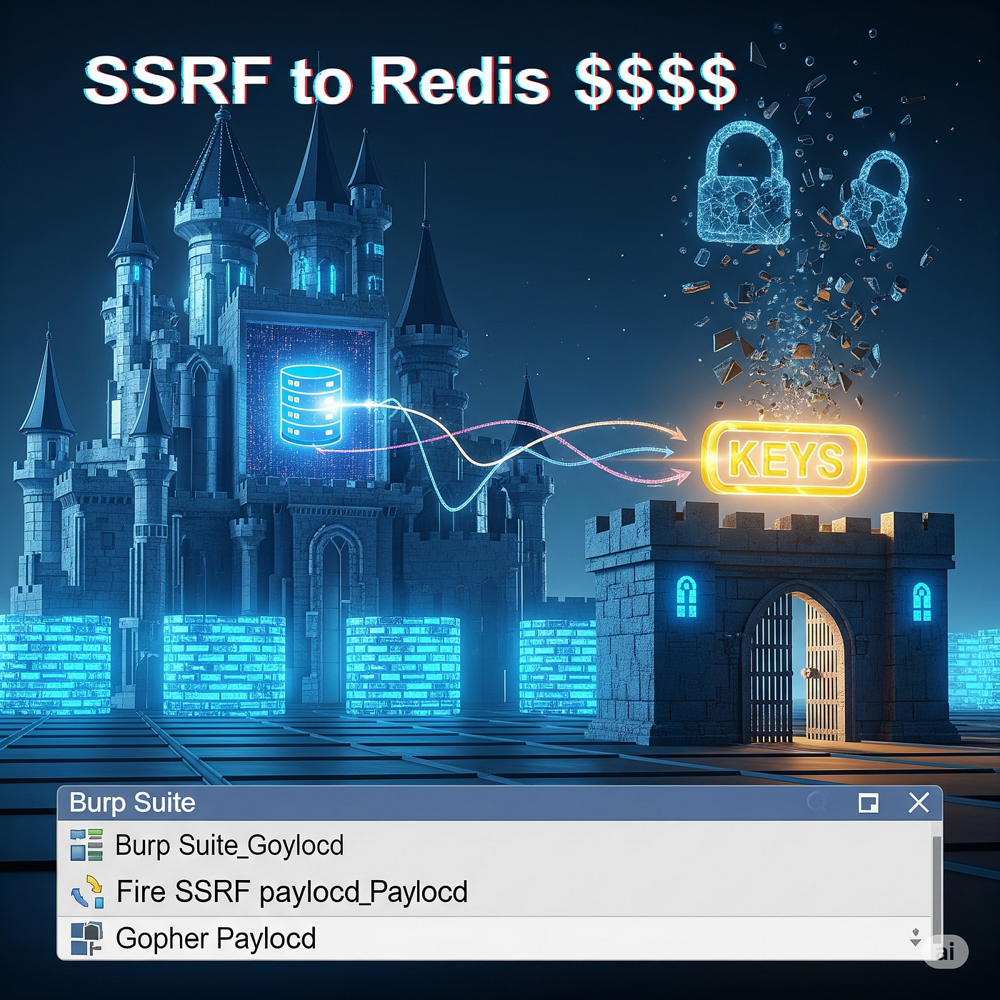

# :globe_with_meridians: 🏰💣 Burp, Bounce, and Break: How SSRF to Redis Gave Me the Keys to the Castle

---

# 🏰💣 Burp, Bounce, and Break: How SSRF to Redis Gave Me the Keys to the Castle

Free Link🎈

Hey there!😁

*Image by Gemini AI*

## “If you stare long enough into a Burp Collaborator tab, it’ll eventually stare back… usually with Redis creds.” 😵‍💫

I was just having one of *those* lazy Sundays. You know, the kind where you open Burp Suite *just* to “poke around” for a few minutes, and 14 hours later you’re still sitting in the same chair with caffeine in your blood and Redis access in your logs. 😅

Little did I know… that day I’d stumble into an SSRF so juicy, it opened the gates to an exposed Redis instance, and let me toss payloads like I was Yeeting keys into a royal vault.

## 🧭 Recon: Hunting Beyond the Login Page

I started with the usual mass recon routine:

- `assetfinder --subs-only target.com`

- `httpx -status -title -tech-detect -follow-redirects -timeout 10`

---
