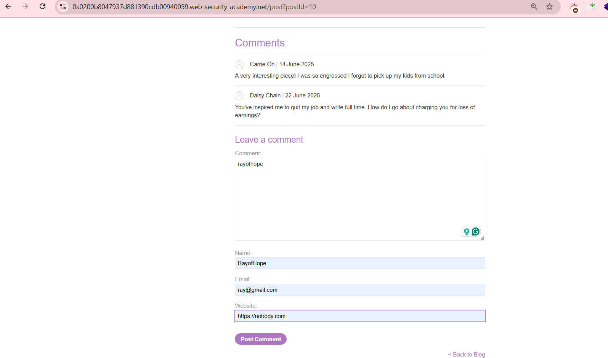
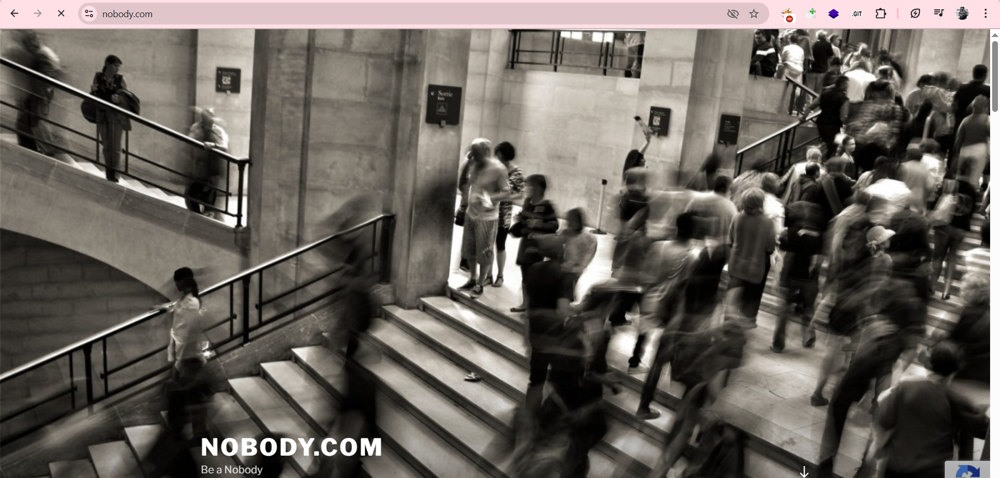
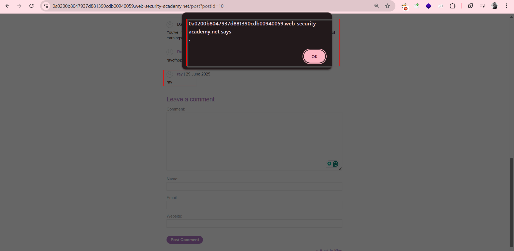

# :globe_with_meridians: Day 8:Stored XSS into anchor `href` attribute with double quotes HTML-encoded : Zero to Hero Series — Portswigger

---

# Day 8:Stored XSS into anchor `href` attribute with double quotes HTML-encoded : Zero to Hero Series — Portswigger

Hi, my fellow hackers. This is Rayofhope. I have over 5 years of experience and am currently working as a consultant with a Big 4 firm.

It’s Day 24 of posting all the PortSwigger labs, not just the solutions. I’ll break down *why*we take each step, because once the *‘why’ is clear, the ‘how’ becomes easy.*Let’s Start:

>

*Video Walkthrough — You can watch the video or read the blog, totally up to you. But if you ask me, start with the video, then read the blog to connect all the dots.*

---
