# :globe_with_meridians: Demystifying Insecure Deserialization in PHP

---

# Demystifying Insecure Deserialization in PHP

*Credits: PortSwigger*


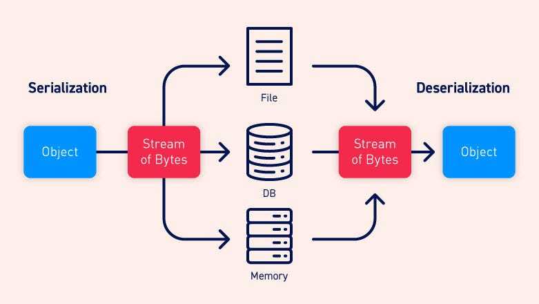
## Serialization vs Deserialization

Serialization is the process of converting objects to a sequential stream of bytes so that it can be easily stored in a database or transmitted over a network. Deserialization is the exact opposite of serialization. It is the process of converting this sequential stream of bytes to a fully functional object.

The object’s state is also persisted which means that the object’s attributes are preserved, along with their assigned values. The process of preventing a field from being serialized varies from language to language.

## What is insecure deserialization?

Insecure deserialization is when user-controllable data is deserialized by an application. This allows an attacker to manipulate serialized objects and pass malicious data into the application code. It is possible to replace the serialized object with an object of a completely different class.

It is virtually impossible to implement validation or sanitization to account for every eventuality. These checks are also fundamentally flawed as they rely on checking the data after it has been deserialized, which in many cases will be too late to prevent the attack as you will see in the exploitation examples later.

## How to prevent insecure deserialization vulnerabilities

Deserialization of user input should be avoided unless necessary. If you do need to deserialize data from untrusted sources, incorporate robust measures to make sure that the data has not been tampered with. For example, you could implement a digital signature to check the integrity of the data. However, remember that any checks must take place before beginning the deserialization process. Otherwise, they are of little use.

## Exploiting insecure deserialization in PHP

### Basics of PHP Deserialization

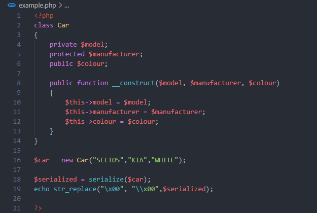


Lines 2–15: Declaring a PHP class called Car which has 3 attributes model, manufacturer and colour. Each of them has different access specifiers for demonstration purposes. The parameterized constructor is used for initializing the attributes.

Line 16: Creating an object of class Car.

Lines 18,19: Serializing the object created in Line #16. Serialization creates some non-printable characters like \x00 so we are replacing it with \\x00 so that we can view the output properly.

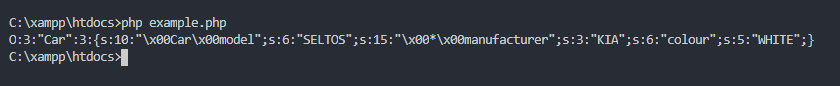


```
O:3:"Car":3:{...}
Objects start with upper case O, followed by the the length of the class name(which is 3 because length of the word car is 3), followed by name of the class i.e. Car, followed by number of attribues in the class which is 3 (model, manufaturer and colour).s:10:"\x00Car\x00model";s:6:"SELTOS";
This is an attribute of the class car with it's corresponding value. 's' means a string attribute followed by the length of the name of attribute. Notice how the access specifier(private) is appended before the attribute name while serialization. \x00ClassName\x00 is the format followed in case of private attributes. This is followed by the type (s: string), length (6 characters in SELTOS) and value (SELTOS) of the attribute (model).s:15:"\x00*\x00manufacturer";s:3:"KIA";
This is also similar to the above example however, as this attribute is of protected type, \x00*\x00 is appended before the attribute name.s:6:"colour";s:5:"WHITE";
For public attributes nothing is appended to the attribute name. The remaining part is similar to the other attributes.Some other types of data can also be present like i for integer and b for boolean. The lenghth of the value is not required in this case.
s:6:wheels;i:4; is similar to public int wheels = 4
s:10:twowheeler;b:0; is similar to public boolean twowheeler = false
```

### Manipulating serialized objects

Suppose there is a web application which uses serialization-based session mechanism. The user details are present in the session cookie in a serialized form. It is possible to manipulate this data and escalate our privileges.

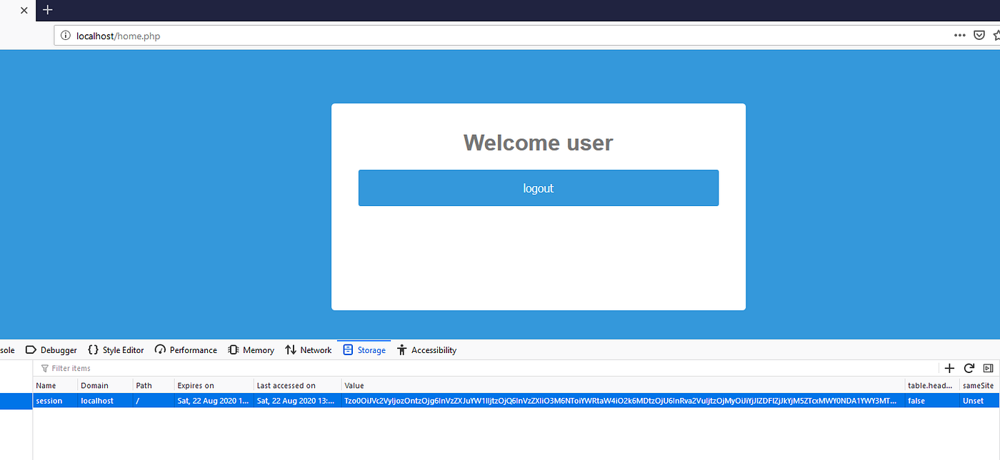


After logging in to the application we can see that a session cookie is set and its base64 encoded. After decoding the value we can see it is a serialized PHP object.

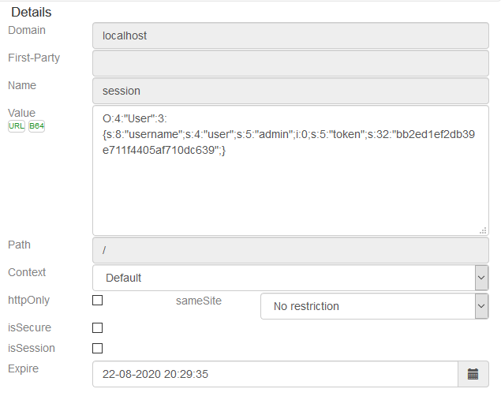


There is an interesting attribute: admin in this cookie which is set to 0. We modify this value to 1, encode it back to base64 and save the new cookie value.

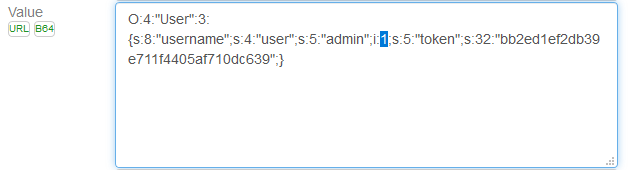


After refreshing the page now we can see that it is now possible to access the admin section of the page.

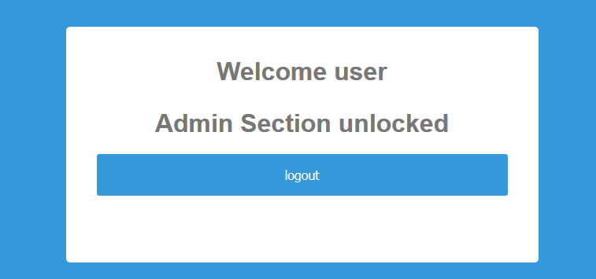


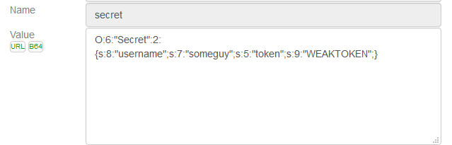

In the backend code, we can see that the application blindly trusts serialized data (Line 7) and provided access control as per the values of the object attributes (Line 21). As it is possible to modify this object attribute and escalate our privileges.

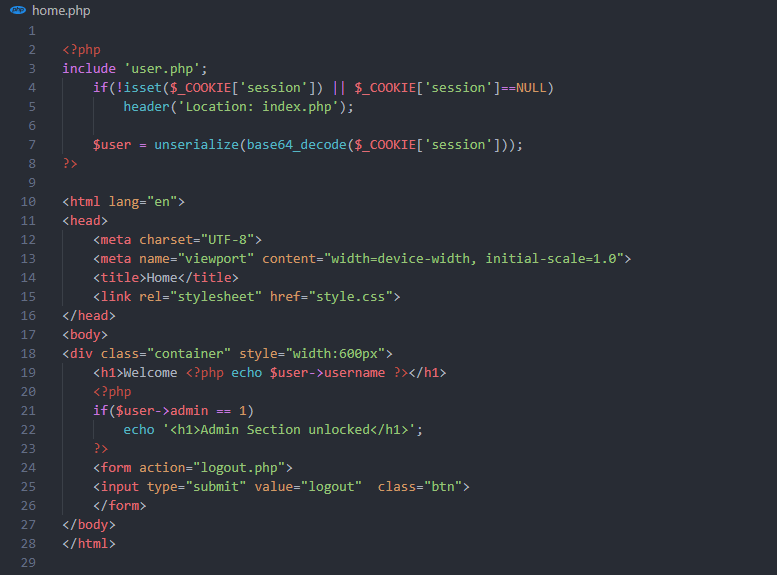


### Manipulating PHP data types and comparisons

This code is basically a proof of concept of how PHP handles data types and loose comparisons and how it can be manipulated. After opening this page and clicking on the set/reset button a cookie is set. This cookie is a serialized object of the class `Secret `which contains a `username `and a `token`. By default, it will show that the user is low privileged, however, if the username is admin and the token is set to the super-secret admin token it is possible to access the admin section. In the following section, we will see how we can bypass these requirements by manipulating how PHP compares data.

## Get Sourov Ghosh’s stories in your inbox

Join Medium for free to get updates from this writer.

Remember me for faster sign in

PHP’s loose comparison is quite strange due to the following characteristics:

- When comparing between an integer and a string, PHP will convert the string to an integer. This means `5 == "5"`

- When comparing an alphanumeric string with a number it will first check if the string begins with a number. If it starts with a number it will ignore the rest of the string. This means`2 == "2 some random string"` is equivalent to `2 == "2"`.

- If this string does not contain an integer then it’s converted to 0 probably because it has 0 numbers in it. So `0 == "Somestring"` is true.

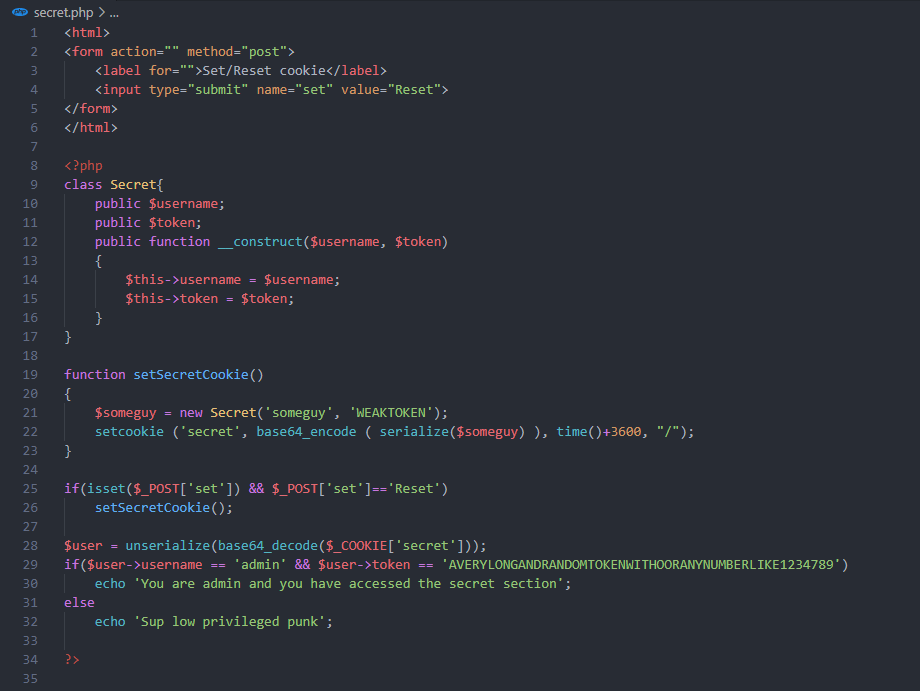


In this exploit, we are going to do the exact same thing. We will change the name to admin and change the token to an integer 0.

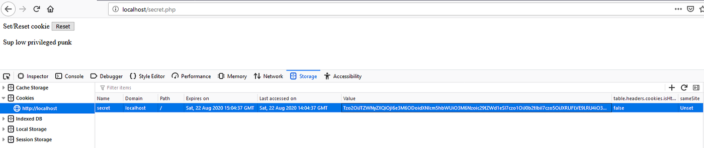


After reloading the page that the page now thinks we are admin and we have bypassed the authentication check without the super-secret access token.

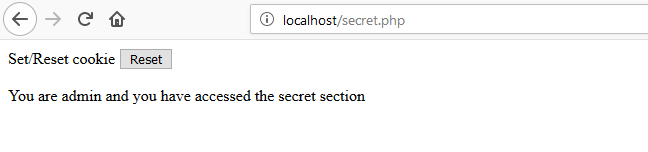


This only works for deserialized objects. It will not work if the password is directly fetched from the parameter, in that case, it would be converted to a string. This only works because data types are preserved in serialization and it is possible to change the type to integer.

### Magic methods and arbitrary objects

Magic methods are special functions that are called automatically. These functions begin with double underscore e.g.` __construct()`. The `__construct()` method gets called as soon as a new object is created. A developer can implement his own `__construct()` method for implementing a parameterized constructor. There are several other magic methods but we will focus on `__destruct()` and `__wakeup()`.

`__wakeup` will be called as soon as a serialized object of the class is deserialized. The intended use of __wakeup() is to reestablish any database connections that may have been lost during serialization and perform other reinitialization tasks. The `__destruct()` method is called automatically for each PHP object at the end of the PHP code execution.

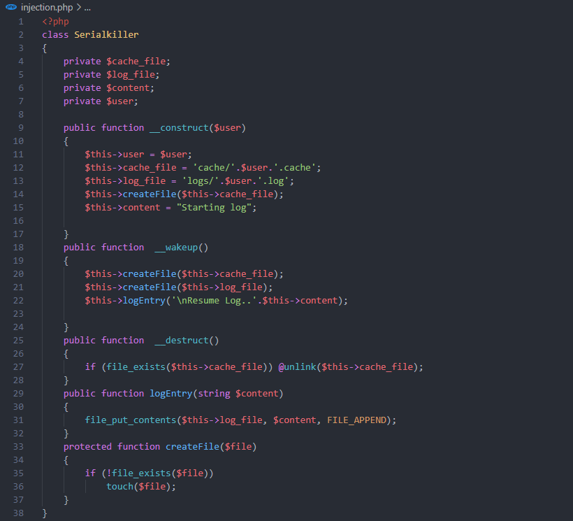


In this code, there is a class called Serialkiller which takes the username as input in the constructor.

- After that, it initializes the file paths for log and cache. The files will be created inside the `/logs` and `/cache` directory.

- There is a helper method `createFile()` which creates files and a `logEntry()` which writes data into the files.

- The `__destroy()` magic method deletes the user’s cache file when the script execution finishes.

- The `__wakeup()` magic method reinitializes the file log and cache files if it does not exist and then creates a log entry.


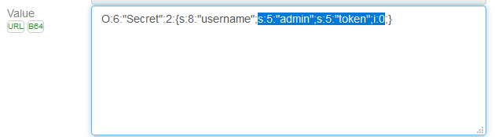
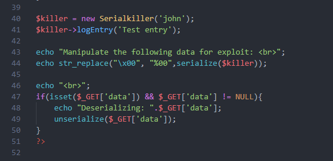


After the class declaration, we create an instance of the Serialkiller class and write a test log. In lines 43–50, we print the serialized form of the instance created before. We replace `\x00` with its URL encoded form `%00`. We will modify this output for creating our exploits.

If the data parameter is set in a GET request the program deserializes whatever is give as input. We will use this to test our exploits.

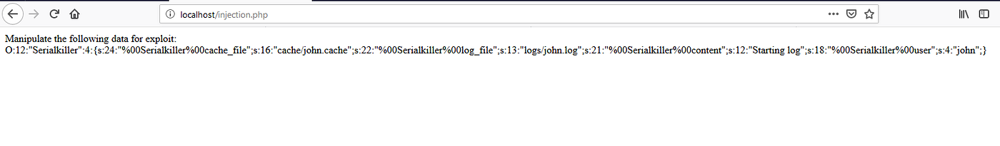


After executing the script we get the serialized object which we will use for developing the exploit. For the first exploit, we will delete the test.txt file from the webroot by manipulating the __destruct function.

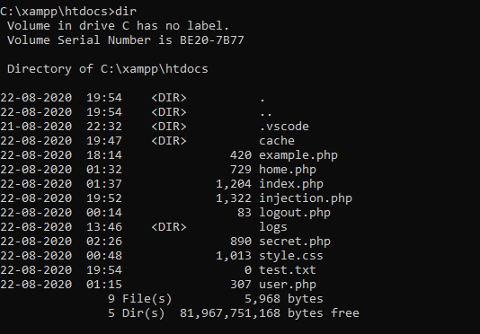


We will change the value of the cache_file attribute to test.txt in the serialized object and deserialize it by giving it as input to the data parameter. After deserialization, the cache_file attribute points to test.txt. When the __destruct() method is called it deletes test.txt (Line 27).

```
O:12:"Serialkiller":4:{s:24:"%00Serialkiller%00cache_file";s:8:"test.txt";s:22:"%00Serialkiller%00log_file";s:13:"logs/john.log";s:21:"%00Serialkiller%00content";s:12:"Starting log";s:18:"%00Serialkiller%00user";s:4:"john";}

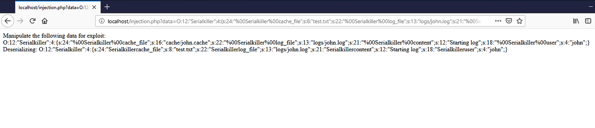

```

We can verify from the next screenshot that the test.txt file has been deleted.

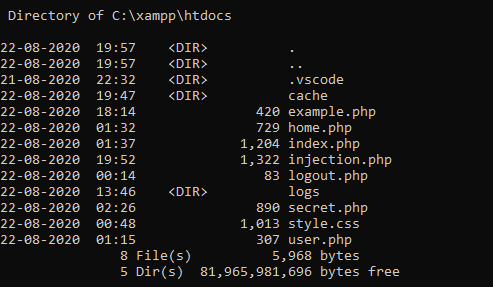


For the next exploit, we are going to execute code on the server by creating a malicious PHP file on the server and executing it. For this, we are going to use the `__wakeup()` function.

We know that `__wakeup()` is called as soon as an object is deserialized. Inside the function, it creates a log file and also adds a log entry. We will manipulate the values of the variables so that instead of creating a log file, a PHP file is created and instead of writing the log entry some malicious PHP command is written in the PHP file. We follow the steps below to exploit this

- We modify the `log_file` attribute in the payload to the target path of the PHP RCE file we want to generate(`logs/rce.php` in the example below). As soon as createFile() is called with it will check if `logs/rce.php` (which is the value of `log_file` variable) file exists or not and will create it if it's missing (Line 21,35).

- Similarly, we will modify the `content` attribute in the payload to some PHP code like `<?php system('dir C:\\'); ?>`. The `logEntry()` method called in Line 22 takes the value of the `content` variable and writes it to `log_file` . Thus malicious PHP code will be written to the `/logs/rce.php` file.

The payload should look similar to this:

```
O:12:"Serialkiller":4:{s:24:"%00Serialkiller%00cache_file";s:16:"cache/john.cache";s:22:"%00Serialkiller%00log_file";s:12:"logs/rce.php";s:21:"%00Serialkiller%00content";s:28:"<?php system('dir C:\\'); ?>";s:18:"%00Serialkiller%00user";s:4:"john";}

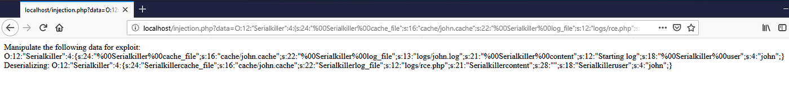

```

As this program deserializes anything which is passed in the GET parameter `data` , we can execute the payload by opening the following page on the browser:

```
http://localhost/injection.php?data=O:12:"Serialkiller":4:{s:24:"%00Serialkiller%00cache_file";s:16:"cache/john.cache";s:22:"%00Serialkiller%00log_file";s:12:"logs/rce.php";s:21:"%00Serialkiller%00content";s:28:"<?php system('dir C:\\'); ?>";s:18:"%00Serialkiller%00user";s:4:"john";}
```

After the above payload is executed we navigate to the new PHP file created in `http://localhost/logs/rce.php`. We can see that it is possible to execute code.

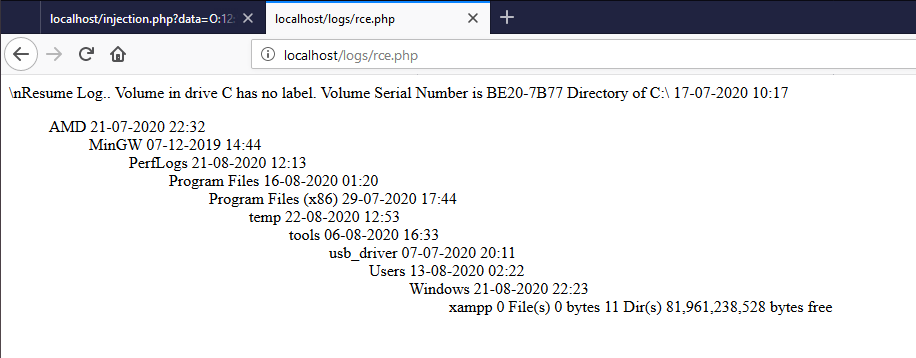


There is also something known as Gadgets which are code snippets present in the code itself. These gadgets can be chained for exploitation however it is almost impossible to find them without the source code and takes a lot of time. We can use the [PHPGGC](https://github.com/ambionics/phpggc) tool to create payloads for such known gadget chains.

All the code used in the above examples can be found from my GitHub repository [here](https://github.com/sh4d3s/Insecure-Deserialization). I plan on making similar codes for Java and .NET soon.

## Further Reading

---
