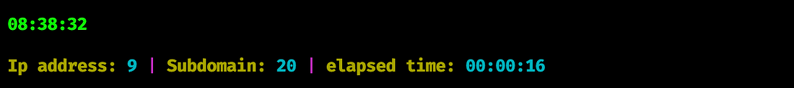

# :globe_with_meridians: Discovery of an XSS on Opera. Discovering XSS in large companies is…

---

And here we found 4 more subdomains which brings us to the vulnerability. I didn’t care about the rest of the subdomains anymore and started looking at those four subdomains. First I started collecting all the old endpoints with katana and archive.

```
cat subs.txt | waybackurls > path.txt; cat subs.txt | katana >> path.txt ; cat path.txt | uro > path.txt2 ; cat path.txt2 | httpx -sc
```


Unfortunately or fortunately, I didn’t get any results this time, which means the results are all fresh and new. I started recon manually and opened one of the subdomains and it led me to such a path:

```
https://game.target.tld/staticgames/wordsearch?url=https://site.tld/pmm/wordsearch
```


I changed the URL’s parameter value to XSS payload:

```
javascript:alert(origin)
```


and Bingo, the alert fired for me 😎🥂. Easy Payload = Good Recon

Thank you for following me here, Don’t forget to follow me for more write-ups.



[Twitter](https://twitter.com/M7arm4n) 🐦

---
