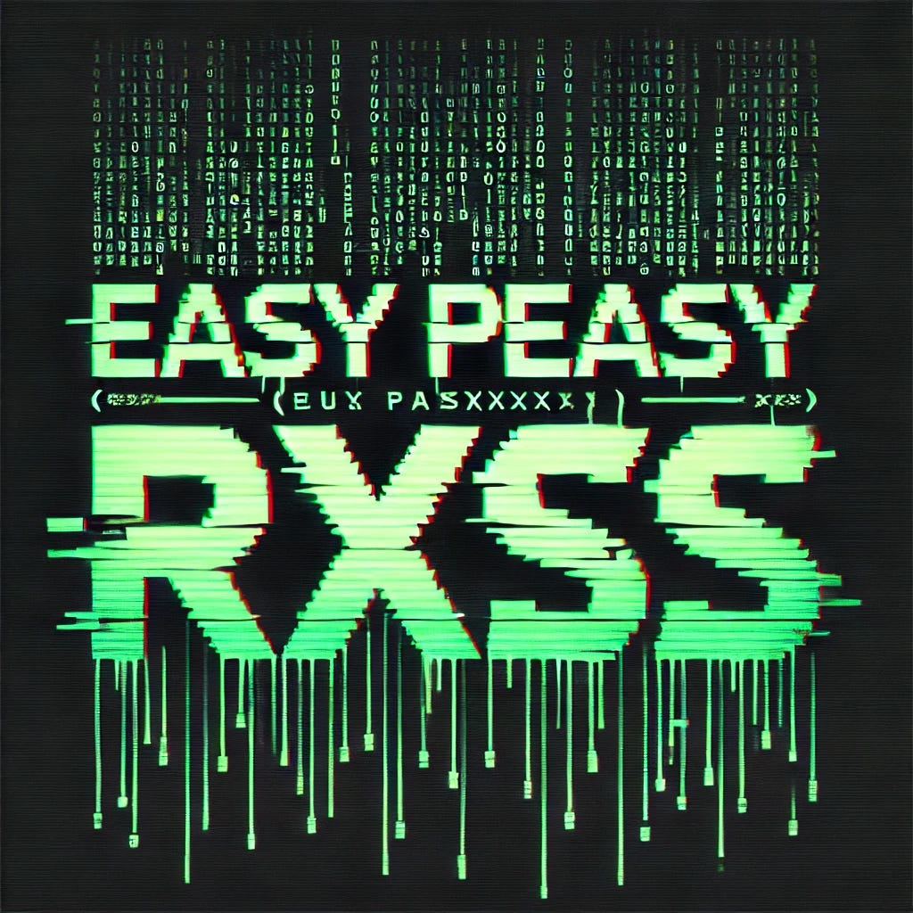

# :globe_with_meridians: Easy Peasy RXSS 👾. Hello Hackers, Today in this quick…

---

Hello Hackers, Today in this quick writeup I am going to share one of my finding of Reflected xss which was actually easy to find. So let’s jump into it.




*Credit: DALL-E*

Consider our target website as target.com. while testing I found the subdomain called tunnel.target.com which looks very different then all the others so I am just visiting all the endpoints of this subdomain and I find this path:

```
https://tunnel.target.com/a/b/c/index.php?a=xyz&system=xyz
```

So I am interested in testing for sqli in the system parameter so I quickly run the sqlmap tool on this path and found nothing 😢 . But sqlmap tells that the parameter might be vulnerable to Cross-Site-Scripting. And I directly jump to test for RXSS. To my surprise the website even not use any type of WAF to protect so it is very easy to detect and work with very simple payload.

Payload: “><script>alert(document.cookie)</script>

The final url looks like this:

```
https://tunnel.target.com/a/b/c/index.php?a=xyz&system=xyz"><script>alert(document.cookie)</script>
```

Then quickly make a full proper report and submitted and after long time reply comes from the company. This is already reported by another researcher so we are marking this report as Duplicate 🤐. As my instict says that this is very easy to detect so others may be even more quicker then me.

---
