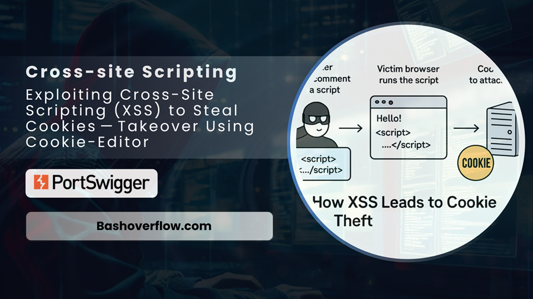

# :globe_with_meridians: Exploiting Cross-Site Scripting (XSS) to Steal Cookies — Takeover Using Cookie-Editor

---

# Exploiting Cross-Site Scripting (XSS) to Steal Cookies — Takeover Using Cookie-Editor

Learn how XSS vulnerabilities can be used to steal session cookies and hijack user accounts.

🔓 [Free Link](https://bashoverflow.com/abd98e0849d2?sk=56bb5c160148d6b142d0a92475eb3e71)

*Exploiting Cross-Site Scripting (XSS) to Steal Cookies — Takeover Using Cookie-Editor*

>

Disclaimer:
The techniques described in this document are intended solely for ethical use and educational purposes. Unauthorized use of these methods outside approved environments is strictly prohibited, as it is illegal, unethical, and may lead to severe consequences.

It is crucial to act responsibly, comply with all applicable laws, and adhere to established ethical guidelines. Any activity that exploits security vulnerabilities or compromises the safety, privacy, or integrity of others is strictly forbidden.

## Table of Contents

- Summary of the Vulnerability

- Steps to Reproduce & Proof of Concept (PoC)

- Impact

## Summary of the Vulnerability

In this lab provided by PortSwigger, we explore a stored cross-site scripting (XSS) vulnerability found in the blog comments feature of a sample website. This flaw allows an attacker to inject a malicious script directly into the comments section, which is later rendered in the victim’s browser when they view the blog post.

---
