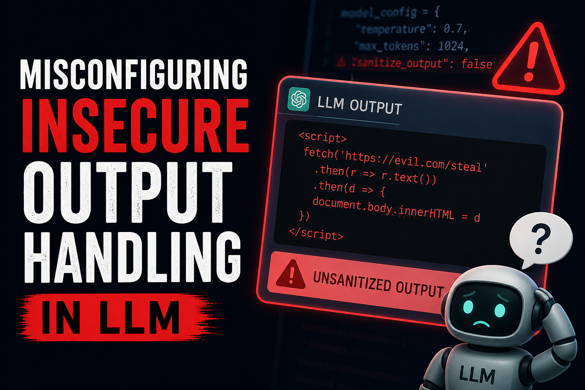

# :globe_with_meridians: 🚨 Exploiting Insecure Output Handling in LLMs via Indirect Prompt Injection (XSS)

---

# 🚨 Exploiting Insecure Output Handling in LLMs via Indirect Prompt Injection (XSS)

## How a Product Review Became a Weapon Against an AI Chatbot 🤖💥

Friend’s link: link (Non Member utilise this link for accessing the blog)

Artificial Intelligence is rapidly becoming part of modern web applications — from customer support bots to shopping assistants and recommendation engines. But as developers rush to integrate LLMs into production systems, a dangerous misconception keeps appearing:

>

*“AI-generated content is safe to render.”*

This lab from [PortSwigger Web Security Academy](https://portswigger.net/web-security?utm_source=chatgpt.com) proves exactly why that assumption is dangerous.

In this expert-level challenge, we exploit insecure output handling in an LLM-powered live chat system to perform an indirect prompt injection attack that results in stored XSS and ultimately deletes another user’s account automatically. 😈

## 🧠 What You’ll Learn

In this walkthrough, we’ll cover:

✅ Indirect Prompt Injection
✅ LLM Output Injection
✅ Stored XSS via AI Responses
✅ Bypassing AI Safety Filters
✅ Real-world impact of insecure AI integrations

---
