# :globe_with_meridians: Exploiting Non-Cloud SSRF for More Fun & Profit

---

# Exploiting Non-Cloud SSRF for More Fun & Profit

Hi Everyone, This is [Basavaraj](https://twitter.com/basu_banakar), Back again with another SSRF Writeup :) You can check my older writeups here [)

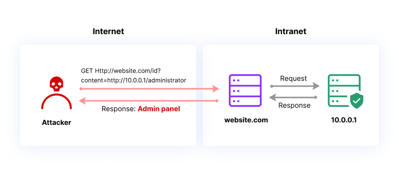
Let's jump in directly, while hunting on some random target in my spare time, I came across one subdomain where we can see the reports related to the company and marketing, I found one functionality where we can see the report in pdf format.

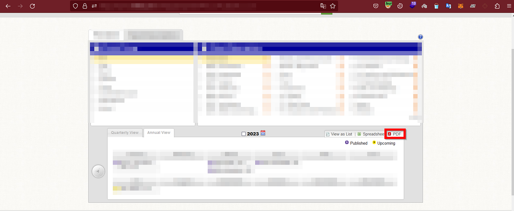

*To see the report in PDF format*

And after clicking on the PDF Button it made one request and the response looked like this.

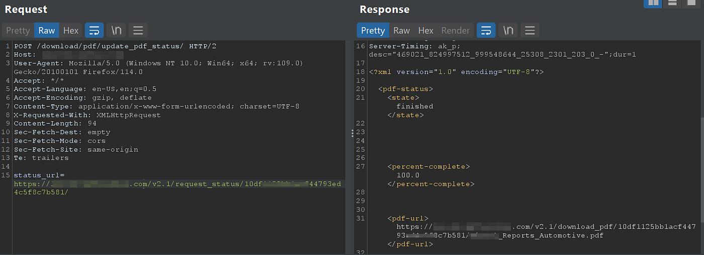

*request and response*

Now quickly inserted one random URL ex: evil.com in the status_url param and got the response of that evil.com, Now I confirmed the Full Read SSRF.

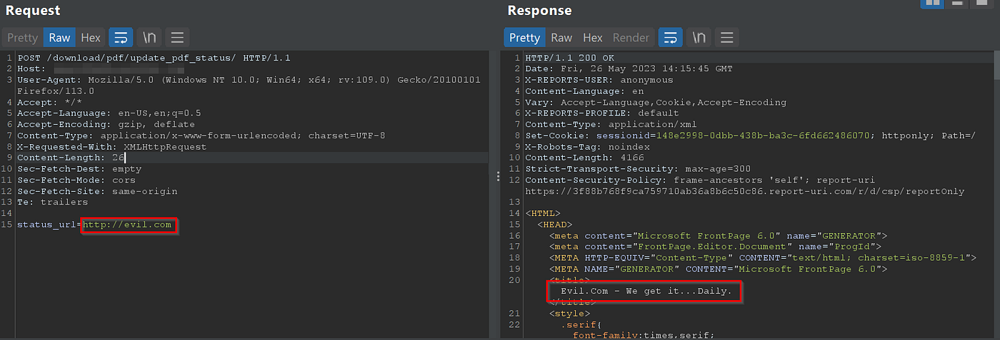

*Confirmed the full read SSRF*

What next, Will check for local file read via file:/// protocol, Now added file:///etc/passwd and sent the request and the response is 403 by Akamai :(

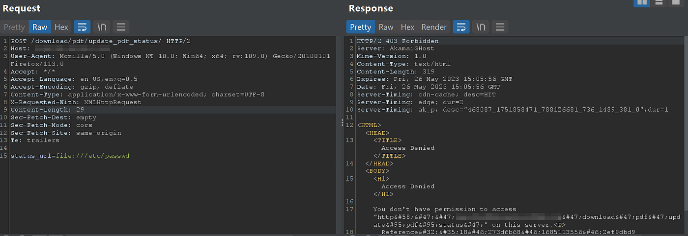

*WAF Blocked due to file protocol*

Dropped this here, and went for internal port scanning for localhost, and scanned 1–10000 Ports by using intruder and successfully found 2 open ports i.e 25 and 9080

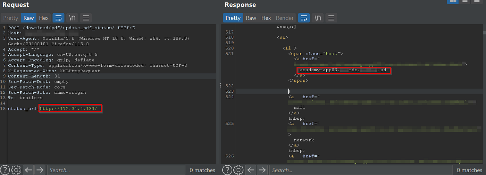
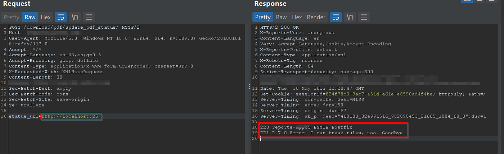

*25 Port open with esmtp postfixservice*

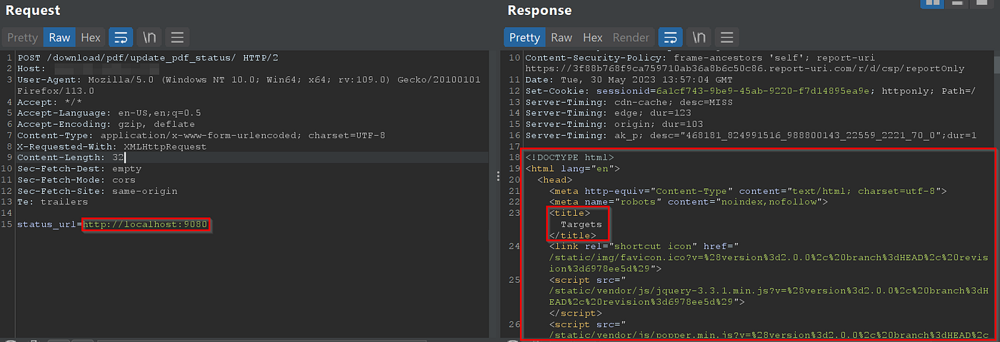

*9080 Open with some random internal webserver*

Now I thought this exploit is enough to report, And reported this to the company and their response was like this :)

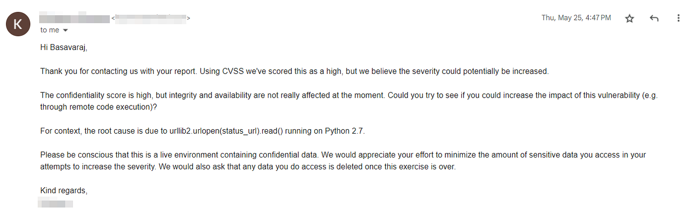

*Love these kinds of responses :)*

>

Now I started exploring more about this issue on the same day like Trying other protocols like Gopher, trying to find internal IPs, internal hosts, etc but no success, one more bad luck is they are not using the cloud as well :(

Took a break for 2hrs and started exploring more about Akamai waf that blocking file:/// protocol and came to know that there will be a set of WAF rules which are blocking the common files like etc/passwd, etc/hosts, etc/shadow, etc. and I started exploring different file paths regarding centos and I was able to read some files successfully but found one interesting file i.e proc/net/arp

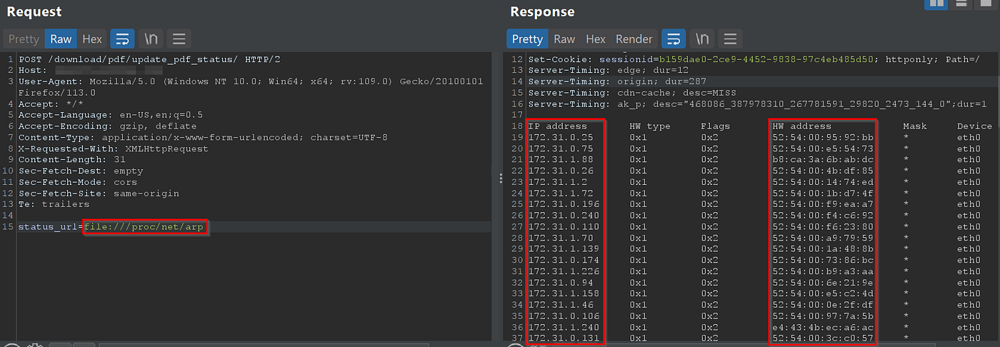

*file:///proc/net/arp*

Now noted down all the internal IPs and built the two CIDRRanges which look like this :)

>

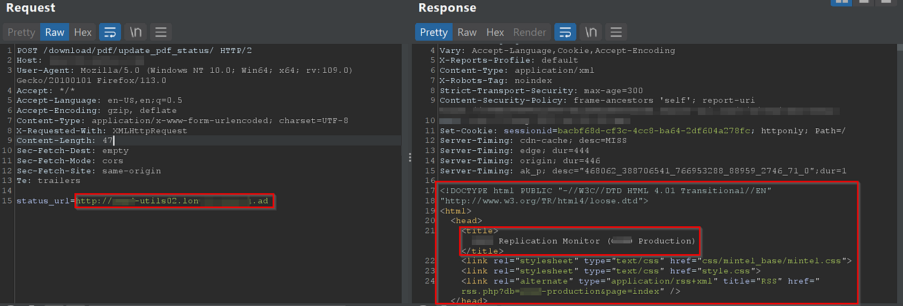
*172.31.0.0/23*
172.31.0.1–255
172.31.1.1–255

*172.31.8.0/23*
172.31.8.1–255
172.31.9.1–255

Now I converted these CIDR ranges to IP addresses and I got 1024 IP addresses.

>

What next?

Now let's use intruder to brute force these IPs :) and the results were astonishing :)

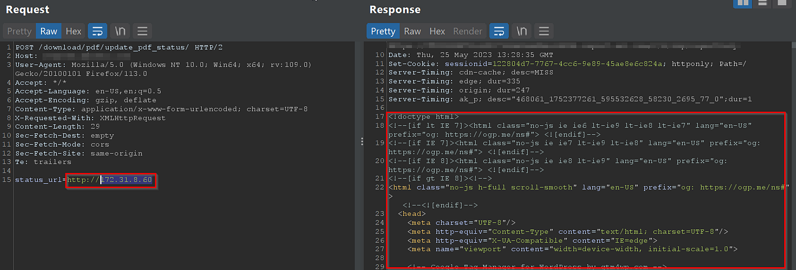

*got access to a random internal web server*

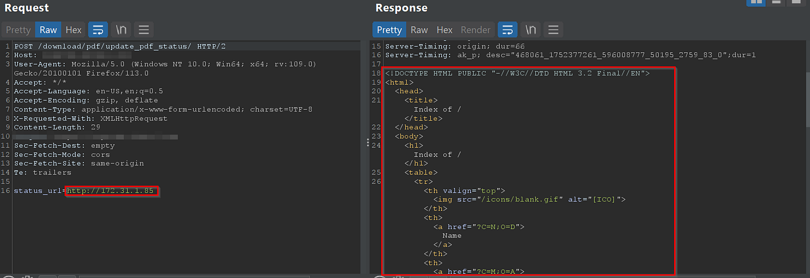

*Internal web server with directory listing enabled with some files*

Now here comes the tricky part, Now in response of the below request, I searched for hostnames that belong to the target for example “.target.” and found some 6000+ results for example: some-internal-app.target.ad here I guess .ad represents an active directory

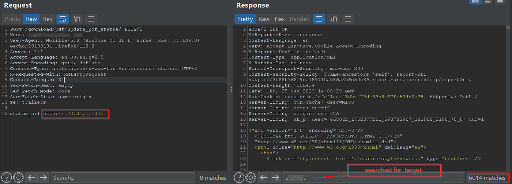

*6000+ internal hostnames*

*example hostname*

>

Now extracted all internal hostnames and started brute-forcing them again using intruder, Now this will be the end because as an attacker I could have takeover the company 😂

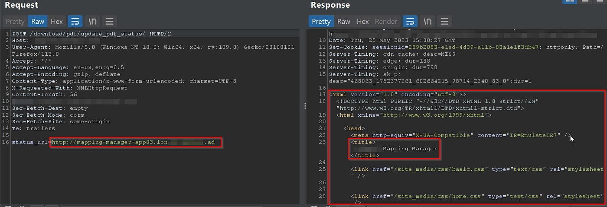
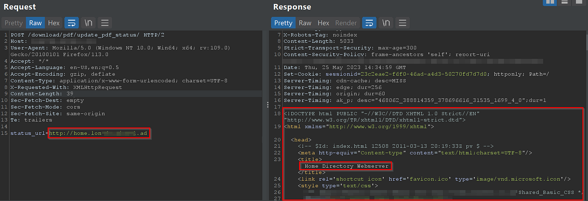

And here are the results :)

*Internal web server :)*

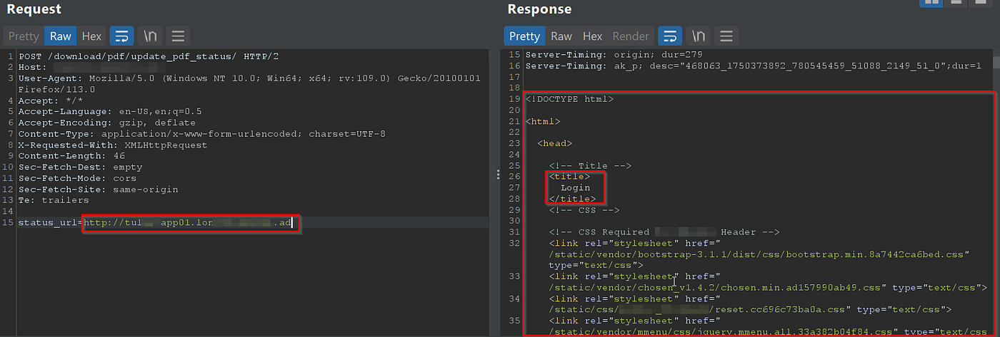

*Some monitoring service*

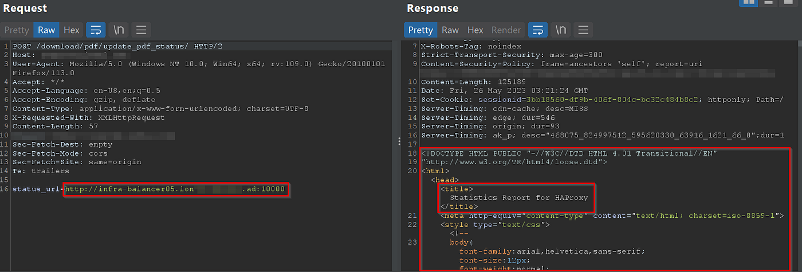

*Internal mapping manager*

*Some internal login page*

*HAProxy Stats*

>

And that's a wrap, I was able to access 1000+ web services that are running in the internal network of the company.

If you have any suspicious SSRF endpoint, Hit me up on Twitter/Instagram we can collab :)

## Get Basavaraj Banakar’s stories in your inbox

Join Medium for free to get updates from this writer.

Remember me for faster sign in

Twitter : [https://twitter.com/basu_banakar](https://twitter.com/basu_banakar)

Instagram: [https://instagram.com/basu_banakar](https://instagram.com/basu_banakar)

---
