# :globe_with_meridians: Exploiting OAuth authentication vulnerabilities Part III

---

# Exploiting OAuth authentication vulnerabilities Part III

## INTRODUCTION:


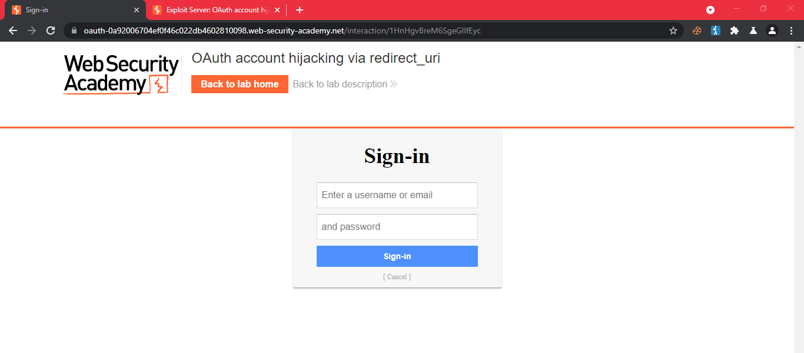
Hi my name is Hashar Mujahid. I’m a cybersecurity student and today I will show some techniques that can be used to exploit OAuth 2.0 and possibly allow an attacker to take over the victim’s account completely.


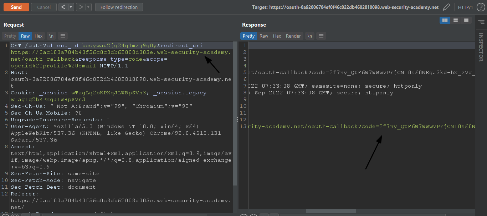
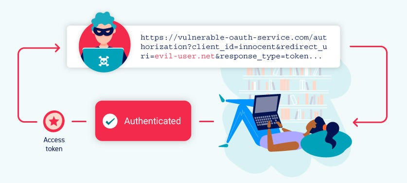


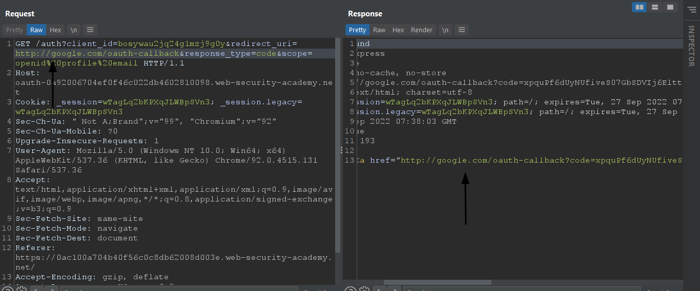


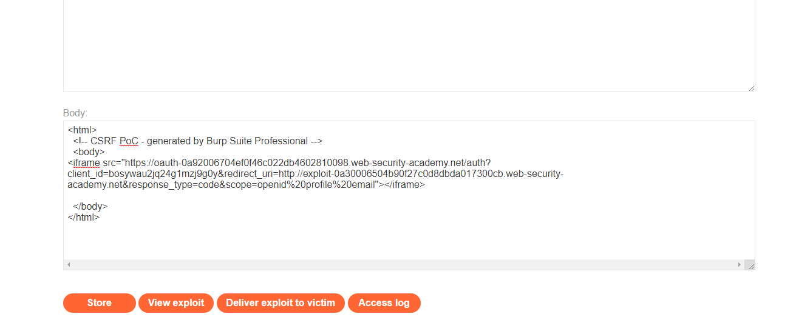

## Leaking authorization codes and access tokens:


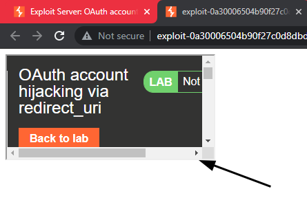
If OAuth 2.0 is not implemented appropriately, an attacker may be able to obtain the authorization tokens of other users, granting access to the personal information of the compromised users. The attacker can use this information to launch additional attacks against the person or the enterprise. The attacker may be able to log in as the victim user on any client application that has been registered with this OAuth service.


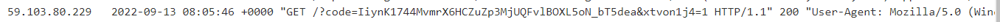
The major source of the auth token leak is an open redirect vulnerability. If the OAuth service provider fails to validate the redirect URI to which it wishes to deliver the token, an attacker may simply create a CSRF exploit and mislead the victim into initiating an OAuth Dance, leaking the token to his own server, and generating a legitimate session through the code.


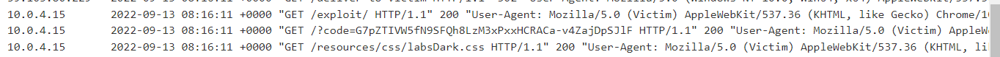
Let’s see an example of this attack.


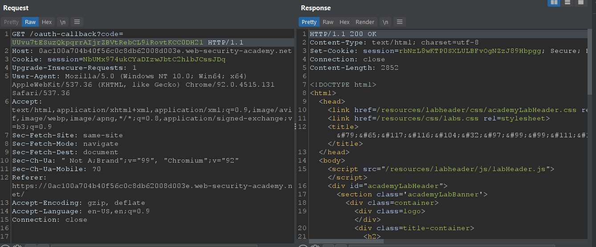
## Lab: OAuth account hijacking via redirect_uri


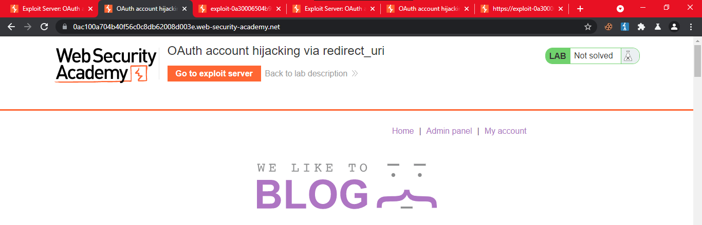
This [lab](https://portswigger.net/web-security/oauth/lab-oauth-account-hijacking-via-redirect-uri) uses an [OAuth](https://portswigger.net/web-security/oauth) service to allow users to log in with their social media accounts. A misconfiguration by the OAuth provider makes it possible for an attacker to steal authorization codes associated with other users’ accounts.


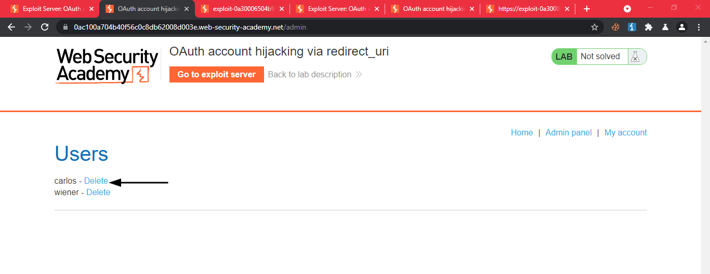
To solve the lab, steal an authorization code associated with the admin user, then use it to access their account and delete Carlos.


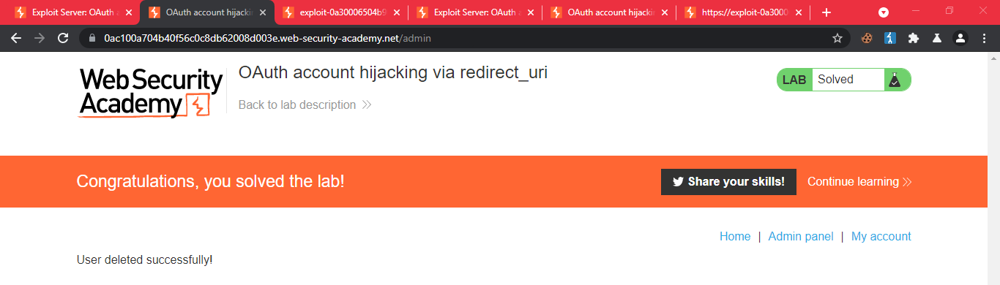
The admin user will open anything you send from the exploit server and they always have an active session with the OAuth service.

You can log in with your own social media account using the following credentials: `wiener:peter`.

Let's log in to the website.

After analyzing the HTTP requests made by the login process we can see that

```
GET auth/?client_id=bosywau2jq24g1mzj9g0y&redirect_uri=

---
