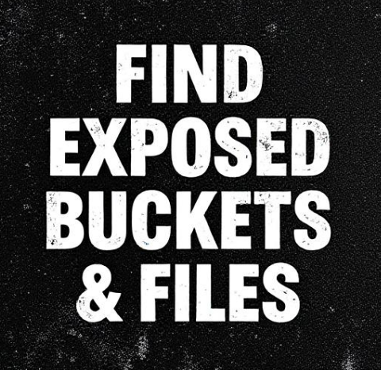
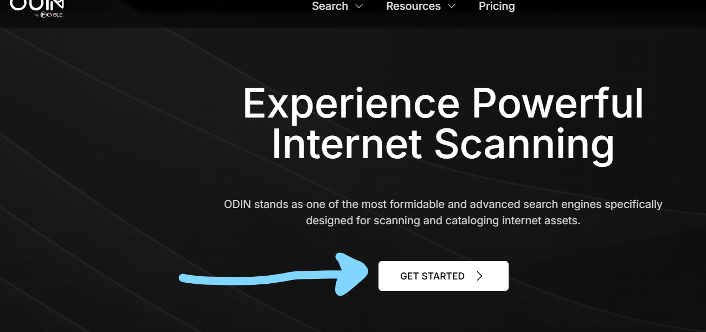
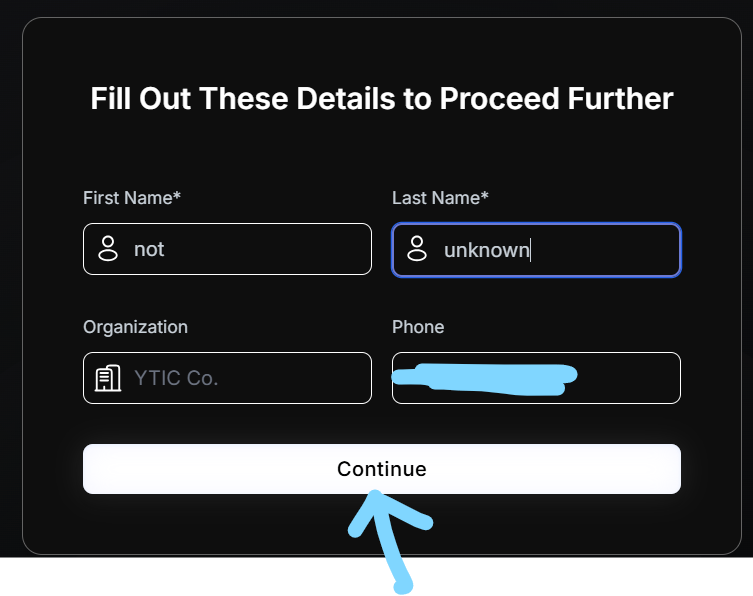

# :globe_with_meridians: Find Exposed Buckets and files, etc., with this resource.

---

# Find Exposed Buckets and files, etc., with this resource.

>

FREE LINK ACCESS

*Image by author*WELCOME.In this article, you will learn how to find exposed CVEs and exposed buckets/files, etc..So, let’s see.Click on the link below⬇️Click on GET STARTED.

*Screenshot taken by author from odin.io*Enter the required details to create an account, then click on sign up.

*Screenshot taken by author from odin.io*Enter your name and phone number, then click on Continue.

*Screenshot taken by author from odin.io*Open your email inbox and verify your email.

---
