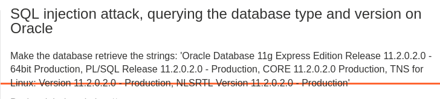
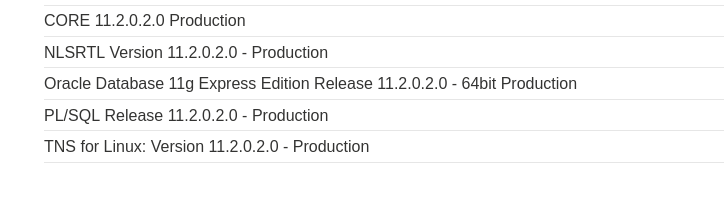
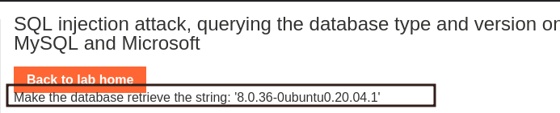
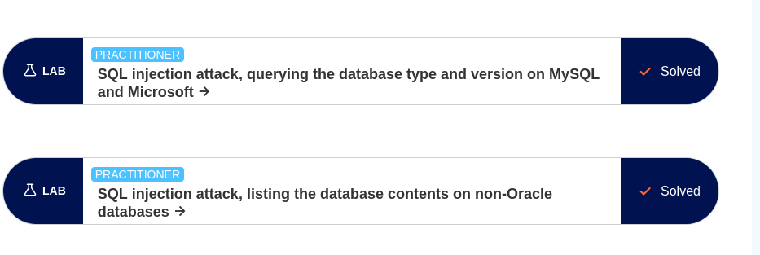
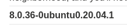

# :globe_with_meridians: Fingerprinting Databases: SQLi (Oracle, MySQL, MS)- Lab 1&2

---

# Fingerprinting Databases: SQLi (Oracle, MySQL, MS)- Lab 1&2

## In the Name of Allah, the Most Beneficent, the Most Merciful.
All the praises and thanks be to Allah, the Lord of the ‘Alamin (mankind, jinns and all that exists).


I will start with Lab 3 of [PortSwigger Academy](https://portswigger.net/web-security/all-labs#sql-injection). Please note that I don’t solve the labs at once; I keep trying and failing until I get it right. Sometimes I check the solution and then figure out a different way to solve it.

## Lab 1 : [SQL injection](https://portswigger.net/web-security/sql-injection) attack, querying the database type and version on Oracle

This lab contains a SQL injection vulnerability in the product category filter. You can use a UNION attack to retrieve the results from an injected query.




*Objective*Solution

I selected the Pets category and tested its vulnerability by adding a single quote after “Pets,” resulting in an internal server error. I tried several times to confirm the number of columns available in the table by:

NOTE: Continue making changes until you receive an error, which will indicate the number of columns just before the point where the internal server error occurs.

```
' ORDER BY 1--
```

In my case, we have 2 column and i also confirm the data type using :

```
' ORDER BY 'a','a'--
```

It’s time to extract our banner/version using any of these payloads :

```
' UNION SELECT NULL,BANNER FROM v$version--
' UNION SELECT BANNER,NULL FROM v$version--



```

## Lab2: [SQL injection](https://portswigger.net/web-security/sql-injection) attack, querying the database type and version on MySQL and Microsoft

This lab contains a SQL injection vulnerability in the product category filter. You can use a UNION attack to retrieve the results from an injected query.

## Get callgh0st’s stories in your inbox

Join Medium for free to get updates from this writer.

Remember me for faster sign in

To solve the lab, display the database version string.




*Objective*Solution

I selected the Pets category and decided to check the number of columns, but I encountered an internal server error. I was surprised when I tried changing the order number again, and was met with an internal server error.

I made a mistake HAHAHA, I was using ORBER instead of ORDER.

So using our payload, we found out that there are 2 columns.

```
ORDER BY 1-- -
```

I decided to use the oracle payload, but it wasn’t working after making some changes.

```
' UNION SELECT NULL,BANNER FROM @@version-- -
```

As we know, queries vary in different databases. This is what worked.







```
' UNION SELECT @@version,NULL-- -
```

I will be posting more labs as i solve them, by Allah’s Will.

Thank you for sticking around until the end.

>

For any suggestions or Correction, Kindly reach out to me:

Twitter — [callgh0st](https://twitter.com/callgh0st)

---
