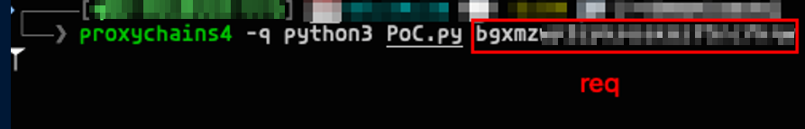
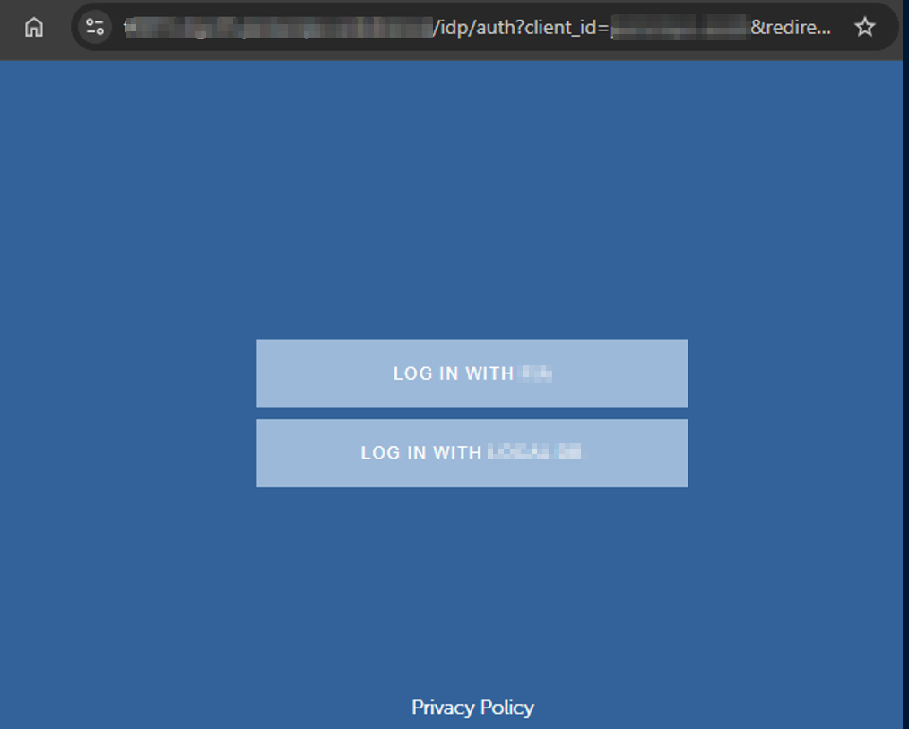
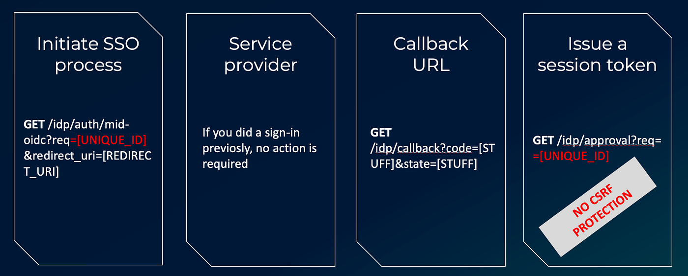
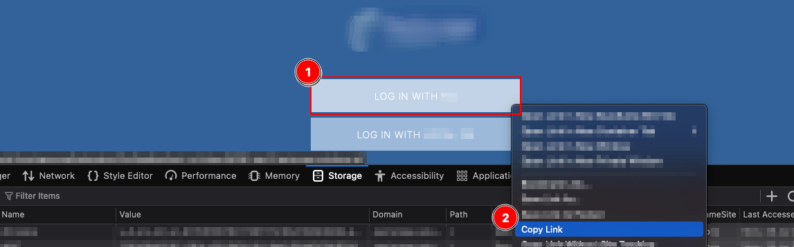
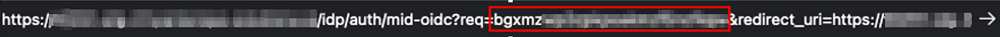
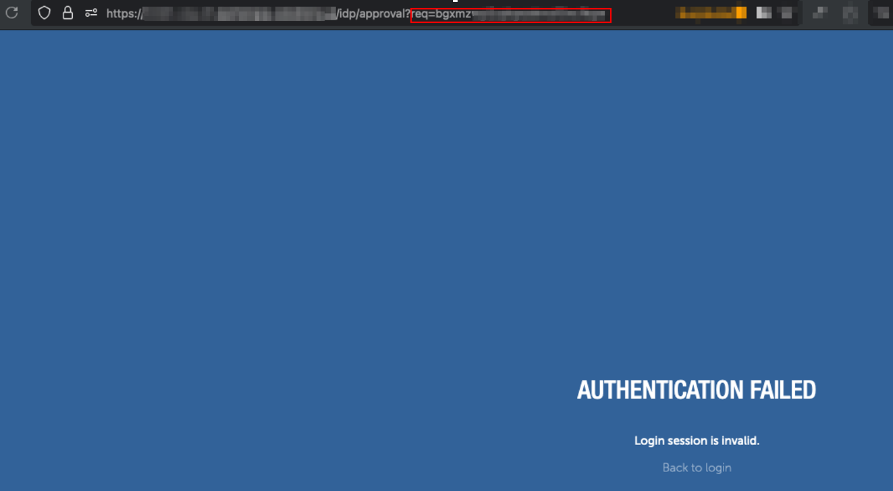
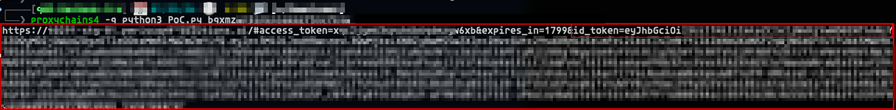

# :globe_with_meridians: Forced SSO Session Fixation

---

# Forced SSO Session Fixation

During a recent project, I encountered an interesting small issue that allowed for a one-click account takeover by fixating a session identifier and forcing a victim’s browser to initiate the first steps of a Single Sign-On (SSO) flow. This vulnerability was possible due to the absence of anti-CSRF token verification.

### The Login Page

The login page exhibited the “Log in with SSO” feature:

### Investigating the SSO Flow

Upon investigating the SSO flow, I discovered the following sequence of steps:

- Initiation of SSO process by clicking the button:GET request to /idp/auth/mid-oidc?req=[UNIQUE_ID]&redirect_uri=[REDIRECT_URI]

- SSO Service Provider process
Multiple requests made on the service provider domain, akin to signing in with Google where requests are sent to google.com. If the user was previously signed in, actions are performed automatically.

- Hitting callback URL
After authorization on the Service Provider side, a request to a callback URL is made:
GET /idp/callback?code=[STUFF]&state=[STUFF].
However, this is not a last step, that returns the session token, one more additonal step was required.

- Issue a session token
Request to get the session token.
GET /idp/approval?req=[UNIQUE_ID]
The UNIQUE_ID value is the same as was on the first step. This means, that if you know this value, you could hit this method and get a session. As no anti-csrf protection was present, so it was possible to perform a session fixation.

### Exploitation Scenario

An “Attacker” opens the environment URL on their machine and extracts the “Log in with SSO” button link:

From the copied link, the attacker extracts the “req” parameter and starts the self-written exploit:

The attacker then sends the link containing the “req” parameter to the “Victim”.

## Get Serj Novoselov’s stories in your inbox

Join Medium for free to get updates from this writer.

Remember me for faster sign in

Upon opening the link in the browser, the “Victim” encounters an error message:

### How does the exploit work?

The malicious script executed by the attacker utilizes 10 threads to make multiple requests to the /idp/approval?req={req}.

Initially, the server responses to these requests are 500 errors. However, when the victim initiates the SSO flow, but before handling the request to the “approval” URL, all subsequent requests to the mentioned endpoint return a valid link with a session token.

As a result of the exploit, the “Attacker” obtains the session URL and can complete the login flow, effectively logging in as the “Victim”:

By directly visiting the returned URL, the attacker finishes the login flow and logs in as “Victim”.

### Remediation

The issue remediation can be done by:

- Implementing Anti-CSRF Protection.

- Validating Session Identifier at each step of the SSO process to prevent fixation.

- Applying rate limiting on the /idp/approval endpoint to prevent rapid and unauthorized requests for session tokens.

---
