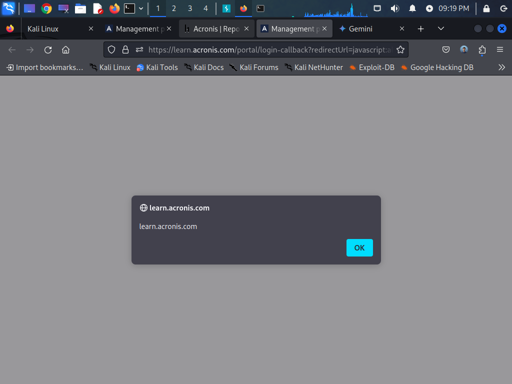
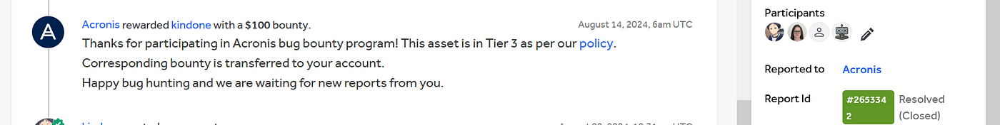

# :globe_with_meridians: From Brute-Force to Bounty: My $200 and Double XSS Win on Acronis

---

# From Brute-Force to Bounty: My $200 and Double XSS Win on Acronis

In the world of cybersecurity, bug bounty programs stand as a crucial bridge between organizations and security researchers. These programs incentivize ethical hackers to identify and report vulnerabilities, ultimately making the digital world safer. I’m excited to share my recent experience participating in the HackerOne bug bounty program and uncovering not one, but two Cross-Site Scripting (XSS) vulnerabilities on Acronis platforms.

>

Report 1: XSS in Acronis Login Callback URL

My first discovery centered around the login callback URL for Acronis, specifically `https://learn.acronis.com/portal/`. During the login process, the `redirectUrl` parameter, designed to redirect users back to their intended destination, was not properly secured. This oversight paved the way for a classic XSS attack.

Simply crafting a malicious URL and enticing a user to click it was enough to trigger the vulnerability. For example, a URL like this could be used:

`https://learn.acronis.com/portal/?redirectUrl=javascript:alert(document.domain)`

Here is my original disclosure report URL if you want it: [https://hackerone.com/reports/2611305](https://hackerone.com/reports/2611305)

## Get KindOne’s stories in your inbox

Join Medium for free to get updates from this writer.

Remember me for faster sign in

*For This I was rewarded $100 for this: My Acronis*

>

Report 2: Double Parameter Trouble!

During further testing on the Acronis learn platform, I decided to brute-force variations of the `redirectUrl` parameter. This led to the discovery of a second, similar parameter: `redirect_url`. Unfortunately, this parameter was also vulnerable to the same XSS flaw.

Vulnerability: XSS (on both `redirect_url` and `redirect_url`)

Here is my original disclosure report URL if you want it:[https://hackerone.com/reports/2653342](https://hackerone.com/reports/2653342)

### Conclusion

>

These *three* XSS findings emphasize secure coding, especially with user inputs and redirects. The discovery of the `redirect_Url` parameter through brute-forcing shows how important it is to go beyond basic testing and explore parameter variations. Acronis' quick response demonstrates their security commitment. Bug bounty programs are vital for collaborative security improvement and uncovering these kinds of nuanced vulnerabilities.

Stay tuned for more cybersecurity insights!

---
