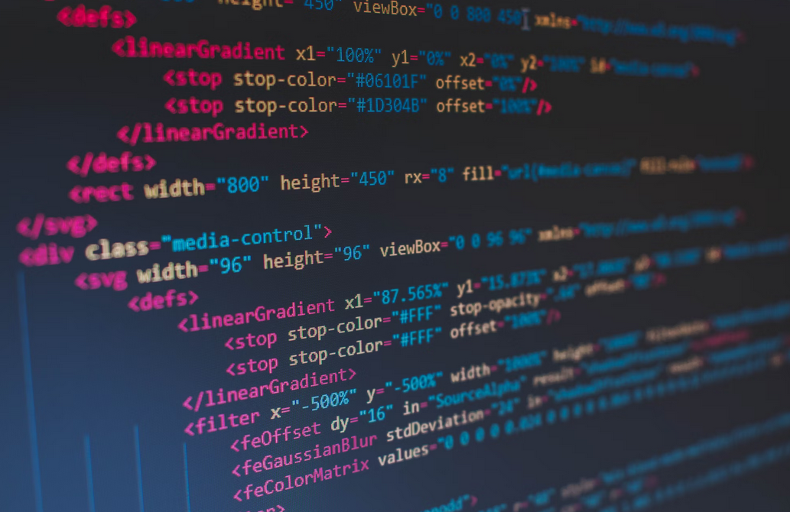
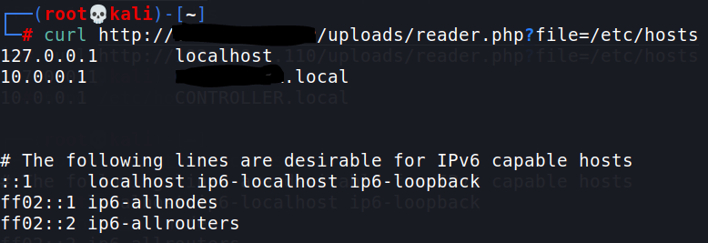
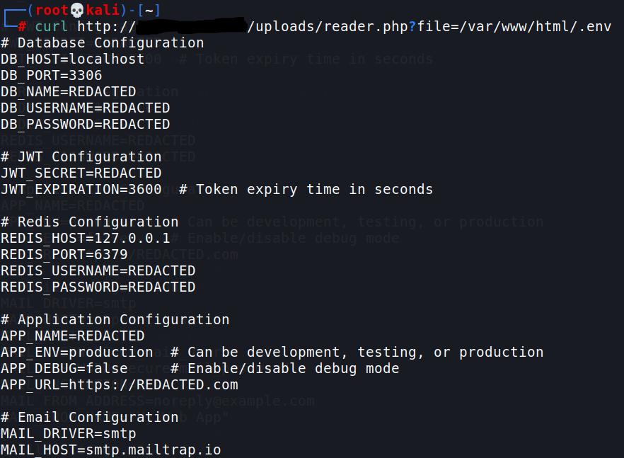

# :globe_with_meridians: From File Upload To LFI: A Journey To Exploitation

---

### Using The JWT Secret

With the *JWT_SECRET *in hand, I could craft valid JWTs for the application. JWTs are commonly used for authentication and authorization, and possessing the secret key allows an attacker to create tokens that the server will trust.



To identify how the application used JWTs, I logged in as a regular user and intercepted the authentication token issued by the server. Decoding the JWT revealed its payload, which included a *role* field:

```
{
"uid": 123456,
"role": "client"
}
```

Using the *JWT_SECRET *from the `*.env*` file, I created a new token with the *role* field modified to *admin*. Tools like [jwt.io](https://jwt.io/) or scripting libraries in Python or Java make this process straightforward.

After generating the forged token, I replaced the original JWT in my browser’s cookies with the new one. Refreshing the page granted me administrative access to the application!!!



As an admin, I now had access to the application’s management interface, including a feature for executing database queries. Using this feature, I dumped the entire database, which included user credentials, personal information, and other sensitive data.

The ability to execute arbitrary database queries opened up further exploitation opportunities, such as manipulating application data or exfiltrating more sensitive information.

### Summary

In many cases, it’s ironically that instead of trying to attack the places that did not get extra layer of security, sometimes challenging the security mechanism of a specific functionality can be beneficial. I had another similar case when I challenged SSRF mitidation of Directus and evenually bypassed the app’s security check and got a CVE for that (CVE-2024–46990).



This exploit chain — from file upload to LFI, and finally to full administrative access — demonstrates how small oversights can lead to severe security breaches. By understanding these vulnerabilities and adopting proactive security measures, developers and organizations can protect their systems from similar attacks.

Hope you enjoyed the article :)

Keep on hacking!

---
