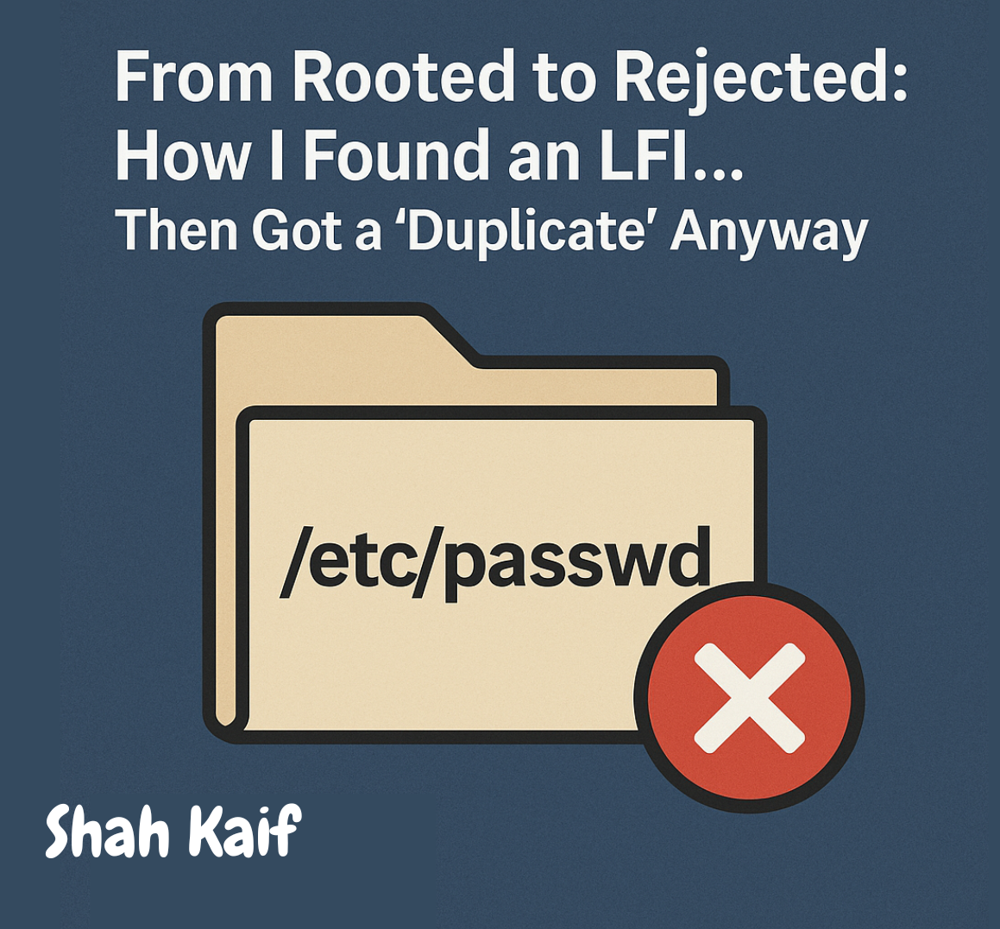
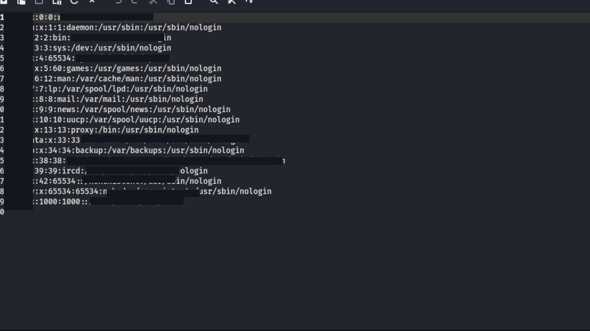
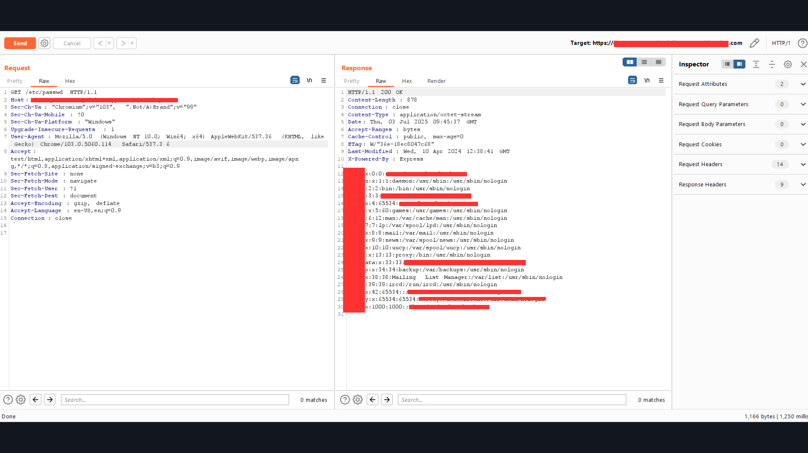
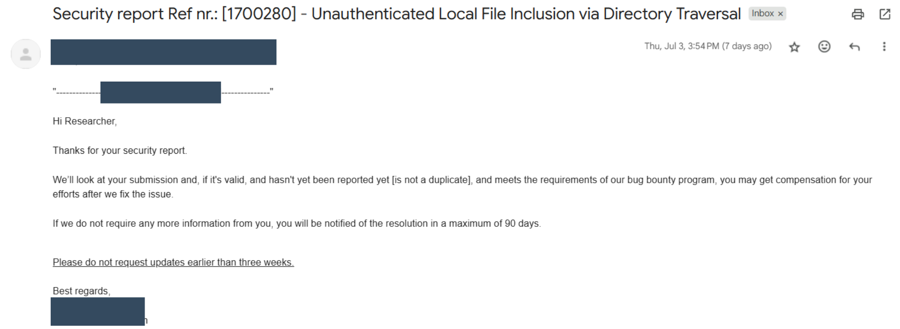

# :globe_with_meridians: From Rooted To Rejected How I Found An Lfi Then Got A Duplicate Anyway C353E8088

---

## Overview

In this post, I’ll walk you through how I discovered a Local File Inclusion (LFI) vulnerability on a real-world target, accessed sensitive files like `/etc/passwd`, reported it responsibly, and even saw it patched within an hour…
Only to be told two days later that it was a duplicate.

Welcome to bug bounty — where you can be right, make impact, and still walk away with zero payout. Here’s how it went down.

---
