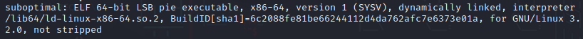
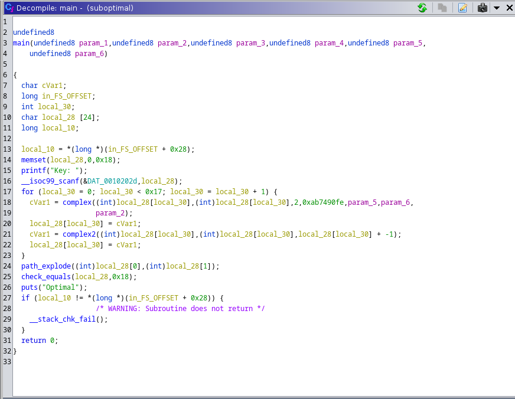
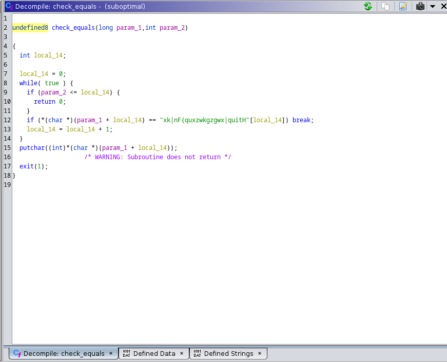
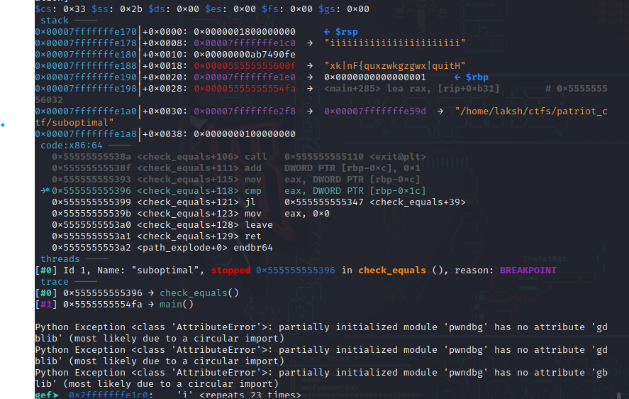
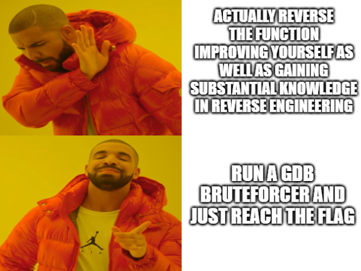
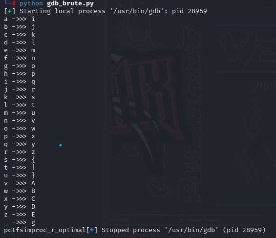

# :globe_with_meridians: Gdb Bruteforcer Cdc4B9F5B277

---

>

Here will showcase the power of a GDB Bruteforcer on a CTF(Capture the flag)


## Challenge description:

I feel like my keygen might not be optimal. can you test it?

### Challenge repo:

## Writeup:

On every binary performing the basic file checks is a good practice, while as it might not prove of great value it is a good practice to follow

### basic file checks:




Now, lets break down what it says:

- “not stripped” — This is always good news as what this means is the binary when it is decompiled now will contain all the symbols variable names, Function names will remain the same and would make stuff essentially easy for us.

- “ELF 64-bit LSB pie Executable” — ELF stands for “Executable and Linkable Format.” It is a common file format for executables, object code, shared libraries, and even core dumps on Unix-like operating systems . 64-bit is self-explanatory really as the binary is said to be 64-bit. PIE- stands for “Position independent executable” where A PIE executable is one where the code can be loaded and executed at any/different memory address without causing problems.

As this is a reversing challenge these basic file checks provide us with the necessary insight *TO GO CRACKING INTO IT!*

## Decompilation:

>

We will use GHIDRA for the decompilation the link is attached in the reference at the end of the page.

Compiling the given elf file in ghidra show us the following result




Well, reading through the decompilation gives us a basic idea of what the function is doing.

- Takes in an input “key”

- Puts that into a series of “complex” mangling

- Checks the output from that function

- Prints suboptimal if not right optimal if it is correct

Lets see, what the check_equals function is:




*Need to get the string “xk|nF{quxzwkgzgwx|quitH”*

As you can see from above the program checks if suboptimal or optimal and the character length is defined to be 23 if not 23 it returns

## Get Lakshmesh Kumar’s stories in your inbox

Join Medium for free to get updates from this writer.

Remember me for faster sign in

After we have that lets do something called *Dynamic analysis *with GDB

## Analysing with GDB:

Run the binary with a breakpoint on the address offset +0x396

but as the binary is run it has it’s base address to it which makes the actual address to put the breakpoint on to be 0x555555555396

You can add breakpoint in gdb with the command b* 0x555555555396. After setting the breakpoint You can see the following




*GDB has being breaked at the strncmp check to see what values are being evaluated here the binary is run and given the string ‘a’*25 times to see what it happens after the mangulation*

As you can see the a has turned into an i similarly try setting a breakpoint a running it with a 23 b’s you would get a ‘j’

Plan of attack:

- Reverse the complex function to check the transformation of each and every character to arrive at the string ‘xkInF{quxzwkgzgwx|quitH’

- Create a bruteforcer in gdb to set a breakpoint and print the character after mangulation




So, obviously the option 2.

Here is the gdb script to bruteforce.

```
from pwn import *
import string
import time
liss=list(string.ascii_lowercase+"_")
dict1={}
dictt={}
encrypted_string="xk|nF{quxzwkgzgwx|quitH"
p=process('gdb')
sl = lambda a : p.sendline(a)
ru= lambda a : p.recvuntil(a)
sl(b"file suboptimal")
sl(b"b *0x0000555555555396")
for i in liss:
sl(b"r")
sl(f"{i*25}".encode())
time.sleep(2)
sl(b"x/s $rdi")
data=ru(b"<repeats 23 times>").decode()[-21:-20]
print(f"{i} ->>> {data}")
dictt={f"{i}":f"{data}"}
dict1.update(dictt)
for s in encrypted_string:
for j,i in dict1.items():
if s==i:
print(j,end="")
```

Code Explanation:

- First and foremost import all the required modules such as pwn, time and string will explain their uses later

- Create a list of all lowercase letters to send the gdb debugger as welll as the ‘_’ letter as we know the flag must contain some underscores as it usually does if it doesn’t won’t return us with anything useful but is better to be safe than sorry :)

- Create a process with gdb to interact with gdb through python

- sl = lambda a : p.sendline(a) { this just helps us use the command sl() instead of the long p.sendline() and the syntax is <name=lamda (parameters) : what you want it to do in our case it is p.sendline(data)

5. load the file that we want to be run with gdb here with the file command ‘suboptimal’

6. As i said earlier we need to set a breakpoint to see what had occured before and after the mangulation.

we are now going to do the following for all the alphabetical characters

- run the binary with r

- send a character*23

- print the result after mangulation which can be done using x/s $rdi { /s specifies to display as string and the $rdi says to print from that register

- next you willl need to map the gotten output in a dictionary so as we traverse the encrypted string we can get the flag as a dictionary has key value pairs such as {p:x} and you can see the first character is x in the encrypted string so if we do this for every character in the encrypted string should print out the flag

Running the code gives us the following output




Voila, We now have the flag:

>

pctf{simproc_r_optimal}

References:

---
