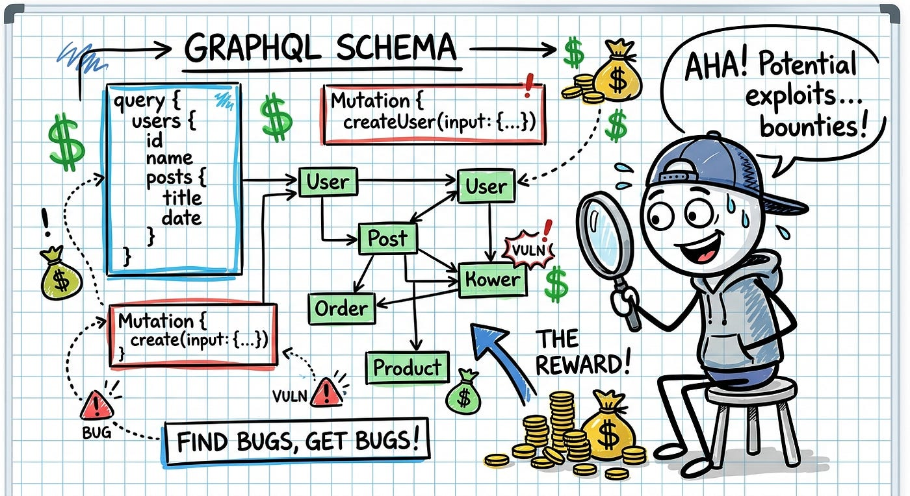

# :globe_with_meridians: 🐛💰🔓🎯 GraphQL Security: How I Found and Exploited Critical IDOR and Authorization Bypass in a Modern API

---

# 🐛💰🔓🎯 GraphQL Security: How I Found and Exploited Critical IDOR and Authorization Bypass in a Modern API

How I earned $12,500 finding GraphQL introspection and batch query vulnerabilities in a fintech startup’s API infrastructure

>

TL;DR: During a bug bounty engagement on a fintech target, I discovered that GraphQL introspection was publicly enabled, allowing full schema enumeration. By exploiting batch query processing and an Insecure Direct Object Reference (IDOR) vulnerability, I was able to access and modify other users’ financial transactions. The vulnerability earned a CVSS 9.1 score and a $12,500 payout.

## 🎯 Target & Scope — Finding My Prey

Let me set the stage for you. It was a typical Tuesday night, coffee brewing, and I was scrolling through HackerOne looking for my next target. That’s when I saw a private program — let’s call them “FinanceFlow” (fictional name) — a growing fintech startup handling payment processing for small businesses.

The program had a solid scope: web application, mobile API, and importantly — a GraphQL API endpoint listed explicitly. Most hunters overlook GraphQL, which is exactly why I got excited. Uncharted territory means less competition and higher chances of finding something juicy.

---
