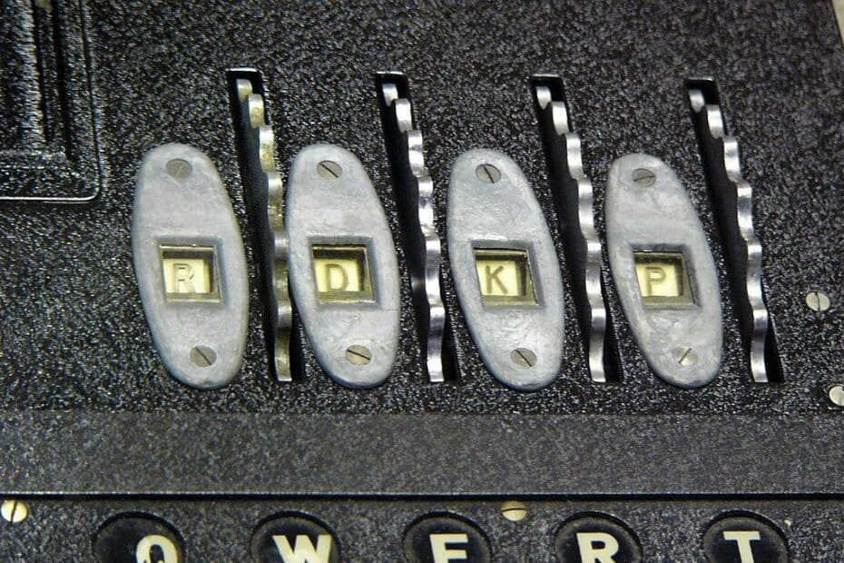

# :globe_with_meridians: How to Brute Force DVWA login with Python - StackZero

---

# How to Brute Force DVWA login with Python — StackZero

>

This article was originally published at [https://www.stackzero.net/brute-force-dvwa-python/](https://www.stackzero.net/brute-force-dvwa-python/)

Hey hackers! In this article, I want to show you one of the most known attacks in the cybersecurity field. And as we usually do, we are going to do it in practice.
The goal of this tutorial will be to implement a simple python script which performs a brute-force attack on [DVWA](https://github.com/digininja/DVWA)!

This time is not a real vulnerability like:

But before getting our hands dirty I think that we need a brief explanation of the attack.

## What is a Brute-Force Attack?

A quite explanatory definition could be:

*A brute force attack is a type of cyber attack where a hacker uses an automated tool to guess the password of a user or system. *
Hackers usually perform this attack when they do not have any prior knowledge of the password or the system and are trying to gain access to a system or account.

A brute force attack can be a very time-consuming and tedious process, especially if the password is long, complex and generally easy to spot, so it represents the last…

---
