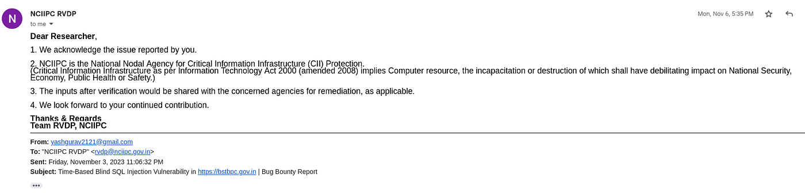

# :globe_with_meridians: Hacking Indian Government, Finding XSS & SQL Injection

---

# Hacking Indian Government, Finding XSS & SQL Injection

it’s Yash Gurav from Pune, India! I’m a B.Com student with a 2-year passion for cybersecurity and bug bounties. While I jumped into bug bounties early, I confess I underestimated the power of Google dorking. But let me tell you, once I harnessed its potential, the game changed!

i am able to find xss & sqli using following google dork in indian government website

```
site:*.*.gov.in inurl:?id
```

>

we can also use ext:php or aspx & keep in mind change the id to most common parameters that are vulnereble to xss

This experience opened my eyes to the immense power of Google dorking. It’s not just about finding vulnerabilities, it’s about being resourceful, creative, and using the tools at your disposal to make a real impact.


Bug Bounty Tip for Everyone : always check all possibilities

## Get ʏᴀꜱʜʜ’s stories in your inbox

Join Medium for free to get updates from this writer.

Remember me for faster sign in

i also found sqli in same parameter After reporting both issues They send me this mail




>

You can use all the google dorking queries listed below Enjoy :D

```
1 /2wayvideochat/index.php?r=
2 /elms/subscribe.php?course_id= /elms/subscribe.php?course_id=
3 /gen_confirm.php?errmsg= /gen_confirm.php?errmsg=
4 /hexjector.php?site= /hexjector.php?site=
5 /index.php?option=com_easygb&Itemid=
6 /index.php?view=help&amp;faq=1&amp;ref=
7 /index.php?view=help&faq=1&ref=
8 /info.asp?page=fullstory&amp;key=1&amp;news_type=news&amp;onvan=
9 /info.asp?page=fullstory&key=1&news_type=news&onvan=
10 /main.php?sid= /main.php?sid=
11 /news.php?id= /news.php?id=
12 /notice.php?msg= /notice.php?msg=
13 /preaspjobboard//Employee/emp_login.asp?msg1=
14 /Property-Cpanel.html?pid= /Property-Cpanel.html?pid=
15 /schoolmv2/html/studentmain.php?session=
16 /search.php?search_keywords= /search.php?search_keywords=
17 /ser/parohija.php?id= /ser/parohija.php?id=
18 /showproperty.php?id= /showproperty.php?id=
19 /site_search.php?sfunction= /site_search.php?sfunction=
20 /strane/pas.php?id= /strane/pas.php?id=
21 /vehicle/buy_do_search/?order_direction=
22 /view.php?PID= /view.php?PID=
23 /winners.php?year=2008&amp;type= /winners.php?year=2008&amp;type=
24 /winners.php?year=2008&type= /winners.php?year=2008&type=
25 index.php?option=com_reservations&amp;task=askope&amp;nidser=2&amp;namser= “com_reservations”
26 index.php?option=com_reservations&task=askope&nidser=2&namser= “com_reservations”
27 intext:”Website by Mile High Creative”
28 inurl:”.php?author=”
29 inurl:”.php?cat=”
30 inurl:”.php?cmd=”
31 inurl:”.php?feedback=”
32 inurl:”.php?file=”
33 inurl:”.php?from=”
34 inurl:”.php?keyword=”
35 inurl:”.php?mail=”
36 inurl:”.php?max=”
37 inurl:”.php?pass=”
38 inurl:”.php?pass=”
39 inurl:”.php?q=”
40 inurl:”.php?query=”
41 inurl:”.php?search=”
42 inurl:”.php?searchstring=”
43 inurl:”.php?searchst­ring=”
44 inurl:”.php?tag=”
45 inurl:”.php?txt=”
46 inurl:”.php?vote=”
47 inurl:”.php?years=”
48 inurl:”.php?z=”
49 inurl:”contentPage.php?id=”
50 inurl:”displayResource.php?id=”
51 inurl:.com/search.asp
52 inurl:/poll/default.asp?catid=
53 inurl:/products/classified/headersearch.php?sid=
54 inurl:/products/orkutclone/scrapbook.php?id=
55 inurl:/search_results.php?search=
56 inurl:/­search_results.php?se­arch=
57 inurl:/search_results.php?search=Search&amp;k=
58 inurl:/search_results.php?search=Search&k=
59 inurl:”contentPage.php?id=”
60 inurl:”displayResource.php?id=”
61 inurl:com_feedpostold/feedpost.php?url=
62 inurl:headersearch.php?sid=
63 inurl:scrapbook.php?id=
64 inurl:search.php?q=
65 pages/match_report.php?mid= pages/match_report.php?mid=
```

---
