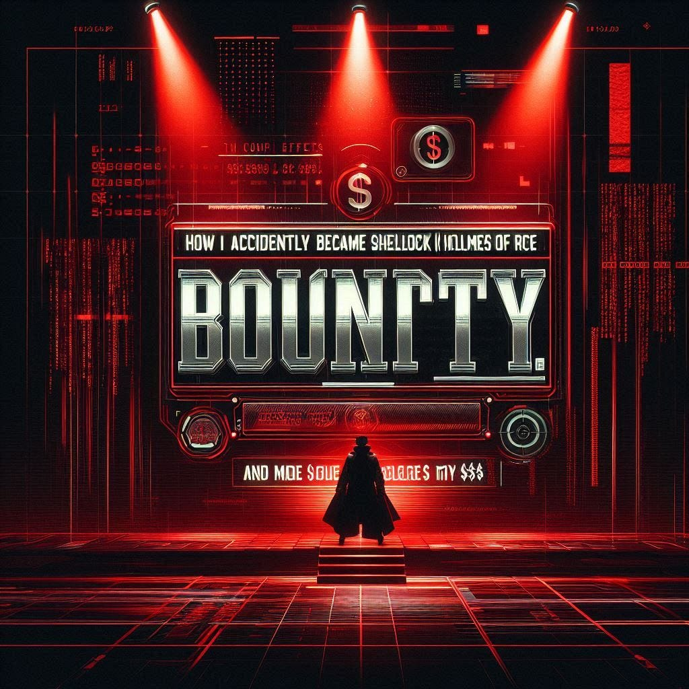

# :globe_with_meridians: How I Accidentally Became the Sherlock Holmes of RCE! and made $$$

---

# How I Accidentally Became the Sherlock Holmes of RCE! and made $$$

Free Link🎈

Hi there!🙌

*Created by Copilot*

Some people wake up and choose coffee, others choose chaos. I apparently chose both. One fine morning, instead of scrolling endlessly through memes, I decided to play detective on the internet. And guess what? I stumbled upon something juicier than my favorite street-side samosa — a Remote Code Execution (RCE) vulnerability!

Let me spill the beans on how that went down.

## A Not-So-Boring Day Turned Epic

It was one of those days when even my phone notifications were silent. With no drama left in my life, I thought, why not create some myself? Bug bounty time! 🛡️

Scrolling through programs, I decided to test a well-known enterprise app. The world loves a good challenge, and I love poking into servers that occasionally fight back. After some recon (because real hackers always do recon, duh), I started finding juicy endpoints.

## Tools of the Trade

Here’s my simple game plan:

- Subfinder and Amass for subdomain enumeration

- Nuclei for vulnerability detection

- Burp Suite to sniff out the sweet stuff

---
