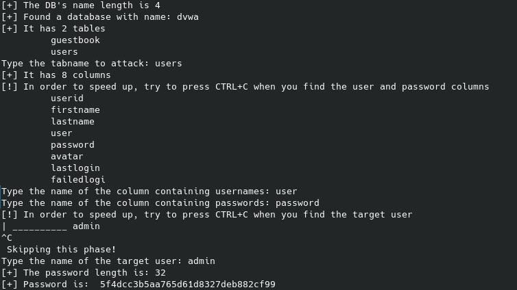

# :globe_with_meridians: Burp Suite? No Thanks! Blind SQLi in DVWA With Python (Part 1)— StackZero

---

# Burp Suite? No Thanks! Blind SQLi in DVWA With Python (Part 1)— StackZero

>

This article was originally published at [https://www.stackzero.net/blind-sql-injection-dvwa-low-security-with-python/](https://www.stackzero.net/blind-sql-injection-dvwa-low-security-with-python/)

Hi hackers! Here is another article that will show how to exploit a known vulnerability in practice.
In particular, this time we will exploit the blind SQL injection section of [DVWA](https://github.com/digininja/DVWA) by using Python.

I want to show you an all-in-one script that once running will get all information you need to get the admin password in an environment where you cannot see query results.

This is how will be the final result:

There are a lot of ways to solve the challenge, but I have chosen to use a custom script for these main reasons:

- We have to perform numerous calls and the [Burp Suite Community](https://portswigger.net/burp) edition has a limit on the number of threads for the intruder

- I don’t want to depend on an external tool

- The best way to understand something is to make it by yourself

I’m fully aware that a professional tool would be better for a Penetration Tester, anyway this…

---
