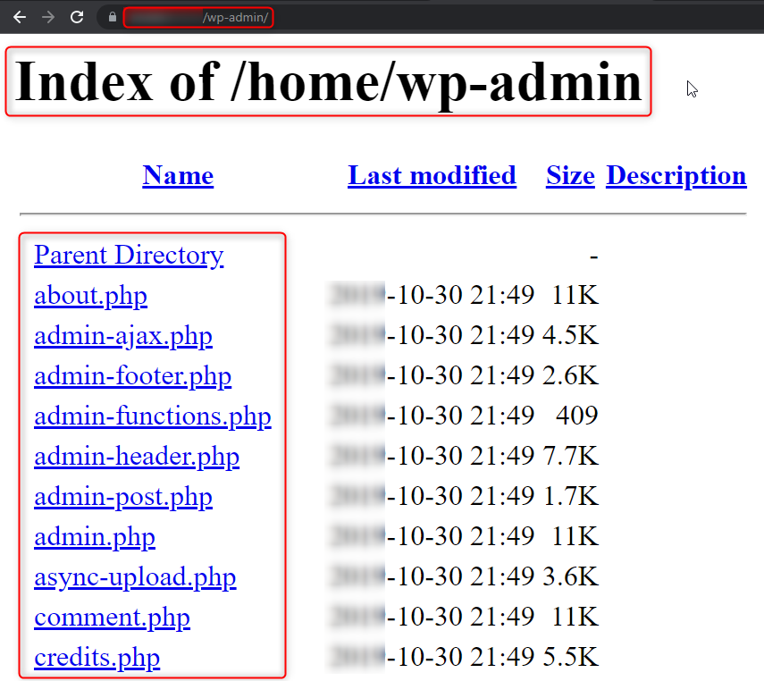
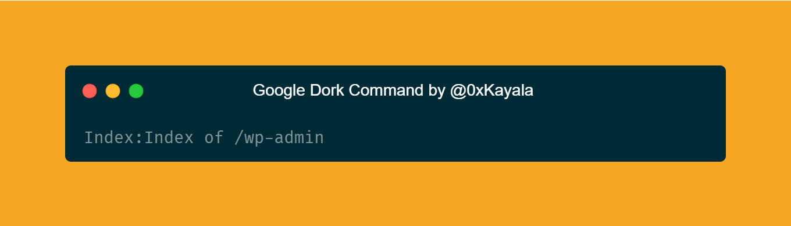
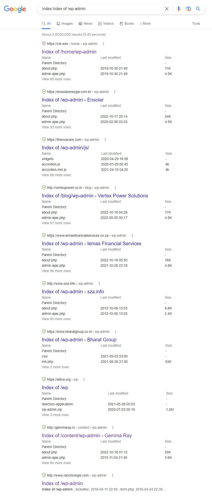
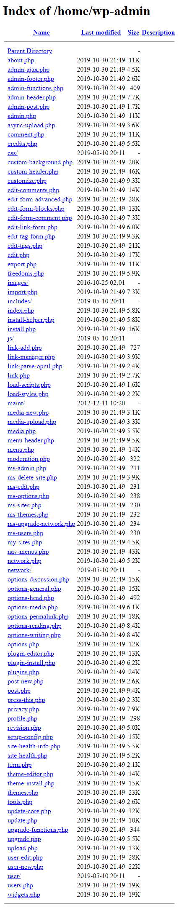
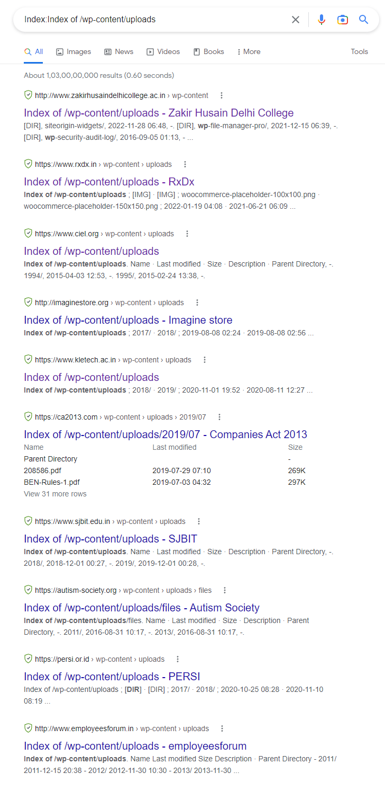
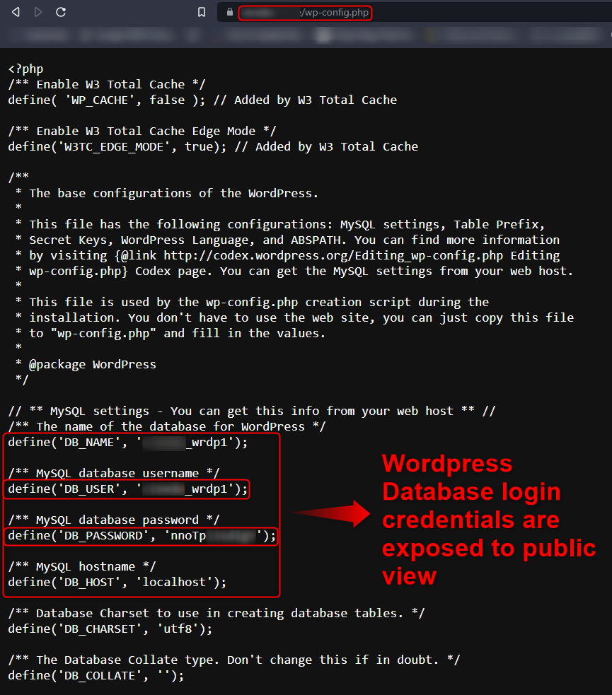
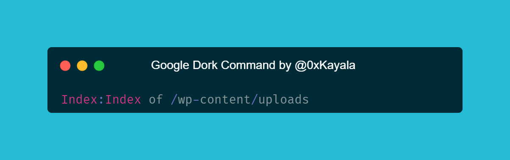
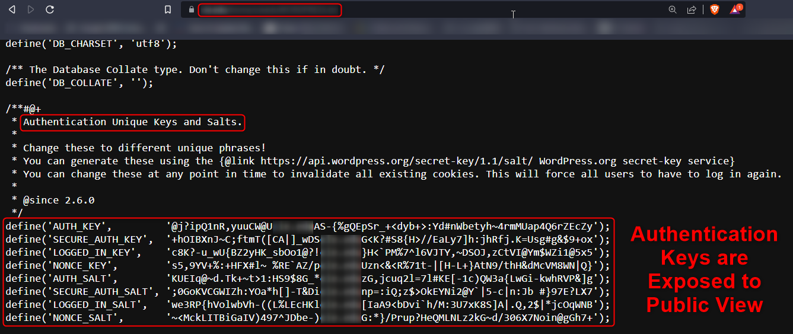

# :globe_with_meridians: How I found 40+ Directory Listing Vulnerabilities of Source Code Disclosure via Exposed WordPress Folders using Google Dorks

---

# How I found 40+ Directory Listing Vulnerabilities of Source Code Disclosure via Exposed WordPress Folders using Google Dorks

I have found more than 40+ Directory Listing Vulnerabilities which contain Source Code Disclosure via the Exposed WordPress Folders (/wp-admin & Others) just by using Google Dorks as shown below 👇

*[Image Source](https://carbon.now.sh/m0OHFchltLrqBhhvOpsG)*

>

*Google Dorks:*

Index:Index of /wp-admin

*Dork Result*

*Source: Google DorkSource: Google Dork*

*[Image Source](https://carbon.now.sh/jvvtmnjmjjagvYThU5Qi)*

>

*Google Dorks:*

Index:Index of /wp-content/uploads

*Source: Google Dork*

Some websites confidential info like database usernames/passwords and other configuration data are exposed directly to public view. For example, we can find database credentials in the “wp-config.php” folder of a website as shown below

*Authentication Keys and Salt*Precautions and Recommendations:

## Get Satya Prakash’s stories in your inbox

Join Medium for free to get updates from this writer.

Remember me for faster sign in

1. The application should have proper permissions on sensitive directories and content.

2. To fix this vulnerability, either remove the “/wp-content/uploads/” or any other folder which contains confidential info from your web server or ensure that you deny public access to the “/wp-content/uploads/” folders on your server

3. Please follow the below reference articles to understand the issue in detail and fix it.

References:

- [https://secure.wphackedhelp.com/blog/wp-content-uploads/](https://secure.wphackedhelp.com/blog/wp-content-uploads/)

- [https://www.acunetix.com/blog/articles/directory-listing-information-disclosure/](https://www.acunetix.com/blog/articles/directory-listing-information-disclosure/)

Thank you guys for Reading this Post — Happy Hunting 🐞

If you like this post, don’t forget to give me a clap 👏

Resources: Google

Support me: If you like to support me, buy me a cup of [Coffee](https://www.buymeacoffee.com/satyakayala)☕

Follow me: | [LinkedIn](https://www.linkedin.com/in/0xkayala/) | [Twitter](https://twitter.com/0xKayala)

---
