# :globe_with_meridians: How I found DOM-Based XSS on Microsoft MSRC and How They Fixed it

---

# How I found DOM-Based XSS on Microsoft MSRC and How they fixed it

Microsoft MSRC ฺBlog site: Dom-based XSS Vulnerability

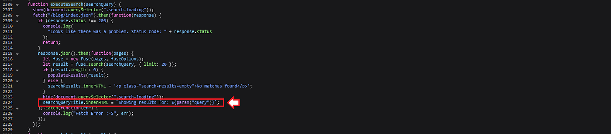
## Table of Contents

## Introduction

In this blog post, I am excited to share my experience of discovering a DOM-Based XSS vulnerability on the Microsoft Security Response Center (MSRC) website, and how the Microsoft Security Team quickly and efficiently resolved the issue by fixing the vulnerability.

## Background of DOM-Based XSS

DOM-based XSS vulnerabilities usually arise when JavaScript takes data from an attacker-controllable source, such as the URL, and passes it to a sink that supports dynamic code execution, such as `eval()` or `innerHTML` (in this case). This enables attackers to execute malicious JavaScript, which typically allows them to hijack other users' accounts.

For more information, please refer to:

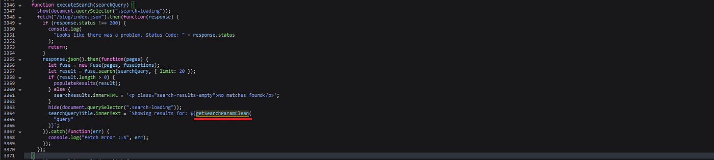
## Finding and Analyzing the Vulnerable Code

On February 12th, 2023, I read on the MSRC blog that they had released a new MSRC Blog Site, which started on February 9th, 2023.

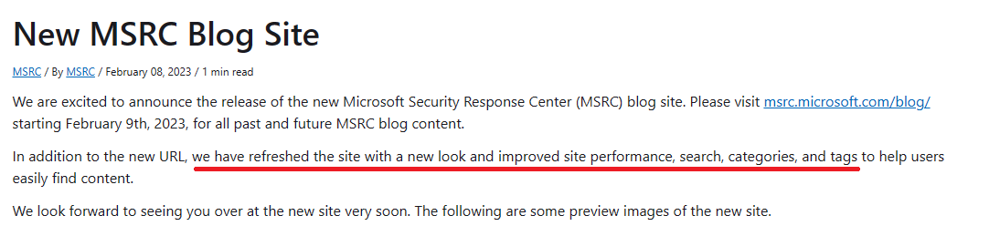

*[New MSRC Blog Site | MSRC Blog | Microsoft Security Response Center](https://msrc.microsoft.com/blog/2023/02/new-msrc-blog-site/)*

The aforementioned blog post announced that the MSRC Blog Site had been refreshed with a new look and improved site performance, search functionality, categories, and tags. That indicates new development functions have been added to the site.

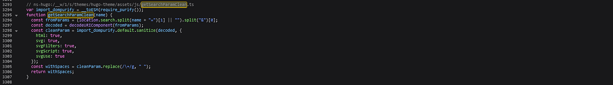
Here is a step-by-step guide that outlines how I found and analyzed the vulnerable code and determined the root cause of the issue.

## Get Supakiad S. (m3ez)’s stories in your inbox

Join Medium for free to get updates from this writer.

Remember me for faster sign in

I started by using the search function and looking at the website’s HTML source code. I discovered that the `search.js` file was being loaded and the search query was being added to the URL as a `query` parameter.

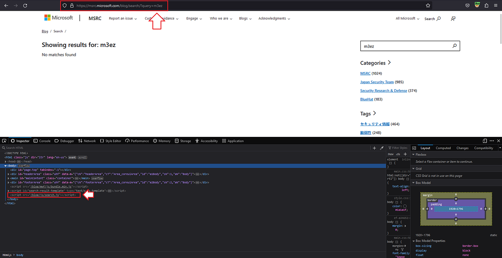

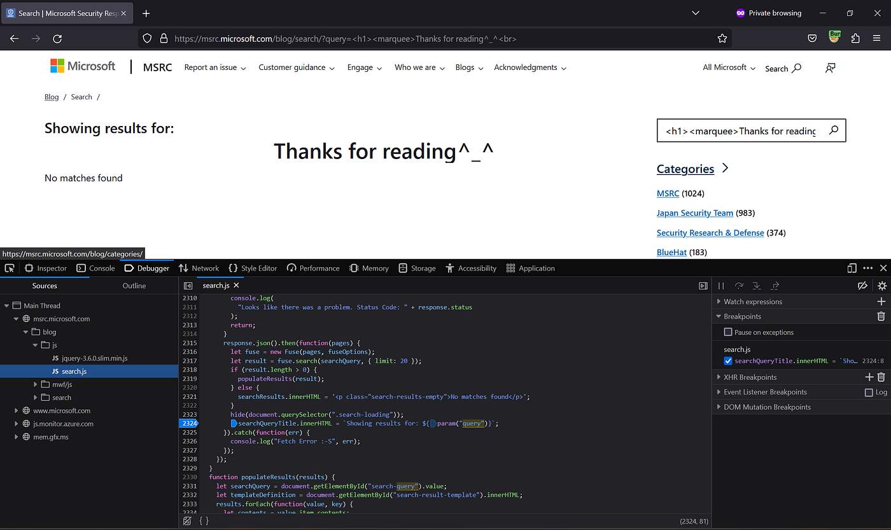

*[https://msrc.microsoft.com/blog/search/?query=m3ez](https://msrc.microsoft.com/blog/search/?query=m3ez)*

Then, I started analyzing the `search.js` file to find the root cause of the vulnerability.

- At line 2296, the application checks whether a value exists in both the `inputBox` and `searchResults` before processing user input.

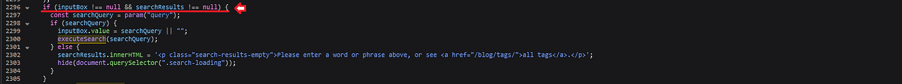

*search.js: 2296–2305*

- At line 2297, the application calls the `param` function to retrieve the value of the query parameter and stores it in the `searchQuery` parameter.

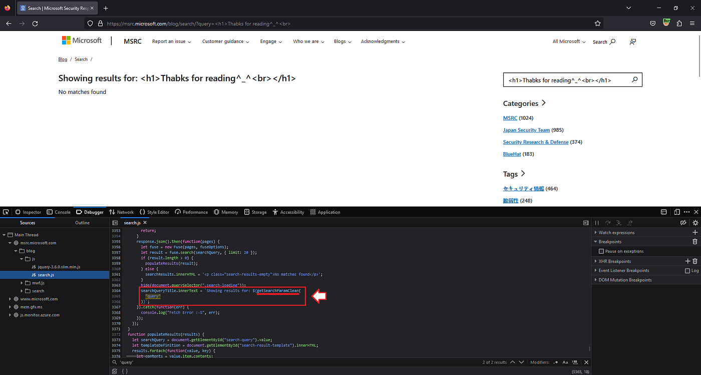
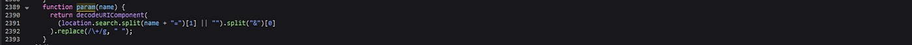

*search.js: 2389–2393*

- At line 2300, the application passes the `searchQuery` parameter to the `executeSearch` function.

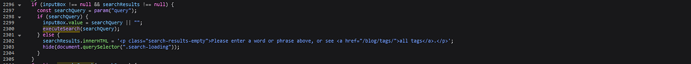

*search.js: 2296–2305*

- In the `executeSearch` function, the application calls `param` function again and parses it into `searchQueryTitle.innerHTML`.

*search.js: 2306–2329*

### Conclusion

As shown in the previous steps, the code retrieves user input from the `param` function and directly set it as the `innerHTML` of a DOM element without proper input sanitation, allowing potential attackers to inject and execute malicious scripts in the victim’s browser.

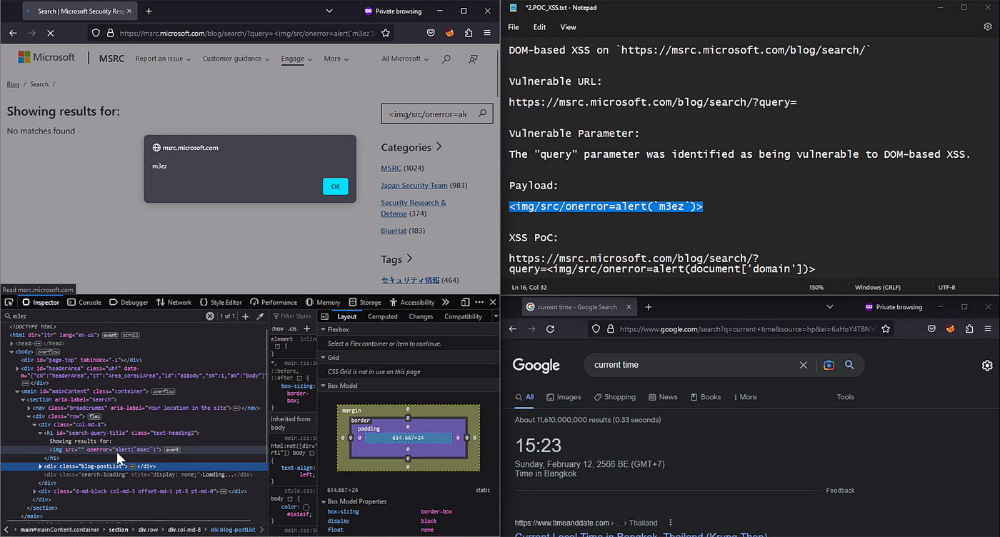

### For example

*[https://msrc.microsoft.com/blog/search/?query=](https://msrc.microsoft.com/blog/search/?query=%3Cimg%2Fsrc%2Fonerror%3Dalert%28%60m3ez%60%29%3E)*

---
